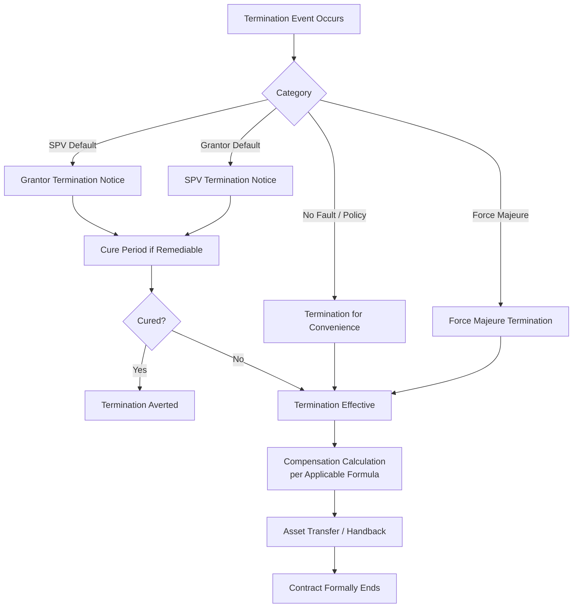
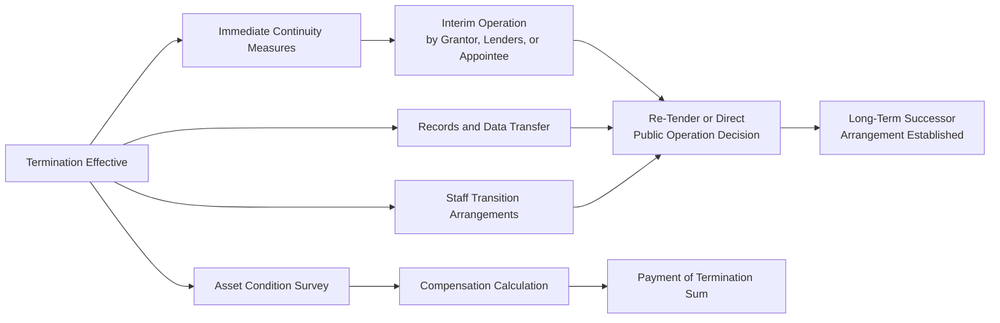

## Grounds and Consequences of Contract Termination

### Overview

Termination provisions in PPP contracts specify the circumstances under which the long-term contractual relationship between the Grantor and the Project Company (SPV) may end before its natural expiry, and the financial and operational consequences that follow. Because PPPs involve highly leveraged, asset-specific, long-duration investments financed substantially through non-recourse or limited-recourse project finance debt, termination provisions are among the most heavily negotiated elements of the PPP agreement — they directly determine lender risk exposure (and therefore financeability), the allocation of loss between public and private parties, and the practical continuity of the underlying public service.

### Rationale and Position in the PPP Lifecycle

**Key Points**

- Termination clauses serve two often-competing objectives: providing a credible, enforceable consequence for serious breach or failure (preserving the deterrent value of the contract's performance obligations) and protecting continuity of public service and lender confidence (since a poorly designed termination regime can precipitate exactly the disruption it is meant to remedy).
- Lenders scrutinize termination provisions intensely during due diligence and typically negotiate **Direct Agreements** with the Grantor, giving lenders step-in rights and consultation rights before termination for SPV default becomes final — because termination compensation terms directly determine debt recoverability and therefore the project's financeability at signing.
- Termination is generally treated as a **remedy of last resort** in well-designed contracts, with lesser remedies (deductions, warning notices, rectification plans, step-in rights) intended to address most performance failures without reaching termination, consistent with the tiered escalation philosophy discussed under dispute resolution and persistent non-performance management.

### Categories of Termination Grounds

| Termination Category | Triggering Party's Position | Typical Trigger |
| --- | --- | --- |
| Termination for SPV Default | Grantor terminates | Persistent non-performance, insolvency, abandonment, fraud, unremedied material breach |
| Termination for Grantor Default | SPV terminates | Persistent non-payment, unlawful repudiation, material breach of Grantor obligations |
| Termination for Convenience | Grantor terminates (some contracts allow SPV in limited cases) | Grantor-initiated, no fault by SPV — e.g., policy change, project no longer needed |
| Termination for Force Majeure | Either party (per contract terms) | Prolonged force majeure event preventing performance |
| Termination for Corrupt/Fraudulent Conduct | Grantor terminates | Bribery, collusion, fraud discovered during procurement or operation |
| Termination for Uninsurability | Either party (per contract terms) | Required insurance becomes unavailable in the market at commercially reasonable terms |
| Voluntary Termination/Buy-Out | Mutual or SPV-initiated (if permitted) | Negotiated early exit, refinancing-linked buy-out provisions |

### Termination for SPV Default

**Key Points**

- Common trigger events include: persistent or severe non-performance against KPIs (typically defined via cumulative breach thresholds, as discussed under performance monitoring), SPV insolvency or entry into formal insolvency proceedings, abandonment of the project, unremedied material breach of fundamental contractual obligations, and fraud or corrupt conduct.
- **Cure periods and remediation rights**: well-drafted contracts require the Grantor to issue a formal default notice specifying the breach and allowing a defined cure period before termination can proceed, except for certain "long-stop" or incurable defaults (e.g., insolvency, fraud) where immediate termination rights may apply.
- **Lender step-in rights**: Direct Agreements typically grant lenders (or their nominated representative) a period to step in and remedy the default themselves, or to replace the SPV's management/shareholders, before the Grantor may proceed to terminate — reflecting the lenders' interest in preserving the project as a going concern to protect their debt recovery.
- **Termination compensation on SPV default**: typically calculated at a level *below* full compensation, often referenced to outstanding senior debt (sometimes with a haircut) rather than equity value or full future cash flows, reflecting the principle that a defaulting party should not be made financially whole — however, some contracts still ensure senior lenders receive a defined minimum recovery to preserve financeability, even where equity receives little or nothing.

### Termination for Grantor Default

**Key Points**

- Common triggers include: persistent failure to make unitary payments when due, unlawful repudiation of the contract, material breach of Grantor step-in or cooperation obligations, or unlawful expropriation/nationalization of the asset.
- Compensation on Grantor default is typically calculated at a **higher level** than SPV default compensation, often intended to place the SPV and its lenders in the position they would have been in had the contract run to full term — commonly based on the discounted value of future cash flows under the Base Case Financial Model, or a formula referencing outstanding debt plus a return on equity component.
- This asymmetry (higher compensation for Grantor default than SPV default) is a deliberate risk allocation design feature, intended to discourage opportunistic or arbitrary termination by the public sector while still holding the SPV to a meaningful performance standard under its own default provisions.

### Termination for Convenience

**Key Points**

- Many PPP contracts grant the Grantor a right to terminate for convenience (i.e., without SPV fault) — reflecting the public sector's sovereign prerogative to change policy direction, respond to changed public needs, or exit a project no longer serving the public interest, while some contracts limit or exclude this right given its potential to undermine the SPV's and lenders' confidence in long-term revenue projections.
- Compensation for termination for convenience is typically the most generous to the SPV among termination categories, often approximating what the SPV would have received had the contract continued to full term (similar in principle to Grantor default compensation, sometimes with adjustments), since the SPV bears no fault for the termination.
- This category is closely watched by lenders and rating agencies, as an overly broad or cheaply-exercisable termination-for-convenience right can undermine project bankability by introducing political risk into what is otherwise meant to be a stable, long-term revenue stream.

### Termination for Force Majeure

**Key Points**

- Distinguished from ordinary relief events (which typically extend time or provide limited compensation without ending the contract) by duration and severity — force majeure termination provisions typically apply only where the force majeure event persists beyond a defined "long-stop" period (e.g., 6-24 months) such that continued performance becomes genuinely impossible or commercially non-viable.
- Compensation on force majeure termination is often structured as an intermediate outcome between default-based and no-fault compensation — commonly covering outstanding senior debt plus a partial return element, reflecting that neither party is at fault but the risk was not fully allocated to either party either.
- Insurance proceeds (where the force majeure event is an insured risk, such as certain natural catastrophe events) are typically applied first to reduce the termination compensation payable by the Grantor, with the compensation formula designed to avoid double recovery.

### Financial Consequences: Termination Compensation Formulas

$$TC = \max\left(0,\ \text{Senior Debt Outstanding} + \text{Adjustment Factor} \times \text{Equity/Subordinated Debt Value}\right)$$

Where the Adjustment Factor varies by termination category (commonly 0 for severe SPV default, partial for force majeure, and approaching 1, or based on discounted future cash flows, for Grantor default or termination for convenience).

**Key Points**

- **Debt-based compensation formulas**: many contracts, particularly for SPV default, calculate compensation primarily by reference to outstanding senior debt (sometimes termed "loan balance" or "debt due" formulas), designed to ensure lender confidence and financeability even in default scenarios, since lenders' willingness to finance the project at reasonable cost depends heavily on protection in default termination scenarios.
- **Market value/re-tender based formulas**: some contracts determine compensation by reference to the amount a re-tender of the residual concession would realize in the market, intended to reflect actual economic value rather than a formulaic calculation, though this approach introduces valuation uncertainty and potential delay.
- **Discounted cash flow (Base Case) formulas**: particularly common for no-fault termination categories, calculating compensation as the net present value of projected future unitary payments/cash flows under the (potentially updated) Base Case Financial Model, discounted at an agreed rate.
- [Inference] The specific formula structure, discount rates, and adjustment mechanics vary enormously across jurisdictions and standard contract forms; no single universal formula applies, and the applicable mechanism must be read from the specific project agreement's termination compensation schedule.

### Operational and Transition Consequences

**Key Points**

- **Service continuity provisions**: contracts typically include mechanisms for interim operation of the asset/service immediately upon termination (by the Grantor directly, a court-appointed receiver, lenders' nominee, or a temporary operator) to avoid a service gap while longer-term successor arrangements are established.
- **Asset condition survey at termination**: similar in principle to the handback survey process at natural contract expiry, an independent condition assessment is typically required at termination to establish the baseline for compensation calculation and any required remediation.
- **Records, data, and knowledge transfer**: as with natural handback, termination requires transfer of as-built records, maintenance history, software/system access, and often a transition support period from outgoing SPV personnel.
- **Staff transition**: employees of the SPV (and any subcontracted O&M staff) may be subject to labor transfer regulations upon termination, similar to considerations at natural contract expiry, adding complexity particularly in early or unplanned terminations.
- **Security and step-in during the transition period**: performance bonds, parent company guarantees, and retention amounts may be drawn upon to fund continuity of service or remediation of deficiencies identified during the termination process.

### Governance and Approval Requirements

**Key Points**

- Given the severe financial and service continuity consequences of termination, many PPP frameworks require termination decisions (particularly Grantor-initiated termination for SPV default or convenience) to pass through elevated internal governance — ministerial approval, cabinet-level sign-off, or notification to a national PPP unit or supreme audit institution — reflecting both the fiscal significance and public accountability dimensions of the decision.
- **Independent verification of default**: robust contracts require objective, often independently verified, evidence of the alleged default (e.g., confirmed persistent non-performance under the performance monitoring regime, or formally declared insolvency) before termination rights may be exercised, reducing the risk of termination being used opportunistically or based on disputed factual premises.
- **Interaction with dispute resolution mechanisms**: termination validity itself is frequently the subject of dispute (e.g., the SPV disputing that the alleged default actually occurred or was material), and contracts typically route such disputes through the escalation and arbitration mechanisms discussed under dispute resolution, sometimes with expedited procedures given the urgency of resolving termination status.

### Common Pitfalls

**Key Points**

- **Vague or overly broad default triggers**: default grounds defined in subjective or ambiguous terms (e.g., "material breach" without further specification) generate disputes over whether termination rights have actually accrued, undermining the deterrent clarity termination provisions are meant to provide.
- **Underestimating lender protection requirements**: termination compensation formulas that inadequately protect senior lenders in default scenarios can render a project unfinanceable or significantly increase financing costs, since lenders price in their expected recovery under all termination scenarios during due diligence.
- **Neglecting service continuity planning**: focusing termination provisions solely on compensation mechanics without adequate operational continuity and transition planning can result in significant public service disruption even where the financial consequences are well-defined.
- **Asymmetric compensation without corresponding performance discipline**: overly generous termination-for-convenience or force majeure compensation, without correspondingly rigorous default-based termination provisions, can weaken the Grantor's practical ability to hold the SPV accountable for genuine performance failures.
- **Treating termination as purely a legal/financial event**: underestimating the practical operational complexity of transitioning a complex asset (particularly technically specialized infrastructure) to a successor operator on short notice, especially where termination is unplanned (as opposed to the multi-year planning horizon available for natural expiry handback).

### Related Topics

- Dispute Resolution Mechanisms and Escalation Procedures
- Asset Condition Monitoring and Handback Standards
- Lender Direct Agreements and Step-In Rights
- Base Case Financial Model Mechanics and Compensation Calculations
- Performance Monitoring Systems and Persistent Non-Performance Escalation
- International Arbitration Under ICSID and Other Frameworks
- Political Risk Insurance and Expropriation Protections
- Re-Tendering and Transition Management After Termination