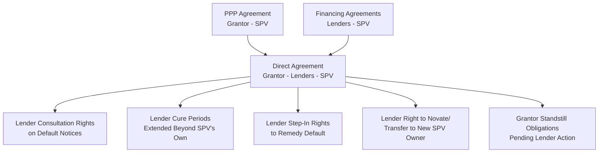
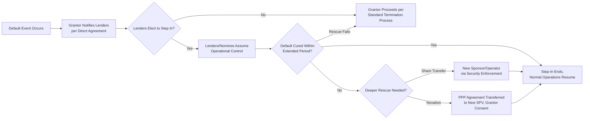

## Lender Step-In and Project Rescue Mechanisms

### Overview

Lender step-in and project rescue mechanisms are the contractual and legal arrangements that allow senior lenders to a PPP project (or their appointed representative) to intervene in the operation, management, or ownership of the Project Company (SPV) when the project faces default, financial distress, or a Grantor-initiated termination trigger — before the underlying PPP contract is terminated. These mechanisms are a defining structural feature of project-financed PPPs, reflecting lenders' fundamental interest in protecting their debt exposure by preserving the project as a going concern rather than allowing it to proceed directly to termination and compensation, which is typically a less favorable outcome for lenders than a successful rescue.

### Rationale and Position in the PPP Financing Structure

**Key Points**

- PPPs are predominantly financed through **non-recourse or limited-recourse project finance**, meaning lenders' primary recourse for debt repayment is the project's own cash flows and assets, not the shareholders' broader balance sheets — this makes lenders acutely sensitive to any event that threatens contract termination, since termination compensation (as discussed under termination provisions) is frequently less than full debt recovery, particularly for SPV-default scenarios.
- Because lenders bear this concentrated exposure, they negotiate **Direct Agreements** (also called tripartite agreements, consent agreements, or step-in agreements) directly with the Grantor, separate from but referencing the main PPP Agreement, giving lenders rights that would not otherwise exist between a mere financier and a public authority's counterparty.
- From the Grantor's perspective, lender step-in rights are generally beneficial: they provide a mechanism to rescue underperforming projects and maintain service continuity without the public sector needing to initiate a full termination and re-tender process, which is typically slower, costlier, and more disruptive.
- Step-in mechanisms exist on a spectrum from lender consultation rights, through formal step-in to cure a default, to full replacement of the SPV's shareholders/management — designed to escalate proportionately to the severity of the underlying problem.

### The Direct Agreement Framework

**Key Points**

- The **Direct Agreement** is the primary legal instrument establishing the relationship among the three key parties (Grantor, Lenders, SPV) regarding events of default, step-in, and termination — it typically sits alongside, and is cross-referenced by, both the PPP Agreement and the senior financing documents (Common Terms Agreement, Facility Agreements).
- **Notice and consultation rights**: the Grantor is typically obligated to notify lenders of any SPV default or contemplated termination action, and to consult with or wait a defined period before proceeding, giving lenders advance warning and time to consider intervention.
- **Extended cure periods for lenders**: Direct Agreements commonly grant lenders a longer period to cure a default than the SPV itself would have under the main PPP Agreement, recognizing that lender-led remediation (e.g., arranging new management, injecting funds, or replacing the SPV's shareholders) takes longer to organize than the SPV's own direct response.
- **Standstill obligations**: the Grantor typically agrees not to exercise termination rights while lenders are validly exercising step-in rights and taking reasonable steps to remedy the underlying default, provided lenders comply with the Direct Agreement's procedural requirements.

### Categories and Escalation of Lender Intervention

| Intervention Level | Nature | Typical Trigger |
| --- | --- | --- |
| Information/Consultation Rights | Lenders receive notices and are consulted, no direct control | Any default notice, early warning indicators |
| Step-In to Cure | Lenders (or their nominee) take temporary operational or management control to remedy the default | Default persists beyond SPV's own cure period |
| Step-In and Replace Management | Lenders replace SPV's board/management while retaining existing shareholding structure | Deeper operational or governance failure |
| Share Transfer / Novation | Lenders enforce security over SPV shares, transferring ownership to a new sponsor or operator | Fundamental financial distress requiring new capital/sponsorship |
| Direct Novation of the PPP Agreement | Contract itself transferred to a new SPV entity, with Grantor consent per Direct Agreement | Comprehensive project rescue requiring a new counterparty |

### Security Package Underpinning Step-In

**Key Points**

- Lender step-in rights are typically secured through a comprehensive **security package** over the SPV's assets and shares, commonly including: a share pledge/mortgage over the SPV's shares (allowing lenders to enforce security by taking control of or transferring ownership), assignment of the SPV's rights under the PPP Agreement and key project contracts (construction, O&M, offtake agreements), and security over the SPV's bank accounts and cash flow waterfall.
- **Share pledges** are often the most operationally significant security instrument for step-in purposes, since enforcing security over shares allows lenders to change the SPV's ownership and board without needing to terminate and replace the underlying PPP contract itself — preserving contractual continuity, which is generally advantageous for all parties compared to termination.
- **Account bank arrangements** and defined **cash flow waterfalls** (specifying the priority order of revenue distribution — operating costs, debt service, reserve accounts, then equity distributions) give lenders visibility and control mechanisms (e.g., cash sweep or lock-up triggers upon covenant breach) that often provide early warning of distress before a formal default under the PPP Agreement occurs.

### Financial Distress Early Warning and Covenant Mechanisms

**Key Points**

- Financing agreements typically include financial covenants (e.g., minimum Debt Service Coverage Ratio (DSCR), Loan Life Coverage Ratio (LLCR)) that, when breached, trigger cash flow restrictions (lock-up of distributions to equity) well before an actual payment default occurs — providing lenders an early intervention point distinct from, and generally preceding, formal step-in under the Direct Agreement.
- **Cash sweep mechanisms**: upon covenant breach, excess cash flow that would otherwise be distributed to equity is instead swept into reserve or debt prepayment accounts, both protecting lender recovery and creating financial pressure on equity sponsors to address the underlying operational or financial problem before it escalates to formal default.
- **Independent Technical Adviser and Model Auditor reports**: lenders typically require periodic independent review of technical performance and financial model compliance throughout the loan tenor, providing an ongoing information channel that can surface emerging distress before it manifests as a formal covenant or PPP Agreement breach.

### Rescue Outcomes and Their Interaction with Termination

**Key Points**

- **Successful cure**: where lender step-in successfully remedies the underlying default (financial or operational) within the extended cure period, the project continues under the original or reconstituted SPV, and no termination occurs — this is generally the most favorable outcome for all parties, including the Grantor, since it avoids the cost, delay, and service disruption of termination and re-tender.
- **Successful novation to a new sponsor**: where the original equity sponsor is unable or unwilling to continue, lenders may facilitate a transfer of shares (or, less commonly, direct novation of the PPP Agreement) to a new, better-capitalized or more capable sponsor/operator, subject to the Grantor's consent rights under the Direct Agreement (often including "know your customer," technical capability, and financial standing checks on the incoming party).
- **Failed rescue leading to termination**: where step-in efforts do not resolve the underlying default within the agreed period, the Grantor's termination rights typically become exercisable again, though the preceding rescue attempt may affect the characterization or timing of the eventual termination and associated compensation calculation.
- **Interaction with insolvency law**: the interplay between contractual step-in rights and the SPV's formal insolvency proceedings (where applicable) is jurisdiction-specific and can be legally complex — some jurisdictions' insolvency regimes may limit or override contractual step-in and termination rights (e.g., through automatic stays), a consideration that requires careful legal structuring specific to the relevant jurisdiction's insolvency framework.
- [Inference] The practical success rate of lender-led project rescues, and the typical duration and cost of such interventions, vary considerably by sector, jurisdiction, and the specific nature of the underlying distress (financial versus operational versus sponsor-level problems); general claims about rescue success rates should be treated with caution absent project- or program-specific data.

### Grantor Considerations and Safeguards

**Key Points**

- While step-in mechanisms generally serve the Grantor's interest in service continuity, Direct Agreements typically include safeguards protecting the Grantor's position during lender intervention: continued performance of core service obligations during step-in (lenders stepping in do not suspend the SPV's underlying obligations to the Grantor), Grantor consent rights over any new incoming sponsor or operator (to ensure technical and financial capability), and time limits on how long a step-in period can continue before the Grantor regains the right to proceed with termination if the rescue is not succeeding.
- **"Know your counterparty" provisions**: Grantors typically retain approval rights over any replacement sponsor, operator, or the terms of a novated contract, preventing lenders from transferring the concession to an unsuitable or under-qualified party purely to protect debt recovery without regard to service quality or public interest considerations.
- Grantors and their advisers should assess Direct Agreement terms carefully during the original transaction structuring phase, since these provisions — heavily negotiated by lenders as a condition of financing — can significantly constrain the Grantor's practical ability to terminate even where grounds technically exist, if step-in rights are drafted too broadly or for too long a duration.

### Common Pitfalls

**Key Points**

- **Overly generous step-in periods**: Direct Agreements granting excessively long or repeatable step-in/cure periods can effectively insulate a persistently underperforming project from meaningful termination consequences, undermining the deterrent function of the performance and termination regime.
- **Inadequate Grantor consent safeguards**: insufficiently robust Grantor approval rights over incoming sponsors following a share transfer can result in an unsuitable or under-capable new operator taking over a public service asset.
- **Underestimating insolvency law interaction**: failing to analyze how domestic insolvency law might interact with (and potentially override) contractual step-in rights can leave both lenders and the Grantor with less protection in practice than the contract appears to provide on its face.
- **Delayed lender engagement**: waiting until a formal default has occurred to engage lenders, rather than leveraging earlier covenant-based warning signals and account bank cash flow controls, reduces the effectiveness of rescue efforts by allowing distress to deepen before intervention begins.
- **Neglecting operational readiness for step-in**: Direct Agreements that are legally sound but lack practical operational planning (e.g., no pre-identified interim operator, no clear protocol for maintaining service continuity during a management transition) can result in service disruption even where the legal step-in mechanism functions as intended.

### Related Topics

- Grounds and Consequences of Contract Termination
- Base Case Financial Model Mechanics and Debt Service Coverage Ratios
- Project Finance Security Packages and Cash Flow Waterfalls
- Dispute Resolution Mechanisms and Escalation Procedures
- Performance Monitoring Systems and Persistent Non-Performance Escalation
- Independent Technical Advisers and Model Auditors in Project Finance
- Insolvency Law Interaction with Project Finance Security
- Re-Tendering and Transition Management After Termination