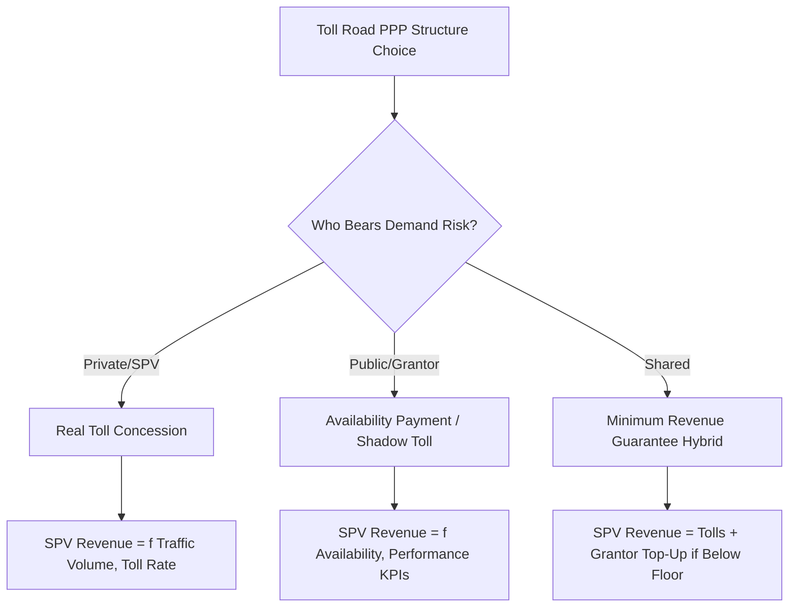
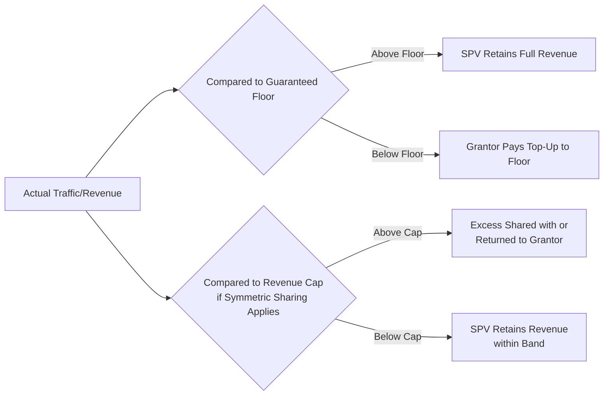

## Toll Road and Motorway Concessions

### Overview

Toll road and motorway concessions are among the most established and widely used PPP models globally, under which a private Project Company (SPV) finances, builds (or upgrades), operates, and maintains a road asset in exchange for the right to collect tolls from users, or to receive availability-based payments from the Grantor, over a defined concession period. This sector has generated the largest body of empirical PPP experience internationally and has been particularly influential in shaping broader PPP risk allocation, demand forecasting, and renegotiation literature, given its long history (dating to 19th-century turnpike trusts and expanding significantly from the 1990s onward across Latin America, Europe, and Asia).

### Rationale and Position Within Transport PPPs

**Key Points**

- Toll roads are a natural fit for PPP structuring because the asset generates a directly measurable, chargeable user benefit (reduced travel time, improved safety, new connectivity), making user-pays revenue models feasible in a way that is harder to replicate for many other public infrastructure categories.
- Motorway concessions typically fall into two broad demand-risk structures: **real toll (user-pays)** concessions, where the SPV's revenue depends directly on traffic volumes and toll rates, and **availability-based/shadow toll** concessions, where the Grantor pays the SPV based on road availability and performance standards regardless of actual traffic volume, with demand risk retained by the public sector.
- The choice between these models is a fundamental risk allocation decision: real toll models transfer demand risk to the private sector (theoretically incentivizing efficient investment and traffic-responsive service) but have historically generated the highest renegotiation rates in the empirical PPP literature, closely tied to traffic forecasting error and the difficulty of accurately predicting demand decades in advance.

### Core Structural Models

| Model | Demand Risk Allocation | Revenue Source | Typical Use Case |
| --- | --- | --- | --- |
| Real Toll Concession | Private (SPV) | Direct tolls from road users | New greenfield motorways, established traffic corridors |
| Shadow Toll | Public (Grantor) | Grantor payments per vehicle-km, based on traffic bands | Roads where direct tolling is politically/technically difficult |
| Availability Payment | Public (Grantor) | Fixed/indexed payments tied to lane availability and performance, not traffic | Roads prioritizing certainty over demand-linked returns |
| Minimum Revenue Guarantee (MRG) Hybrid | Shared | Real tolls, with Grantor top-up if traffic falls below a floor | Transitional/hybrid risk allocation, common in emerging markets |
| Design-Build-Finance-Operate-Maintain (DBFOM), Availability-Based | Public | Availability payments | Common in North American and some European motorway PPPs |

### Demand Risk and Traffic Forecasting

**Key Points**

- Traffic demand forecasting is widely regarded as the single most consequential — and historically most error-prone — technical input in toll road PPP structuring, with systematic evidence (from academic studies, e.g., Bain's and Flyvbjerg's research on infrastructure forecasting accuracy) showing a persistent tendency toward **optimistic bias** in traffic and revenue forecasts across many toll road projects internationally.
- [Inference] Whether this optimism bias reflects genuine forecasting difficulty (traffic demand is inherently hard to predict decades ahead, especially for new roads without comparable traffic history), strategic bidder optimism to win competitive tenders, or a combination of both, is debated in the literature; the appropriate policy response (e.g., independent traffic forecast review, standardized forecasting methodologies, optimism bias adjustment factors) reflects differing views on the underlying cause.
- **Independent traffic studies**: many Grantors now require or commission independent traffic and revenue forecasts (distinct from the bidder's own projections) as part of the value-for-money and bankability assessment, and some require bidders' forecasts to be benchmarked against or reconciled with an independent baseline.
- **Ramp-up period modeling**: newly opened toll roads typically experience a multi-year "ramp-up" period before traffic reaches its long-term equilibrium level, as travelers adjust habits and awareness grows — inadequate modeling of ramp-up dynamics (assuming near-immediate full traffic uptake) is a documented source of early-year revenue shortfalls.

### Toll Setting and Adjustment Mechanisms

**Key Points**

- **Toll-setting formulas**: contracts typically specify how tolls may be increased over the concession term, commonly linked to inflation indices (CPI or a construction cost index), sometimes with additional real increases permitted at defined intervals or tied to specific investment triggers (e.g., a toll increase permitted upon completion of a capacity expansion).
- **Price cap vs. rate of return regulation**: some toll road concessions (particularly those with quasi-regulatory oversight) apply economic regulation principles more commonly associated with utilities, capping toll increases based on an allowed rate of return on the regulatory asset base, rather than a simple indexation formula.
- **Political sensitivity of toll increases**: toll rates are frequently a politically contentious issue, and Grantors sometimes face pressure to freeze or delay contractually permitted toll increases — a scenario that, if the Grantor fails to allow contractually agreed increases, can constitute a compensable event or Grantor default under many concession agreements, since it directly undermines the Base Case Financial Model's revenue assumptions.
- **Congestion/dynamic pricing**: increasingly used in some jurisdictions (particularly express/managed lanes in North America) as a demand management tool, with toll rates varying by time of day or real-time congestion levels — this introduces additional complexity into revenue forecasting and payment mechanism design compared to fixed or simply-indexed tolls.

### Minimum Revenue Guarantees and Risk-Sharing Mechanisms

**Key Points**

- **Minimum Revenue Guarantees (MRGs)**: a common risk-sharing mechanism in which the Grantor commits to topping up SPV revenue if actual traffic/toll revenue falls below a pre-agreed floor, partially mitigating demand risk to make projects financeable in markets with limited traffic history or high forecasting uncertainty — though MRGs have also been criticized for potentially reintroducing much of the demand risk the PPP model was intended to transfer, and for creating contingent fiscal liabilities that may not be fully transparent in public accounts.
- **Revenue-sharing/claw-back mechanisms**: some contracts pair MRGs with an upside-sharing arrangement, where revenue above a certain threshold is shared with or returned to the Grantor, intended to balance the asymmetric protection MRGs provide with some upside recapture for the public sector.
- **Least Present Value of Revenue (LPVR) auctions**: an alternative competitive bidding mechanism (used notably in Chile's concession program) in which bidders compete on the total discounted revenue they require to complete the project, with the concession automatically ending once that revenue target is reached — this approach directly addresses demand risk by making the concession term itself variable rather than fixed, reducing the incentive for either excessive risk-taking or excessive Grantor guarantee provision.
- [Unverified] The prevalence and current design variations of LPVR-style and other innovative demand-risk-sharing mechanisms continue to evolve across different national programs; specific current adoption should be verified against up-to-date country program documentation rather than assumed static.

### Capacity, Expansion, and Lifecycle Considerations

**Key Points**

- Motorway concessions often include contractual triggers for capacity expansion (e.g., additional lanes) tied to traffic volume thresholds, requiring careful integration with the variations/change order mechanism discussed under contract management, since expansion works are typically substantial, multi-year undertakings requiring updated financial model and payment mechanism terms.
- Pavement and structural asset management (bridges, tunnels, drainage) follows lifecycle planning principles similar to those discussed under asset condition monitoring, with performance specifications commonly referencing engineering metrics such as the International Roughness Index (IRI), rutting depth, and structural condition indices for bridges.
- Safety performance (accident rates, incident response times) is typically a distinct KPI category from availability/roughness metrics, often carrying specific regulatory reporting obligations to national road safety authorities independent of the PPP contract's own monitoring regime.

### Common Pitfalls

**Key Points**

- **Overly optimistic bid-stage traffic forecasts**: as discussed above, systematically optimistic forecasts (whether from genuine forecasting difficulty or strategic bidding behavior) are among the most frequently cited causes of financial distress and renegotiation in toll road concessions specifically.
- **Political resistance to contractually agreed toll increases**: Grantors underestimating the political difficulty of implementing scheduled toll increases can create a structural tension between the contract's financial assumptions and its practical political implementation, a recurring theme in the broader renegotiation literature.
- **Underpricing minimum revenue guarantees**: MRG commitments, if not properly valued and disclosed as contingent liabilities at the time of contract signing, can create unrecognized fiscal risk that only becomes apparent when triggered by weak actual demand.
- **Neglecting network effects and competing routes**: failing to account for how future public investment in alternative free routes, or changes in regional development patterns, might divert traffic from the tolled facility, undermining the original demand forecast basis.
- **Insufficient allowance for ramp-up dynamics**: structuring debt service and covenant requirements around immediate full-traffic assumptions rather than realistic ramp-up periods, creating unnecessary early-year financial stress even on projects that ultimately prove viable at steady-state traffic levels.

### Related Topics

- Economics and Prevalence of PPP Contract Renegotiation
- Demand Risk Allocation Models: Real Toll, Shadow Toll, and Availability Payments
- Minimum Revenue Guarantees and Contingent Fiscal Liability Management
- Asset Condition Monitoring and Handback Standards (pavement and structural lifecycle)
- Performance Monitoring Systems and Reporting Requirements (safety and availability KPIs)
- Managing Variations and Change Orders (capacity expansion triggers)
- Chilean LPVR Concession Model and Alternative Demand-Risk Auction Mechanisms
- Rail and Urban Transit PPP Structures (comparative demand risk approaches)