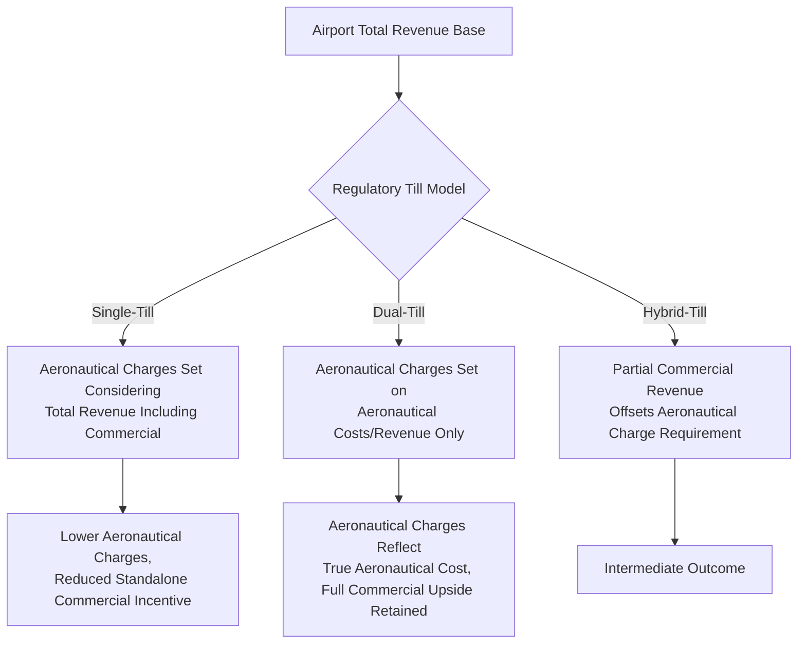

## Airport PPPs and Aeronautical versus Non-Aeronautical Revenue

### Overview

Airport PPPs involve the private financing, development, and/or operation of airport infrastructure — ranging from full concessions covering an entire airport (terminals, runways, ground infrastructure) to more limited management contracts or terminal-specific build-operate-transfer arrangements. A defining economic feature of airport PPPs, distinguishing them from most other transport PPP sectors, is the dual revenue structure split between **aeronautical revenue** (regulated charges tied to aircraft and passenger movements) and **non-aeronautical/commercial revenue** (retail, parking, real estate, and other commercial activities), each governed by different regulatory logics and risk profiles.

### Rationale and Position Within Transport PPPs

**Key Points**

- Airports combine characteristics of a natural monopoly infrastructure asset (a single or dominant airport typically serves a metropolitan region with limited practical substitutes) with a substantial commercial retail/property business — this hybrid nature drives much of the distinctive regulatory and contractual complexity in airport PPP structuring.
- The private sector's involvement in airports has historically ranged from full ownership/concession (extensive in parts of Europe, Latin America, and Australia) to more limited management contracts or specific terminal concessions (more common where national security or sovereignty considerations limit full privatization of core airport infrastructure).
- Airport PPP structuring must simultaneously address: aviation safety and security regulatory compliance (typically retained under state/international civil aviation authority oversight regardless of the ownership model), economic regulation of aeronautical charges (given the natural monopoly characteristics), and commercial revenue optimization (where the private operator's expertise in retail and property management is expected to add significant value).

### Aeronautical Revenue

**Key Points**

- **Aeronautical charges** are fees levied on airlines (and sometimes passengers directly) for the use of airport infrastructure and services, typically including: landing fees (based on aircraft weight/type), passenger service charges (per departing passenger), aircraft parking/stand charges, and terminal navigation charges (where applicable).
- Because a dominant airport in a region typically has substantial market power over airlines (who have limited ability to simply use a different airport), aeronautical charges are almost universally subject to **economic regulation**, distinguishing airport PPPs from most toll road or purely commercial PPP structures.
- **Regulatory models for aeronautical charges** commonly include: single-till regulation (aeronautical charges are set considering the airport's total revenue, including non-aeronautical income, effectively cross-subsidizing aeronautical charges downward), dual-till regulation (aeronautical and non-aeronautical revenues/costs are regulated and assessed separately, allowing aeronautical charges to be set based solely on aeronautical cost recovery), and hybrid-till approaches (a partial blend, sometimes allocating a defined percentage of non-aeronautical profit to offset aeronautical charge requirements).
- [Inference] The choice between single-till, dual-till, and hybrid approaches has significant economic consequences for the airport operator's incentives to invest in and grow non-aeronautical revenue, and different jurisdictions and even different regulatory reviews within the same jurisdiction have reached different conclusions on the preferred model; there is no international consensus establishing one approach as unambiguously superior, and the appropriate model depends on specific policy objectives (e.g., airline cost competitiveness versus operator investment incentives) in each jurisdiction.

### Non-Aeronautical (Commercial) Revenue

**Key Points**

- Non-aeronautical revenue encompasses: retail concessions (duty-free, food and beverage, specialty retail), car parking, property/real estate development (office space, hotels, cargo facilities, sometimes broader "airport city" or aerotropolis developments), advertising, and other commercial activities within the airport boundary or on adjacent land under the operator's control.
- In many mature, well-developed airport PPPs, non-aeronautical revenue constitutes a very substantial share of total airport revenue — often comparable to or exceeding aeronautical revenue — and is frequently the primary driver of the commercial return that attracts private investors to airport concessions, distinguishing the sector's investment logic from more purely infrastructure-focused PPP models.
- **Retail concession structuring**: typically structured as sub-concessions or leases to specialist retail/F&B operators, with airport operator revenue derived from a combination of fixed rent and revenue-share (percentage of tenant sales) arrangements, requiring specialized commercial and retail management expertise distinct from traditional infrastructure operations.
- **Passenger volume and dwell time** are key commercial revenue drivers, meaning terminal design (passenger flow, dwell time before boarding, retail placement) has direct commercial revenue implications that create incentives for the private operator to optimize terminal design and passenger experience beyond pure operational efficiency — a frequently cited example of how private sector commercial incentives can align with certain aspects of service quality in ways not always present in non-commercial infrastructure PPPs.
- [Unverified] The specific proportion of non-aeronautical to total revenue varies enormously across airports, driven by factors including passenger demographics, catchment area affluence, international versus domestic traffic mix, and available land for commercial/property development; general claims about typical revenue splits should be verified against airport-specific or program-specific data rather than treated as universal.

### Risk Allocation Considerations Specific to Airports

**Key Points**

- **Traffic/passenger volume risk**: similar in principle to toll road demand risk, airport PPPs must allocate the risk of passenger volume shortfalls (due to economic downturns, airline route decisions, geopolitical disruption, or pandemic-type demand shocks) between the Grantor and the private operator — full concessions typically transfer substantial demand risk to the operator, while management contracts retain more risk with the public sector.
- **Airline relationship and route development risk**: unlike toll road users, airlines are sophisticated commercial counterparties whose route and capacity decisions significantly affect airport traffic — airport operators often engage directly in route development incentive programs (reduced charges for new routes) to grow traffic, introducing a commercial dimension to demand management not present in most other transport PPPs.
- **Aviation security and safety regulatory risk**: security and safety regulation typically remains under state or international civil aviation authority control regardless of the PPP structure, meaning the private operator must comply with evolving regulatory requirements (which can impose significant capital costs) that are not always within the operator's control to negotiate, requiring careful contractual allocation of compliance cost risk.
- **Exogenous shock exposure**: the aviation sector has historically demonstrated acute vulnerability to exogenous shocks (health pandemics, geopolitical crises, extreme fuel price volatility) that can cause severe, rapid demand collapse — a risk category that has prompted renewed attention to force majeure and relief event drafting specifically tailored to aviation-sector risks in more recent airport PPP contracts.

### Regulatory and Institutional Framework

**Key Points**

- Airport economic regulation is typically administered by a dedicated national aviation/airport economic regulator (distinct from the general competition authority in many jurisdictions), applying periodic price/revenue reviews (often on a 5-year cycle, similar in structure to utility regulation) to reset allowed aeronautical charges based on projected capital investment, operating costs, and traffic forecasts.
- **Capital investment planning and regulatory asset base (RAB) mechanisms**: many airport regulatory frameworks use a RAB-based approach (similar to utility regulation) to determine allowed aeronautical revenue, incorporating the operator's capital expenditure into the asset base on which a regulated return is calculated — requiring robust capital investment planning and regulatory consultation processes.
- **Airline consultation requirements**: given airlines' direct exposure to aeronautical charges, many regulatory frameworks and airport PPP contracts include formal consultation obligations with airline users before major capital investment decisions or charge changes, reflecting international guidance (e.g., ICAO's policies on charges for airports and air navigation services) promoting cost-relatedness, non-discrimination, and transparency in aeronautical charge-setting.
- **Slot allocation and capacity management**: at capacity-constrained airports, slot allocation (governing which airlines can operate at which times) is typically governed by separate international/national frameworks (e.g., IATA Worldwide Airport Slot Guidelines-based systems) rather than directly by the airport operator, creating an additional layer of institutional complexity distinct from the PPP contract itself.

### Common Structural Variants

| Structure | Scope | Typical Context |
| --- | --- | --- |
| Full Concession | Entire airport (terminals, runways, aeronautical and commercial operations) | Major hub airports, long concession terms (20-40 years) |
| Management Contract | Operations and management only, limited capital investment responsibility | Where sovereignty/security concerns limit asset transfer |
| Terminal-Specific BOT | Design-build-operate-transfer of a specific new terminal | Capacity expansion at existing state-operated airports |
| Greenfield Airport DBFO | New airport development, design-build-finance-operate | New city/regional airport development |
| Cargo/Ancillary Facility Concession | Specific cargo terminal, MRO facility, or FBO concession | Partial private participation without full airport transfer |

### Common Pitfalls

**Key Points**

- **Misaligned till regulation and investment incentives**: single-till regulation, while potentially reducing aeronautical charges for airlines, can weaken the operator's incentive to invest heavily in growing commercial revenue if the benefits are effectively shared back into reduced aeronautical charges rather than retained.
- **Underestimating exogenous shock exposure**: contracts and financial models that do not adequately provide for severe demand shocks (whether pandemic-related, geopolitical, or macroeconomic) can face acute financial distress and prompt significant post-shock renegotiation, as has occurred at various points in aviation sector history.
- **Neglecting airline relationship management**: treating airlines purely as regulated fee-payers rather than commercial partners whose route decisions directly drive both aeronautical and non-aeronautical revenue can undermine long-term traffic growth and airport competitiveness.
- **Overestimating commercial revenue growth potential**: business cases that assume aggressive non-aeronautical revenue growth without adequately validating catchment area demand, competitive retail dynamics, or realistic property development timelines can create financial model risk analogous to overoptimistic traffic forecasting in toll roads.
- **Inadequate capacity planning coordination**: airport capacity investment must align with broader national aviation policy, airline fleet and route planning, and airspace/air traffic management capacity — a private airport operator's investment decisions made in isolation from these broader system considerations can create bottlenecks or stranded investment.

### Related Topics

- Toll Road and Motorway Concessions (comparative demand-risk and regulatory structures)
- Economic Regulation Models: Single-Till, Dual-Till, and RAB-Based Price Reviews
- Force Majeure and Relief Events for Exogenous Sector Shocks
- Rail and Urban Transit PPP Structures
- Contract Management and Performance Monitoring (aeronautical and commercial KPI design)
- Grounds and Consequences of Contract Termination (aviation-sector-specific considerations)
- Managing Variations and Change Orders (capacity expansion and regulatory-driven investment)
- Port and Maritime Infrastructure PPPs (comparative natural monopoly regulatory challenges)