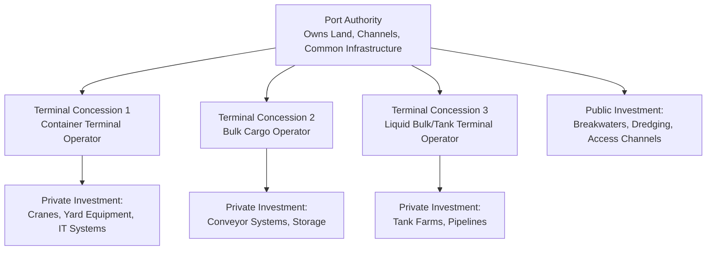
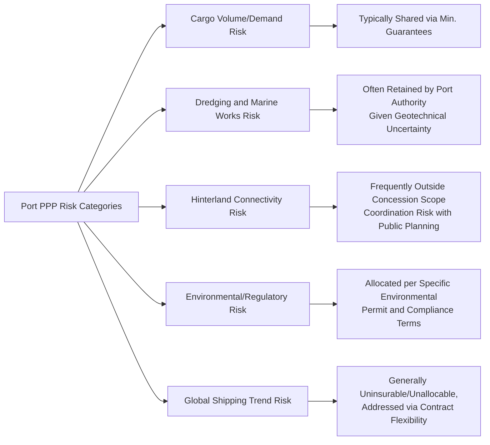

## Port Concessions and Terminal Operating Agreements

### Overview

Port concessions and terminal operating agreements govern the private sector's involvement in financing, developing, and operating maritime port infrastructure — most commonly specific terminals (container, bulk, liquid bulk, or multi-purpose) within a larger port authority-controlled port estate, rather than entire ports as unified assets. This "landlord port" model, in which the public port authority retains ownership of the underlying land and common infrastructure while granting concessions over specific terminals to private operators, is the dominant global structure and distinguishes port PPPs structurally from many other transport sector arrangements.

### Rationale and Position Within Transport PPPs

**Key Points**

- The **landlord port model** — where a public Port Authority owns the port estate, channels, and common infrastructure (breakwaters, access channels, sometimes rail/road connections) while leasing specific terminal areas to private concessionaires who invest in and operate superstructure (cranes, terminal equipment, warehousing) — has become the internationally dominant structure, reflecting a division between infrastructure that benefits the whole port (retained public) and terminal-specific commercial operations (transferred to specialized private operators).
- This model allows multiple private terminal operators to compete within a single port for cargo volumes, in contrast to a single-concessionaire whole-port model, which can support greater competitive discipline on service quality and pricing even after individual terminal concessions are awarded.
- Global container terminal operation is dominated by a relatively small number of specialized international terminal operating companies with deep technical, commercial, and network expertise (route/shipping line relationships, cargo-handling technology, global logistics integration) — meaning port PPPs often involve highly specialized, internationally experienced private counterparties rather than purely domestic or first-time infrastructure investors.

### Core Structural Models

| Structure | Ownership/Control | Typical Use Case |
| --- | --- | --- |
| Landlord Port with Terminal Concessions | Port Authority owns land/common infrastructure; private concessionaires operate specific terminals | Dominant global model for major container/bulk ports |
| Service Port | Port Authority owns and operates all infrastructure and services directly | Traditional model, increasingly less common for major commercial ports |
| Tool Port | Port Authority owns infrastructure and superstructure; private operators provide labor/services only | Transitional model, less capital-intensive private role |
| Fully Privatized Port | Full private ownership of port estate and operations | Less common; used in specific jurisdictions (e.g., certain UK ports) |
| BOT/BOO Greenfield Terminal | Private party builds and operates a new terminal on a defined concession basis | New port capacity development, greenfield deep-water terminals |

### Concession Structuring and Key Commercial Terms

**Key Points**

- **Concession fees**: typically structured as a combination of a fixed annual land lease/rental payment and a variable throughput-based royalty (per container/TEU handled, per tonne of bulk cargo), aligning port authority revenue with actual terminal activity while providing a baseline guaranteed return on the leased land.
- **Minimum throughput guarantees**: many concession agreements include minimum guaranteed cargo volume or minimum annual fee commitments from the operator, providing the Port Authority revenue certainty and creating an incentive for the operator to actively develop cargo volumes rather than passively holding the concession.
- **Capital investment obligations**: concession agreements typically specify defined capital investment commitments and milestones (e.g., installation of a specified number of ship-to-shore cranes by a defined date, yard equipment specifications, minimum berth depth maintenance) tied to capacity and service level targets.
- **Exclusivity and cargo-type restrictions**: concessions commonly define the specific cargo types or terminal functions the concessionaire is permitted to handle, and whether any exclusivity applies within the port for that cargo category — a significant competitive and commercial term given the potential for multiple terminals within one port to compete for the same cargo types.
- **Tariff/pricing regulation**: unlike many other transport PPPs, terminal handling charges are frequently *not* directly regulated in the landlord port model (since shipping lines are sophisticated commercial counterparties and intra-port or inter-port competition can provide a market discipline), though port authorities in some jurisdictions retain tariff approval or benchmarking rights, particularly where a terminal has significant local market power.

### Demand Risk and Cargo Volume Dynamics

**Key Points**

- Cargo throughput risk is fundamentally linked to global trade volumes, shipping line routing and alliance decisions, regional economic growth, and competition from alternative ports — factors largely outside the terminal operator's or Port Authority's direct control, making demand risk allocation and forecasting a central structuring challenge similar in spirit to toll road traffic risk but driven by different (often more globally systemic) demand drivers.
- **Shipping alliance and vessel size dynamics**: the trend toward larger container vessels and consolidated shipping alliances has significant implications for port infrastructure requirements (berth depth, crane outreach, yard capacity) and can shift cargo volumes between competing ports/terminals as alliances reconfigure their port-calling patterns — a structural risk factor terminal concessionaires and port authorities must account for in long-term capacity and investment planning.
- **Hinterland connectivity risk**: a terminal's competitiveness depends significantly on rail, road, and inland waterway connections to its hinterland market, meaning risks and investment decisions outside the terminal concession's direct boundary (last-mile and inland logistics infrastructure) can materially affect terminal utilization and revenue.
- [Inference] The relative allocation of demand risk between minimum guaranteed volumes/fees and pure throughput-based structures reflects negotiated commercial terms specific to each concession and port context; there is no single standard risk allocation applied uniformly across the global port sector, given the wide variation in port competitive dynamics, cargo type, and national policy objectives.

### Performance Standards and Monitoring

**Key Points**

- **Berth productivity metrics**: common KPIs include crane moves per hour, vessel turnaround time, and berth occupancy rates — technical performance indicators specific to the cargo-handling nature of terminal operations, distinct from the availability/roughness-style metrics common in road/rail PPPs.
- **Equipment availability and maintenance standards**: contracts typically specify minimum equipment availability rates (cranes, yard equipment) and maintenance regimes, with associated reporting requirements feeding into the port authority's oversight of concession performance, following similar principles to the performance monitoring and reporting frameworks discussed in contract management generally.
- **Safety and environmental compliance**: port and terminal operations carry significant safety (heavy cargo handling, hazardous materials for certain cargo types) and environmental (dredging impacts, emissions, spill risk for liquid bulk) regulatory obligations, typically monitored both under the concession agreement and separately under applicable maritime and environmental regulatory regimes.
- **Cargo dwell time**: the average time cargo remains in the terminal before onward transport is a key efficiency indicator affecting both terminal capacity utilization and the port's broader logistics competitiveness, sometimes incorporated into performance incentive structures.

### Risk Allocation Considerations Specific to Ports

**Key Points**

- **Dredging and marine geotechnical risk**: maintaining and periodically deepening access channels and berth pockets involves significant geotechnical and environmental uncertainty; this risk is frequently retained by the Port Authority (as owner of the channel/marine infrastructure) rather than transferred to individual terminal concessionaires, given the shared benefit of channel depth across multiple terminals within the port.
- **Force majeure considerations specific to ports**: ports face particular exposure to weather-related disruption (storms, cyclones), and in some regions, geopolitical risks affecting shipping routes (e.g., regional conflict affecting transit chokepoints) — contract force majeure and relief provisions should be tailored to these sector-specific exposure patterns.
- **Labor relations**: port operations have historically involved significant organized labor presence in many jurisdictions, and labor relations risk (industrial action affecting cargo throughput) is a material operational consideration often requiring specific contractual and risk management attention distinct from other transport PPP sectors.

### Common Pitfalls

**Key Points**

- **Underestimating shipping industry structural shifts**: contracts and financial models that do not adequately anticipate vessel size trends, alliance restructuring, or shifts in global trade patterns can face significant demand risk exposure not contemplated at contract signing.
- **Inadequate hinterland coordination**: terminal concessions structured without adequate attention to coordinated public investment in rail/road hinterland connections can result in underutilized terminal capacity even where the terminal itself performs to specification.
- **Overlapping or unclear dredging responsibility**: ambiguity over who bears responsibility for maintaining channel depth (Port Authority versus individual terminal concessionaires, particularly where multiple terminals share access channels) can create disputes and underinvestment in shared marine infrastructure.
- **Insufficient competitive discipline within multi-terminal ports**: where a single operator controls multiple or all terminals within a port (through common ownership or market consolidation), the competitive benefits of the landlord port model can be undermined, requiring active competition policy attention from the Port Authority or national regulator.
- **Environmental and community impact underestimation**: port expansion and dredging activities frequently generate significant environmental and local community concerns (marine ecosystem impact, noise, traffic), and inadequate stakeholder engagement (see also stakeholder communication practices) can generate delays, legal challenges, or reputational risk during both development and ongoing operations.

### Related Topics

- Toll Road and Motorway Concessions (comparative demand-risk and revenue structures)
- Airport PPPs and Aeronautical versus Non-Aeronautical Revenue (comparative landlord/concession models)
- Managing Variations and Change Orders (capacity expansion and dredging works)
- Performance Monitoring Systems and Reporting Requirements (berth productivity KPIs)
- Force Majeure and Relief Events (weather and geopolitical exposure specific to maritime assets)
- Stakeholder and Public Communication During Operations (environmental and community engagement)
- Rail and Urban Transit PPP Structures
- Economics and Prevalence of PPP Contract Renegotiation (global trade volume shocks)