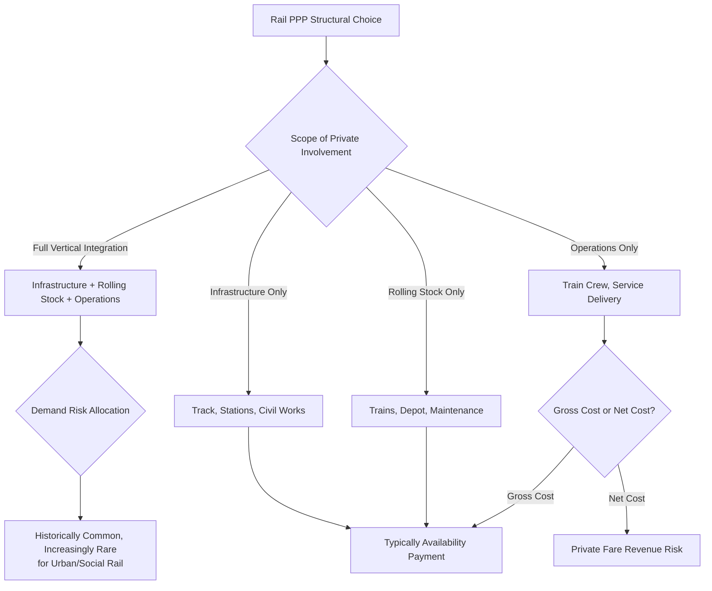
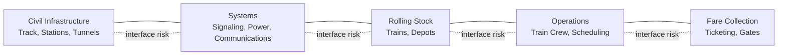

## Railway and Urban Rail PPPs

### Overview

Railway and urban rail PPPs encompass private sector participation in heavy rail, high-speed rail, light rail transit (LRT), and metro/subway systems, spanning arrangements from full vertically-integrated concessions (infrastructure and rolling stock/operations combined) to more common structures that separate infrastructure provision from train operations. Rail PPPs present distinctive economic and structural challenges relative to road and port PPPs, arising primarily from the sector's pronounced network effects, high fixed costs relative to variable costs, frequent public service obligations (fare affordability, social inclusion), and the technical complexity of integrating multiple specialized systems (civil infrastructure, rolling stock, signaling, fare collection) within a single service.

### Rationale and Position Within Transport PPPs

**Key Points**

- Rail systems typically exhibit strong **natural monopoly characteristics** at the network level (duplicating rail infrastructure is rarely economically sensible) combined with high capital intensity and long asset lives (track and civil infrastructure often exceeding 50-100 years, rolling stock 25-35 years), creating a fundamentally different risk and financing profile than road-based transport PPPs.
- Urban rail (metro, LRT) in particular is frequently subject to strong political commitments around fare affordability and social equity objectives, since urban transit often serves as essential mobility infrastructure for lower-income populations — this typically necessitates greater public revenue support (through availability payments, capital grants, or fare subsidy mechanisms) than pure user-pays models can sustain.
- The sector has historically seen a shift from early "full concession, real fare-box risk" models (common in some 1990s-2000s urban rail PPPs) toward **availability-based payment structures** that separate service delivery performance from fare revenue risk, reflecting lessons learned about the difficulty of transferring genuine demand risk to private operators in a politically sensitive, socially essential service.

### Core Structural Models

| Model | Scope | Demand Risk | Typical Use Case |
| --- | --- | --- | --- |
| Vertically Integrated Concession | Infrastructure + rolling stock + operations combined | Often private (fare-box) or hybrid | Some intercity and light rail concessions |
| Infrastructure-Only DBFM | Design-build-finance-maintain infrastructure; separate public/private train operator | Public (availability payment to infrastructure provider) | High-speed rail infrastructure, some metro civil works |
| Rolling Stock/Availability Concession | Private provides and maintains rolling stock; public operates train services | Public (availability payment for fleet readiness) | Many modern metro and rail rolling stock PPPs |
| Gross Cost Operating Concession | Private operator runs services for a fixed fee; Grantor retains fare revenue | Public | Franchised passenger rail in various jurisdictions |
| Net Cost/Franchise Concession | Private operator retains fare revenue, pays/receives premium based on performance | Private (substantial fare risk) | Traditional rail franchising models, historically more common |

### Demand Risk and Fare-Box Revenue Challenges

**Key Points**

- Fare-box demand risk in urban rail has proven particularly difficult to transfer successfully to the private sector, given: fares are frequently politically constrained (governments resist fare increases needed to make fare-box-risk models financially viable), ridership is heavily influenced by broader transport network integration and land-use planning decisions outside any single operator's control, and social/equity considerations often require below-cost-recovery fare levels sustained by public subsidy regardless of the operational delivery model.
- Notable historical experience with fare-box-risk urban rail PPPs internationally (some prominent light rail and metro concessions in various countries) has demonstrated **significant vulnerability to demand risk mis-forecasting**, prompting numerous renegotiations and, in some documented cases, contract termination or restructuring when actual ridership fell substantially short of Base Case projections — reinforcing the broader empirical pattern of demand-risk PPPs (also seen in toll roads) being disproportionately prone to renegotiation.
- [Inference] This accumulated experience has been a significant driver of the sector-wide shift toward availability-based payment structures for urban rail, since separating infrastructure/rolling stock investment returns from fare revenue volatility better matches the risk-bearing capacity of private investors while preserving public control over fare policy — though the specific mix of structures in use continues to vary by country and evolve over time.

### Integration Complexity and Interface Risk

**Key Points**

- **Interface risk** — the risk that failures or delays at the boundary between different contractual packages (e.g., civil works contractor versus systems integrator versus rolling stock supplier versus train operator) cause disputes over responsibility and project delay — is a defining technical challenge in rail PPPs, particularly where multiple separate contracts/concessions cover different elements of an integrated system.
- **Systems integration risk**: signaling, train control, and communications systems must interoperate correctly with both the civil infrastructure and rolling stock, and technology changes (e.g., transitions to newer train control standards) can create significant technical and commercial complexity when different contract packages are procured or renewed on different timelines.
- **Single-point responsibility versus fragmented delivery trade-off**: fully vertically integrated concessions reduce interface risk by placing a single private party responsible for the entire system, but at the cost of requiring that party to possess (or subcontract) expertise across civil engineering, rolling stock, and train operations — whereas fragmented structures (separate infrastructure, rolling stock, and operations contracts) allow more specialized procurement but increase interface risk and coordination complexity, often requiring the Grantor to take on a more active systems integration role itself.

### Rolling Stock Availability Concessions

**Key Points**

- A distinctive structural innovation in modern rail PPPs is the **rolling stock (or "train") availability concession**, in which a private consortium designs, finances, procures/manufactures, and maintains a rolling stock fleet over its operational life, receiving availability-based payments tied to fleet readiness and reliability (e.g., percentage of scheduled trains available, mean distance between failures) rather than fare revenue.
- This structure isolates rolling stock lifecycle and maintenance risk (technically complex, requiring specialized engineering expertise) into a dedicated, appropriately-skilled private consortium, while leaving fare policy, service planning, and demand risk with the public operator — a risk allocation increasingly favored in metro and regional rail modernization programs.
- Rolling stock KPIs typically include: fleet availability percentage, mean distance/time between failures, cleanliness and passenger information system functionality, and compliance with accessibility standards — distinct technical metrics from the civil infrastructure availability/roughness metrics used in road/pavement-focused PPPs.

### High-Speed Rail Specific Considerations

**Key Points**

- High-speed rail PPPs typically involve exceptionally high capital costs and long construction periods, often necessitating substantial public capital grant contributions alongside private financing (a "PPP-plus-grant" hybrid structure) rather than relying on private financing and fare revenue alone to make the project financially viable.
- **Network and interoperability standards**: high-speed rail infrastructure must typically comply with international or regional interoperability standards (particularly relevant in interconnected regional networks, e.g., European high-speed rail interoperability requirements), which can constrain design flexibility and affect risk allocation for technology and standards-compliance obligations.
- Demand for high-speed rail is heavily influenced by competing modes (particularly aviation on comparable routes) and broader economic/tourism factors, adding a distinct demand risk dimension compared to urban commuter rail, where demand is more closely tied to stable commuting patterns.

### Performance Monitoring Considerations Specific to Rail

**Key Points**

- **Punctuality and reliability metrics**: on-time performance (often measured against defined delay thresholds, e.g., percentage of trains arriving within a specified number of minutes of scheduled time) is a central KPI category, frequently subject to public reporting requirements given high commuter sensitivity to reliability.
- **Safety performance and regulatory compliance**: rail safety regulation is typically administered by a dedicated national rail safety authority, operating alongside (and generally taking precedence over) the PPP contract's own safety-related KPIs, given the sector's stringent safety-critical nature.
- **Capacity and crowding metrics**: particularly relevant in urban rail, some contracts incorporate passenger crowding or capacity utilization metrics, reflecting service quality dimensions beyond simple availability or punctuality.

### Common Pitfalls

**Key Points**

- **Persisting with fare-box-risk models against strong evidence of unsuitability**: continuing to structure urban rail PPPs around private fare-box demand risk despite substantial international experience demonstrating high renegotiation and distress rates in this model, rather than adopting availability-based structures better suited to the sector's political and demand characteristics.
- **Underestimating interface risk in fragmented procurement**: dividing a rail project into separate infrastructure, systems, rolling stock, and operations packages without adequate systems integration governance and interface risk management can result in disputes, delays, and finger-pointing between multiple private counterparties.
- **Inadequate coordination with broader transport network planning**: rail PPP demand and revenue projections that fail to account for planned changes to competing or complementary transport modes (new roads, bus network changes, land-use/urban development plans) can be significantly undermined by exogenous network changes outside the concession's control.
- **Underfunded public subsidy commitments**: availability payment structures shift demand risk to the public sector, meaning Grantors must ensure long-term fiscal capacity and political commitment to sustained subsidy payments over the contract term — underestimating this fiscal commitment at the planning stage can create significant contingent liability and affordability risk.
- **Technology obsolescence in long-lived rolling stock and signaling contracts**: given rolling stock and signaling systems' multi-decade lifespans, contracts insufficiently providing for technology refresh, spare parts availability, and eventual obsolescence management can create significant later-stage operational and cost risk.

### Related Topics

- Toll Road and Motorway Concessions (comparative demand-risk experience)
- Airport PPPs and Aeronautical versus Non-Aeronautical Revenue
- Managing Variations and Change Orders (systems integration and technology refresh)
- Performance Monitoring Systems and Reporting Requirements (punctuality and availability KPIs)
- Economics and Prevalence of PPP Contract Renegotiation (demand-risk model comparisons)
- Asset Condition Monitoring and Handback Standards (rolling stock and infrastructure lifecycle)
- Public Subsidy Design and Fiscal Sustainability of Availability Payment PPPs
- Interface Risk Management in Multi-Contract Infrastructure Delivery