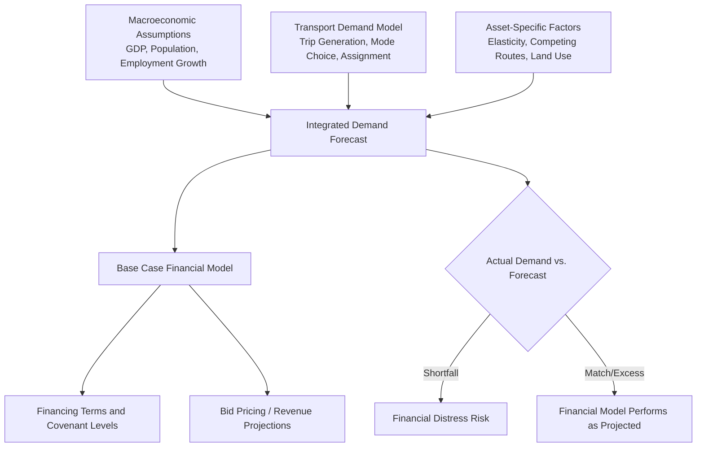
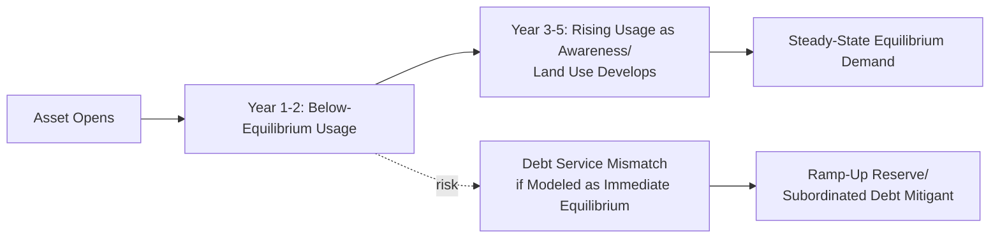
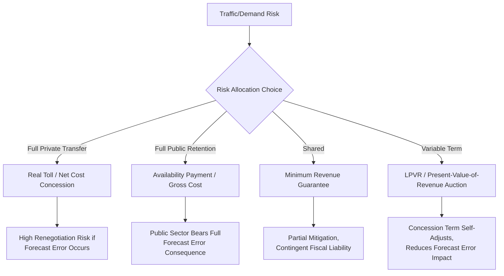

## Traffic Risk, Ramp-Up Periods, and Revenue Forecasting Challenges

### Overview

Traffic risk, ramp-up periods, and revenue forecasting challenges refer to the interconnected set of demand-side uncertainties that affect transport PPPs where revenue depends, directly or indirectly, on the volume of usage — vehicles, passengers, or cargo — over the life of the asset. This is a cross-cutting theme across toll roads, airports, ports, and rail, but merits dedicated treatment because it is empirically the single most significant source of financial distress, renegotiation, and dispute across transport PPPs globally, and because the underlying forecasting and modeling challenges share common structural features regardless of the specific transport mode.

### The Core Forecasting Problem

**Key Points**

- Transport demand forecasts embedded in PPP bids and Base Case Financial Models must project usage patterns 20-35 years into the future, a horizon over which economic growth, land-use development, competing infrastructure, technology (e.g., autonomous vehicles, remote work patterns, e-commerce logistics shifts), and travel behavior can change in ways that are inherently difficult to predict with precision at the time of bidding.
- Traffic/demand forecasts typically combine multiple modeling layers: macroeconomic growth assumptions (GDP, population, employment), transport-specific demand models (often four-step travel demand models: trip generation, distribution, mode choice, and route/traffic assignment), and asset-specific factors (toll/fare elasticity, competing route or mode availability, land-use and development assumptions along the corridor or catchment).
- Because forecasts feed directly into the Base Case Financial Model that underpins financing terms, equity returns, and (in demand-risk structures) actual revenue realization, forecasting error has direct and potentially severe financial consequences distinct from a purely academic modeling exercise.

### Documented Patterns of Forecasting Bias

**Key Points**

- A substantial body of academic research (notably work by Bent Flyvbjerg and colleagues examining large infrastructure projects internationally, and sector-specific studies on toll road and rail demand forecasts) has documented a persistent and statistically significant tendency toward **optimistic forecasting bias** across many transport infrastructure projects, with actual demand frequently falling short of pre-construction projections.
- [Inference] The academic literature offers multiple, not mutually exclusive, explanations for this pattern: genuine technical difficulty in long-horizon demand modeling, "optimism bias" as a well-documented general cognitive/organizational tendency in project appraisal (systematically underestimating costs and risks while overestimating benefits), and "strategic misrepresentation" (deliberate manipulation of forecasts to secure project approval or win competitive bids) — the relative contribution of each explanation is debated and likely varies by project, sponsor, and institutional context, so attributing any specific instance of forecast error to a particular cause requires case-specific analysis rather than general assumption.
- Forecasting error has been documented in both directions (some projects exceed forecasts), but the statistical pattern in much of the published literature shows a skew toward shortfall rather than a simple symmetric error distribution — a pattern of particular concern for demand-risk PPP structures, where such shortfalls translate directly into revenue and debt-service shortfalls for the private party.

### Ramp-Up Period Dynamics

**Key Points**

- **Ramp-up** refers to the multi-year period following a new asset's opening during which actual usage rises from an initial lower level toward its longer-term equilibrium, as users become aware of the new facility, adjust habits, and as complementary land-use or network changes materialize over time.
- Ramp-up dynamics differ meaningfully by asset type: greenfield toll roads in developing corridors may experience ramp-up periods of several years as surrounding development catches up to the new infrastructure; new airport terminals or routes may see faster passenger ramp-up tied to airline scheduling decisions; new rail lines often see ramp-up tied to complementary feeder service and land-use integration timelines.
- **Common modeling failure**: financial models that assume near-immediate achievement of long-term equilibrium demand (rather than an explicit, realistic ramp-up curve) can create a structural mismatch between actual early-year cash flows and debt service obligations calibrated to steady-state assumptions, generating financial stress even on projects that may prove viable once full ramp-up is achieved.
- Some financing structures explicitly address this through **ramp-up facilities or subordinated debt tranches** with reduced or deferred debt service in the early operational years, or through **debt service reserve accounts** sized to bridge an anticipated ramp-up shortfall period — recognizing ramp-up as a distinct, quantifiable risk category rather than treating any early-year shortfall as an unexpected default trigger.

### Elasticity and Price-Demand Interactions

**Key Points**

- Toll/fare elasticity (the sensitivity of demand to price changes) is a critical and often uncertain modeling input — overestimating price tolerance can lead to toll/fare levels that suppress demand below projections, while underestimating tolerance may leave revenue on the table relative to what the market would actually bear, though the latter is generally treated as a less severe forecasting risk than demand-suppressing overestimation.
- Cross-elasticity with competing routes or modes (a free alternative road, a competing airline route, an alternative port) means that even accurate own-price elasticity estimates can be undermined by exogenous changes in the pricing or availability of substitutes not fully anticipated at the forecasting stage.
- Elasticity estimates are typically derived from historical data on comparable existing facilities or stated-preference/revealed-preference survey methodologies, both of which carry inherent extrapolation risk when applied to new, sometimes unprecedented, infrastructure or route contexts.

### Independent Review and Governance Responses

**Key Points**

- **Independent traffic and revenue studies**: increasingly standard practice for Grantors to commission an independent demand forecast (distinct from and sometimes reconciled against bidders' own projections) as part of project preparation, providing a more objective baseline for evaluating bid credibility and setting realistic public sector risk exposure expectations (e.g., for minimum revenue guarantee sizing).
- **Sensitivity and scenario analysis requirements**: robust project appraisal practice requires financial models to be stress-tested against a range of demand scenarios (not just a single base case), with covenant structures and reserve account sizing calibrated to withstand realistic downside scenarios rather than only the base case projection.
- **Optimism bias adjustment factors**: some national infrastructure appraisal guidance (e.g., certain public investment appraisal frameworks) mandate the application of standardized "optimism bias" uplift/discount factors to demand and cost forecasts, based on historical outturn data for comparable project categories, as a structural correction for the documented systematic bias discussed above.
- **Benchmarking against comparable assets**: forecasts for new infrastructure are often validated against actual demand outturns at comparable existing facilities (similar road corridors, similar-sized airports, similar rail lines), providing an empirical anchor beyond pure theoretical modeling.

### Risk Allocation Design Responses

**Key Points**

- The empirical prevalence of demand-risk forecasting failures has been a primary driver of the broader sector-wide shift toward availability-based payment structures (as discussed in relation to rail and increasingly toll roads), which remove fare-box/toll revenue volatility from the private party's risk exposure at the cost of shifting demand risk fully to the public sector's fiscal position.
- **Least Present Value of Revenue (LPVR)** and similar variable-term auction mechanisms directly address forecasting risk by making the concession length itself responsive to actual realized revenue, rather than fixing a term based on a point forecast that may prove materially wrong in either direction.
- Minimum revenue guarantees represent an intermediate risk-sharing approach but require careful actuarial-style valuation and transparent fiscal disclosure, since underpriced or poorly disclosed guarantees can create material contingent liabilities that are not fully visible in headline public accounts at the time of contract signing.

### Common Pitfalls

**Key Points**

- **Relying solely on bidder-supplied forecasts**: accepting private bidders' own demand projections without independent verification creates an inherent conflict-of-interest risk, since bidders may have incentives to present optimistic forecasts to win competitive tenders (whether through genuine optimism or strategic behavior).
- **Ignoring or under-modeling the ramp-up period**: assuming immediate steady-state demand achievement, leading to inappropriately front-loaded debt service obligations relative to realistic early-year cash flows.
- **Static, single-point forecasts without scenario testing**: failing to stress-test financial models against a realistic range of demand outcomes, leaving little margin for the kind of forecast error that has proven historically common in the sector.
- **Underestimating cross-modal and competing infrastructure effects**: not adequately accounting for how future public investment in competing routes or modes could materially affect projected demand for the PPP asset over its long concession term.
- **Treating optimism bias as solely a bidder problem**: overlooking that Grantors and their advisers can also be subject to the same cognitive biases when preparing independent forecasts or approving projects, particularly where political incentives favor project approval.

### Related Topics

- Toll Road and Motorway Concessions
- Railway and Urban Rail PPPs (fare-box risk experience)
- Airport PPPs and Aeronautical versus Non-Aeronautical Revenue (passenger volume risk)
- Economics and Prevalence of PPP Contract Renegotiation
- Minimum Revenue Guarantees and Contingent Fiscal Liability Management
- Base Case Financial Model Mechanics and Sensitivity Analysis
- Chilean LPVR Concession Model and Alternative Demand-Risk Auction Mechanisms
- Value-for-Money Assessment and Public Sector Comparator Methodology