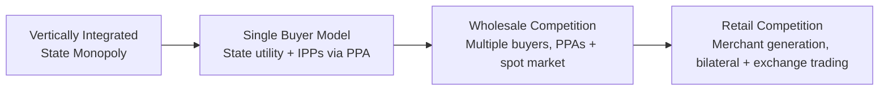
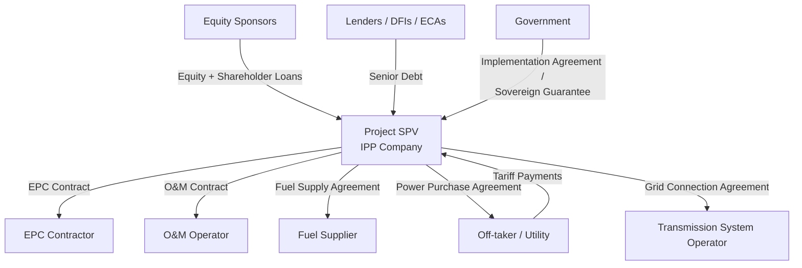

## Independent Power Producer Models and Power Purchase Agreements

### Overview and Definition

An Independent Power Producer (IPP) is a privately owned entity that generates electricity for sale to a utility, a grid operator, or, in liberalized markets, directly to end consumers, without owning the transmission and distribution network. The IPP model is one of the earliest and most widely adopted PPP structures in the energy sector, distinct from vertically integrated state utilities that historically owned generation, transmission, and distribution together.

A Power Purchase Agreement (PPA) is the contractual instrument that underpins the IPP model. It is a long-term bilateral contract between the power generator (seller) and an off-taker (buyer, typically a state-owned utility or distribution company) that establishes the commercial and technical terms under which electricity is sold, including price, quantity, delivery point, duration, and risk allocation.

**Key Points**

- IPPs typically operate under Build-Own-Operate (BOO) or Build-Own-Operate-Transfer (BOOT) structures, distinguishing them from concession-based infrastructure PPPs where assets revert to the government.
- The PPA is the central risk-allocation and bankability document; lenders in project-financed IPPs rely on the PPA's revenue certainty to extend non-recourse or limited-recourse debt.
- The model separates generation from transmission/distribution, allowing private capital into generation while the grid can remain a state monopoly (a "single-buyer model").

### Historical Context and Rationale

The IPP model emerged prominently in the 1980s–1990s as governments sought to address chronic underinvestment in generation capacity, fiscal constraints on state utilities, and inefficiencies in state-run power sectors. The United States' Public Utility Regulatory Policies Act (PURPA) of 1978 is widely cited as an early catalyst, requiring utilities to purchase power from qualifying independent facilities. This model was subsequently exported to developing countries through World Bank and multilateral development bank programs during the 1990s power sector reform wave, notably in countries such as Pakistan, Indonesia, the Philippines, and Turkey.

**Key Points**

- Core drivers: capital scarcity in state utilities, need for rapid capacity addition, technology and efficiency gains from private operators, and de-risking public balance sheets.
- IPPs allowed governments to add generation capacity "off-balance-sheet," though this classification depends on contingent liability treatment (see Fiscal Risk section below).
- The single-buyer model (one state utility purchasing all IPP output) remains dominant in many emerging markets, while liberalized markets have moved toward multi-buyer or merchant models.

### Sector Structure Continuum

Power sector reform is often depicted along a continuum from fully vertically integrated state monopoly to fully liberalized competitive markets. IPPs typically enter at intermediate stages.

**Key Points**

- Most emerging-market PPP programs operate in the Single Buyer stage (B), where the PPA is essential because there is no liquid wholesale market to sell into otherwise.
- Advanced markets (C, D) see PPAs evolve into corporate PPAs, virtual PPAs, and contracts-for-difference rather than the classical utility-offtake PPA.

### Core IPP Contractual and Ownership Structures

**BOO (Build-Own-Operate)**

The IPP retains permanent ownership of the generation asset. There is no transfer obligation to the government. This is now the dominant model for renewable energy IPPs globally because the asset has residual value and the sponsor prefers to retain it (or sell to a secondary buyer) rather than hand it over.

**BOOT (Build-Own-Operate-Transfer)**

The IPP builds, owns, and operates the plant for a concession period (typically 20–25 years), after which ownership transfers to the government or its nominee, usually at no cost or nominal value. Common in thermal and large hydro IPPs where the government wants eventual asset control.

**BOO vs. BOOT Comparison**

| Dimension | BOO | BOOT |
| --- | --- | --- |
| Asset ownership at contract end | Retained by sponsor/successor | Transferred to government |
| Typical technology | Renewables (solar, wind) | Thermal, large hydro, nuclear-adjacent |
| Sponsor exit options | Sale to secondary market, refinancing | Limited to concession period |
| Government long-term control | Low | High (post-transfer) |
| Terminal value risk allocation | Borne by sponsor | Borne by government (inherits asset condition risk) |

**Rental Power / Emergency Power Producer (EPP) Models**

Short-term (often 3–10 year) contracts, typically for containerized or barge-mounted diesel/gas generation, deployed to address acute supply shortfalls. These carry higher per-unit tariffs reflecting speed of deployment and shorter cost recovery periods. [Inference: exact tariff premiums vary significantly by country and are not standardized, so specific multipliers should be treated as illustrative rather than universal.]

**Merchant IPP Model**

The IPP sells output into a wholesale spot market or via short-term bilateral contracts rather than a single long-term PPA. This model requires a functioning liquid wholesale market and shifts price and volume risk substantially onto the generator, materially changing bankability and typically requiring higher equity cushions or hedging instruments.

### Project Structuring and SPV Architecture

IPPs are almost universally structured through a ring-fenced Special Purpose Vehicle (SPV) to enable project finance (non-recourse or limited-recourse lending against project cash flows rather than sponsor balance sheets).

**Key Points**

- The EPC contract, O&M contract, fuel supply agreement, and PPA together form a matched set of "back-to-back" contracts, each transferring specific risks so that the SPV's net risk position is manageable.
- The Implementation Agreement (or Government Support Agreement) sits alongside the PPA to address risks the off-taker alone cannot cover: currency convertibility, change-in-law, sovereign guarantee of off-taker payment obligations, and land/permitting support.
- Lenders conduct due diligence across the entire contract stack because a weakness in any single agreement (e.g., an EPC contractor without adequate liquidated damages) can undermine the bankability the PPA otherwise establishes.

### Anatomy of a Power Purchase Agreement

A PPA typically contains the following core clauses:

**1. Term and Commercial Operation Date (COD)**

Defines contract duration (commonly 15–25 years for thermal, 20–25 years for renewables) and the milestone date from which payment obligations begin.

**2. Capacity and Energy Definitions**

Distinguishes Contracted Capacity (the maximum output the off-taker commits to pay for availability) from Net Energy Output (actual electricity delivered, metered at a defined delivery point).

**3. Tariff Structure**

Most conventional-generation PPAs use a **two-part tariff**:

$$\text{Total Tariff Payment} = \text{Capacity Payment} + \text{Energy Payment}$$

- **Capacity Payment (Fixed Charge):** Paid based on plant availability regardless of dispatch, designed to recover fixed costs — debt service, return on equity, fixed O&M. Often expressed as:

$$CP = \left(\frac{DS + FOM + ROE}{AC_{ref}}\right) \times AC_{actual}$$

where $DS$ is debt service, $FOM$ is fixed operations and maintenance cost, $ROE$ is the contracted return on equity, $AC_{ref}$ is reference (contracted) availability, and $AC_{actual}$ is demonstrated availability.

- **Energy Payment (Variable Charge):** Paid per unit of energy actually dispatched, designed to cover variable costs, primarily fuel:

$$EP = HR \times FC \times E$$

where $HR$ is the heat rate (fuel consumed per unit of electricity), $FC$ is the fuel cost per unit of fuel, and $E$ is energy delivered in the billing period.

Renewable energy PPAs (solar, wind) typically use a **single-part, energy-only tariff** (a flat $/MWh or local-currency/kWh rate) because there is no fuel cost to isolate and the "must-run" dispatch priority removes the need for a separate capacity payment in most jurisdictions. [Inference: some renewable PPAs, particularly in capacity-constrained or resource-adequacy-focused markets, do include a capacity or availability component; this varies by regulatory design.]

**4. Take-or-Pay / Minimum Offtake Obligations**

Many PPAs include a "deemed generation" or "deemed energy" clause under which the off-taker must pay for contracted capacity/energy even if it does not dispatch the plant (e.g., due to grid constraints or lower-than-forecast demand), shifting demand risk to the off-taker. This is a defining bankability feature distinguishing traditional utility-offtake IPP PPAs from merchant arrangements.

**5. Dispatch and Curtailment Provisions**

Specifies merit-order dispatch rules, curtailment rights of the grid operator, and whether curtailed renewable energy is compensated (curtailment compensation is increasingly standard in mature renewable PPA frameworks to preserve bankability).

**6. Force Majeure**

Distinguishes Natural Force Majeure (weather, earthquakes) from Political Force Majeure (war, expropriation, currency inconvertibility), with the latter often triggering government buy-out obligations rather than mere suspension of obligations.

**7. Termination and Compensation on Termination (CoT)**

Defines termination triggers (off-taker default, sponsor default, prolonged force majeure, political events) and the corresponding compensation formula, which typically must cover outstanding debt at minimum (to satisfy lender step-in requirements) and may include equity return components depending on the fault attribution.

**8. Change in Law**

Allocates the risk of new taxes, regulatory changes, or environmental requirements enacted after contract signing, usually via tariff pass-through mechanisms.

**9. Metering, Billing, and Payment Security**

Defines metering standards, billing cycles, and payment security mechanisms such as Letters of Credit (LCs), escrow accounts, or partial risk guarantees from development finance institutions (DFIs) to mitigate off-taker payment default risk.

### Risk Allocation Matrix

| Risk Category | Typically Borne By | Mitigation Mechanism |
| --- | --- | --- |
| Construction cost overrun | Sponsor/EPC Contractor | Fixed-price, date-certain EPC contract with liquidated damages |
| Fuel price volatility | Off-taker (pass-through) | Energy payment fuel pass-through formula |
| Fuel supply availability | Sponsor (via Fuel Supply Agreement) | Back-to-back FSA with supplier |
| Demand/offtake risk | Off-taker | Take-or-pay / deemed dispatch clause |
| Currency/convertibility risk | Government | Implementation Agreement, hard-currency indexation |
| Off-taker payment default | Off-taker, backstopped by Government | Sovereign guarantee, LC, DFI partial risk guarantee |
| Regulatory/change-in-law risk | Off-taker or Government | Change-in-law tariff adjustment clause |
| Force majeure (political) | Government | Termination compensation, buy-out obligation |
| Force majeure (natural) | Shared or insured | Business interruption insurance |
| Operating performance | Sponsor | O&M contract with performance guarantees |
| Resource risk (wind/solar variability) | Sponsor (or shared via capacity factor guarantees) | Resource assessment studies, insurance products |
| Interconnection/grid delay | Varies by jurisdiction | Grid connection agreement with TSO |

**Key Points**

- The guiding principle of PPA risk allocation is that each risk should sit with the party best able to manage or price it — a private EPC contractor is best placed to manage construction risk; a sovereign is best placed to manage currency convertibility risk.
- Poorly allocated risk (e.g., forcing sponsors to bear currency risk in a country with a history of forex shortages) raises the required tariff or renders the project unfinanceable, illustrating that risk allocation directly drives project cost, not merely a legal formality.

### Tariff Determination Methodologies

**1. Cost-Plus / Cost-of-Service Tariffs**

Tariff is built up from itemized cost components (capital recovery, O&M, fuel, contracted return on equity). Common in early-generation IPP programs and in negotiated (non-competitive) procurement.

**2. Competitively Bid Tariffs**

Tariff is the outcome of a competitive tender (auction) where bidders submit a levelized tariff and the lowest compliant bid wins. This has become the dominant procurement method globally for renewable IPPs due to its price discovery efficiency and reduced negotiation risk. [Inference: "dominant" reflects observed procurement trends as of the pre-2026 knowledge base; program-specific adoption varies by country and sector maturity.]

**3. Feed-in Tariff (FiT)**

A regulator-set, technology-specific fixed tariff offered to any qualifying generator, without competitive bidding. Historically used to bootstrap early-stage renewable markets (e.g., Germany's Renewable Energy Sources Act model) before transitioning to auctions as markets matured.

**Levelized Cost of Electricity (LCOE)** is the standard metric underlying tariff benchmarking:

$$LCOE = \frac{\sum_{t=0}^{n} \frac{I_t + M_t + F_t}{(1+r)^t}}{\sum_{t=0}^{n} \frac{E_t}{(1+r)^t}}$$

where $I_t$ is investment expenditure, $M_t$ is operations and maintenance expenditure, $F_t$ is fuel expenditure, $E_t$ is electricity generated, $r$ is the discount rate, and $t$ is the year over the project lifetime $n$.

**Example**

A solar IPP bidding into a competitive auction estimates: capital expenditure of $800 per kW, annual fixed O&M of $12 per kW, a capacity factor of 22%, a 25-year project life, and a discount rate of 8%. The bidder computes LCOE using the formula above, discounting the annualized capex, O&M, and generation streams, then submits a per-kWh tariff bid at or above this LCOE plus a target equity margin. If the auction clears at a tariff below the bidder's computed LCOE-plus-margin threshold, the bidder should not submit at that price, since it would generate a return below its cost of capital. [Inference: real-world bid strategies also incorporate portfolio effects, tax equity structuring, and merchant tail value, which can lower the effective bid below simple LCOE.]

### Fiscal Risk and Contingent Liabilities

A central public-finance concern with IPP/PPA programs is that take-or-pay obligations and sovereign guarantees create contingent and sometimes direct fiscal liabilities that may not appear on the government's primary balance sheet but materially affect fiscal sustainability.

**Key Points**

- "Capacity payments" for underutilized IPPs (a widely documented issue in several emerging markets during periods of demand overestimation) can result in governments paying for power that is not consumed, effectively transferring demand-forecasting risk costs to the public purse.
- Multilateral bodies such as the IMF and World Bank have developed PPP fiscal risk assessment tools (e.g., the IMF's PPP Fiscal Risk Assessment Model, PFRAM) partly in response to concerns that IPP take-or-pay commitments understate true public financial exposure.
- Good practice includes conducting realistic demand forecasting before contracting capacity, staggering PPA commissioning dates to match demand growth, and maintaining fiscal risk registers that quantify contingent liabilities from sovereign guarantees and take-or-pay clauses. [Inference: the specific magnitude of capacity payment burdens as a share of GDP varies widely and case-specific figures should be sourced from country-specific audits rather than generalized.]

### Renewable Energy IPP Considerations

Renewable IPPs (solar PV, onshore/offshore wind) differ from thermal IPPs in several structural respects:

- **Zero fuel cost** eliminates the energy-payment fuel pass-through mechanism, simplifying the tariff to a single $/kWh rate but concentrating all revenue risk on resource variability and availability.
- **Intermittency** requires either "must-run" dispatch priority in the PPA or complementary grid-balancing arrangements (storage, ancillary services procurement) to maintain system stability, particularly at high penetration levels.
- **Curtailment risk** is a growing bankability issue as renewable penetration rises; PPAs increasingly include "deemed generation" compensation for curtailment caused by grid constraints not attributable to the generator.
- **Corporate PPAs**: In liberalized markets, corporate off-takers (large industrial or technology companies) increasingly contract directly with renewable IPPs, bypassing the utility off-taker entirely, often via **virtual/synthetic PPAs** structured as financial contracts-for-difference rather than physical delivery contracts.

**Physical vs. Virtual (Synthetic) PPA Comparison**

| Feature | Physical PPA | Virtual/Synthetic PPA |
| --- | --- | --- |
| Electricity delivery | Direct physical delivery to off-taker | No physical delivery; financial settlement only |
| Off-taker location requirement | Same grid/market as generator | None; off-taker can be anywhere |
| Settlement mechanism | Metered delivery at agreed tariff | Contract-for-difference against market reference price |
| Typical buyer | Utilities, retailers | Corporates (tech, manufacturing) seeking renewable attribute credits |
| Renewable Energy Certificate (REC) treatment | Bundled or unbundled | Typically unbundled, REC retained by buyer for claims |

### Financing Structure and Bankability

Project finance for IPPs typically follows a debt-to-equity ratio in the range of 70:30 to 80:20, reflecting the relatively predictable, contracted cash flow profile that PPAs are designed to create. [Inference: specific gearing ratios are transaction- and market-specific, varying with country risk, technology, and lender appetite; the ranges cited are commonly observed rather than fixed rules.]

**Debt Service Coverage Ratio (DSCR)**, a core bankability metric lenders assess against PPA cash flows:

$$DSCR = \frac{CFADS}{DS}$$

where $CFADS$ is Cash Flow Available for Debt Service (revenue under the PPA less operating costs and taxes) and $DS$ is scheduled debt service (principal plus interest) for the period. Lenders typically require minimum DSCR thresholds (commonly cited in the 1.2x–1.4x range for conventional IPPs) [Inference: exact covenant thresholds vary by lender, country risk, and technology] to provide a cash flow buffer against underperformance.

**Key Points**

- Because PPAs typically provide the SPV's sole revenue stream, the PPA's tenor should match or exceed the loan tenor; a mismatch (e.g., a 15-year PPA against a 18-year loan) is a common bankability red flag.
- Development finance institutions (IFC, ADB, World Bank's MIGA, export credit agencies) frequently provide partial risk guarantees, political risk insurance, or direct lending to improve bankability in higher-risk jurisdictions, effectively substituting for sovereign credit strength that the off-taker lacks.

### Common Renegotiation and Dispute Triggers

- Currency devaluation eroding the local-currency value of dollar-indexed tariffs, prompting off-taker requests for tariff renegotiation.
- Demand shortfalls relative to original forecasts, leading governments to challenge take-or-pay capacity payments as excessive ("stranded capacity" disputes).
- Allegations of tariff-setting irregularities in non-competitively negotiated legacy contracts, sometimes leading to government-led contract reviews (several such reviews have occurred in South and Southeast Asian IPP programs).
- Force majeure disputes over pandemic-related demand collapse (a notable feature of many PPAs during 2020–2021).

**Key Points**

- Well-drafted PPAs include structured renegotiation or dispute resolution clauses (international arbitration under ICC, UNCITRAL, or ICSID rules) precisely because unilateral government renegotiation attempts are a recurring source of investor-state disputes in the IPP sector.
- Political risk insurance and multilateral guarantee involvement (e.g., MIGA) can reduce renegotiation risk by increasing the reputational and financial cost to governments of unilateral contract modification.

### Worked Numerical Example: Two-Part Tariff Calculation

Assume a 100 MW thermal IPP with the following parameters for a given month:

- Contracted (reference) availability: 90%
- Actual demonstrated availability: 95%
- Annualized fixed charge (debt service + fixed O&M + equity return): $18,000,000
- Heat rate: 2,400 kcal/kWh (converted to fuel units per kWh)
- Fuel cost: $0.045 per kWh-equivalent fuel input
- Net energy delivered in the month: 40,000,000 kWh

**Capacity Payment** (monthly fixed charge apportioned, scaled by availability performance):

$$CP_{monthly} = \left(\frac{\$18{,}000{,}000}{12}\right) \times \left(\frac{95\%}{90\%}\right) = \$1{,}500{,}000 \times 1.0556 \approx \$1{,}583{,}333$$

**Energy Payment**:

$$EP = 40{,}000{,}000 \text{ kWh} \times \$0.045/\text{kWh} = \$1{,}800{,}000$$

**Total Monthly Tariff Payment**:

$$\$1{,}583{,}333 + \$1{,}800{,}000 = \$3{,}383{,}333$$

**Example**

This illustrates a key structural feature: because demonstrated availability (95%) exceeded reference availability (90%), the capacity payment is scaled upward, rewarding the IPP for over-performance — a common (though not universal) design in availability-based capacity payment formulas. [Inference: exact scaling mechanics, including caps on over-performance bonuses, vary by contract and regulatory framework.]

### IPP Governance and Off-take Diagram

<svg xmlns="http://www.w3.org/2000/svg" viewBox="0 0 900 460" font-family="Arial, sans-serif">
<text x="450" y="28" font-size="18" font-weight="bold" text-anchor="middle" fill="#1a1a1a">IPP Contractual Ecosystem (svg_diagram)</text>
<rect x="370" y="190" width="160" height="80" rx="8" fill="#dbeafe" stroke="#1e40af" stroke-width="2" />
<text x="450" y="225" font-size="14" font-weight="bold" text-anchor="middle" fill="#1e40af">Project SPV</text>
<text x="450" y="245" font-size="12" text-anchor="middle" fill="#1e40af">(IPP Company)</text>
<rect x="40" y="60" width="150" height="60" rx="8" fill="#dcfce7" stroke="#166534" stroke-width="2" />
<text x="115" y="85" font-size="12" font-weight="bold" text-anchor="middle" fill="#166534">Equity Sponsors</text>
<text x="115" y="102" font-size="11" text-anchor="middle" fill="#166534">Equity + Sub-debt</text>
<rect x="40" y="340" width="150" height="60" rx="8" fill="#dcfce7" stroke="#166534" stroke-width="2" />
<text x="115" y="365" font-size="12" font-weight="bold" text-anchor="middle" fill="#166534">Lenders / DFIs</text>
<text x="115" y="382" font-size="11" text-anchor="middle" fill="#166534">Senior Debt</text>
<rect x="710" y="60" width="150" height="60" rx="8" fill="#fef3c7" stroke="#92400e" stroke-width="2" />
<text x="785" y="85" font-size="12" font-weight="bold" text-anchor="middle" fill="#92400e">EPC Contractor</text>
<text x="785" y="102" font-size="11" text-anchor="middle" fill="#92400e">Fixed-price build</text>
<rect x="710" y="150" width="150" height="60" rx="8" fill="#fef3c7" stroke="#92400e" stroke-width="2" />
<text x="785" y="175" font-size="12" font-weight="bold" text-anchor="middle" fill="#92400e">O&amp;M Operator</text>
<text x="785" y="192" font-size="11" text-anchor="middle" fill="#92400e">Performance guarantee</text>
<rect x="710" y="240" width="150" height="60" rx="8" fill="#fef3c7" stroke="#92400e" stroke-width="2" />
<text x="785" y="265" font-size="12" font-weight="bold" text-anchor="middle" fill="#92400e">Fuel Supplier</text>
<text x="785" y="282" font-size="11" text-anchor="middle" fill="#92400e">Fuel Supply Agreement</text>
<rect x="370" y="340" width="160" height="60" rx="8" fill="#fee2e2" stroke="#991b1b" stroke-width="2" />
<text x="450" y="365" font-size="12" font-weight="bold" text-anchor="middle" fill="#991b1b">Off-taker Utility</text>
<text x="450" y="382" font-size="11" text-anchor="middle" fill="#991b1b">PPA counterparty</text>
<rect x="40" y="200" width="150" height="60" rx="8" fill="#ede9fe" stroke="#5b21b6" stroke-width="2" />
<text x="115" y="225" font-size="12" font-weight="bold" text-anchor="middle" fill="#5b21b6">Government</text>
<text x="115" y="242" font-size="11" text-anchor="middle" fill="#5b21b6">Implementation Agmt</text>
<line x1="190" y1="90" x2="370" y2="210" stroke="#166534" stroke-width="1.5" />
<line x1="190" y1="230" x2="370" y2="225" stroke="#5b21b6" stroke-width="1.5" />
<line x1="190" y1="370" x2="370" y2="260" stroke="#166534" stroke-width="1.5" />
<line x1="530" y1="215" x2="710" y2="90" stroke="#92400e" stroke-width="1.5" />
<line x1="530" y1="225" x2="710" y2="180" stroke="#92400e" stroke-width="1.5" />
<line x1="530" y1="245" x2="710" y2="270" stroke="#92400e" stroke-width="1.5" />
<line x1="450" y1="270" x2="450" y2="340" stroke="#991b1b" stroke-width="2" />
<text x="465" y="308" font-size="11" fill="#991b1b" font-weight="bold">PPA</text>

<text x="450" y="440" font-size="11" text-anchor="middle" fill="`#4b5563`">Arrows indicate contractual/financial relationships converging on the ring-fenced SPV</text>

</svg>

### Distinguishing IPP/PPA Models from Other PPP Structures

| Feature | IPP/PPA Model | Toll Road Concession | Availability-Based PPP (e.g., social infrastructure) |
| --- | --- | --- | --- |
| Revenue source | Off-taker tariff payments | User tolls (demand risk) or shadow tolls | Government availability payments |
| Demand risk | Largely on off-taker (take-or-pay) | Often on concessionaire | On government |
| Asset transfer | BOO (none) or BOOT (at term end) | Typically BOT | Typically transferred at contract end |
| Primary revenue risk driver | Fuel cost, off-taker credit, dispatch | Traffic volume forecasts | Service quality/availability standards |

### Related Topics

- Renewable Energy Auctions and Competitive Procurement Design
- Sovereign Guarantees and Government Support Agreements in Energy PPPs
- Transmission and Distribution PPPs (Concession vs. Management Contracts)
- Political Risk Insurance and Multilateral Guarantee Instruments (MIGA, PRGs)
- Off-taker Creditworthiness Assessment and Payment Security Mechanisms (LCs, Escrow, DFI Guarantees)
- Grid Integration and Curtailment Risk in High-Renewable-Penetration Systems
- Corporate and Virtual Power Purchase Agreements
- Fiscal Risk Assessment Tools for Contingent Liabilities (IMF PFRAM)
- Energy Storage PPPs and Battery Energy Storage System (BESS) Contracting Models
- Renegotiation Dynamics and Investor-State Dispute Settlement in Energy PPPs