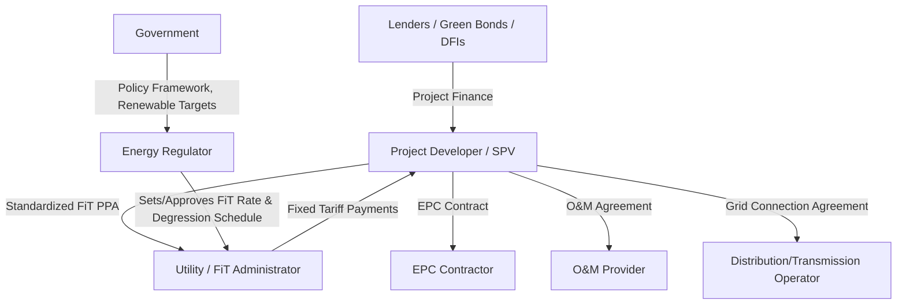

## Renewable Energy PPPs and Feed-In Tariff Structures

### Overview and Definition

Renewable Energy Public-Private Partnerships involve private developers financing, building, owning, and operating renewable generation assets (solar PV, onshore/offshore wind, small hydro, biomass, geothermal) under long-term contracts with a public or quasi-public off-taker. A Feed-in Tariff (FiT) is a specific policy and remuneration mechanism within this broader category: a government- or regulator-set, technology-specific fixed price per unit of electricity, guaranteed to any qualifying generator that connects to the grid, typically without competitive bidding.

FiTs are one of several support mechanisms used to structure renewable energy PPPs; understanding where FiTs sit relative to auctions, feed-in premiums, and net metering is central to this topic.

**Key Points**

- FiTs decouple renewable project revenue from wholesale market price volatility, which is what historically made early-stage renewable investment bankable before technology costs fell.
- FiT programs are typically administered through a standardized, non-negotiated PPA template, reducing transaction costs relative to individually negotiated thermal IPP contracts.
- Most mature markets have transitioned from pure FiTs toward competitive auctions or Feed-in Premiums (FiPs) as renewable costs declined and deployment volumes grew, though FiTs remain common for smaller-scale or distributed generation.

### Rationale for Renewable-Specific PPP Structures

Renewable generation differs from thermal IPPs in ways that justify distinct contractual and remuneration design:

- **No fuel cost** removes the need for a fuel pass-through mechanism, simplifying tariff design to a single energy-based rate.
- **Resource intermittency** (solar irradiance, wind speed variability) shifts the dominant risk from dispatch/demand risk to resource risk and grid curtailment risk.
- **Modularity and shorter construction periods** (particularly for solar PV) allow smaller-scale private participation than large thermal or hydro IPPs typically require.
- **Policy objectives beyond electricity supply** — decarbonization targets, energy security, and industrial policy (local manufacturing content) — often shape renewable PPP design more heavily than pure least-cost dispatch economics.

### The Support Mechanism Spectrum

**Key Points**

- Movement rightward along this spectrum generally corresponds to increasing market maturity, larger project scale, and lower policy-administered risk transfer to consumers/taxpayers.
- Many jurisdictions operate hybrid systems: FiTs for small-scale/rooftop generation and rooftop residential systems, with auctions or CfDs for utility-scale projects.

### Feed-in Tariff Mechanics

**Core Structure**

A FiT guarantees the generator:

1. **Priority/guaranteed grid access** — the utility or grid operator is obligated to connect and purchase all output.
2. **A fixed price per kWh** for a specified contract duration (commonly 15–20 years), often differentiated by technology, project size, and sometimes commissioning date (vintage).
3. **Must-run/must-take dispatch priority** — renewable output is typically dispatched ahead of conventional generation in the merit order.

**Tariff-Setting Approaches**

| Approach | Description | Typical Use Case |
| --- | --- | --- |
| Administratively determined (cost-plus) | Regulator sets tariff based on estimated LCOE plus a target return | Early-stage market bootstrapping |
| Degression schedule | Tariff for new entrants automatically declines on a pre-set schedule (e.g., annually or per capacity tranche) to track falling technology costs | Mature FiT programs (e.g., Germany's historical EEG design) |
| Vintage-based | Tariff locked at the rate in effect at the time of grid connection or contract signing, held fixed for the full contract term | Nearly universal within individual FiT contracts, regardless of the setting approach above |

**FiT Payment Formula**

$$\text{Monthly FiT Payment} = T_{FiT} \times E_{net}$$

where $T_{FiT}$ is the fixed feed-in tariff rate (local currency or USD per kWh) and $E_{net}$ is net metered energy exported to the grid in the billing period.

**Example**

A rooftop solar developer signs a FiT contract at $0.12/kWh for 20 years. In a given month, the system exports 8,000 kWh to the grid. The payment due is:

$$\$0.12 \times 8{,}000 = \$960$$

Because the rate is fixed for the full 20-year term regardless of later declines in the administratively set FiT for new entrants, this generator's revenue is insulated from subsequent tariff degression — a defining bankability feature of vintage-based FiT design.

### Feed-in Premium (FiP) as an Evolution of FiT

Under a FiP, the generator sells electricity directly into the wholesale market and receives a supplementary premium on top of the market price, rather than a single administratively fixed price.

$$\text{Total Revenue per kWh} = P_{market} + Premium$$

Two common premium designs:

- **Fixed premium:** A constant top-up regardless of market price movement, retaining full market price risk with the generator.
- **Sliding/variable premium:** The premium adjusts inversely with market price to maintain a target total revenue level, transferring price risk back toward the counterparty (government or market operator), similar in effect to a one-sided Contract for Difference.

**Key Points**

- FiPs expose generators to market price risk and dispatch/balancing responsibility that FiTs shield them from, generally requiring more sophisticated market participation capability (forecasting, balancing group membership).
- The shift from FiT to FiP is frequently cited as a step toward integrating renewables into competitive markets while retaining some revenue support during the transition period.

### Contract for Difference (CfD) as a Related Structure

A CfD is a two-way hedge: if the market reference price falls below a pre-agreed strike price, the counterparty (often a government agency) pays the generator the difference; if the market price rises above the strike price, the generator pays back the surplus.

$$\text{Settlement Payment} = (P_{strike} - P_{reference}) \times E$$

A positive result is paid to the generator; a negative result is paid by the generator to the counterparty. This structure, prominently used in the UK's Contracts for Difference scheme for offshore wind, caps both downside and upside for the generator, which some policymakers view as fairer to consumers than a one-way FiT during periods of high market prices. [Inference: whether CfDs are "fairer" is a policy judgment; the mechanism's distributional effects depend on realized market price paths relative to the strike price, which vary by market and period.]

### Comparative Table: FiT vs. FiP vs. CfD vs. Competitive Auction

| Feature | FiT | FiP | CfD | Competitive Auction |
| --- | --- | --- | --- | --- |
| Price discovery | Administrative | Administrative (premium) + market | Administrative (strike) + market | Competitive bid |
| Market price exposure | None | Full (plus premium) | None (two-way hedge) | Depends on underlying instrument awarded |
| Grid access priority | Guaranteed | Usually guaranteed | Usually guaranteed | Contract-dependent |
| Administrative complexity | Low | Moderate | Moderate–High | High (tender design/evaluation) |
| Cost to consumers/taxpayers | Can be high if tariffs set above market-clearing cost | Variable | Capped both ways | Tends toward least-cost given competition |
| Typical market stage | Early-stage market bootstrapping | Transitional | Mature markets, large-scale offshore wind | Mature or maturing markets |

### PPP Contractual Structure for FiT-Based Renewable Projects

**Key Points**

- Unlike negotiated thermal IPP PPAs, FiT PPAs are typically standardized templates published by the regulator, substantially reducing transaction and legal costs — a key reason FiTs enabled rapid small-scale renewable deployment.
- The regulator (rather than the off-taker utility) often sets and revises the FiT rate and degression schedule, meaning the utility acts more as a payment administrator than a commercial negotiating counterparty.
- Grid connection agreements are a frequent bottleneck; interconnection queue delays are a well-documented constraint on renewable PPP deployment even where FiT rates are attractive. [Inference: the severity of interconnection delays is highly jurisdiction-specific and depends on grid capacity planning practices.]

### Risk Allocation in FiT-Based Renewable PPPs

| Risk Category | Typically Borne By | Mitigation Mechanism |
| --- | --- | --- |
| Resource variability (solar/wind) | Developer | Resource assessment studies, P50/P90 energy yield analysis, insurance products |
| Curtailment (grid-driven) | Varies; increasingly compensated | Deemed generation / curtailment compensation clauses |
| Tariff degression for future entrants | New entrants only (existing contracts locked) | Vintage-based tariff locking |
| Policy reversal / retroactive tariff cuts | Developer, unless contractually protected | Grandfathering clauses, stabilization clauses, investor-state protections |
| Construction cost/delay | Developer/EPC contractor | Fixed-price EPC, liquidated damages |
| Off-taker payment risk | Developer, backstopped by regulator/government | Escrow accounts, payment security funds |
| Interconnection delay | Developer (schedule risk) | Grid connection agreements with defined milestones |

**Key Points**

- Retroactive FiT reductions (tariff cuts applied to already-signed contracts) have occurred in several jurisdictions during fiscal stress periods and are a well-documented source of investor disputes and reduced future investor confidence; well-designed programs include explicit grandfathering protections to avoid this. [Unverified: specific historical instances and their legal outcomes vary by country and should be confirmed against country-specific case records rather than treated as a general rule.]
- Resource risk is typically quantified using probabilistic energy yield estimates (P50: expected/median annual yield; P90: yield exceeded with 90% probability, used conservatively by lenders for debt sizing).

### Worked Example: P50/P90 Debt Sizing Concept

A wind IPP's independent engineer estimates:

- P50 annual energy yield: 350 GWh
- P90 annual energy yield: 290 GWh (i.e., a 90% probability that actual generation meets or exceeds this figure)

Lenders typically size senior debt using a conservative yield estimate (often between P90 and P75) rather than the P50 case, to ensure debt service coverage holds even in a below-average resource year.

$$DSCR_{P90} = \frac{CFADS_{P90}}{DS}$$

If $CFADS_{P90}$ (cash flow available for debt service under the P90 generation scenario) still meets or exceeds the lender's minimum DSCR covenant (commonly cited around 1.2x–1.3x for renewable IPPs) [Inference: exact covenant levels are transaction-specific], the debt sizing is considered conservative and bankable. Sponsors, by contrast, often evaluate equity returns using the P50 case, creating a structural gap between "bankable" debt capacity and "expected" project economics that sponsors bridge with equity.

### Technology-Specific Considerations

**Solar PV**

- Shortest construction timelines (often under 12–18 months for utility-scale), making it the most common technology for early FiT program rollouts.
- Degradation rates (typically modeled around 0.5%–0.8% per year) [Inference: manufacturer-specific and dependent on module technology] are factored into long-term energy yield projections underlying the tariff-revenue model.
- Distributed/rooftop solar under net metering or net billing is a related but distinct mechanism from utility-scale FiT PPPs, often governed by separate regulatory frameworks.

**Onshore Wind**

- Higher capacity factors than solar in favorable sites but greater resource variability and more complex interconnection requirements (often located in remote high-wind areas requiring new transmission infrastructure).
- Wake effects and turbine siting studies materially affect the energy yield assessment underlying tariff bids or FiT eligibility.

**Offshore Wind**

- Substantially higher capital costs and longer development/construction timelines than onshore wind or solar, generally requiring CfD-style structures rather than simple FiTs due to project scale and financing complexity.
- Often requires dedicated transmission infrastructure (offshore substations, subsea cables), sometimes procured or owned separately from the generation asset itself under a distinct "offshore transmission owner" (OFTO) model in some markets.

**Small Hydro and Biomass**

- FiTs for small hydro often incorporate seasonal or hydrological risk considerations distinct from solar/wind resource risk.
- Biomass FiTs must additionally account for fuel/feedstock supply risk, reintroducing an element of fuel-related risk allocation similar to thermal IPPs.

### Net Metering vs. FiT: A Common Point of Confusion

| Feature | Feed-in Tariff | Net Metering |
| --- | --- | --- |
| Compensation basis | Fixed rate per kWh exported | Credit against consumption, often at retail rate |
| Typical scale | Utility-scale to small commercial/residential | Primarily residential/small commercial |
| Grid sale vs. self-consumption | All output sold to grid | Excess output only, after self-consumption |
| Contract duration | Fixed long-term term | Often no fixed term; policy-dependent, revisable |
| Revenue certainty | High (contractual) | Lower (policy-dependent, revisable by regulator) |

### Fiscal and Consumer-Cost Considerations

FiT programs are typically funded through one of the following mechanisms, each with different fiscal and distributional implications:

- **Utility pass-through via consumer tariffs (surcharge/levy):** The utility recovers above-market FiT costs through a dedicated renewable energy surcharge on all consumer bills.
- **Dedicated renewable energy fund:** A government-administered fund, sometimes financed through a specific tax or levy, pays the FiT premium directly.
- **General budget subsidy:** Direct government payment, which more directly appears as a fiscal expenditure rather than a consumer surcharge.

**Key Points**

- Rapid FiT-driven deployment without a corresponding degression mechanism can create rapidly escalating consumer surcharges, a dynamic observed in several early European FiT programs during periods of high technology cost and generous tariffs, which subsequently prompted retroactive policy reviews. [Unverified: specific program figures should be verified against country-specific regulatory records.]
- Because FiT contracts are long-term and vintage-locked, the fiscal/consumer cost impact of a given FiT cohort persists for the full contract term, making forward-looking degression design and volume caps important tools for managing aggregate program cost.

### Related Topics

- Feed-in Premiums and Contracts for Difference in Mature Renewable Markets
- Competitive Renewable Energy Auction Design (pay-as-bid vs. uniform pricing)
- Grid Curtailment Compensation and Deemed Generation Clauses
- Corporate and Virtual Power Purchase Agreements for Renewables
- Energy Storage Co-location and Hybrid Renewable-Storage PPP Models
- Offshore Wind Transmission Ownership Models (OFTO)
- Green Bonds and Blended Finance for Renewable Project SPVs
- Grandfathering Clauses and Regulatory Stability Mechanisms in Renewable Contracts
- Distributed Generation, Net Metering, and Net Billing Policy Design
- Renewable Portfolio Standards and Renewable Energy Certificate (REC) Markets