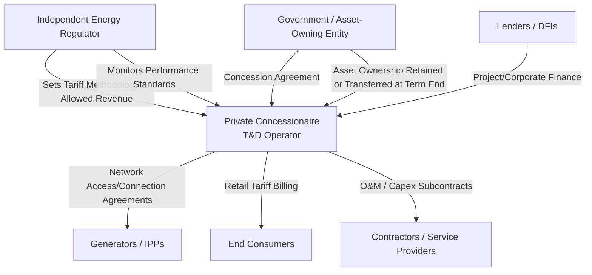

## Transmission and Distribution Concessions

### Overview and Definition

Transmission and Distribution (T&D) concessions are PPP arrangements in which a private entity is granted long-term rights to finance, build, operate, and/or maintain electricity transmission (high-voltage bulk transport) or distribution (medium/low-voltage delivery to end consumers) networks, typically in exchange for regulated revenue collected from grid users or end consumers. Unlike generation IPPs, which sell a commodity (electricity) under a PPA, T&D concessions grant rights over a network monopoly asset, making them economically and regulatorily distinct.

**Key Points**

- T&D networks are natural monopolies (duplicating wires is economically inefficient), so private participation requires economic regulation of allowed revenues or tariffs rather than reliance on competitive market pricing.
- Transmission and distribution concessions differ substantially in risk profile: transmission networks typically serve a small number of large, creditworthy counterparties (generators, large utilities) under availability-based revenue, while distribution networks interface directly with mass retail consumers and carry collection risk, technical/commercial losses, and social/political sensitivity around tariffs.
- Common structures include full concessions (private entity holds long-term operating rights and often makes capital investments), affermage/lease contracts (private operator manages the asset without major capital investment, paying a fee to the asset owner), and management contracts (private operator is paid a fee for management services with minimal risk transfer).

### Transmission vs. Distribution: Structural Differences

| Dimension | Transmission Concession | Distribution Concession |
| --- | --- | --- |
| Voltage level | High voltage (bulk transport) | Medium/low voltage (final delivery) |
| Customer base | Few, large (generators, distribution utilities) | Many, small (retail/residential/commercial) |
| Revenue mechanism | Typically availability-based (regulated allowed revenue) | Typically tariff-based, volumetric, with collection risk |
| Demand risk | Low (revenue often independent of throughput) | Higher (linked to consumption volumes and collections) |
| Loss/theft risk | Minimal (few interconnection points) | Significant (technical and non-technical/commercial losses) |
| Political sensitivity | Lower (fewer direct end-user interactions) | Higher (tariff increases directly affect households) |
| Typical private model | Merchant transmission, TSO concessions, availability-based PPPs | Concessions, affermage, management contracts |

### PPP Structural Models for T&D

**1. Full Concession**

The private concessionaire is granted exclusive rights to operate (and often invest in) the network for a defined period (commonly 20–30 years), collecting tariff revenue directly from users, subject to regulatory oversight. The concessionaire typically bears demand risk, collection risk, and investment/capex risk, with assets reverting to the government at the end of the term.

**2. Affermage (Lease) Contract**

The government or a state-owned asset holding company retains ownership and responsibility for major capital investment, while the private operator manages day-to-day operations, billing, and collection in exchange for an operating fee or a share of collected revenue. This model transfers operational efficiency risk to the private party while retaining capital investment risk with the public sector — a structure historically prominent in West African and some South Asian distribution reforms. [Inference: prevalence by region reflects historically documented patterns and may not reflect the current state of any specific program.]

**3. Management Contract**

The private operator is paid a fixed or performance-based fee to manage operations (billing, collections, maintenance) without taking on revenue or investment risk. This is the lowest-risk-transfer PPP model in the T&D space, often used as a transitional step before a full concession or privatization.

**4. Build-Own-Operate-Transfer (BOOT) for New Transmission Lines**

Used for specific new transmission infrastructure (e.g., a dedicated interconnector or a renewable energy evacuation line), where a private developer builds and operates a specific line under a long-term revenue contract (often an availability-based Transmission Service Agreement) before transferring the asset to the state transmission utility.

**5. Independent Power Transmission Companies / Independent Transmission Projects (ITPs)**

Increasingly used for competitively tendered dedicated transmission assets (e.g., interconnecting a remote renewable energy zone to the grid), structured similarly to IPPs but with availability-based (rather than commodity-based) revenue.

**Model Comparison Table**

| Model | Capex Responsibility | Demand/Collection Risk | Typical Duration | Risk Transfer Level |
| --- | --- | --- | --- | --- |
| Management Contract | Public | Public | 3–5 years | Low |
| Affermage/Lease | Public | Private (operational) | 5–15 years | Medium |
| Full Concession | Private (often) | Private | 20–30 years | High |
| BOOT (dedicated line) | Private | Low (availability-based) | 20–25 years | High (construction/O&M), Low (demand) |

### Governance and Contractual Architecture

**Key Points**

- The independent energy regulator plays a more central and continuous role in T&D concessions than in generation IPPs, because allowed revenue and tariffs must be periodically reset (typically every 3–5 years) throughout the concession term, not fixed once at contract signing.
- Network access/connection agreements with generators are a distinct contractual layer specific to transmission concessions, governing non-discriminatory grid access — a regulatory principle often mandated to prevent a vertically integrated transmission owner from favoring affiliated generators.
- Distribution concessionaires typically also hold a supply/retail license (in markets without full retail competition), bundling network operation with commodity billing to end consumers.

### Regulatory Frameworks: Rate-of-Return vs. Incentive Regulation

Because T&D assets are natural monopolies, tariff-setting is not market-determined and instead follows one of two broad regulatory philosophies:

**1. Rate-of-Return (Cost-of-Service) Regulation**

Allowed revenue is set to recover prudently incurred operating costs plus a regulated return on the Regulatory Asset Base (RAB):

$$AR = OPEX + D + (RAB \times WACC)$$

where $AR$ is allowed revenue, $OPEX$ is efficient operating expenditure, $D$ is depreciation, $RAB$ is the regulatory asset base (the value of invested capital on which a return is earned), and $WACC$ is the regulator-approved weighted average cost of capital.

**2. Incentive (Price-Cap / Revenue-Cap) Regulation**

Allowed revenue or price is set for a multi-year regulatory period and adjusted mechanically using an efficiency factor, shifting cost-efficiency risk to the operator (who retains savings beyond the target as profit, or bears losses if costs exceed the cap).

The most common formula is the **RPI-X** (or CPI-X) price-cap mechanism:

$$P_t = P_{t-1} \times (1 + RPI_t - X)$$

where $P_t$ is the allowed price/tariff in year $t$, $RPI_t$ is the inflation index for the period, and $X$ is a regulator-determined efficiency factor requiring real productivity improvement over time.

A **revenue-cap** variant applies the same logic to total allowed revenue rather than per-unit price, decoupling network revenue from sales volume — a design increasingly favored where governments want to avoid disincentivizing energy efficiency or distributed generation (which reduce throughput).

**Key Points**

- Rate-of-return regulation is criticized for weak cost-efficiency incentives (the "Averch-Johnson effect," where regulated firms may over-invest in capital to expand the RAB and thus the allowed return), while incentive regulation is criticized for potential under-investment or service quality shortcuts if the efficiency factor is set too aggressively relative to genuine achievable savings. [Inference: the magnitude of these distortions is context- and design-specific rather than a fixed universal outcome.]
- Many modern regulatory frameworks combine elements of both (a "hybrid" building-block approach: cost-of-service building blocks translated into a multi-year revenue cap with efficiency incentives), used by regulators such as the UK's Ofgem (RIIO framework) and various Latin American regulators.

### Regulatory Asset Base (RAB) Mechanics

The RAB is the cornerstone of allowed-revenue calculations under both regulatory philosophies (directly under rate-of-return, indirectly as the building block under revenue-cap). It evolves over time as:

$$RAB_t = RAB_{t-1} + CAPEX_t - D_t - Disposals_t$$

where $CAPEX_t$ is capital expenditure added in year $t$ (subject to regulatory prudency review), $D_t$ is regulatory depreciation, and $Disposals_t$ accounts for asset retirements.

**Example**

A distribution concessionaire begins a regulatory period with a RAB of $500 million. During the year, it invests $40 million in approved network capex and regulatory depreciation is calculated at $25 million. The closing RAB is:

$$RAB_{t} = \$500{,}000{,}000 + \$40{,}000{,}000 - \$25{,}000{,}000 = \$515{,}000{,}000$$

If the regulator has approved a WACC of 9%, the return-on-capital component of allowed revenue for the following year based on the opening RAB would be approximately:

$$\$515{,}000{,}000 \times 9\% = \$46{,}350{,}000$$

This figure would then be added to approved operating expenditure and depreciation to derive total allowed revenue, which is then divided by forecast sales volume (in a price-cap regime) or applied directly (in a revenue-cap regime) to derive the tariff.

### Distribution-Specific Risk: Technical and Commercial Losses

A defining risk category unique to distribution concessions is network losses, split into:

- **Technical losses:** Physical energy dissipation (resistive losses in lines and transformers), generally 5–15% of energy input depending on network age, voltage profile, and load density. [Inference: figures vary substantially by country and network condition; cited range is illustrative.]
- **Non-technical (commercial) losses:** Electricity theft, meter tampering, billing errors, and uncollected receivables — often the dominant loss category in distribution utilities in developing markets and a primary target of private-sector efficiency improvement mandates in concession contracts.

**Aggregate Technical and Commercial (AT&C) Loss** is a standard performance metric:

$$AT\&C\ Loss\ (\%) = 1 - \left(\frac{\text{Units Billed} \times \text{Collection Efficiency}}{\text{Units Input into the System}}\right) \times 100$$

**Key Points**

- Many distribution concession contracts include explicit AT&C loss reduction targets as a condition of concession renewal or as a performance benchmark linked to incentive payments or penalties, since loss reduction is often the single largest source of value creation a private operator can deliver relative to a state-run predecessor. [Inference: the degree to which AT&C reduction is achievable depends heavily on baseline conditions, metering infrastructure, and enforcement capacity, and specific improvement targets should be treated as case-specific rather than generalizable.]
- Advanced Metering Infrastructure (AMI) and smart meter rollouts are frequently bundled into distribution concession capex obligations specifically to reduce non-technical losses and improve billing accuracy.

### Risk Allocation Matrix for T&D Concessions

| Risk Category | Typically Borne By | Mitigation Mechanism |
| --- | --- | --- |
| Demand/consumption volume risk | Concessionaire (full concession) or Public (management contract) | Revenue-cap decoupling, minimum revenue guarantees |
| Non-technical losses (theft) | Concessionaire (as efficiency incentive) | AT&C loss reduction targets, AMI investment obligations |
| Tariff-setting/regulatory risk | Shared; concessionaire exposed to regulatory lag or political tariff freezes | Automatic tariff indexation formulas, regulatory contract clauses |
| Capital expenditure risk | Concessionaire (full concession) or Public (affermage) | Prudency review process, capex true-up mechanisms |
| Political risk (tariff freezes, populist intervention) | Concessionaire, backstopped by government undertakings | Stabilization clauses, international arbitration provisions |
| Currency risk (dollar-denominated debt vs. local tariff revenue) | Concessionaire, unless indexed | Tariff indexation to currency/inflation, hedging |
| Legacy asset condition risk | Varies; often a major due-diligence and negotiation issue | Asset condition surveys, transitional performance targets |
| Force majeure | Shared | Insurance, extension of term, compensation clauses |

**Key Points**

- Political risk around tariff increases is one of the most consequential and frequently realized risks in distribution concessions, since tariff increases needed to sustain the concessionaire's regulated revenue are often socially and politically unpopular, leading to documented cases of regulatory tariff freezes or delayed tariff reviews across several regions. [Unverified: specific historical episodes and their resolutions are country-specific and should be verified against the relevant regulatory record rather than generalized.]
- Currency mismatch is a significant structural risk where a concessionaire has foreign-currency-denominated debt (from international lenders) but collects revenue in local currency at regulated tariffs; indexation clauses and hedging instruments are standard, though imperfect, mitigants.

### Concession Award and Bid Evaluation Criteria

T&D concessions are typically competitively tendered using one or a combination of the following bid variables:

| Bid Variable | Mechanism | Typical Use |
| --- | --- | --- |
| Lowest tariff proposed | Bidder proposing lowest end-user tariff (subject to minimum service standards) wins | Distribution concessions in cost-sensitive markets |
| Highest concession fee/premium paid to government | Bidder offering the highest upfront or periodic payment to the grantor wins | Concessions for already-profitable, mature networks |
| Least present value of revenue (LPVR) | Concession term is variable; ends once bidder's proposed revenue target is reached, reducing over-earning risk | Toll-road-style variable-term concessions, occasionally adapted for T&D |
| Highest committed capex/service quality improvement | Bidder committing to the most investment or best service standards for a fixed tariff wins | Legacy networks requiring significant rehabilitation |

### Performance Standards and Service Quality Regulation

Distribution concession contracts typically embed enforceable service quality metrics, commonly including:

- **SAIDI (System Average Interruption Duration Index):** Average outage duration per customer per year.
- **SAIFI (System Average Interruption Frequency Index):** Average number of outages per customer per year.
- **Voltage quality compliance:** Percentage of measurements within regulatory voltage tolerance bands.
- **Connection time standards:** Maximum days to connect a new customer after application.

$$SAIDI = \frac{\sum (\text{Customers Affected} \times \text{Outage Duration})}{\text{Total Number of Customers Served}}$$

**Key Points**

- Performance standards are typically linked to financial penalties (tariff reduction, revenue clawback) or bonuses within the regulatory revenue framework, directly connecting service quality to the concessionaire's financial outcomes rather than relying solely on regulatory enforcement action.
- Baseline performance benchmarking against comparable networks (regionally or internationally) is commonly used by regulators to set realistic but improvement-oriented targets, since asset condition and geography materially affect achievable SAIDI/SAIFI levels.

### Termination, Step-In Rights, and Handback Provisions

T&D concession agreements require detailed provisions for:

- **Handback conditions:** Technical and financial standards the network must meet at contract expiry (asset condition surveys, minimum RAB levels, spare parts inventories) to prevent asset degradation ("sweating the assets") toward the end of the concession term.
- **Lender step-in rights:** Allowing project lenders to assume control or nominate a replacement operator in the event of concessionaire default, preserving continuity of an essential public service and protecting debt recovery.
- **Early termination compensation:** Formulas distinguishing termination for concessionaire default (typically lower compensation, often limited to outstanding debt), government default or convenience termination (typically higher compensation, potentially including a share of expected equity returns), and force majeure/political events.

**Key Points**

- "Sweating the assets" — deferring maintenance and capex near the end of a concession term to maximize short-term concessionaire profit at the expense of handback condition — is a well-documented structuring risk, mitigated by mandatory independent asset condition audits in the final years of the concession and financial retention/escrow mechanisms tied to handback standards. [Inference: the effectiveness of specific mitigation mechanisms depends on contract drafting quality and regulatory enforcement capacity.]
- Because essential service continuity is a paramount public interest concern, T&D concession agreements often include stronger "public interest" step-in and emergency intervention rights for the government than are typical in other PPP sectors.

### Distinguishing T&D Concessions from Generation IPPs

| Feature | T&D Concession | Generation IPP |
| --- | --- | --- |
| Asset type | Network monopoly infrastructure | Individual generation plant |
| Revenue basis | Regulated allowed revenue/tariff | Contracted PPA tariff |
| Regulatory involvement | Continuous (periodic tariff resets) | Largely fixed at contract signing |
| Competition exposure | None (natural monopoly) | Some (competitive procurement, merchant exposure in liberalized markets) |
| End-consumer interface | Direct (distribution) or indirect (transmission) | None (sells to off-taker, not directly to consumers) |
| Primary private value-add | Operational efficiency, loss reduction, capex discipline | Construction/technology efficiency, O&M performance |

### Related Topics

- Independent Power Producer Models and Power Purchase Agreements
- Independent Energy Regulator Design and Tariff-Setting Methodologies
- Regulatory Asset Base (RAB) Valuation and Building-Block Revenue Models
- Smart Grid and Advanced Metering Infrastructure (AMI) Investment Planning
- Non-Technical Loss Reduction Strategies in Distribution Utilities
- Concession Handback and Asset Condition Audit Frameworks
- Currency and Political Risk Mitigation in Regulated Utility Concessions
- Retail Competition and Unbundling Models in Liberalized Electricity Markets
- Performance-Based Regulation (RIIO-style Incentive Frameworks)
- Rural Electrification PPPs and Universal Service Obligation Design