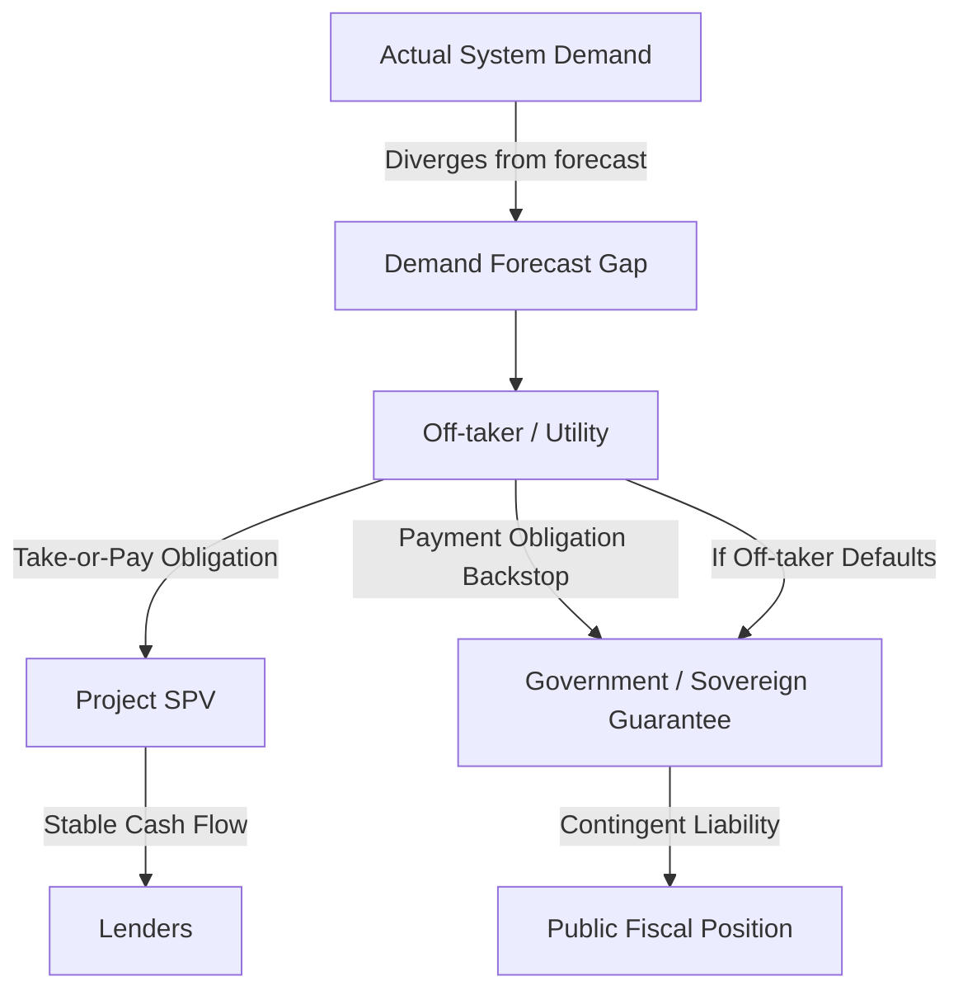

## Take-or-Pay Contracts and Offtake Risk

### Overview and Definition

A Take-or-Pay (ToP) contract is a contractual mechanism obligating a buyer (off-taker) to either take delivery of a contracted quantity of a good or service (electricity, gas, water) or pay for it regardless of whether it is actually consumed or dispatched. In energy and power sector PPPs, ToP clauses are the primary mechanism by which demand/offtake risk is transferred away from the private project company (SPV) and onto the off-taker, and by extension, often onto the government that backstops the off-taker's obligations.

Offtake risk, more broadly, refers to the risk that the contracted buyer will not purchase (or pay for) the output at the volume, price, or timing assumed in the project's financial model — encompassing not only demand shortfalls but also off-taker payment default and creditworthiness deterioration.

**Key Points**

- ToP is fundamentally a risk-allocation tool: it shifts the consequence of demand overestimation from the private investor (who cannot control macroeconomic or sectoral demand growth) to the off-taker/government (who commissioned the capacity based on its own demand forecast).
- ToP is a defining bankability feature because it converts a project's revenue stream from "dispatch-dependent" (variable, uncertain) to "availability-dependent" (predictable, contractible), which is what allows project finance lenders to size debt against relatively stable cash flows.
- Offtake risk is broader than ToP mechanics alone; it also includes off-taker counterparty credit risk, which ToP clauses do not by themselves resolve (a ToP obligation is only as strong as the off-taker's ability and willingness to pay).

### Distinguishing Take-or-Pay from Related Concepts

| Concept | Definition | Key Distinction |
| --- | --- | --- |
| Take-or-Pay | Buyer pays for contracted volume/capacity whether or not it is taken/dispatched | Core demand-risk transfer mechanism |
| Take-and-Pay | Buyer only pays for what is actually delivered/consumed | No demand-risk transfer; seller bears volume risk |
| Deemed Generation/Dispatch | A specific application of ToP logic in power PPAs: generator is compensated as if it had generated, even when curtailed for grid reasons outside its control | Addresses grid-driven curtailment specifically, not general demand shortfall |
| Minimum Offtake Guarantee | A floor volume the buyer commits to purchase, below full contracted capacity | A partial/softer form of ToP, often used to balance risk-sharing |
| Merchant Exposure | No offtake contract; seller sells into spot/wholesale market at prevailing price | Full demand and price risk retained by seller |

### Mechanics of Take-or-Pay in Power PPAs

In power sector PPAs (see the two-part tariff structure discussed under IPP/PPA models), the ToP obligation typically attaches to the **capacity payment**, which recovers fixed costs (debt service, fixed O&M, equity return), while the **energy payment** (recovering variable/fuel costs) is usually paid only on actual dispatch, since fuel is not consumed if the plant does not run.

$$\text{Capacity Payment Due} = \left(\frac{DS + FOM + ROE}{AC_{ref}}\right) \times AC_{demonstrated}$$

Under a ToP structure, this capacity payment is owed **regardless of the volume of energy actually dispatched**, as long as the plant demonstrates the contracted availability. This is what "protects" the fixed-cost recovery underlying the SPV's debt service.

**Deemed Energy Payments**

In cases where the plant is available and willing to generate but the off-taker does not call for dispatch (due to lower system demand, transmission constraints, or merit-order dispatch of cheaper units), many PPAs include a "deemed generation" or "deemed energy" clause compensating the generator as if the plant had generated at a pre-agreed reference output level (often based on historical performance, contracted capacity factor, or resource assessment for renewables).

$$\text{Deemed Energy Payment} = E_{deemed} \times EP_{rate}$$

where $E_{deemed}$ is the deemed (assumed) energy output under the relevant clause and $EP_{rate}$ is the contracted energy payment rate.

### Contractual Flow of Offtake Risk

**Key Points**

- The diagram illustrates why ToP is often described as "risk relocation" rather than "risk elimination": the demand risk does not disappear, it moves down the chain from the SPV to the off-taker, and ultimately, if the off-taker's own revenues (retail tariffs) are insufficient, to the government's fiscal position.
- This chain is precisely why multilateral fiscal risk tools (e.g., IMF's PFRAM) treat ToP-backed PPA portfolios as a category of contingent/direct fiscal liability requiring active monitoring, not merely a private-sector risk-transfer success story.

### Rationale for Take-or-Pay from the Investor/Lender Perspective

- **Revenue certainty for debt service:** Lenders require confidence that scheduled principal and interest payments will be met regardless of dispatch variability; ToP-secured capacity payments provide this predictability.
- **Removal of demand-forecasting risk from private control:** A private generator has no control over macroeconomic growth, industrial demand, or competing generation additions — factors that drive system demand — so allocating this risk to the party that plans the power system (the utility/government) reflects the "risk should sit with the party best able to manage it" principle.
- **Enables long-tenor project finance:** Without ToP, lenders would need to underwrite dispatch/merchant price risk over 15–25 year loan tenors, which is generally not feasible for infrastructure-scale non-recourse debt without substantially higher required returns or shorter tenors.

### Rationale and Risks from the Government/Off-taker Perspective

- **Necessary to attract private capital** in contexts where no liquid wholesale market exists to provide an alternative revenue mechanism (single-buyer model).
- **Creates "stranded capacity" risk** if system demand grows more slowly than forecast at the time contracts were signed, or if too many ToP contracts are signed concurrently (excess contracted capacity relative to actual system needs), resulting in the off-taker paying capacity charges for underutilized plants.
- **Generates contingent/direct fiscal liabilities** that may not be transparently reflected in headline government debt figures, since ToP obligations are contractual commitments of the (often state-owned) off-taker rather than direct sovereign debt, despite frequently being backstopped by sovereign guarantees.

**Key Points**

- Several countries' power sector reform experiences (particularly in South and Southeast Asia during the 1990s–2000s IPP wave) are commonly cited in the PPP literature as cautionary examples of excess contracted capacity relative to realized demand growth, resulting in substantial capacity payment burdens; specific figures and case outcomes vary by country and period and should be verified against country-specific studies rather than treated as a uniform pattern. [Unverified: this reflects broadly documented sector history rather than a specific verified case in this response.]
- The core policy tension is that ToP mechanisms which are strong enough to be bankable are, by the same design, strong enough to create meaningful fiscal exposure if demand forecasts prove overly optimistic — there is no risk-allocation design that fully eliminates this trade-off, only ways to manage its magnitude.

### Mitigating Offtake and Demand Forecast Risk

| Mitigation Strategy | Mechanism | Effect |
| --- | --- | --- |
| Robust, independent demand forecasting | Third-party demand studies before contracting capacity | Reduces likelihood of over-contracting |
| Staggered/phased capacity procurement | Commissioning dates spread to match demand growth trajectory | Avoids lumpy stranded capacity from simultaneous COD of multiple projects |
| Flexible/modular capacity additions | Smaller, faster-to-build plants (e.g., solar, gas peakers) vs. large baseload plants | Reduces the cost and duration of forecast-error exposure |
| Take-and-pay for merchant-exposed portions | Partial ToP (e.g., 70% contracted, 30% merchant) | Shares demand risk between generator and off-taker |
| Regular contract portfolio review | Periodic system planning reviews against contracted capacity | Enables early corrective action (e.g., pausing new procurement) |
| Sinking/security funds for off-taker payment obligations | Escrow accounts, partial risk guarantees from DFIs | Reduces payment default risk without eliminating the underlying ToP exposure |

### Off-taker Creditworthiness and Payment Security

Because a ToP obligation is a promise to pay, its value to the SPV and its lenders is only as strong as the off-taker's financial capacity and willingness to honor it. Payment security mechanisms are therefore a standard complement to ToP clauses, not a substitute for sound demand planning:

- **Letters of Credit (LCs):** A revolving LC, often covering one to a few months of billing, that the SPV can draw on in the event of off-taker payment delay.
- **Escrow accounts:** Off-taker revenues (or a defined share) are directed into a dedicated account from which the SPV is paid before other off-taker obligations, prioritizing project debt service.
- **Sovereign guarantees:** The government directly guarantees the off-taker's payment obligations under the PPA, converting off-taker credit risk into sovereign credit risk.
- **DFI partial risk guarantees (PRGs):** Multilateral development banks (World Bank, ADB, IFC/MIGA) guarantee a portion of the off-taker's payment obligations, improving bankability in markets where the sovereign's own credit rating is weak or where full sovereign guarantees are not extended.

**Key Points**

- Payment security mechanisms address the "will the off-taker pay" question, while ToP clauses address the "how much is the off-taker obligated to pay" question — both are necessary, and a strong ToP clause paired with weak payment security still leaves lenders exposed to counterparty credit risk.
- DFI involvement (guarantees, direct lending, or preferred creditor status) is frequently used precisely because it introduces a credibility and enforcement dynamic that pure contractual ToP language alone cannot provide in weaker institutional environments.

### Quantitative Illustration: Impact of Demand Shortfall Under ToP vs. No ToP

Assume a 200 MW IPP has an annual fixed-cost recovery requirement (debt service + fixed O&M + equity return) of $40,000,000, structured as a capacity payment based on demonstrated plant availability of 92% against a reference availability of 90%.

**Scenario: System demand comes in 15% below forecast, reducing actual dispatch, but the plant remains available.**

- **Under a ToP/availability-based capacity payment structure:**

$$\text{Capacity Payment} = \$40{,}000{,}000 \times \left(\frac{92\%}{90\%}\right) \approx \$40{,}888{,}889$$

The SPV receives its full expected fixed-cost recovery (in fact slightly more, due to over-performance on availability) despite the demand shortfall, because payment is decoupled from dispatch volume.

- **Under a hypothetical take-and-pay (no ToP) structure**, where fixed-cost recovery were instead embedded in the energy payment and dependent on dispatched volume, a 15% reduction in dispatched energy would translate roughly proportionally into a 15% reduction in the portion of revenue meant to cover fixed costs — potentially breaching the DSCR covenant lenders require, illustrating why lenders in project-financed IPPs generally will not proceed without a ToP or equivalent availability-based structure.

**Example**

This illustrates the core bankability logic: ToP does not change the underlying demand shortfall (an economic reality the off-taker/government must absorb), but it does determine who bears the *financial consequence* of that shortfall — the off-taker/government under ToP, versus the SPV and its lenders under take-and-pay.

### Take-or-Pay Beyond Power: Gas and Water Sector Parallels

ToP structures originated prominently in the gas sector (long-term gas sales agreements underpinning LNG project financing) and are also used in water treatment/bulk supply PPPs, following the same fundamental logic:

| Sector | ToP Application | Distinguishing Feature |
| --- | --- | --- |
| Power (PPA) | Capacity payment regardless of dispatch | Availability-based; deemed generation for curtailment |
| Gas (Gas Sales Agreement) | Buyer pays for contracted gas volume whether lifted or not | Often includes "make-up gas" rights allowing deferred lifting |
| Water (Bulk Supply Agreement) | Off-taker (municipal utility) pays for contracted treated water capacity regardless of offtake volume | Distinguishes capacity charge from volumetric/variable charge, mirroring power's two-part tariff |

**Key Points**

- The gas sector's "make-up gas" concept (allowing a buyer who paid for but did not lift gas to claim it in a later period, subject to time limits) is a partial softening of pure ToP rigidity and illustrates a broader family of intermediate risk-sharing designs between full ToP and full take-and-pay.
- Water bulk supply ToP agreements face similar fiscal risk dynamics to power ToP contracts: municipal off-takers with constrained tariff-raising ability can accumulate payment arrears on capacity charges for underutilized treatment capacity, a dynamic structurally analogous to power sector stranded capacity payments.

### Legal and Dispute Dimensions

- **Enforceability under prolonged non-payment:** PPAs typically define cure periods, and persistent off-taker payment default is usually a termination trigger entitling the SPV to a Compensation on Termination (CoT) payment (see IPP/PPA termination provisions), which is where payment security mechanisms (LCs, escrow, guarantees) become operationally critical.
- **Renegotiation pressure:** ToP obligations are a recurring focus of government-initiated PPA renegotiation attempts, particularly following demand shortfalls, currency devaluations increasing the local-currency cost of dollar-indexed capacity payments, or political change; well-drafted contracts include international arbitration clauses (ICC, UNCITRAL, ICSID) to manage this risk, since unilateral government modification of ToP terms is a recognized driver of investor-state disputes in the energy sector.
- **Force majeure interaction:** Extended force majeure events (natural or political) typically suspend, rather than permanently waive, ToP payment obligations, with specific thresholds (e.g., a defined number of consecutive months) after which either party may gain termination rights.

### Risk Allocation Summary Table

| Risk Element | Borne By (Typical ToP Structure) | Residual Exposure |
| --- | --- | --- |
| Demand/dispatch volume shortfall | Off-taker (via capacity payment ToP) | SPV retains none directly, but exposed if off-taker fails to pay |
| Off-taker payment willingness/ability | Off-taker, backstopped by government/DFI guarantees | SPV/lenders retain residual counterparty risk despite mitigants |
| Grid-driven curtailment | Off-taker/grid operator (via deemed generation) | SPV retains risk only if curtailment clause is absent or narrowly drafted |
| Plant unavailability (generator's own fault) | SPV/generator | Capacity payment reduced proportionally to availability shortfall |
| Aggregate system over-contracting | Government/off-taker (fiscal/tariff burden) | Public/consumer bears eventual cost via tariffs or subsidies |
| Currency devaluation on indexed payments | Off-taker/government (if indexed) | SPV exposed if indexation mechanism is weak or capped |

### Related Topics

- Independent Power Producer Models and Power Purchase Agreements
- Fiscal Risk Assessment and Contingent Liability Management (IMF PFRAM)
- Off-taker Creditworthiness Assessment and Payment Security Instruments
- Sovereign Guarantees and Government Support Agreements in Energy PPPs
- Deemed Generation and Grid Curtailment Compensation Clauses
- Power System Planning and Least-Cost Capacity Expansion Studies
- Investor-State Dispute Settlement and PPA Renegotiation Dynamics
- Gas Sales Agreements and LNG Project Finance Structures
- Debt Service Coverage Ratio (DSCR) and Bankability Analysis in Project Finance
- Partial Risk Guarantees and Multilateral Development Bank Credit Enhancement