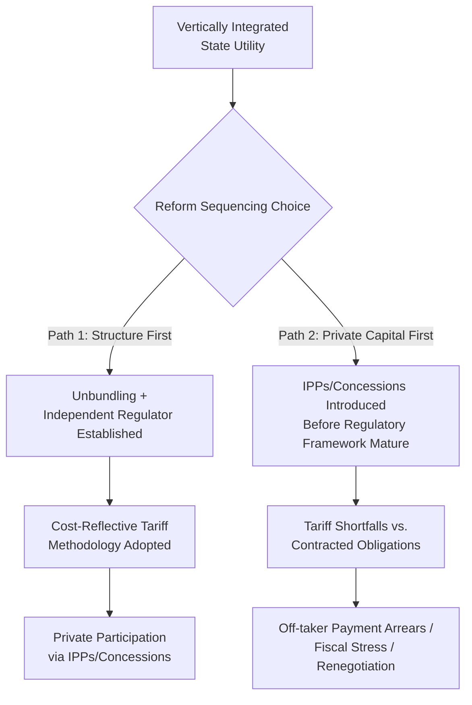
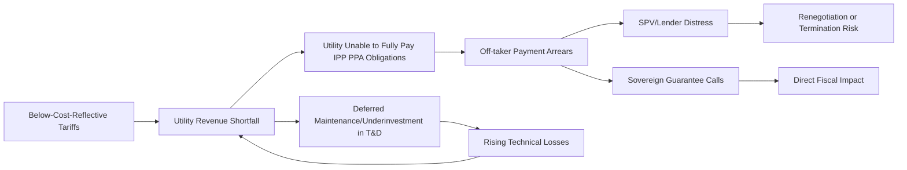

## Energy Sector Regulatory and Tariff Reform Interactions

### Overview and Definition

Energy Sector Regulatory and Tariff Reform Interactions refers to the bidirectional relationship between broader power sector regulatory reform (unbundling, independent regulator establishment, market liberalization) and the tariff structures/methodologies that determine cost recovery across generation, transmission, and distribution. This topic examines how PPP contracts (IPPs, PPAs, T&D concessions) both depend on, and are shaped by, the sequencing and design of regulatory and tariff reform, and how misalignment between the two is a leading cause of PPP underperformance or renegotiation in the power sector.

**Key Points**

- PPP contracts are not self-sufficient; they are embedded within, and constrained by, the broader regulatory and tariff framework of the sector. A well-drafted PPA is of limited value if the underlying tariff structure does not generate sufficient utility revenue to honor the PPA's payment obligations.
- Reform sequencing matters: introducing private capital (via IPPs or concessions) before establishing credible independent regulation and cost-reflective tariffs is a widely documented source of subsequent contract distress, off-taker payment default, and renegotiation. [Inference: while this sequencing risk is broadly documented in PPP and utility reform literature, the specific causal weight relative to other factors (governance quality, macroeconomic shocks) varies by country case.]
- Tariff reform and regulatory reform are interdependent but distinct: an independent regulator can exist without cost-reflective tariffs (if political tariff-setting persists in practice), and cost-reflective tariff formulas can exist on paper without independent enforcement capacity to apply them consistently.

### The Reform Sequencing Problem

**Key Points**

- Path 1 (structural and regulatory reform preceding significant private capital commitments) is generally regarded in the sector reform literature as lower-risk, since it establishes the cost-recovery mechanism before the sector takes on binding long-term private payment obligations.
- Path 2 (private capital introduced under fiscal or supply-crisis pressure, ahead of regulatory and tariff reform) has occurred frequently in practice — often because governments face acute generation shortfalls requiring rapid IPP procurement while regulatory institution-building is a multi-year process that cannot be accelerated to match the urgency of the supply crisis. [Inference: this describes a commonly observed practical tension rather than a universal rule; some jurisdictions have successfully introduced private capital under interim or transitional regulatory arrangements.]
- Neither path is a guarantee of success or failure; sequencing interacts with governance quality, macroeconomic stability, and demand forecasting accuracy discussed under Take-or-Pay and offtake risk.

### Core Regulatory Reform Components

**1. Legal and Institutional Unbundling**

Separating generation, transmission, and distribution into distinct legal entities (or at minimum, distinct accounting units) to enable transparent cost allocation and prevent cross-subsidization from obscuring the true cost of each segment. Degrees of unbundling range from accounting unbundling (separate books, same corporate entity) to full ownership unbundling (separate companies, potentially separate owners).

**2. Independent Regulatory Authority**

Establishment of a regulator with sufficient legal independence, technical capacity, and enforcement authority to set and adjust tariffs according to a pre-defined methodology, insulated (to the extent institutionally achievable) from ad hoc political intervention.

**3. Tariff Methodology Codification**

Formal adoption of a tariff-setting methodology (cost-of-service, price-cap, revenue-cap, or hybrid — as discussed under T&D concessions) with defined, publicly available rules for periodic tariff reviews, rather than case-by-case administrative discretion.

**4. Market Structure Design**

Determining whether the sector will operate as a single-buyer model, a wholesale competitive market, or full retail competition — a decision that directly determines whether PPAs remain the dominant contracting instrument or are gradually supplemented/replaced by wholesale market mechanisms.

### Tariff Reform Components

**1. Cost-Reflective Tariff Design**

Setting end-user tariffs to recover the full efficient cost of supply (generation, transmission, distribution, and a reasonable return), as opposed to politically set tariffs that may be held below cost-recovery levels for social or political reasons.

$$\text{Cost-Reflective Tariff} = \frac{\text{Generation Cost} + \text{Transmission Charge} + \text{Distribution Charge} + \text{Losses} + \text{Regulatory Return}}{\text{Billed Units}}$$

**2. Subsidy Reform and Targeting**

Where full cost-reflectivity is not immediately or politically feasible (particularly for low-income or "lifeline" residential consumers), reform typically involves shifting from broad, poorly targeted tariff subsidies (which distort utility revenue and often disproportionately benefit higher-consumption households) toward targeted direct subsidies or lifeline tariff blocks for low-consumption users, while moving other tariff categories toward cost-reflectivity.

**3. Cross-Subsidy Rationalization**

Adjusting historical cross-subsidy patterns (e.g., industrial/commercial tariffs set above cost to subsidize residential tariffs set below cost) which, if excessive, can drive large consumers toward self-generation or captive power (bypassing the grid), eroding the utility's revenue base and worsening the very tariff gap the cross-subsidy was meant to address.

**4. Automatic Tariff Indexation/Pass-Through Mechanisms**

Formulaic mechanisms allowing tariffs to adjust automatically for fuel cost changes, inflation, or currency movements, reducing the frequency and political visibility of discretionary tariff increase decisions — a design feature directly relevant to the currency and fuel pass-through provisions discussed under IPP/PPA tariff structures.

### The Tariff-Subsidy-Fiscal Gap Nexus

A central analytical framework for understanding PPP payment risk in the power sector is the **quasi-fiscal deficit**, representing the gap between the utility's actual revenue (collected at below-cost tariffs) and its full cost of supply (including PPA obligations to IPPs).

$$\text{Quasi-Fiscal Deficit} = (\text{Cost-Reflective Tariff} - \text{Actual Average Tariff Collected}) \times \text{Units Sold}$$

This deficit must be financed by one or a combination of:

- Direct government budget subsidies to the utility.
- Accumulation of utility payment arrears to generators/IPPs (i.e., the off-taker payment default risk discussed under Take-or-Pay and Offtake Risk).
- Accumulation of utility debt (often government-guaranteed).
- AT&C loss reduction or other efficiency gains that narrow the gap without requiring tariff increases.

**Example**

A national utility sells electricity at an average tariff of $0.08/kWh against a full cost of supply (including generation PPA payments, T&D costs, and losses) of $0.11/kWh, across 20 billion kWh sold annually. The quasi-fiscal deficit is:

$$(\$0.11 - \$0.08) \times 20{,}000{,}000{,}000 = \$600{,}000{,}000$$

If this gap is not closed through budget transfers, it will manifest as growing payment arrears to IPPs under their PPAs, directly threatening the debt service capacity of the very projects the government contracted to solve its power shortage — illustrating why tariff reform and PPP contract sustainability are inseparable in practice.

### Interaction Diagram: How Tariff Reform Failure Transmits to PPP Distress

**Key Points**

- This diagram illustrates a self-reinforcing negative cycle: below-cost tariffs cause underinvestment in network maintenance, which increases technical losses, which worsens the revenue shortfall, which further constrains investment — a dynamic that regulatory and tariff reform is specifically designed to interrupt.
- The transmission mechanism from tariff shortfall to PPP distress runs primarily through the off-taker (utility), which is why off-taker creditworthiness assessment (discussed under Take-or-Pay and Offtake Risk) is inseparable from broader tariff policy analysis, not a standalone due-diligence exercise.

### Regulatory Independence: Design Features and Common Weaknesses

| Design Feature | Purpose | Common Implementation Weakness |
| --- | --- | --- |
| Fixed-term regulator appointments with defined removal grounds | Insulate commissioners from short-term political pressure | Appointments politically influenced despite formal independence provisions |
| Statutory tariff-setting timelines | Prevent indefinite delay of legally due tariff reviews | Reviews delayed administratively without formal legal breach |
| Transparent, rules-based tariff methodology | Reduce discretion and increase predictability for investors | Methodology exists on paper but ministerial approval/override retained in practice |
| Independent budget/funding for the regulator | Prevent budgetary leverage over regulatory decisions | Regulator funded through government budget allocations subject to political influence |
| Public consultation and appeal mechanisms | Increase legitimacy and technical rigor of tariff decisions | Consultation processes exist but decisions made before or independent of input received |

**Key Points**

- "De jure" independence (formal legal provisions) and "de facto" independence (actual operational behavior) frequently diverge; PPP risk assessments and country risk analyses generally need to examine both, since formal regulatory independence provisions do not guarantee that tariff reviews will occur on schedule or that political tariff freezes will not occur despite statutory timelines. [Inference: the degree of divergence is country- and period-specific and requires case-specific governance assessment rather than reliance on formal legal text alone.]
- Regulatory risk is frequently assessed by PPP investors and lenders using both formal institutional indicators and track-record analysis (has the regulator historically approved tariff reviews on schedule and at levels consistent with its own methodology?).

### Tariff Reform Approaches: Comparative Table

| Approach | Description | Advantage | Risk/Limitation |
| --- | --- | --- | --- |
| Immediate cost-reflective adjustment | Tariffs raised to full cost-recovery levels in a single or few steps | Rapidly closes quasi-fiscal deficit | High political and social resistance risk; affordability concerns for low-income consumers |
| Gradual phased adjustment | Tariffs raised incrementally over a multi-year glide path with pre-announced schedule | Reduces shock, improves predictability for planning | Slower fiscal gap closure; vulnerable to reform reversal or delay at each step |
| Automatic fuel/inflation pass-through with periodic base tariff review | Formulaic component adjusts automatically; structural tariff level reviewed less frequently | Reduces politically visible ad hoc increases; improves cost recovery predictability | Base tariff level can still lag true cost of supply if periodic reviews are delayed |
| Targeted subsidy with cost-reflective headline tariff | Headline tariff set at cost-recovery level; targeted direct subsidies protect vulnerable consumers | Preserves price signal and utility revenue while protecting affordability | Requires functioning subsidy targeting/delivery systems (e.g., beneficiary databases) |

### Implications for PPP Contract Design

Given the interaction between tariff reform status and PPP viability, several contract design responses have become standard practice:

- **Sovereign guarantees and payment security instruments** (letters of credit, escrow accounts, DFI partial risk guarantees) are used specifically to bridge periods where tariff reform is incomplete or the off-taker's revenue is not yet fully cost-reflective, as discussed under Take-or-Pay and Offtake Risk.
- **Currency and fuel cost pass-through clauses** in PPAs are calibrated against the assumption that the off-taker itself has (or will develop) a corresponding tariff pass-through mechanism to consumers; a mismatch (PPA indexation without corresponding retail tariff indexation) is a structural source of the quasi-fiscal deficit illustrated above.
- **Phased or capped PPA procurement volumes**, calibrated to realistic demand forecasts and the utility's demonstrated capacity to service payment obligations, rather than procuring capacity based on optimistic demand growth assumptions alone.
- **Sector reform conditionality** in donor/DFI-supported IPP or concession programs, where financing or guarantees are made conditional on specific tariff or regulatory reform milestones, explicitly linking PPP transaction support to broader sector reform progress.

### Political Economy Considerations

**Key Points**

- Tariff reform is politically costly in the short term (visible price increases) while its benefits (sector financial sustainability, improved service reliability, reduced fiscal burden) are diffuse and realized over a longer horizon — a classic political economy asymmetry that helps explain why tariff reform is frequently delayed or reversed relative to technically recommended timelines. [Inference: this is a widely cited political economy framework in utility reform literature rather than an empirically fixed outcome for any specific country.]
- Reform sustainability is generally considered more likely where tariff increases are paired with visible, tangible service quality improvements (reduced outages, faster connections) that consumers can directly attribute to the reform, providing a political counter-narrative to the cost of higher tariffs — though the specific conditions under which this holds vary by context. [Speculation: while this pairing is a commonly recommended reform communication strategy, its actual effectiveness in sustaining reform depends on context-specific political dynamics not verifiable in general terms.]
- Election cycles and tariff review timing frequently interact, with tariff increases often delayed around elections in many jurisdictions — a pattern noted across various country contexts in the sector reform literature, though the specific frequency and magnitude of this effect is not something that can be generalized without case-specific data.

### Diagnostic Framework for Assessing Reform-PPP Alignment

A practical diagnostic sequence for assessing whether a given PPP transaction is likely to be sustainable given the regulatory/tariff environment:

1. **Is there an independent regulator with a track record of timely, methodology-consistent tariff decisions?**
2. **Is the current average tariff at, near, or significantly below the estimated cost-reflective level?**
3. **Does the off-taker have a demonstrated payment track record with existing IPPs or is there a documented arrears history?**
4. **Are there automatic pass-through mechanisms for fuel and currency risk at both the PPA level and the retail tariff level (not just one or the other)?**
5. **Is the quasi-fiscal deficit (if any) being financed transparently (budget subsidy) or is it accumulating as off-balance-sheet arrears?**
6. **Are payment security mechanisms (LCs, escrow, DFI guarantees) commensurate with the assessed level of tariff/regulatory risk?**

**Key Points**

- This diagnostic sequence reflects the general logic used in DFI and export credit agency risk assessments of energy sector PPP transactions, though the specific weighting and thresholds applied vary by institution and are not standardized across the industry. [Inference: presented as a synthesized analytical framework rather than a codified universal checklist from any single institution.]

### Related Topics

- Independent Power Producer Models and Power Purchase Agreements
- Take-or-Pay Contracts and Offtake Risk
- Transmission and Distribution Concessions
- Quasi-Fiscal Deficits and Utility Financial Sustainability Analysis
- Regulatory Independence Design and Political Economy of Utility Reform
- Subsidy Reform and Targeted Social Tariff Design
- Fiscal Risk Assessment Tools for PPP Contingent Liabilities (IMF PFRAM)
- Off-taker Creditworthiness Assessment and Payment Security Mechanisms
- Power Sector Unbundling Models and Market Structure Design
- Donor and DFI Conditionality in Power Sector Reform Programs