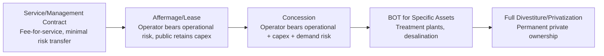
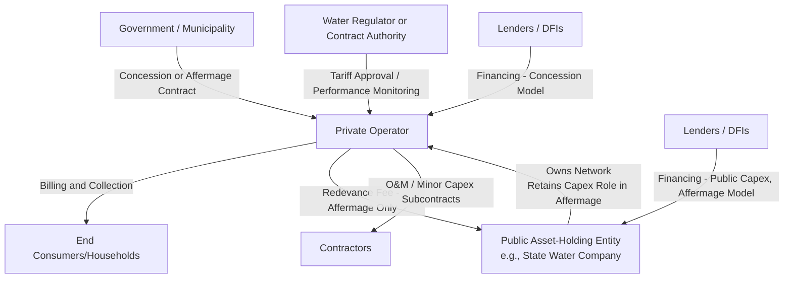

## Water Utility Concessions and Affermage Contracts

### Overview and Definition

Water Utility Concessions and Affermage Contracts are PPP structures for delegating the management, operation, and in some cases investment responsibility for water supply and/or sanitation services to a private operator, while the underlying infrastructure typically remains under public ownership or reverts to the public sector at contract end. These structures sit within a broader spectrum of water sector private participation models, ranging from low-risk-transfer management contracts to high-risk-transfer full concessions or divestitures.

**Affermage** (a French-origin term now used internationally, sometimes translated as "lease contract") is a specific model in which the private operator ("fermier") is responsible for operations, maintenance, billing, and collection, and retains a defined operating fee or margin from collected tariffs, while the public asset-owning entity remains responsible for major capital investment and asset renewal.

A **Concession** grants the private operator broader responsibility, typically including capital investment obligations, in exchange for the right to collect tariff revenue directly from users over a long-term period (commonly 20–30 years), with assets transferring back to the public sector at contract expiry.

**Key Points**

- The core distinction between affermage and concession is **capital investment responsibility**: affermage keeps major capex with the public asset holder; concession transfers most or all capex responsibility to the private operator.
- Both models differ from full privatization/divestiture in that public ownership of the core network asset is retained or restored; the private party holds time-limited operating and/or investment rights, not permanent ownership.
- Water sector PPPs face structurally different dynamics than energy sector PPPs (discussed in the Energy and Power Sector chapter) because water tariffs carry stronger social/human-right dimensions, water demand is far less price-elastic in ways that complicate cost-recovery tariff design, and non-revenue water (technical and commercial losses) is often a larger share of total system input than in electricity distribution.

### The Water Sector Private Participation Spectrum

**Key Points**

- Movement rightward generally corresponds to increasing risk transfer to the private party, increasing contract complexity, and increasing requirements for regulatory sophistication and financial capacity on the private side.
- Water sector reform has historically shown more model diversity and more instances of contract renegotiation, early termination, or reversion to public operation compared to some other infrastructure sectors — a pattern frequently attributed to water's social sensitivity, the political difficulty of tariff increases for a basic human need, and the technical complexity of urban water networks. [Inference: this reflects a widely observed pattern in water PPP literature; the specific causal weight of each factor is context-dependent and contested in academic literature.]

### Core Structural Models Compared

| Model | Capex Responsibility | Revenue Collection | Demand/Commercial Risk | Typical Duration | Asset Ownership |
| --- | --- | --- | --- | --- | --- |
| Service/Management Contract | Public | Public (operator paid a fee) | Public | 3–5 years | Public |
| Affermage/Lease | Public (major capex); operator may fund minor renewals | Private (operator collects tariffs, remits a fee/royalty to asset owner) | Private (operational/collection risk) | 8–15 years | Public |
| Concession | Private | Private (operator collects tariffs directly) | Private | 20–30 years | Public (reverts at term end) |
| BOT (specific asset, e.g., desalination/treatment plant) | Private | Often via bulk supply agreement with a public utility off-taker | Often mitigated via take-or-pay bulk supply agreement | 20–25 years | Private during term, transfers at end |
| Full Divestiture | Private | Private | Private | Permanent | Private |

### Affermage Contract Mechanics

Under affermage, the private operator's revenue is typically structured as a **fermier fee/margin**, retained from tariffs collected on behalf of the asset-owning public entity:

$$\text{Fermier Retained Revenue} = \text{Tariff Collected} - \text{Redevance (Asset Owner Fee)}$$

where the **redevance** is a per-unit or lump-sum fee paid by the fermier to the public asset holder, intended to fund capital investment, debt service on existing public infrastructure debt, and asset renewal — the public counterpart's primary revenue source under this model.

**Key Points**

- Because the fermier's margin is essentially the difference between total collected tariff and the fixed/formulaic redevance owed to the public entity, the fermier's core commercial incentive is to **maximize collection efficiency and minimize operating costs** within the tariff level set by the regulator or contract, rather than to expand or upgrade the network (which remains a public responsibility).
- This incentive structure is precisely why affermage contracts commonly include explicit performance targets on non-revenue water (NRW) reduction, billing/collection efficiency, and service continuity, since these are the dimensions the fermier directly controls and profits from improving.
- The redevance mechanism creates an important interdependency: if the fermier under-collects (due to poor commercial performance) the public asset owner may receive insufficient redevance revenue to fund planned capital investment, illustrating that affermage does not fully insulate the public sector from operational performance risk despite nominally retaining capex responsibility.

### Concession Contract Mechanics

Under a full concession, the private concessionaire's revenue equation more closely resembles the T&D electricity concession model (see Energy and Power Sector chapter), with tariff revenue required to cover both operations and capital recovery:

$$\text{Required Tariff Revenue} = OPEX + \text{Capex Recovery (Depreciation + Return)} + \text{Concession Fee (if any)}$$

Concession agreements typically specify a multi-year capital investment program (a defined schedule of network extension, treatment capacity expansion, or rehabilitation works) as a binding contractual obligation, distinct from affermage where capex planning and execution remain with the public asset owner.

**Key Points**

- Because concessions transfer both demand risk and capex risk to the private party, they require materially higher levels of tariff cost-reflectivity and regulatory predictability to be bankable than affermage contracts, which explains why affermage has often been used as an intermediate or transitional model in markets where full cost-reflective water tariffs are not yet politically or socially feasible. [Inference: this reflects a commonly cited rationale in water sector PPP design literature rather than a universal rule dictating model choice in every case.]
- Concession agreements typically include detailed "asset condition and investment obligation" schedules precisely because the operator's capex performance (unlike in affermage) is a primary contractual deliverable subject to penalty for non-compliance.

### Contractual and Institutional Architecture

**Key Points**

- The presence of two potential financing flows (to the operator under concession, or to the public asset holder under affermage) is a key structural marker distinguishing the two models and directly affects whether the private operator or the public entity carries the project finance/debt obligations for network expansion.
- Many water sector reforms retain a distinct "asset holding company" (patrimoine) separate from the operating entity even under affermage, so that the public asset owner has a dedicated institutional home for planning, financing, and monitoring capital investment independent of the operator's day-to-day management functions.

### Tariff Design and Regulation in Water PPPs

Water tariffs commonly employ an **increasing block tariff (IBT)** structure to balance cost recovery with affordability/social objectives:

$$\text{Bill} = \sum_{i=1}^{n} (\text{Block}_i \text{ Volume}) \times (\text{Block}_i \text{ Rate})$$

where consumption is divided into successive volume blocks (e.g., 0–10 m³, 11–20 m³, above 20 m³), each priced at a progressively higher rate, so that low-consumption (often lower-income) households pay a lower average rate than high-consumption households.

**Example**

A household consumes 25 m³ in a month under an IBT with: Block 1 (0–10 m³) at $0.30/m³, Block 2 (11–20 m³) at $0.50/m³, Block 3 (above 20 m³) at $0.90/m³.

$$\text{Bill} = (10 \times \$0.30) + (10 \times \$0.50) + (5 \times \$0.90) = \$3.00 + \$5.00 + \$4.50 = \$12.50$$

**Key Points**

- IBT design must be carefully calibrated: if block thresholds and rates are not periodically revised for inflation and consumption pattern changes, the tariff can lose cost-reflectivity over time even while nominally remaining in place, echoing the tariff reform sustainability challenges discussed in the Energy and Power Sector chapter.
- A well-known critique of IBT design is that it assumes a correlation between low consumption and low income that does not always hold (e.g., a low-income household with many occupants may consume more than a high-income single-occupant household), meaning IBT is an imperfect, though administratively simple, proxy for progressive social tariff design. [Inference: this is a recognized critique in water tariff policy literature rather than a claim that IBT is universally ineffective.]

### Non-Revenue Water (NRW): The Central Water-Sector Performance Metric

Analogous to AT&C losses in electricity distribution, **Non-Revenue Water** is the central efficiency and financial sustainability metric in water utility PPPs:

$$NRW\ (\%) = \frac{\text{System Input Volume} - \text{Billed Authorized Consumption}}{\text{System Input Volume}} \times 100$$

NRW is composed of:

- **Physical (real) losses:** Leakage from pipes, joints, and storage facilities due to aging or poorly maintained infrastructure.
- **Commercial (apparent) losses:** Meter under-registration, illegal connections, billing errors, and data handling errors.
- **Unbilled authorized consumption:** Legitimate but unbilled use (firefighting, utility's own operational use).

**Key Points**

- NRW levels vary enormously across utilities globally, with well-performing utilities often cited in the 15–25% range and poorly performing utilities in some contexts exceeding 40–50%; specific figures for any given utility should be sourced from that utility's own reported data rather than treated as generalizable benchmarks. [Unverified: illustrative ranges reflect commonly cited sector benchmarks in water utility performance literature rather than a verified universal standard.]
- NRW reduction is frequently the single largest source of financial value a private operator can unlock relative to a pre-existing public operator, which is why affermage and concession contracts commonly embed specific, time-bound NRW reduction targets tied to performance incentives or penalties, mirroring the AT&C loss reduction targets discussed for electricity distribution concessions.
- NRW reduction requires capital investment (pipe replacement, metering upgrades) as well as operational effort (leak detection, illegal connection enforcement), meaning the capex-responsibility split between concession and affermage models directly affects which party can be reasonably held accountable for which portion of NRW improvement.

### Risk Allocation Matrix

| Risk Category | Affermage | Concession | Mitigation Mechanism |
| --- | --- | --- | --- |
| Demand/collection risk | Private (operational) | Private (full) | Collection efficiency targets, tariff-setting mechanism |
| Capital investment/capex risk | Public | Private | Investment program schedules, prudency review (concession) |
| Non-revenue water (physical losses) | Shared (operator manages, public funds major rehab) | Private | NRW reduction targets, capex obligations |
| Tariff-setting/regulatory risk | Shared | Private (greater exposure given capex reliance on tariff revenue) | Automatic indexation, transparent regulatory methodology |
| Currency risk (foreign debt vs. local tariff revenue) | Primarily public (if public entity holds the debt) | Private (concessionaire), unless indexed | Tariff indexation, local currency financing, DFI guarantees |
| Political risk (tariff freezes, contract renegotiation) | Moderate | High (given long duration and capex stakes) | Stabilization clauses, international arbitration provisions |
| Asset condition/handback risk | Lower (public retains ongoing capex role) | Higher (requires handback condition standards) | Asset condition audits, handback investment reserves |
| Force majeure / drought and resource scarcity | Shared; often escalation/renegotiation trigger | Shared; often escalation/renegotiation trigger | Water resource risk studies, alternative source contingency planning |

### Common Renegotiation and Failure Modes

- **Tariff increases insufficient to meet contracted investment or return targets**, often due to political resistance to raising water tariffs, a good perceived as a basic human right and politically sensitive good even relative to electricity. [Inference: the political sensitivity is broadly documented, though its magnitude relative to electricity tariff sensitivity varies by country and cultural context.]
- **Currency devaluation** increasing the local-currency cost of foreign-currency-denominated concession debt or equity return targets, a recurring source of high-profile water concession renegotiations and disputes in various regions during the 1990s–2000s water privatization wave. [Unverified: specific historical case outcomes are well-documented in academic and development literature but should be verified against primary sources for any specific case cited.]
- **Overly optimistic demand or connection growth assumptions** at contract signing, leading to revenue shortfalls relative to the concessionaire's financial model, echoing the demand forecasting risk discussed under Take-or-Pay contracts in the energy sector, though water concessions typically lack an equivalent take-or-pay mechanism since there is usually no analogous "off-taker" — the concessionaire sells directly to dispersed retail consumers.
- **Social/political opposition to private water operation** itself, independent of specific performance issues, reflecting debates about the appropriateness of private participation in a sector viewed by many as a core public good or human right — a normative and political debate distinct from the technical/financial performance of any specific contract. [This reflects contested political and normative positions rather than an empirical technical claim; reasonable perspectives differ on the appropriate role of private participation in water service delivery.]

### Handback and Contract-End Provisions

- **Asset condition audits:** Independent technical audits in the final years of concession or affermage contracts assess whether network condition meets pre-agreed handback standards, mirroring the T&D concession handback framework.
- **Investment reserve/escrow mechanisms:** Some contracts require operators to fund a reserve account in later contract years specifically earmarked for handback-condition capital works, to counter "sweating the assets" incentives near contract expiry.
- **Data and knowledge transfer obligations:** Given the technical complexity of urban water networks (pipe age, material, historical leak records), contracts typically specify detailed handover documentation and data transfer requirements to avoid operational discontinuity when transitioning to a successor operator or back to public management.

### Comparative Table: Water Affermage/Concession vs. Energy T&D Concession

| Feature | Water Affermage/Concession | Electricity T&D Concession |
| --- | --- | --- |
| Loss terminology | Non-Revenue Water (NRW) | Aggregate Technical & Commercial (AT&C) Loss |
| Tariff social sensitivity | Very high (basic human need framing) | High, but somewhat less acute in most contexts |
| Typical intermediate model | Affermage (capex stays public) | Affermage/lease also used, though full concession more common |
| Off-taker/demand risk structure | No equivalent "off-taker"; direct retail billing | Similar direct retail billing for distribution; transmission has generator "off-takers" |
| Resource/supply risk | Drought, watershed/source depletion | Fuel/generation adequacy (upstream, less concessionaire-specific) |

### Related Topics

- Transmission and Distribution Concessions (Energy Sector Parallel Structures)
- Non-Revenue Water Reduction Strategies and Performance-Based Contracts
- Increasing Block Tariff Design and Social/Lifeline Tariff Structuring
- Bulk Water Supply Agreements and Desalination BOT Structures
- Water Regulator Independence and Tariff-Setting Methodology Design
- Handback Provisions and Asset Condition Audit Frameworks in Utility Concessions
- Political Economy of Water Tariff Reform and Social Acceptability
- Currency Risk Mitigation in Long-Term Utility Concessions
- Water Resource Risk and Climate Resilience in Water Sector PPPs
- Community and Small-Scale Water Service Delivery Models