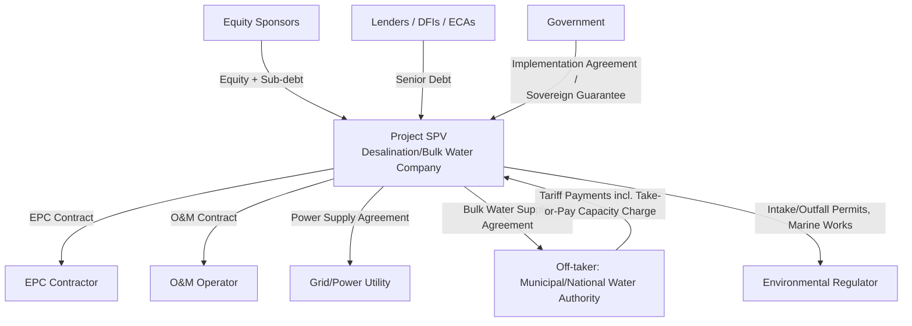

## Bulk Water Supply and Desalination BOT Projects

### Overview and Definition

Bulk Water Supply and Desalination BOT (Build-Operate-Transfer) Projects are PPP structures in which a private developer designs, finances, builds, owns (during the contract term), and operates a large-scale water production facility — typically a desalination plant, bulk surface water treatment plant, or water reuse/reclamation facility — and sells treated bulk water to a public off-taker (a municipal water utility or national water authority) under a long-term Bulk Water Supply Agreement (BWSA), before transferring the asset to the public sector at contract expiry.

This model is structurally distinct from the retail-facing affermage/concession structures covered elsewhere in this chapter: the private entity's customer is a single wholesale off-taker, not dispersed retail consumers, making the contractual and risk-allocation logic far closer to the Independent Power Producer (IPP) model in the Energy and Power Sector chapter than to a water distribution concession.

**Key Points**

- The defining structural analogy is: **Desalination/Bulk Water BOT is to water what an IPP is to power** — a single-asset, single off-taker, project-financed facility selling a bulk commodity under a long-term offtake agreement, rather than an entity managing an entire retail network.
- BOT (rather than BOO) is the dominant model in this subsector because bulk water production facilities are typically considered strategic national infrastructure that governments prefer to eventually own outright, unlike some renewable energy generation assets where BOO has become more common.
- The Bulk Water Supply Agreement (BWSA) is the central bankability document, performing the same central role that the PPA performs for IPPs — its take-or-pay structure, tariff formula, and risk allocation clauses are the primary determinants of project financeability.

### Technology Overview: Desalination Processes

**1. Reverse Osmosis (RO)**

The dominant modern desalination technology, using high-pressure pumps to force seawater or brackish water through semi-permeable membranes that reject dissolved salts. RO is significantly more energy-efficient than older thermal technologies and is now the technology of choice for the large majority of new large-scale desalination BOT projects globally. [Inference: "large majority" reflects the well-documented industry-wide shift toward RO over the past two decades; precise current global market share figures should be verified against current industry data if needed for a specific analysis.]

**2. Thermal Desalination (MSF – Multi-Stage Flash; MED – Multi-Effect Distillation)**

Older technologies that heat seawater and capture the resulting steam as fresh water, historically dominant in the Gulf region often due to co-location with power plants (cogeneration, using waste heat), but generally more energy-intensive than RO on a per-unit-of-water basis.

**3. Brackish Water Desalination**

Applies similar membrane technology to lower-salinity groundwater or brackish surface water sources, generally requiring less energy and lower-pressure systems than seawater RO due to lower feed-water salinity.

**Comparative Table: Desalination Technologies**

| Technology | Energy Intensity | Typical Application | Co-location Benefit |
| --- | --- | --- | --- |
| Seawater Reverse Osmosis (SWRO) | Moderate (dominant modern standard) | Large-scale municipal/industrial seawater desalination | Can co-locate with power plants for intake/outfall sharing |
| Multi-Stage Flash (MSF) | High | Legacy large-scale plants, often Gulf region | Strong cogeneration synergy with thermal power plants |
| Multi-Effect Distillation (MED) | Moderate–High | Similar to MSF, somewhat more efficient | Cogeneration synergy |
| Brackish Water RO (BWRO) | Low–Moderate | Inland groundwater desalination | Limited (no seawater intake/outfall issue) |

### Project Structure and SPV Architecture

**Key Points**

- The **Power Supply Agreement** is a distinctive additional contract layer specific to desalination (particularly RO, which is highly electricity-intensive), representing a major variable cost input analogous to the fuel supply agreement in a thermal IPP.
- The Environmental/marine permitting relationship is a more prominent and technically distinct contractual dimension in desalination BOTs than in most other water PPPs, given the intake (marine ecosystem impact) and outfall (brine discharge) environmental considerations discussed below.
- As with IPPs, the full contract stack (EPC, O&M, Power Supply, BWSA, Implementation Agreement) must align coherently for the project to be bankable; a weakness in any single agreement can undermine the credit strength the BWSA is otherwise designed to establish.

### Bulk Water Supply Agreement (BWSA): Core Structure

The BWSA closely mirrors the two-part tariff structure used in power PPAs, reflecting the shared project-finance logic:

$$\text{Total Tariff Payment} = \text{Capacity/Availability Charge} + \text{Variable/Output Charge}$$

**Capacity/Availability Charge (Fixed Charge)**

Paid based on the plant's demonstrated capacity to produce contracted volumes, regardless of whether the off-taker actually calls for that volume — functioning as a take-or-pay mechanism analogous to the capacity payment in power PPAs (see Take-or-Pay Contracts and Offtake Risk).

$$CC = \left(\frac{DS + FOM + ROE}{Cap_{ref}}\right) \times Cap_{demonstrated}$$

where $DS$ is debt service, $FOM$ is fixed O&M cost, $ROE$ is contracted equity return, $Cap_{ref}$ is contracted reference capacity, and $Cap_{demonstrated}$ is demonstrated available capacity.

**Variable/Output Charge**

Paid per cubic meter of water actually delivered, covering variable costs — primarily electricity (the dominant variable cost for RO plants) and chemicals/consumables:

$$VC = (E_{kWh/m^3} \times P_{electricity} + C_{chemicals}) \times V_{delivered}$$

where $E_{kWh/m^3}$ is the plant's specific energy consumption (kWh per cubic meter produced), $P_{electricity}$ is the electricity tariff, $C_{chemicals}$ is the chemical/consumable cost per cubic meter, and $V_{delivered}$ is the volume of water delivered.

**Example**

A 300,000 m³/day SWRO plant has a specific energy consumption of 3.5 kWh/m³, an electricity tariff of $0.08/kWh, and chemical costs of $0.03/m³. For a month where 8,000,000 m³ is delivered:

$$VC = (3.5 \times \$0.08 + \$0.03) \times 8{,}000{,}000 = (\$0.28 + \$0.03) \times 8{,}000{,}000 = \$0.31 \times 8{,}000{,}000 = \$2{,}480{,}000$$

This illustrates why electricity price risk is the dominant variable-cost exposure in desalination BOTs, analogous to the role fuel price plays in thermal power IPPs — and why the variable charge formula typically includes an automatic electricity tariff pass-through mechanism rather than a fixed per-unit rate.

### Risk Allocation Matrix

| Risk Category | Typically Borne By | Mitigation Mechanism |
| --- | --- | --- |
| Construction cost overrun/delay | Sponsor/EPC Contractor | Fixed-price, date-certain EPC contract with liquidated damages |
| Electricity price volatility | Off-taker (via pass-through) | Variable charge electricity pass-through formula |
| Electricity supply availability | Sponsor, backstopped by Power Supply Agreement terms | Firm power supply agreement, backup generation provisions |
| Demand/offtake risk | Off-taker | Take-or-pay capacity charge |
| Feed-water quality variability (seawater) | Sponsor (design responsibility), shared for extreme events | Pre-feasibility water quality studies, design margins |
| Membrane fouling/replacement cost | Sponsor (O&M responsibility) | O&M contract performance and cost provisions |
| Marine environmental/permitting risk | Sponsor (compliance), Government (permit issuance risk) | Environmental Impact Assessment, permitting conditions precedent |
| Currency/convertibility risk | Government | Implementation Agreement, hard-currency indexation |
| Off-taker payment default | Off-taker, backstopped by Government | Sovereign guarantee, LC, DFI partial risk guarantee |
| Force majeure (natural: storms, red tide/algal blooms) | Shared or insured | Business interruption insurance, feed-water quality contingency clauses |
| Force majeure (political) | Government | Termination compensation, buy-out obligation |

**Key Points**

- **Feed-water quality risk** is a desalination-specific risk category without a close power-sector analogue: algal blooms ("red tide"), unusually high turbidity, or oil spills can temporarily impair intake water quality, requiring the BWSA to define specific provisions (deemed availability during declared water-quality emergencies, or defined operational protocols) to avoid the plant being penalized for conditions outside its control.
- Membrane replacement is a recurring, planned operating cost (RO membranes typically require periodic replacement over the plant's operating life) [Inference: replacement intervals depend on feed-water quality, pretreatment effectiveness, and operating regime, and are plant-specific rather than fixed], and is normally budgeted within the fixed or variable charge structure depending on how the BWSA allocates this cost.

### Environmental and Permitting Considerations

**1. Intake Design and Marine Ecosystem Impact**

Open ocean intakes can impinge/entrain marine organisms; subsurface intakes (beach wells, infiltration galleries) reduce this impact but may be infeasible at very large scale or in certain geological conditions. Intake design choice materially affects both capex and environmental permitting risk/timeline.

**2. Brine/Concentrate Discharge (Outfall) Management**

Desalination produces a concentrated brine byproduct (roughly 1–1.5x the volume of product water for SWRO, with salinity roughly double that of the source seawater) [Inference: exact brine volume and concentration ratios vary by technology, recovery rate, and feed-water salinity], which must be discharged in a manner that avoids excessive localized salinity increases harmful to marine ecosystems. Common mitigation approaches include diffuser systems that promote rapid dilution, and co-location with power plant cooling water discharge to dilute brine before release.

**3. Environmental Impact Assessment (EIA) as a Critical Path Item**

EIA approval is frequently one of the longest-lead-time items in desalination project development, and BWSA/Implementation Agreement drafting typically treats EIA and environmental permit issuance as conditions precedent to financial close, given the potential for permitting delay or denial to materially affect project timelines.

**Key Points**

- Environmental permitting risk in desalination BOTs is structurally comparable in *timeline criticality* to land acquisition and right-of-way risk in linear infrastructure PPPs (roads, transmission lines), even though the underlying technical concern (marine ecosystem impact) is different.
- Brine management technology and cost is an active area of engineering development (e.g., brine concentration/valorization, mineral extraction from brine), and while conventional diffuser-based discharge remains the standard approach for large-scale plants, project-specific environmental conditions may require additional or alternative approaches beyond standard diffuser systems. [Inference: presented as a general engineering and regulatory trend rather than a claim about any specific project's technology choice.]

### Financing Structure and Bankability

Desalination BOT projects are typically financed with debt-to-equity ratios comparable to thermal IPPs (commonly in the 70:30 to 80:20 range) [Inference: transaction- and market-specific, varying with country risk and lender appetite], reflecting the similarly contracted, take-or-pay-backed cash flow profile.

**Debt Service Coverage Ratio (DSCR)** remains the core bankability metric:

$$DSCR = \frac{CFADS}{DS}$$

where $CFADS$ is cash flow available for debt service (BWSA revenue less operating costs and taxes) and $DS$ is scheduled debt service.

**Key Points**

- Because the BWSA is typically the SPV's sole revenue source, BWSA tenor must match or exceed loan tenor, mirroring the same bankability principle discussed for power PPAs; a mismatch is an equivalent red flag in desalination financing.
- Multilateral development banks and export credit agencies are frequently involved in large desalination BOTs, both for direct financing and for political risk mitigation instruments, particularly in emerging markets where the off-taker (often a national water authority) may have weaker standalone credit than is required for pure commercial financing.
- Desalination-specific technical due diligence for lenders typically includes independent feed-water quality studies, membrane technology track record review, and specific energy consumption benchmarking against comparable operating plants, given that specific energy consumption directly drives the variable charge and, by extension, the off-taker's total payment obligation.

### Alternative Bulk Water Sourcing: Non-Desalination BOTs

While desalination is the most prominent modern application of the bulk water BOT model, the same structure applies to other bulk water production or conveyance assets:

- **Bulk Surface Water Treatment Plants:** Private BOT development of a large water treatment plant drawing from a river or reservoir, selling treated bulk water to a municipal utility — structurally similar to desalination BOTs but without the marine intake/outfall and high electricity-intensity dimensions, and instead facing river/reservoir water quality and seasonal flow variability risk.
- **Water Reuse/Reclamation Plants:** BOT facilities treating municipal wastewater to a potable or non-potable reuse standard, sold to a utility or industrial off-taker (e.g., for irrigation or industrial cooling), an increasingly significant category given water scarcity and circular-economy policy trends.
- **Bulk Water Conveyance/Transfer Schemes:** Large-scale pipeline or canal BOT projects moving raw or treated water between basins or regions, structured with capacity-based tariffs similar to bulk water production BOTs, but with the dominant risk being hydrological/flow variability at the source rather than treatment process risk.

**Comparative Table: Bulk Water BOT Variants**

| Variant | Dominant Variable Cost | Dominant Unique Risk | Off-taker Relationship |
| --- | --- | --- | --- |
| Seawater Desalination | Electricity | Marine intake/outfall, feed-water quality events | BWSA with municipal/national water authority |
| Bulk Surface Water Treatment | Chemicals, moderate electricity | Source water quality, seasonal flow/drought | BWSA with municipal utility |
| Water Reuse/Reclamation | Electricity, chemicals | Influent (wastewater) quality/quantity variability | BWSA with utility or industrial off-taker |
| Bulk Conveyance/Transfer | Electricity (pumping) | Hydrological/source availability risk | Capacity-based agreement with regional water authority |

### Distinguishing Bulk Water BOT from Retail Concessions/Affermage

| Feature | Bulk Water BOT (Desalination etc.) | Retail Concession/Affermage |
| --- | --- | --- |
| Customer | Single wholesale off-taker | Dispersed retail consumers |
| Revenue mechanism | Take-or-pay bulk tariff (capacity + variable charge) | Direct retail tariff billing, often IBT structure |
| Demand risk | On off-taker (via take-or-pay) | On operator (concession) or shared (affermage) |
| Network/distribution responsibility | None (production only) | Core responsibility |
| Primary technical risk | Feed-water/process/technology risk | Network condition, NRW, collection efficiency |
| Structural analogy | Power sector IPP | Power sector T&D concession |

### Worked Example: Take-or-Pay Impact on Bulk Water BOT Revenue

A 200,000 m³/day desalination BOT has a contracted capacity charge designed to recover $25,000,000 annually in fixed costs, with a reference availability of 92%.

**Scenario: Off-taker's actual bulk water demand falls 20% below forecast due to unexpected rainfall reducing municipal water demand, but the plant remains available at 95%.**

Under the take-or-pay capacity charge:

$$CC_{annual} = \$25{,}000{,}000 \times \left(\frac{95\%}{92\%}\right) \approx \$25{,}815{,}217$$

The SPV receives its full expected fixed-cost recovery (and slightly more, due to over-performance on availability) despite the demand shortfall, because the capacity charge is decoupled from actual offtake volume — precisely mirroring the take-or-pay logic detailed under Take-or-Pay Contracts and Offtake Risk in the Energy and Power Sector chapter, and illustrating why this contractual mechanism, not the underlying technology, is what determines the project's revenue resilience to demand variability.

### Related Topics

- Independent Power Producer Models and Power Purchase Agreements
- Take-or-Pay Contracts and Offtake Risk
- Water Utility Concessions and Affermage Contracts
- Environmental Impact Assessment and Permitting Risk in Infrastructure PPPs
- Water Reuse and Circular Economy PPP Models
- Power Supply Agreements and Energy-Intensive Industrial PPP Structures
- Debt Service Coverage Ratio (DSCR) and Bankability Analysis in Project Finance
- Marine and Coastal Environmental Risk Management in Infrastructure Projects
- Sovereign Guarantees and Government Support Agreements in Water PPPs
- Climate Resilience and Water Security Planning in Bulk Water Infrastructure