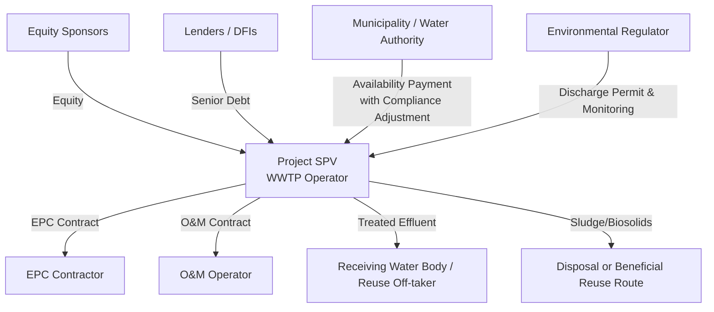

## Wastewater Treatment and Solid Waste Management PPPs

### Overview and Definition

Wastewater Treatment and Solid Waste Management PPPs are structures in which a private entity finances, builds, and/or operates infrastructure for treating municipal or industrial wastewater, or for collecting, transferring, processing, and disposing of solid waste, under a long-term contract with a public authority (typically a municipality, water authority, or regional waste authority). Both subsectors share a common structural feature that distinguishes them from most other utility PPPs: the off-taker is frequently paying the private party to **process an input** (wastewater or waste) rather than paying for a delivered commodity (electricity, treated water), which fundamentally shapes their tariff and risk allocation logic.

**Key Points**

- The core commercial relationship inverts the typical PPP logic: instead of the private party being paid for **output delivered** (as in an IPP selling electricity or a desalination BOT selling treated water), these projects are frequently paid a **gate fee** or **tipping fee** for accepting and processing an input, with volume risk running in the opposite direction of most utility PPPs — the operator often wants sufficient volume to sustain fixed-cost recovery.
- Both subsectors carry significant environmental compliance and public health dimensions that create distinct permitting, monitoring, and reputational risk profiles compared to water supply or power generation.
- Revenue models range from pure availability/capacity-based payments (most common for large centralized treatment plants) to volume-based gate/tipping fees (common for waste-to-energy and landfill facilities) to hybrid structures combining both.

### Wastewater Treatment PPPs

**Core Structural Models**

| Model | Description | Typical Application |
| --- | --- | --- |
| BOT (Build-Operate-Transfer) | Private developer builds and operates a treatment plant for a concession period, transferring to the public sector at term end | Large centralized municipal wastewater treatment plants |
| DBFO (Design-Build-Finance-Operate) | Similar to BOT but emphasizes integrated design responsibility from the outset, often used for greenfield facilities with performance-based design flexibility | New treatment plant construction with output-based specifications |
| O&M Contract / Management Contract | Private operator manages an existing publicly-owned plant for a fee, without major capital investment or ownership | Rehabilitation of underperforming existing plants, lower risk transfer |
| Affermage (Lease) | Private operator manages operations and collects service fees; public entity retains capex responsibility | Similar rationale to water affermage — used where capex financing capacity or tariff levels don't yet support full concession |

**Revenue and Payment Mechanism**

Municipal wastewater treatment BOTs are typically remunerated through an **availability-based payment** from the public off-taker (the municipality or water utility), rather than direct billing to households, since wastewater treatment plants do not have a direct billing relationship with individual generators of wastewater in most institutional arrangements:

$$\text{Availability Payment} = \left(\frac{DS + FOM + ROE}{Cap_{ref}}\right) \times Cap_{demonstrated} \times \text{Compliance Adjustment Factor}$$

where the **Compliance Adjustment Factor** is a defining feature of wastewater treatment payment mechanisms: payment is typically reduced (or penalties applied) if treated effluent fails to meet contracted discharge quality standards (e.g., BOD, COD, total suspended solids, nutrient levels), even if the plant is nominally "available."

**Key Points**

- The Compliance Adjustment Factor is what distinguishes wastewater treatment availability payments from simpler power/water availability payments: **availability alone is insufficient** — the plant must be available **and** meeting effluent quality standards for full payment, since a non-compliant plant that is technically "operating" still creates environmental and regulatory liability for the public off-taker.
- Some structures fund wastewater PPPs partly or wholly through **sewerage/sanitation tariffs** billed to households (often bundled with the water bill), in which case the arrangement more closely resembles the retail-facing concession/affermage model discussed for water utilities, rather than a pure availability-payment BOT.
- Financing of municipal off-taker payment obligations frequently draws on national or municipal budget allocations, environmental levies, or blended finance from climate/environmental funds, given that wastewater treatment is often justified primarily by public health and environmental externalities rather than direct cost-recovery revenue potential.

**Effluent Quality and Performance Standards**

Contracted discharge standards are typically expressed as maximum permissible concentrations for key parameters:

| Parameter | Typical Regulatory Concern | Contractual Treatment |
| --- | --- | --- |
| Biochemical Oxygen Demand (BOD) | Organic pollution load, oxygen depletion in receiving water | Maximum concentration threshold with penalty for exceedance |
| Chemical Oxygen Demand (COD) | Broader measure of oxidizable pollutants | Maximum concentration threshold |
| Total Suspended Solids (TSS) | Sediment/particulate pollution | Maximum concentration threshold |
| Nutrients (Nitrogen, Phosphorus) | Eutrophication risk in receiving water bodies | Increasingly stringent in sensitive receiving environments |
| Pathogen indicators (e.g., fecal coliform) | Public health risk, especially where reuse is intended | Critical for water reuse-linked wastewater PPPs |

**Key Points**

- Contracted effluent standards should align with the national/local environmental regulator's discharge permit requirements; a structural risk arises if the BOT contract's compliance thresholds are set independently of, or become misaligned with, subsequently tightened environmental regulations — a form of change-in-law risk requiring an explicit tariff/payment adjustment mechanism, similar to change-in-law provisions in power PPAs.
- Sludge management (treatment, dewatering, and disposal of the solid byproduct of wastewater treatment) is frequently a distinct cost center and sometimes a separate contractual scope, with disposal routes (landfill, agricultural land application, incineration) carrying their own environmental permitting and market/price risk (e.g., value or cost of biosolids disposal can shift based on regulatory and agricultural market conditions).

### Contractual Architecture: Wastewater Treatment BOT

**Key Points**

- Unlike the desalination BOT model (which sells an output to a single off-taker), a wastewater BOT has an implicit "second output" — treated effluent discharged to the environment or a reuse off-taker — creating an ongoing environmental compliance relationship that persists independent of the payment relationship with the municipal off-taker.
- Where treated effluent is sold for reuse (industrial cooling, irrigation), the project can develop a secondary revenue stream, partially reducing reliance on the availability payment and shifting the project's risk/return profile closer to the bulk water BOT model discussed elsewhere in this chapter.

### Solid Waste Management PPPs

**Core Structural Models Across the Waste Value Chain**

| Segment | Typical PPP Model | Description |
| --- | --- | --- |
| Collection and Transport | Service contract | Private contractor collects and transports waste for a fee, usually the lowest risk-transfer segment |
| Transfer Stations | BOT or management contract | Intermediate consolidation facilities reducing transport costs to distant disposal sites |
| Material Recovery Facilities (MRF) | BOT or concession | Sorting/recycling facilities, revenue partly from recovered material sales |
| Sanitary Landfill | Concession or BOT | Long-term disposal site development and operation, often with gate fees |
| Waste-to-Energy (WtE) / Incineration | BOT or BOO | Thermal treatment generating electricity/heat from waste, hybrid gate-fee plus energy-sale revenue |
| Composting/Anaerobic Digestion | BOT | Organic waste processing, revenue from gate fees plus compost/biogas sales |

**Waste-to-Energy (WtE) Hybrid Revenue Model**

WtE facilities are among the most contractually complex solid waste PPPs because they combine two distinct revenue streams:

$$\text{Total Revenue} = (\text{Gate/Tipping Fee} \times \text{Waste Volume}) + (\text{Energy Payment} \times \text{Electricity Generated})$$

The **gate fee** (paid per tonne of waste accepted) functions similarly to a take-or-pay-like mechanism when structured with minimum guaranteed waste delivery volumes from the municipality, while the **energy payment** follows a structure resembling a power PPA (see Independent Power Producer Models and Power Purchase Agreements), often with renewable/waste-to-energy classification qualifying the facility for a feed-in tariff or equivalent renewable support mechanism in some jurisdictions. [Inference: whether waste-to-energy qualifies as "renewable" for policy support purposes varies significantly by jurisdiction and waste composition, and should be verified against local regulatory classification.]

**Example**

A WtE facility processes 1,500 tonnes/day of municipal solid waste at a gate fee of $45/tonne, and generates 25 MWh of net electricity per 1,000 tonnes processed, sold at $0.09/kWh.

Daily gate fee revenue:

$$1{,}500 \times \$45 = \$67{,}500$$

Daily energy revenue (net generation scaled to daily throughput):

$$\left(\frac{1{,}500}{1{,}000}\right) \times 25{,}000 \text{ kWh} \times \$0.09 = 37{,}500 \text{ kWh} \times \$0.09 = \$3{,}375$$

Total daily revenue: approximately $70,875, illustrating that for most municipal WtE facilities, the **gate fee is typically the dominant revenue source**, not the energy sale — a common misconception given the "waste-to-energy" branding. [Inference: the relative weight of gate fee versus energy revenue varies by local tipping fee levels and electricity prices; this example is illustrative rather than universally representative.]

**Key Points**

- **Minimum guaranteed waste delivery (a "waste flow control" or "put-or-pay" obligation)** is the solid-waste-sector analogue to take-or-pay in power/water PPPs: the municipality commits to delivering a minimum tonnage, and pays a shortfall penalty if actual delivered volume falls below the guaranteed level, protecting the WtE facility's fixed-cost recovery in a manner structurally identical to the take-or-pay logic discussed under Take-or-Pay Contracts and Offtake Risk.
- Waste composition and calorific value materially affect WtE plant performance and revenue; contracts typically specify a design waste composition/calorific value range, with mechanisms to address risk if actual delivered waste falls significantly outside this range (e.g., due to upstream recycling programs diverting high-calorific-value materials).
- Landfill diversion policy and recycling target trends represent a structural long-term risk to WtE and landfill BOT revenue models, since successful municipal recycling/diversion programs reduce the waste volume available to meet put-or-pay commitments, creating a potential tension between environmental policy goals (waste reduction) and the take-or-pay-style contractual commitments that made the WtE facility bankable. [Inference: this tension is a recognized structural feature of long-term WtE contracting, though its practical significance depends on the specific interplay between local recycling programs and contracted minimum volumes.]

### Risk Allocation Matrix: Solid Waste PPPs

| Risk Category | Typically Borne By | Mitigation Mechanism |
| --- | --- | --- |
| Construction cost overrun | Sponsor/EPC Contractor | Fixed-price EPC with liquidated damages |
| Waste volume shortfall | Municipality/Authority | Put-or-pay / minimum guaranteed tonnage clause |
| Waste composition/calorific value variability | Shared | Design composition bands, tariff adjustment mechanisms |
| Recyclable/recovered material price volatility | Operator (MRF revenue) or shared | Price-sharing formulas, floor-price guarantees in some structures |
| Environmental compliance (emissions, leachate) | Operator | Performance bonds, compliance-linked payment deductions |
| Off-taker (municipal) payment default | Municipality, backstopped by government/DFI in some cases | Escrow, payment security instruments |
| Energy off-take price risk (WtE) | Varies by contract; often mitigated via PPA/FiT | Feed-in tariff or PPA structure for energy component |
| Post-closure landfill liability (leachate, methane, monitoring) | Often retained by public sector or subject to defined post-closure operator obligations | Post-closure care fund/escrow, defined monitoring period obligations |

**Key Points**

- **Post-closure landfill liability** is a distinctive long-tail risk in solid waste PPPs without a close analogue in power or water sector infrastructure: landfills continue to generate leachate and methane for years or decades after closure, and contracts must explicitly define which party bears post-closure monitoring, maintenance, and remediation obligations, since this liability can materially outlast the concession/BOT operating term itself.
- Recovered material (recyclables) price volatility (paper, plastics, metals) is a distinctive market risk for Material Recovery Facilities, and contract structures vary widely in how this risk is shared between operator and municipality — some contracts include price-sharing formulas or floor-price mechanisms, while others leave full commodity price risk with the operator. [Inference: allocation approach is highly contract- and market-specific; no single standard approach dominates globally.]

### Environmental and Social Risk Considerations

- **Emissions Standards (WtE/Incineration):** Air emissions (dioxins, particulates, heavy metals, NOx) are subject to stringent regulatory limits in most jurisdictions, requiring continuous emissions monitoring systems and creating a compliance-linked payment risk analogous to the effluent compliance adjustment discussed for wastewater treatment.
- **Community and Siting Opposition ("NIMBY" dynamics):** Waste facilities (landfills, WtE plants, transfer stations) frequently face significant local community opposition, making site selection, community engagement, and social impact assessment critical path items comparable in schedule-risk significance to environmental permitting risk in desalination BOTs.
- **Informal Waste Sector Interaction:** In many developing-country contexts, formalizing waste collection and processing through a PPP can displace informal waste pickers who previously derived livelihoods from recyclable material recovery, raising social risk and inclusion considerations that increasingly feature in project design (e.g., formal integration of waste picker cooperatives into MRF operations). [Inference: this is a well-documented policy and social-inclusion consideration in development-oriented solid waste PPP literature, though specific integration approaches and their effectiveness vary substantially by context.]

### Comparative Table: Wastewater Treatment vs. Solid Waste PPPs vs. Bulk Water BOT

| Feature | Wastewater Treatment BOT | Solid Waste (WtE) BOT | Bulk Water BOT (Desalination) |
| --- | --- | --- | --- |
| Payment logic | Availability + compliance adjustment | Gate fee (volume) + energy sale | Capacity charge + variable output charge |
| Direction of "flow" paid for | Input processed (wastewater) | Input processed (waste) | Output delivered (treated water) |
| Volume risk direction | Neutral (availability-based) | Municipality guarantees minimum (put-or-pay) | Off-taker guarantees minimum (take-or-pay) |
| Dominant unique risk | Effluent compliance, sludge disposal | Waste composition, post-closure liability, recyclables price | Feed-water quality, marine permitting |
| Secondary revenue potential | Effluent reuse sale | Recovered materials, energy sale | None typically (single product) |

### Related Topics

- Independent Power Producer Models and Power Purchase Agreements
- Take-or-Pay Contracts and Offtake Risk
- Bulk Water Supply and Desalination BOT Projects
- Water Reuse and Circular Economy PPP Models
- Environmental Impact Assessment and Compliance-Linked Payment Mechanisms
- Post-Closure Landfill Liability and Long-Tail Environmental Risk Management
- Renewable Energy Classification and Support Mechanisms for Waste-to-Energy
- Informal Sector Integration in Municipal Solid Waste PPP Design
- Sludge and Biosolids Management Contracting Models
- Municipal Off-taker Creditworthiness and Payment Security in Environmental PPPs