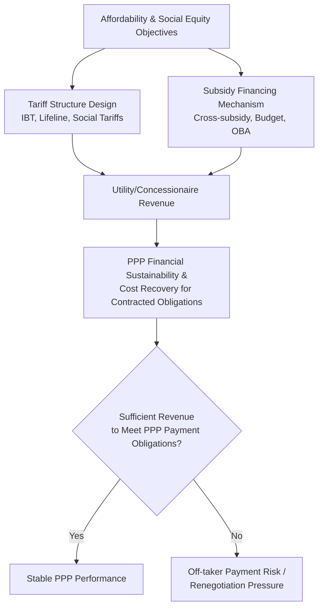

## Tariff Affordability and Social Equity Considerations

### Overview and Definition

Tariff Affordability and Social Equity Considerations examine the tension between the cost-recovery imperative that underpins bankable water, sanitation, and environmental PPPs, and the social/human-right dimensions of ensuring access to essential services for low-income and vulnerable households. This topic sits at the intersection of PPP financial sustainability (covered throughout this chapter and the Energy chapter's tariff reform discussion) and social policy, examining the analytical frameworks, tariff design tools, and institutional mechanisms used to reconcile these often-competing objectives.

**Key Points**

- The central tension is structural, not merely a design flaw to be engineered away: cost-reflective tariffs are necessary for PPP bankability and long-term sector financial sustainability, while affordability constraints for low-income households may require tariffs below full cost recovery for at least some consumption segments — meaning some form of subsidy, cross-subsidy, or targeted support is a **normal and expected feature** of well-designed water/sanitation tariff systems, not evidence of tariff design failure.
- Affordability analysis and social equity considerations directly affect PPP bankability: if a concessionaire's revenue depends on tariff increases that prove politically or socially unsustainable, the resulting non-implementation or reversal of planned tariffs becomes a tariff/regulatory risk of the kind discussed in the Energy and Power Sector chapter's tariff reform interactions.
- These considerations differ meaningfully from purely technical or financial PPP topics in that they involve genuine, contested normative and political judgments about the appropriate balance between cost recovery, equity, and the role of private capital in essential services — this content presents the frameworks and tools used in this space rather than asserting a single correct balance.

### Defining and Measuring Affordability

**Common Affordability Metrics**

The most widely used affordability benchmark in water/sanitation sector literature is the **percentage of household income spent on water and sanitation services**:

$$\text{Affordability Ratio} = \frac{\text{Household Water/Sanitation Bill}}{\text{Household Income}} \times 100$$

A commonly cited threshold in international development literature suggests that water and sanitation expenditure should not exceed approximately 3–5% of household income, though this benchmark is contested and its appropriateness varies by country context, income distribution, and what other essential services (electricity, housing) compete for the same household budget share. [Inference: this threshold range is frequently cited in water sector policy literature as a rule-of-thumb rather than a scientifically derived or universally agreed standard; some researchers and institutions propose different thresholds or argue against a single universal benchmark.]

**Key Points**

- Affordability metrics based on a single percentage-of-income threshold are a simplification; more rigorous affordability analysis typically examines the **distribution** of affordability burden across income deciles, since an average or median affordability ratio can mask severe unaffordability for the lowest-income households even when the sector-wide average appears acceptable.
- Affordability should be distinguished from **willingness to pay**, which measures consumer valuation of service improvements and is used in demand studies and tariff design, but does not by itself establish whether a tariff level is affordable for low-income households, since willingness to pay is influenced by income constraints as well as genuine valuation.
- "Access affordability" (whether a household can afford the connection fee/capital cost of obtaining a new connection) is analytically distinct from "consumption affordability" (whether a connected household can afford ongoing tariff payments), and PPP contract design tools differ significantly between these two dimensions.

### Tariff Design Tools for Affordability

**1. Increasing Block Tariffs (IBT)**

As discussed under Water Utility Concessions and Affermage Contracts, IBT structures charge progressively higher rates for higher consumption blocks, implicitly subsidizing low-consumption (often lower-income) households through the pricing structure itself rather than requiring a separate subsidy mechanism.

$$\text{Bill} = \sum_{i=1}^{n} (\text{Block}_i \text{ Volume}) \times (\text{Block}_i \text{ Rate})$$

**2. Lifeline Tariffs**

A specific, typically very low or zero-cost tariff rate applied to a minimum "lifeline" volume of consumption (often calibrated to estimated basic health/hygiene needs, sometimes referenced against WHO minimum water requirement guidance), intended to guarantee baseline access regardless of ability to pay for higher consumption levels.

**3. Social/Targeted Tariffs**

Tariff discounts or exemptions applied not by consumption volume (as with IBT/lifeline tariffs) but by **verified household characteristics** — registration in a national social protection database, pensioner status, disability status, or similar means-tested criteria — allowing more precisely targeted support than volume-based proxies.

**4. Connection Subsidies**

Distinct from consumption tariff subsidies, these address the "access affordability" dimension: subsidizing or financing (via installment plans, micro-credit, or capital grants) the upfront connection fee that can otherwise be a significant barrier to formal service access for low-income households, even where ongoing consumption tariffs are affordable.

**Comparative Table: Tariff Design Tools**

| Tool | Targeting Basis | Administrative Complexity | Key Limitation |
| --- | --- | --- | --- |
| Increasing Block Tariff (IBT) | Consumption volume (proxy for income) | Low (built into billing system) | Imperfect proxy; large low-income households may consume more than small high-income households |
| Lifeline Tariff | Minimum consumption threshold | Low | Provides baseline support but limited protection above the lifeline volume |
| Social/Targeted Tariff | Verified household characteristics | High (requires functioning beneficiary database) | Effectiveness depends entirely on targeting system accuracy and coverage |
| Connection Subsidy | Upfront capital cost barrier | Moderate | Addresses access, not ongoing consumption affordability |

**Key Points**

- IBT and lifeline tariffs are **administratively simple but imperfectly targeted** (they proxy income via consumption, which correlates imperfectly with actual household income and need), while targeted social tariffs are **more precisely targeted but administratively demanding**, requiring reliable beneficiary identification systems that may not exist or may be incomplete in some institutional contexts. [Inference: this trade-off is a well-established finding in social tariff design literature, though the magnitude of targeting error under IBT varies by context and household composition patterns.]
- A well-documented critique of relying solely on consumption-based proxies (IBT, lifeline tariffs) is that they fail to account for household size: a large low-income household may exceed the lifeline/low-tariff block simply due to having more members, while a small high-income household may fall within the subsidized block — meaning consumption-based tools alone do not achieve the same targeting precision as verified means-tested approaches.

### Subsidy Financing Mechanisms

Where tariffs are set below full cost recovery for some or all consumption segments (whether via IBT, lifeline tariffs, or targeted social tariffs), the resulting revenue gap must be financed through one of the following mechanisms, each with distinct fiscal transparency and PPP risk implications:

**1. Cross-Subsidization (Within-Sector)**

Higher tariffs charged to industrial/commercial or high-consumption residential customers finance lower tariffs for low-consumption/residential customers, without requiring external budget transfers.

**2. Direct Government Budget Subsidy**

Explicit fiscal transfers from central or municipal government budgets to the utility or directly to eligible households, appearing transparently as a government expenditure line item.

**3. Output-Based Aid (OBA) / Connection Subsidies**

Donor or government funding tied to verified service delivery outputs (e.g., a subsidy paid per verified new low-income household connection), often used in PPP contexts specifically to address access affordability while maintaining private operator accountability for actual delivery.

**4. Cross-Sector Levies**

Dedicated levies on related sectors or activities (e.g., an environmental or resource-use levy) earmarked to fund water/sanitation subsidies, distinct from general budget allocation.

**Key Points**

- **Cross-subsidization carries a structural risk** discussed in the Energy and Power Sector chapter's tariff reform content: if cross-subsidies from industrial/commercial customers become too large relative to the cost-reflective tariff those customers would otherwise pay, large consumers may have an incentive to seek alternative supply arrangements (self-supply, bypass), eroding the utility's revenue base and ultimately undermining the very subsidy mechanism intended to support low-income households.
- **Direct budget subsidies offer the greatest fiscal transparency** (the true cost of the affordability policy is visible in the government budget) but require sustained political commitment and fiscal capacity, and are vulnerable to being cut during fiscal consolidation periods, potentially disrupting the affordability mechanism the tariff design assumed would remain in place.
- **Output-Based Aid** is particularly relevant to PPP contract design because it directly links subsidy disbursement to verified private-sector performance (new connections delivered to eligible households), reducing the moral hazard risk associated with untargeted or poorly monitored subsidy mechanisms.

### Affordability Considerations in PPP Contract and Tariff-Setting Design

**Key Points**

- This diagram illustrates that affordability and social equity mechanisms are not external constraints layered onto PPP design after the fact — they are inputs directly determining whether the utility or off-taker generates sufficient revenue to honor its contracted payment obligations to the private operator, linking this topic directly to the off-taker creditworthiness and quasi-fiscal deficit concepts discussed elsewhere in this and the Energy and Power Sector chapter.
- A PPP tariff and subsidy design that fails to adequately address affordability risks **social/political opposition and non-payment** (both individual household non-payment and broader political resistance to tariff increases), while a design that fails to achieve adequate cost recovery risks **PPP financial distress and renegotiation** — good design must navigate both failure modes simultaneously rather than treating them as sequential or separable problems.

### Non-Payment, Disconnection Policy, and Human Rights Considerations

**Disconnection Policy Design**

PPP contracts and regulatory frameworks typically must define disconnection policies for non-payment, balancing the operator's legitimate need for revenue collection against social protection concerns, particularly regarding:

- **Protected categories:** Many jurisdictions restrict or prohibit disconnection for vulnerable households (e.g., during specific circumstances such as serious illness, or for households below a defined poverty threshold), requiring the PPP contract's collection/disconnection provisions to align with these legal protections.
- **Minimum service guarantees:** Some frameworks mandate a minimum lifeline supply be maintained even for non-paying households (particularly for water, given its basic health and human rights dimensions), rather than full disconnection, distinguishing water from services where full disconnection for non-payment is more commonly accepted practice.
- **Human right to water recognition:** The UN General Assembly's 2010 recognition of water and sanitation as a human right has informed (though its precise legal and policy implications remain subject to ongoing interpretation and vary by country) subsequent national policy and regulatory approaches to disconnection and minimum service guarantees in many jurisdictions. [Inference: the practical legal and regulatory implications of this recognition vary substantially by country and are subject to differing legal interpretation; this is a factual reference to the UN resolution's existence and general influence rather than a claim about its specific binding effect in any jurisdiction.]

**Key Points**

- Disconnection policy directly affects PPP operator revenue collection risk: a policy environment restricting disconnection for non-payment (for legitimate social protection reasons) without a corresponding, reliably funded subsidy or targeted support mechanism can create a structural revenue gap that the operator cannot resolve through collection efforts alone, since the contractual "stick" of disconnection is legally or socially constrained.
- This is a genuine area of contested policy judgment: reasonable positions differ on where to draw the line between protecting vulnerable households from service loss and maintaining sufficient collection discipline to sustain utility/PPP financial viability, and this content presents the competing considerations rather than asserting where that line should be drawn.

### Regulatory and Institutional Mechanisms for Balancing Cost Recovery and Equity

| Mechanism | Function | Institutional Requirement |
| --- | --- | --- |
| Independent regulator with explicit affordability mandate | Balances cost-reflectivity and affordability within tariff-setting methodology | Regulator with technical capacity and clear statutory mandate covering both objectives |
| Social tariff/subsidy eligibility database | Enables targeted (rather than blanket) subsidy delivery | Functioning social registry or means-testing system |
| Tariff review public consultation processes | Provides transparency and stakeholder input on affordability impacts of proposed tariff changes | Legal requirement for consultation, genuine incorporation of input |
| PPP contract affordability review clauses | Allows contractually defined tariff adjustment review if affordability metrics breach pre-agreed thresholds | Clear, objective affordability metrics defined in contract |
| Independent affordability/poverty impact assessment | Assesses distributional impact of proposed tariff changes before implementation | Technical capacity to conduct household expenditure/income analysis |

**Key Points**

- The most robust institutional designs generally embed affordability considerations directly into the regulator's tariff-setting mandate and methodology (rather than treating affordability as a separate, ad hoc political overlay on an otherwise purely cost-based tariff process), since this reduces the risk of affordability-driven ad hoc tariff freezes of the kind discussed as a structural risk to PPP financial sustainability in the Energy and Power Sector chapter's tariff reform content.
- Effective targeted subsidy delivery is fundamentally constrained by the quality of the underlying social registry or beneficiary identification system; PPP transactions in contexts lacking such systems face a genuine design constraint that cannot be fully resolved through tariff or contract design alone, since accurate targeting requires institutional capacity outside the PPP contract's direct control. [Inference: this reflects a well-recognized institutional dependency in social protection and tariff design literature rather than a claim specific to any particular country's current system capacity.]

### Worked Example: Comparing Flat Tariff vs. IBT Affordability Impact

Consider two households in the same service area under a hypothetical tariff structure:

- **Household A (low-income):** Consumes 8 m³/month
- **Household B (higher-income):** Consumes 30 m³/month

**Under a flat tariff of $0.50/m³:**

$$\text{Household A Bill} = 8 \times \$0.50 = \$4.00$$

$$\text{Household B Bill} = 30 \times \$0.50 = \$15.00$$

**Under an IBT with Block 1 (0–10 m³) at $0.30/m³, Block 2 (11–20 m³) at $0.55/m³, Block 3 (above 20 m³) at $1.00/m³:**

$$\text{Household A Bill} = 8 \times \$0.30 = \$2.40$$

$$\text{Household B Bill} = (10 \times \$0.30) + (10 \times \$0.55) + (10 \times \$1.00) = \$3.00 + \$5.50 + \$10.00 = \$18.50$$

**Example**

This illustrates the core IBT mechanism: Household A's bill falls from $4.00 to $2.40 (a meaningful affordability improvement, assuming Household A is indeed low-income), while Household B's bill rises from $15.00 to $18.50, with the higher-consumption block effectively cross-subsidizing the lower block. Whether this design achieves genuine equity improvement depends on the accuracy of the underlying assumption that low consumption correlates with low income for the specific service area in question — an assumption that does not always hold, as noted above.

### Distinguishing This Topic from Pure Tariff/Regulatory Design

| Dimension | Tariff/Regulatory Design (Technical) | Affordability & Social Equity (This Topic) |
| --- | --- | --- |
| Primary objective | Cost recovery, efficiency incentives, regulatory predictability | Ensuring access and protecting vulnerable households |
| Key metrics | RAB, WACC, allowed revenue, DSCR | Affordability ratio, targeting accuracy, coverage of vulnerable households |
| Primary risk of failure | Under-recovery, PPP financial distress | Exclusion of low-income households, social/political opposition |
| Nature of trade-offs | Largely technical/financial optimization | Involves genuine normative and political value judgments |

### Related Topics

- Water Utility Concessions and Affermage Contracts
- Energy Sector Regulatory and Tariff Reform Interactions
- Quasi-Fiscal Deficits and Utility Financial Sustainability Analysis
- Output-Based Aid and Results-Based Financing in Infrastructure PPPs
- Social Protection Systems and Beneficiary Targeting Mechanisms
- Human Right to Water and International Legal Frameworks
- Regulatory Independence and Institutional Design for Tariff-Setting
- Political Economy of Tariff Reform and Public Consultation Processes
- Off-taker Creditworthiness and Payment Security in Environmental PPPs
- Poverty and Distributional Impact Assessment Methodologies for Utility Tariffs