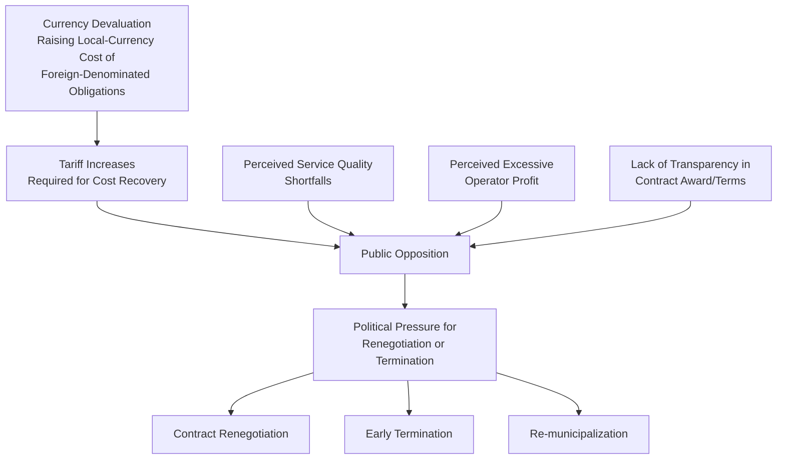

## Political Sensitivity and Public Opposition to Water Privatization

### Overview and Definition

Political Sensitivity and Public Opposition to Water Privatization examines the distinct political economy dynamics that arise when private capital and management are introduced into water and sanitation services, and the recurring patterns of public resistance, contract renegotiation, early termination, and re-municipalization observed across water sector PPP experience globally. This topic is analytically distinct from the technical/financial risk allocation content covered elsewhere in this chapter: it addresses the normative, political, and social legitimacy dimensions of private participation in water services, which frequently operate independently of — and sometimes despite — a contract's technical or financial soundness.

**Key Points**

- Water occupies a distinctive position among infrastructure sectors because it is widely regarded, and in some contexts legally recognized, as a basic human right and essential-for-life good, which generates political and social sensitivities that are typically more acute than for comparable private participation in power, telecommunications, or transport. [Inference: while water's status as more politically sensitive than most other utility sectors is widely observed and discussed in sector literature, this is a comparative characterization of documented patterns rather than an objective ranking with universal application.]
- Public opposition to water privatization is not solely, or even primarily, a reaction to poor contract performance; it frequently reflects genuine, contested normative disagreement about whether **essential public goods should be operated for private profit at all**, a political and philosophical question distinct from whether any specific contract is well-designed or well-performing.
- This topic presents the competing considerations, historical patterns, and institutional responses in this space; it does not take a position on the underlying normative question of whether private participation in water services is desirable, as this is a matter of genuinely contested political and value judgment on which reasonable people disagree.

### Historical Context: The Global Water Privatization Wave and Its Reversal

Water sector private participation expanded significantly during the 1990s and early 2000s, encouraged in part by multilateral development bank policy advice and structural adjustment-linked reform programs, following a general global trend toward private participation in infrastructure sectors. This period saw high-profile concession awards in various Latin American, sub-Saharan African, and Asian cities.

A subsequent, well-documented pattern of **contract renegotiation, early termination, and re-municipalization** (return of water services to public/municipal operation) occurred in a number of prominent cases from the late 1990s through the 2010s, generating significant academic, policy, and civil society attention to the political risks specific to water sector private participation. [Unverified: while the broad pattern of renegotiation and re-municipalization in the water sector during this period is extensively documented in academic and development literature, specific case details, causal attributions, and outcomes vary by source and should be verified against primary case studies or academic literature for any specific city or country referenced.]

**Key Points**

- The frequency of contract distress, renegotiation, and re-municipalization observed in the water sector during this period is often cited as notably higher than in comparable power or telecommunications sector privatizations of the same era, though the precise comparative statistics and their interpretation are subject to debate among researchers, and causal explanations differ (some emphasizing tariff/currency shocks, others emphasizing weak regulatory design, others emphasizing the sector's inherent political sensitivity). [Inference: this is a widely discussed comparative observation in infrastructure PPP literature rather than a precisely quantified or uncontested empirical finding.]
- "Re-municipalization" as a documented global trend has itself become a subject of academic study, examining the conditions under which cities and countries have chosen to bring water services back under public operation after a period of private participation, with researchers offering varying assessments of the drivers and outcomes of this trend. [Inference: presented as an acknowledgment of a documented research area rather than an endorsement of any particular researcher's conclusions about re-municipalization's overall success or failure.]

### Sources of Political Sensitivity Specific to Water

**1. Human Right and Basic Needs Framing**

The 2010 UN General Assembly resolution recognizing water and sanitation as a human right (referenced also under Tariff Affordability and Social Equity Considerations) reinforced a pre-existing normative framing in many societies that water is fundamentally different from a typical commercial good, making profit-oriented private operation of water services a more contested proposition in public discourse than for many other privatized services.

**2. Natural Monopoly and Lack of Consumer Choice**

Unlike some privatized sectors where consumers retain at least some choice or exit option (e.g., switching mobile providers), water network customers have no practical alternative supplier, meaning perceived poor performance or tariff increases cannot be addressed through consumer choice, concentrating political attention on the contract and regulatory relationship itself.

**3. Visible, Direct Household Billing Impact**

Water tariff increases are directly and visibly billed to households (unlike, for example, some forms of infrastructure financing that are embedded in general taxation), making tariff changes a politically salient and easily attributable event, particularly when a private operator (rather than a public utility) is the direct recipient of the increased payment.

**4. Historical Association with Colonial and Foreign Investment Dynamics**

In numerous contexts, water privatization involved multinational (often foreign-headquartered) operators, which in some cases intersected with pre-existing public sentiment regarding foreign corporate involvement in essential national infrastructure, adding a further dimension of political sensitivity beyond the purely economic terms of the contract. [Inference: the specific salience of this dynamic varies substantially by country history and political context, and should not be generalized as a factor in every water PPP.]

**5. Information Asymmetry and Contract Transparency Concerns**

Water concession contracts have in various instances been criticized for insufficient public transparency in their negotiation and terms, feeding public distrust regardless of the contract's actual technical merit — a concern that has driven subsequent reform emphasis on transparent, competitively tendered concession awards and public disclosure of contract terms in many jurisdictions.

### Common Triggers of Public Opposition and Contract Distress

**Key Points**

- Tariff increases required for cost recovery (often necessitated by currency devaluation raising the local-currency cost of foreign-denominated debt or equity return targets, as discussed under Water Utility Concessions and Affermage Contracts) are among the most frequently cited proximate triggers of public opposition, illustrating the direct link between the currency and tariff risks discussed in technical PPP design and their downstream political consequences.
- Perceived excessive operator profit is a recurring theme in public opposition narratives, though assessing whether a given contract's returns were in fact excessive relative to the risk undertaken requires detailed financial analysis that is often not readily available to, or trusted by, the public — meaning the *perception* of excessive profit can drive political opposition independent of a rigorous financial assessment of actual returns. [This distinguishes a factual/analytical point (perception can diverge from a rigorous financial assessment) from a normative claim about whether any specific historical case's returns were or were not excessive, which is a contested, case-specific empirical and political question.]
- Service quality shortfalls, when they occur, are particularly politically salient in water given the direct public health implications of service interruption or water quality problems, generating a lower tolerance for performance issues than might be politically sustainable in some other infrastructure sectors.

### Institutional and Contractual Responses to Political Risk

**1. Enhanced Transparency in Contract Award and Terms**

Competitive, transparent tendering processes with publicly disclosed contract terms (rather than direct negotiation) have become increasingly standard practice, intended to reduce the information-asymmetry-driven distrust noted above and to establish demonstrable value-for-money and fair-process credentials for the resulting contract.

**2. Independent Regulatory Oversight with Public Participation**

Establishing an independent regulator (as discussed under Water Utility Concessions and Affermage Contracts and Tariff Affordability and Social Equity Considerations) with formal public consultation requirements in tariff-setting processes, intended to provide a legitimate, technically grounded forum for tariff decisions rather than either purely political or purely commercial determination.

**3. Explicit Affordability and Social Tariff Mechanisms**

As detailed under Tariff Affordability and Social Equity Considerations, embedding lifeline tariffs, targeted social tariffs, or connection subsidies directly into contract and regulatory design to pre-empt affordability-driven opposition, rather than addressing affordability concerns reactively after opposition emerges.

**4. Performance Bonds and Enforceable Service Standards**

Contractually binding service quality standards (as discussed under Transmission and Distribution Concessions for the analogous electricity context) with meaningful penalties for non-compliance, intended to provide a credible commitment mechanism addressing service-quality-driven opposition.

**5. Hybrid and Intermediate Models**

As discussed under Water Utility Concessions and Affermage Contracts, choosing lower-risk-transfer models (management contracts, affermage) over full concessions in contexts of high political sensitivity or limited institutional/regulatory maturity, potentially reducing (though not eliminating) the scale and visibility of private-sector financial stakes that can become a focal point for opposition.

**6. Public-Public Partnerships and Alternative Models**

In some contexts, "public-public partnerships" (collaboration between a well-performing public utility and a struggling one, without private-sector profit motive) or not-for-profit operator models have been proposed and implemented as alternatives explicitly responding to normative objections to private-for-profit water operation, representing a structurally different response than technical contract redesign. [Inference: the prevalence and comparative effectiveness of these alternative models relative to conventional PPP structures is a subject of ongoing academic and policy debate rather than an established consensus finding.]

**Comparative Table: Political Risk Mitigation Approaches**

| Approach | Addresses | Limitation |
| --- | --- | --- |
| Transparent competitive tendering | Information asymmetry, legitimacy of award process | Does not address post-award performance or tariff opposition |
| Independent regulator + public consultation | Legitimacy of ongoing tariff/performance decisions | Effectiveness depends on genuine regulatory independence (see Energy chapter's de jure vs. de facto discussion) |
| Affordability/social tariff mechanisms | Tariff-increase-driven opposition | Requires reliable financing and targeting systems |
| Enforceable performance standards | Service-quality-driven opposition | Requires monitoring capacity and genuine enforcement willingness |
| Lower-risk-transfer models (affermage, management contracts) | Scale/visibility of private profit as opposition focal point | Reduces but does not eliminate political sensitivity; also reduces potential efficiency/investment benefits of full concession |
| Public-public partnerships / not-for-profit models | Normative objection to private profit motive itself | Does not address underlying capacity, financing, or efficiency challenges the PPP was intended to solve |

### Distinguishing Contract Performance Issues from Normative Opposition

A recurring analytical challenge in this space is distinguishing between two conceptually distinct sources of opposition, which are often conflated in public and political discourse:

| Dimension | Performance-Based Opposition | Normative/Ideological Opposition |
| --- | --- | --- |
| Underlying concern | Specific contract is poorly designed, poorly performing, or unfairly negotiated | Private, for-profit operation of water services is inherently inappropriate regardless of specific contract terms |
| Resolvable through better contract design? | Potentially yes (improved risk allocation, transparency, performance standards) | Not fully — this is a values-based position about the appropriate institutional model for essential services |
| Typical evidence cited | Specific tariff increases, service failures, profit margins | Broader philosophical/political arguments about commodification of essential goods, democratic accountability, or historical experience |
| Response type | Technical/contractual reform | Requires political/institutional dialogue about the underlying model choice, not contract redesign alone |

**Key Points**

- Conflating these two categories can lead to mismatched responses: addressing normative opposition solely through improved contract design (transparency, performance standards) may reduce some performance-based grievances but is unlikely to fully resolve opposition rooted in a genuine philosophical objection to private profit in essential services — a normative position that thoughtful people hold for various coherent reasons.
- Conversely, treating clearly evidenced performance failures (poor service quality, contract terms that were genuinely unfavorable to the public interest) as if they were purely ideological opposition risks dismissing legitimate, evidence-based grievances that better contract design and enforcement could actually address.
- Because this distinction involves genuinely contested value judgments about the appropriate role of markets and private capital in essential public services, this topic is best approached by clearly identifying which type of concern is being raised in a given context, rather than assuming all opposition to a specific water PPP falls into either category by default.

### Implications for PPP Structuring and Risk Assessment

**Key Points**

- Political risk assessment for water sector PPPs should treat public opposition and re-municipalization risk as a distinct risk category from the technical/financial risks (currency, demand, construction) covered elsewhere in this chapter, since this risk can materialize even where a contract performs adequately on conventional technical and financial metrics, if it faces sufficient normative opposition or a shift in the broader political environment.
- Political risk insurance and international arbitration provisions (discussed under Water Utility Concessions and Affermage Contracts) provide financial protection against expropriation or contract termination but do not address the underlying political and social dynamics that may drive a government toward such action — these are risk-transfer/compensation mechanisms, not risk-prevention mechanisms.
- Some development finance institutions and PPP advisory practice have increasingly emphasized early and sustained stakeholder engagement, civil society consultation, and transparent communication about the rationale, terms, and expected outcomes of proposed water PPPs as a preventive measure, reflecting a view that political and social legitimacy must be actively built and maintained throughout the contract lifecycle rather than assumed from a legally sound contract alone. [Inference: this reflects an observable trend in PPP advisory and development practice rather than a claim that such engagement reliably prevents political opposition in all cases, since outcomes remain context-dependent and contested in specific instances.]

### Related Topics

- Water Utility Concessions and Affermage Contracts
- Tariff Affordability and Social Equity Considerations
- Energy Sector Regulatory and Tariff Reform Interactions
- Re-municipalization Trends and Public-Public Partnership Models
- Regulatory Independence and Political Economy of Utility Reform
- Stakeholder Engagement and Civil Society Consultation in PPP Design
- Investor-State Dispute Settlement and Contract Renegotiation Dynamics
- Human Right to Water and International Legal Frameworks
- Transparency and Anti-Corruption Safeguards in PPP Procurement
- Currency Risk and Its Political Transmission Mechanisms in Utility Concessions