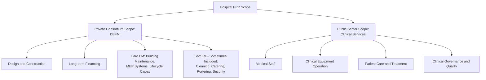

## Hospital and Healthcare Facility PPPs


### Overview and Definition

Hospital and Healthcare Facility PPPs are arrangements in which a private consortium finances, designs, builds, and maintains (and in some models, partially operates) a healthcare facility over a long-term contract, in exchange for periodic payments from a public health authority. This subsector is a leading example of **social infrastructure PPPs** and is structurally distinct from the economic infrastructure PPPs (energy, water, transport) covered elsewhere in this program, primarily because the revenue mechanism is typically an **availability payment** from government rather than a user-charge or commodity-sale mechanism, and because clinical service delivery is almost universally retained by the public sector.

**Key Points**

- The dominant international model is **DBFM(O)** — Design, Build, Finance, Maintain (Operate) — where the private party is responsible for the physical asset (the building, its systems, and often "soft" facilities management services) while clinical services (doctors, nurses, medical equipment operation, patient care) remain with the public health authority or a separate public/private clinical operator.
- This "hard FM / soft FM vs. clinical services" split is the single most important conceptual distinction in hospital PPPs and is discussed in detail below, since almost all subsequent risk allocation, payment mechanism, and controversy discussion in this subsector traces back to where that boundary is drawn.
- Hospital PPPs share close structural kinship with other availability-based social infrastructure PPPs (schools, prisons, government buildings) more than with economic infrastructure PPPs; the payment mechanism, risk allocation logic, and typical controversies (discussed below) are best understood by contrast with the demand/commodity-based models covered in the Energy and Water chapters.

### The Clinical/Non-Clinical Service Boundary



**Key Points**

- **Hard Facilities Management (Hard FM)** covers the physical building fabric, mechanical/electrical/plumbing (MEP) systems, medical gas infrastructure, HVAC, and lifecycle replacement of building components — this is almost universally within private consortium scope in mature hospital PPP models.
- **Soft Facilities Management (Soft FM)** — cleaning, catering, laundry, portering, security, waste management — is more variably allocated: some programs include it within the private consortium's scope (bundled FM), while others retain it with the public health authority or contract it separately, a design choice with significant implications for both risk allocation and, as discussed below, political controversy.
- **Clinical services are essentially never included** in mainstream hospital PPP/DBFM models internationally; the private party is not responsible for the quality, staffing, or delivery of medical care itself, which is the critical distinguishing feature separating hospital PPPs from a hypothetical (and rarely implemented) "privatized hospital operations" model.

### Core Structural Models

| Model | Private Scope | Payment Mechanism | Clinical Service Responsibility |
| --- | --- | --- | --- |
| DBFM (Design-Build-Finance-Maintain) | Design, build, finance, hard FM only | Availability payment | Public |
| DBFMO (Design-Build-Finance-Maintain-Operate) | Design, build, finance, hard FM + soft FM | Availability payment | Public |
| DB (Design-Build) / Turnkey Construction | Design and construction only, no long-term finance or maintenance | Fixed-price construction contract | Public |
| Alliance/Integrated Project Delivery | Collaborative risk-sharing design-construction model, distinct from long-term concession structures | Cost-plus/target-cost with shared savings | Public |
| Full Concession (rare in mature markets) | Broader scope potentially including some ancillary revenue-generating services | Availability payment + ancillary revenue | Public (clinical services essentially always excluded even here) |

**Key Points**

- DBFM and DBFMO are by far the dominant models internationally for major new hospital construction PPPs; the choice between them is primarily a question of whether soft FM services are bundled into the long-term private contract or retained/separately contracted by the public health authority.
- The "operate" in DBFMO refers to operating the **building and its non-clinical services**, not operating the hospital as a healthcare institution — a terminology point that is a frequent source of public confusion and is worth being explicit about in any communication regarding this model.

### Availability Payment Mechanism

Hospital PPPs are remunerated almost universally through a **unitary charge** or **availability payment**, structured to reward the private party for making the facility available to the required specification and performance standard, rather than for patient volumes or clinical activity (which the private party does not control).

$$\text{Unitary Charge} = \text{Base Availability Payment} - \text{Performance Deductions} + \text{Indexation Adjustment}$$

**Base Availability Payment**

A fixed periodic payment (monthly or quarterly) calculated to cover the SPV's debt service, equity return, and FM operating costs over the concession term (typically 25–35 years for major hospital DBFM contracts), set at financial close and escalated over time per an agreed indexation formula (commonly linked to a consumer or construction price index).

**Performance Deduction Mechanism**

The defining feature distinguishing availability-based social infrastructure PPPs from simple fixed-fee contracts: the unitary charge is reduced if the facility fails to meet contracted availability or performance standards, creating an ongoing financial incentive for consistent maintenance and service quality throughout the contract term rather than only at initial handover.

$$\text{Performance Deduction} = \sum_{i} (\text{Failure Points}_i \times \text{Deduction Rate}_i)$$

where failure events (e.g., an operating theatre unavailable due to a maintenance fault, a ward area failing a cleanliness audit, a critical system failure) are typically weighted by clinical/operational criticality — a failure affecting a critical care area or operating theatre attracts a substantially higher deduction than a failure in a non-critical administrative area.

**Example**

A hospital DBFM contract has a base monthly unitary charge of $2,400,000. During a given month, a ward's air handling unit fails for 18 hours (rated as a "Category B" failure attracting a deduction of $1,500 per hour beyond a 4-hour rectification grace period), and two soft FM cleanliness audit failures occur in non-critical areas (rated at $800 per failure).

$$\text{Deduction} = (18 - 4) \times \$1{,}500 + 2 \times \$800 = 14 \times \$1{,}500 + \$1{,}600 = \$21{,}000 + \$1{,}600 = \$22{,}600$$


$$\text{Adjusted Unitary Charge} = \$2{,}400{,}000 - \$22{,}600 = \$2{,}377{,}400$$

This illustrates the core mechanism: financial consequences are calibrated to the operational/clinical criticality of the failure, and grace periods before deductions apply are standard, reflecting that minor, promptly-rectified faults should not trigger the same penalty as prolonged or clinically significant failures. [Inference: specific deduction rates, weighting categories, and grace period lengths are contract-specific design choices, and the figures above are illustrative rather than representative of any standard universal schedule.]

### Contractual Architecture

```mermaid
flowchart TD
    S[Equity Sponsors] -->|Equity| SPV[Project SPV]
    L[Lenders / Bond Investors] -->|Senior Debt| SPV
    SPV -->|Design-Build Contract| DB[Design-Build Contractor]
    SPV -->|Hard FM Contract| HFM[Hard FM Subcontractor]
    SPV -->|Soft FM Contract - if bundled| SFM[Soft FM Subcontractor]
    HA[Public Health Authority] -->|DBFM(O) Agreement| SPV
    SPV -->|Availability Payment / Unitary Charge| HA2[Payment Flow]
    HA2 -.->|Payment from| HA
    CLIN[Clinical Staff and Services -<br/>Separate Public Employment/Contract] -.->|Operates within| SPV
    REG[Health Sector Regulator] -->|Clinical Quality Oversight - Public Domain| CLIN
```

**Key Points**

- The clinical staff and services box is shown with a dashed relationship to the SPV because clinical operations occur physically within the SPV-provided building but are contractually and organizationally entirely separate — the SPV has no authority over, and bears no responsibility for, clinical governance, which remains subject to standard public health sector regulatory oversight rather than PPP contract terms.
- The interface between the SPV's hard/soft FM responsibilities and the public health authority's clinical operations requires a detailed **interface agreement or protocol** specifying, for example, who is responsible for medical equipment maintenance (often split between building-integrated systems like medical gas pipelines, which are SPV responsibility, and portable clinical equipment, which is not) — this interface definition is a frequent source of contractual disputes if not drafted with precision.

### Risk Allocation Matrix

| Risk Category | Typically Borne By | Mitigation Mechanism |
| --- | --- | --- |
| Design and construction cost overrun | SPV/Design-Build Contractor | Fixed-price contract with liquidated damages |
| Construction delay | SPV/Design-Build Contractor | Liquidated damages, milestone-linked financing drawdown |
| Building availability/maintenance performance | SPV (Hard FM) | Performance deduction mechanism |
| Soft FM service quality (if bundled) | SPV (Soft FM) | Performance deduction mechanism |
| Clinical service quality and patient outcomes | Public Health Authority | Outside PPP contract scope entirely |
| Patient volume/demand | Public (availability payment is volume-independent) | Not a factor in payment; a defining feature of this model |
| Interest rate risk | SPV, typically hedged | Fixed-rate financing or interest rate swaps at financial close |
| Inflation/indexation risk | Shared via indexation formula | Base payment indexed to agreed price index |
| Technology/clinical obsolescence (e.g., changing medical technology requiring building reconfiguration) | Varies; often a source of contract variation/dispute | Change/variation mechanisms defined in contract |
| Handback condition | SPV | Lifecycle costing obligations, handback condition surveys |

**Key Points**

- **Demand/patient volume risk is explicitly not transferred to the private party** under the standard availability payment model — this is one of the most consistently emphasized features distinguishing hospital PPPs from economic infrastructure PPPs with user-charge or take-or-pay mechanisms, and reflects the policy judgment that private parties should not have a financial incentive tied to patient volumes (which could create perverse incentives around clinical decision-making if payment were volume-linked).
- **Clinical/medical technology obsolescence** is a genuinely difficult risk allocation area: hospital buildings must accommodate evolving medical technology and clinical practice over a 25–35 year contract term, and rigid, narrowly specified DBFM contracts have in various instances faced criticism for insufficient flexibility to accommodate legitimate clinical service reconfiguration needs over the contract's long duration. [Inference: this is a recognized structural challenge discussed in hospital PPP and social infrastructure literature; the extent to which any specific contract successfully addresses it is case-specific.]

### Financing Structure

Hospital DBFM projects are typically financed with debt-to-equity ratios in a similar range to other availability-based social infrastructure PPPs (commonly cited around 85:15 to 90:10) [Inference: gearing ratios are transaction- and market-specific, reflecting the relatively low-risk, government-availability-payment-backed cash flow profile, which generally supports higher gearing than commodity-sale or demand-risk PPP structures], given the absence of demand risk and the strong counterparty credit typically associated with government/public health authority off-takers.

$$DSCR = \frac{CFADS}{DS}$$

**Key Points**

- Because the availability payment is largely predictable (subject only to performance deduction risk, which a competent operator should be able to manage within a modest band), hospital PPPs generally support higher leverage and lower required equity returns than demand-risk infrastructure PPPs, reflecting their lower fundamental risk profile once construction is complete.
- Financing structures increasingly incorporate long-term fixed-rate debt or interest rate hedging at financial close, given the very long contract tenors typical of this subsector, to avoid interest rate risk undermining the fixed unitary charge calculation that was set at the outset.

### Value-for-Money and Lifecycle Cost Rationale

The principal economic rationale for the DBFM model in hospital infrastructure, beyond simply accessing private finance, centers on **lifecycle cost integration**: because the same private party is responsible for both initial construction quality and long-term maintenance performance (with financial consequences via the unitary charge mechanism), the model is intended to incentivize construction choices that minimize whole-life cost, rather than construction choices that minimize only upfront capital cost at the expense of higher long-term maintenance burden.

$$\text{Whole-Life Cost} = \text{Capital Cost} + \sum_{t=1}^{n} \frac{\text{Maintenance/FM Cost}_t}{(1+r)^t}$$

**Key Points**

- This lifecycle cost integration logic is one of the most frequently cited theoretical advantages of the DBFM model relative to traditional public procurement (where a government might separately contract construction and later, separately, maintenance, creating a potential incentive for the construction contractor to minimize upfront cost without full accountability for downstream maintenance implications).
- Whether this theoretical advantage is realized in practice in any specific project depends on contract design quality (particularly whether performance deduction mechanisms are calibrated to genuinely incentivize good lifecycle asset management) and is a subject of ongoing empirical Value-for-Money assessment practice, discussed further under dedicated Value-for-Money methodology topics.

### Common Controversies and Criticisms

**1. Cost of Private Finance vs. Public Borrowing**

A recurring critique of hospital DBFM/PFI-style models is that the cost of private finance (reflecting equity returns and commercial lending margins) is generally higher than the government's own sovereign borrowing cost, raising the question of whether the lifecycle cost and risk transfer benefits of the DBFM model outweigh this financing cost premium — a genuinely contested empirical and methodological question addressed through Value-for-Money analysis, which compares the DBFM option against a hypothetical "Public Sector Comparator." [This reflects a recognized and actively debated critique in the social infrastructure PPP literature rather than a settled empirical conclusion; assessments of net value-for-money vary by project and by the methodology and assumptions used in the comparison.]

**2. Soft FM Service Quality and Staffing Conditions**

Where soft FM services (cleaning, catering, portering) are bundled into the private contract, this has in various instances been a focus of public and labor-relations controversy, including concerns about service quality, staffing levels, and terms of employment for staff transferred to or employed by the private FM provider, compared to equivalent public-sector employment. [Inference: this is a recognized area of debate and, in some documented instances, industrial dispute in the hospital PPP sector, though outcomes and the merits of specific claims vary by project and jurisdiction and are not generalizable to all bundled-FM contracts.]

**3. Contractual Rigidity and Change Costs**

Given the highly detailed, long-term nature of DBFM contracts, subsequent changes to clinical service configuration (e.g., converting a ward for a different clinical use, adding new equipment requiring building modification) often require formal contract variations, which can involve additional cost and negotiation compared to a scenario where the public sector retained direct control over the building — a structural trade-off inherent to the risk-transfer logic of the model rather than necessarily a design flaw. [Inference: whether this represents a net cost or an acceptable trade-off for the risk transfer and discipline benefits of the model is a contested assessment question dependent on specific project experience.]

**4. Long-Term Fiscal Commitment Visibility**

As with other long-term availability-payment PPPs, hospital DBFM unitary charge commitments represent multi-decade fiscal obligations that some public finance analysts argue warrant careful comparison against direct public capital investment and associated fiscal risk disclosure practices, an analytical concern conceptually related to the contingent liability and fiscal risk assessment themes discussed in the Energy and Power Sector chapter, though hospital availability payments are typically a firm (non-contingent) rather than contingent liability, differing in this respect from take-or-pay energy contracts. [Inference: this reflects an active area of public finance methodology and debate rather than a single settled position on appropriate fiscal treatment.]

### Comparative Table: Hospital PPP vs. Economic Infrastructure PPP

| Feature | Hospital DBFM(O) | IPP/PPA (Energy) | Toll Concession (Transport) |
| --- | --- | --- | --- |
| Revenue mechanism | Government availability payment | Off-taker tariff payment | User tolls or shadow tolls |
| Demand risk | None (availability-based) | Take-or-pay mitigated | Often retained by concessionaire |
| Core service delivery | Retained by public sector (clinical) | N/A (commodity sale) | Sometimes includes O&M by concessionaire |
| Typical gearing | High (85:15–90:10) | Moderate (70:30–80:20) | Variable, often lower given demand risk |
| Primary private value-add | Construction/lifecycle cost discipline, FM performance | Generation technology/construction/O&M efficiency | Construction efficiency, sometimes O&M |
| Core controversy theme | Financing cost vs. public borrowing, soft FM conditions | Fiscal risk from take-or-pay, tariff pass-through | Tariff levels, demand forecast disputes |

### Related Topics

- Value-for-Money Analysis and Public Sector Comparator Methodology
- Availability-Based Payment Mechanisms in Social Infrastructure PPPs
- School and Educational Facility PPPs (Comparative DBFM Structures)
- Fiscal Risk Disclosure and Long-Term Government Payment Commitments
- Facilities Management Contracting: Hard FM vs. Soft FM Risk Allocation
- Lifecycle Costing and Whole-Life Asset Management in PPP Design
- Labor Relations and Employment Conditions in Bundled FM Contracts
- Clinical Governance and Public Health Regulatory Oversight Frameworks
- Interface Agreements Between Private Building Operators and Public Service Providers
- Contract Variation Mechanisms for Long-Term Social Infrastructure PPPs