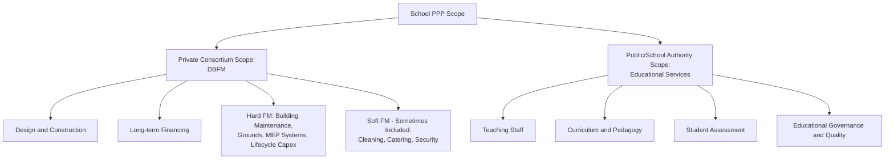

## School and Education Infrastructure PPPs


### Overview and Definition

School and Education Infrastructure PPPs are arrangements in which a private consortium finances, designs, builds, and maintains educational facilities (primary/secondary schools, vocational training centers, university buildings) over a long-term contract, receiving periodic payments from a public education authority. As with hospital PPPs (covered elsewhere in this chapter), this subsector follows the availability-payment social infrastructure model, with the same fundamental separation between private-sector responsibility for the physical asset and public-sector responsibility for the core service — in this case, teaching and educational service delivery rather than clinical care.

**Key Points**

- The dominant structural model is **DBFM(O)** — Design, Build, Finance, Maintain (Operate) — closely paralleling the hospital PPP model, with private scope covering the building and its non-educational support services, while curriculum, teaching staff, and educational governance remain entirely with the public education authority or school administration.
- Education infrastructure PPPs are frequently procured as **bundled, multi-school programs** rather than single-asset transactions — a structural feature more prominent in this subsector than in hospital PPPs, reflecting the more standardized and replicable design requirements of schools compared to the highly bespoke, clinically-driven design requirements of hospitals.
- The "teaching/non-teaching service boundary" is the central conceptual anchor for this subsector, analogous to the clinical/non-clinical boundary in hospital PPPs, and nearly all subsequent risk allocation and controversy discussion traces back to how and where that boundary is drawn.

### The Teaching/Non-Teaching Service Boundary



**Key Points**

- As with hospital PPPs, **hard FM** (building fabric, MEP systems, grounds maintenance, lifecycle component replacement) is almost universally within private consortium scope, while **soft FM** (cleaning, catering, security, sometimes ICT infrastructure support) is more variably allocated depending on the specific program design.
- **Teaching and educational content delivery are essentially never included** in mainstream school DBFM models — this is the critical distinguishing feature that separates infrastructure PPPs from the conceptually distinct (and more controversial, discussed below) category of "education management organizations" or charter/academy school operators, which is a different policy question entirely from infrastructure procurement.
- ICT infrastructure (networks, hardware provision, digital learning platforms) occupies an increasingly ambiguous middle ground in modern school PPP design: the physical network and hardware may fall within private scope, while the digital curriculum content and its pedagogical use remain an educational (public) matter — this boundary requires increasingly careful contractual definition as digital learning tools become more central to education delivery. [Inference: this reflects an evolving area of contract design practice rather than a single settled international standard for where the ICT boundary should sit.]

### Core Structural Models

| Model | Private Scope | Payment Mechanism | Educational Service Responsibility |
| --- | --- | --- | --- |
| DBFM (Design-Build-Finance-Maintain) | Design, build, finance, hard FM only | Availability payment | Public |
| DBFMO (Design-Build-Finance-Maintain-Operate) | Design, build, finance, hard FM + soft FM | Availability payment | Public |
| Bundled Multi-School Program | Multiple schools financed and delivered as a single portfolio contract | Aggregate availability payment across portfolio | Public |
| DB (Design-Build) / Turnkey | Design and construction only | Fixed-price construction contract | Public |
| Community/Charter School Facility Lease | Private developer builds facility, leases to an independent (often not-for-profit) school operator | Lease payment, distinct from availability-payment DBFM | Independent school operator (not the facility PPP party) |

**Key Points**

- **Bundled multi-school programs** are a distinctive feature of this subsector: because school buildings share more standardized design requirements than hospitals (which vary enormously by clinical specialty and scale), governments have frequently procured portfolios of schools (sometimes dozens within a single program) under a single financing and delivery structure, achieving economies of scale in both construction (standardized or modular designs) and transaction costs (a single procurement process rather than dozens of separate ones).
- The **Community/Charter School Facility Lease** model is conceptually and legally distinct from standard DBFM: here the PPP relates purely to the physical facility, which is then leased to a separate, often independently governed school operator, rather than the private consortium contracting directly with a central government education authority for an availability payment tied to a public school's operation.

### Availability Payment Mechanism

Analogous to the hospital PPP unitary charge, school DBFM contracts are remunerated through a periodic availability payment reduced by performance deductions for failures against contracted service standards:

$$\text{Unitary Charge} = \text{Base Availability Payment} - \text{Performance Deductions} + \text{Indexation Adjustment}$$

**Performance Deduction Categories Specific to Schools**

While the general mechanism mirrors hospital PPPs, the specific failure categories and their weighting reflect the school operating environment rather than a clinical one:

| Failure Category | Example | Relative Weighting Logic |
| --- | --- | --- |
| Classroom/teaching space unavailability | Heating failure making a classroom unusable | High — directly disrupts core educational activity |
| Safety-critical system failure | Fire alarm system fault, security system failure | High — child safety is a paramount concern |
| Soft FM standard failure (if bundled) | Catering service quality shortfall, cleanliness audit failure | Moderate |
| Non-critical administrative area failure | Staff room facility issue | Lower |
| Sports/recreational facility unavailability | Playing field or gymnasium unavailable | Moderate, may vary by contractual weighting of extracurricular provision |

**Example**

A bundled multi-school DBFM contract covering 12 schools has an aggregate base monthly unitary charge of $1,800,000. During the month, School 4 experiences a heating system failure affecting 3 classrooms for 30 hours beyond the contracted rectification period (rated at $120 per classroom-hour), and School 9 fails a soft FM cleanliness audit (rated at $600 per failure).

$$\text{Deduction} = (3 \times 30 \times \$120) + \$600 = \$10{,}800 + \$600 = \$11{,}400$$


$$\text{Adjusted Unitary Charge} = \$1{,}800{,}000 - \$11{,}400 = \$1{,}788{,}600$$

This illustrates how deductions in a bundled program are calculated and aggregated across the portfolio, with individual school-level performance issues affecting the overall payment to the single SPV responsible for the entire program. [Inference: specific deduction rates, categories, and portfolio aggregation mechanics are program-specific design choices, illustrative rather than representing a universal standard schedule.]

### Contractual Architecture: Bundled Program Structure

```mermaid
flowchart TD
    S[Equity Sponsors] -->|Equity| SPV[Project SPV<br/>Multi-School Portfolio]
    L[Lenders / Bond Investors] -->|Senior Debt| SPV
    SPV -->|Design-Build Contract| DB[Design-Build Contractor]
    SPV -->|Hard FM Contract| HFM[Hard FM Subcontractor]
    SPV -->|Soft FM Contract - if bundled| SFM[Soft FM Subcontractor]
    EDU[Education Authority / Ministry] -->|DBFM(O) Agreement| SPV
    SPV -->|Aggregate Availability Payment| EDU
    SCH1[School 1 Administration] -.->|Operates within| SPV
    SCH2[School 2 Administration] -.->|Operates within| SPV
    SCHN[School N Administration] -.->|Operates within| SPV
```

**Key Points**

- The dashed relationships between individual school administrations and the SPV reflect the same principle as in hospital PPPs: educational governance and delivery occur physically within SPV-provided buildings but remain organizationally and contractually separate from the SPV's facilities-focused scope.
- A bundled program structure introduces a **portfolio risk diversification benefit** not present in single-asset hospital PPPs: a construction delay or performance issue at one school within a 12-school portfolio has a proportionally smaller impact on the SPV's overall cash flow than an equivalent issue would have on a single-asset project, which can support more favorable financing terms for genuinely diversified multi-school programs. [Inference: the magnitude of this diversification benefit depends on the specific portfolio's construction and operational correlation structure, and is a general financial-structuring principle rather than a guaranteed outcome for every bundled program.]

### Risk Allocation Matrix

| Risk Category | Typically Borne By | Mitigation Mechanism |
| --- | --- | --- |
| Design and construction cost overrun | SPV/Design-Build Contractor | Fixed-price contract with liquidated damages |
| Construction delay (single school within portfolio) | SPV | Liquidated damages; portfolio structure limits aggregate impact |
| Building availability/maintenance performance | SPV (Hard FM) | Performance deduction mechanism |
| Soft FM service quality (if bundled) | SPV (Soft FM) | Performance deduction mechanism |
| Educational quality and student outcomes | Public Education Authority | Outside PPP contract scope entirely |
| Student enrollment/demand | Public (availability payment is enrollment-independent in most models) | Not a factor in payment; a defining feature of this model |
| Inflation/indexation risk | Shared via indexation formula | Base payment indexed to agreed price index |
| Changing pedagogical/space requirements (e.g., shift toward different classroom configurations, digital learning space needs) | Varies; often a source of contract variation | Change/variation mechanisms, design flexibility provisions |
| Demographic shift risk (population changes affecting school capacity needs over 25+ year contract) | Often a genuinely difficult allocation question | Long-term demographic forecasting at design stage; contract flexibility provisions |
| Handback condition | SPV | Lifecycle costing obligations, handback condition surveys |

**Key Points**

- **Demographic shift risk** is a distinctive and genuinely challenging risk category in education infrastructure PPPs without a close hospital-sector analogue at the same scale: population and demographic patterns can shift meaningfully over a 25+ year contract term (e.g., a neighborhood's school-age population declining or growing substantially), creating a risk that a facility sized and located based on original demand projections becomes significantly mismatched to actual need well before the contract concludes. [Inference: while demographic risk exists in principle for any long-term social infrastructure asset, its practical significance is highly context- and location-specific, depending on local demographic trends over the contract period.]
- **Changing pedagogical requirements** (e.g., a shift toward more collaborative/flexible classroom layouts, increased need for specialized STEM or vocational training spaces, changing digital learning infrastructure needs) represent an evolving-requirements risk conceptually similar to the medical technology obsolescence risk discussed in Hospital and Healthcare Facility PPPs, requiring similar contractual flexibility mechanisms to avoid rigid, narrowly-specified contracts becoming a constraint on legitimate educational evolution over a multi-decade term.

### Design Standardization and Modular Construction

A distinctive feature of many school PPP programs, particularly bundled multi-school procurements, is the use of **standardized or modular design templates** applied with limited site-specific variation across the portfolio.

**Comparative Table: Standardized vs. Bespoke Design Approaches**

| Approach | Advantage | Limitation |
| --- | --- | --- |
| Standardized/modular design | Lower design cost, faster construction, proven design reduces technical risk, easier cost benchmarking across the portfolio | Limited responsiveness to site-specific context, community preferences, or specialized pedagogical approaches |
| Bespoke design per site | Tailored to specific site conditions, community context, and educational program needs | Higher design cost and time, less benchmarking comparability across a portfolio, potentially higher technical/construction risk per site |
| Hybrid (standardized core with site-specific adaptation) | Balances efficiency benefits of standardization with some contextual responsiveness | Requires more sophisticated design management than pure standardization |

**Key Points**

- The choice between standardized and bespoke design approaches is a significant factor in bundled school PPP procurement cost-effectiveness, and many mature programs have moved toward hybrid approaches — a standardized structural/systems core with defined parameters for site-specific adaptation (orientation, minor layout adjustments, community-specific facility additions). [Inference: this represents an observed trend in school PPP design practice rather than a claim that any specific approach is universally superior across all contexts.]
- Standardization also facilitates more robust lifecycle maintenance cost forecasting (a key input to the whole-life cost model discussed under Hospital and Healthcare Facility PPPs), since maintenance requirements and component replacement schedules are more predictable and comparable across a portfolio of near-identical buildings than across bespoke, unique facilities.

### Financing Structure

School DBFM programs share the general financing characteristics of availability-based social infrastructure PPPs discussed under Hospital and Healthcare Facility PPPs: relatively high gearing (commonly cited in a similar 85:15–90:10 range) [Inference: gearing ratios are transaction- and market-specific] given the absence of demand risk in the payment mechanism and the typically strong credit standing of the public education authority as off-taker.

$$DSCR = \frac{CFADS}{DS}$$

**Key Points**

- Bundled multi-school programs can, in some cases, achieve financing efficiencies (economies of scale in transaction costs, portfolio diversification benefits as noted above) not available to single-school transactions, though realizing these efficiencies requires sufficient program scale and standardization to justify the more complex portfolio financing structure. [Inference: this is a general financial-structuring principle; the specific efficiency gains realized depend on program-specific scale, standardization, and market conditions.]
- As with hospital PPPs, the largely predictable, demand-independent nature of the availability payment (subject only to performance deduction risk) generally supports lower required equity returns than demand-risk infrastructure PPPs.

### Common Controversies and Criticisms

**1. Cost of Private Finance vs. Public Borrowing**

As with hospital PPPs, a recurring critique centers on whether the DBFM model's private financing cost premium (relative to sovereign borrowing) is justified by the lifecycle cost discipline and risk transfer benefits claimed for the model — assessed through Value-for-Money analysis comparing the DBFM option against a Public Sector Comparator. [This reflects an actively debated critique rather than a settled empirical conclusion; specific project-level assessments vary.]

**2. Design Rigidity and Reduced Community/Pedagogical Input**

Standardized design approaches, while offering cost and delivery efficiencies, have in various instances drawn criticism for insufficiently accommodating community-specific needs, unique pedagogical approaches, or architectural/place-based considerations that a bespoke public procurement process might more readily incorporate. [Inference: this represents a documented tension in school PPP design literature and public debate rather than a universal outcome of every standardized program.]

**3. Confusion with Broader Education Privatization Debates**

School infrastructure PPPs (DBFM building procurement) are conceptually and legally distinct from debates about **for-profit school operation**, charter/academy school models, or private management of educational service delivery — but public discourse frequently conflates these genuinely separate policy questions, since both involve "private sector" and "schools" in the same sentence despite addressing entirely different aspects of education provision (buildings vs. teaching/curriculum/governance). This conflation is a significant source of public and political confusion specific to this subsector, distinct from the more straightforwardly infrastructure-focused controversies seen in hospital PPPs. [This is a factual observation about a common conflation in public discourse, not a normative claim about the merits of either infrastructure PPPs or education service privatization models, which are separate and independently contested policy questions.]

**4. Long-Term Fiscal Commitment and Demographic Mismatch Risk**

As with hospital PPPs, multi-decade unitary charge commitments represent long-term fiscal obligations; in the education context, this is compounded by the demographic shift risk noted above, since a fixed, long-term payment commitment to a facility that becomes significantly oversized or undersized relative to actual future enrollment represents a distinctive value-for-money risk not present to the same degree in most hospital contexts (where clinical service demand patterns, while evolving, are generally less subject to the specific demographic volatility that can affect localized school-age population). [Inference: this comparative framing reflects the specific character of demographic versus clinical demand risk rather than a claim that one sector's overall fiscal risk is categorically greater than the other's.]

### Comparative Table: School PPP vs. Hospital PPP

| Feature | School DBFM(O) | Hospital DBFM(O) |
| --- | --- | --- |
| Core service boundary | Teaching/curriculum (public) vs. building/FM (private) | Clinical care (public) vs. building/FM (private) |
| Typical procurement structure | Frequently bundled multi-asset portfolios | More often single large-asset transactions |
| Design approach | Standardized/modular common | Highly bespoke, clinically-driven design |
| Distinctive long-term risk | Demographic shift affecting enrollment/capacity match | Medical technology and clinical practice evolution |
| Common public conflation | Confused with education service privatization (charter/academy debates) | Generally less conflated with clinical service privatization debates |
| Portfolio diversification potential | High (multi-school bundling) | Lower (typically single-asset) |

### Related Topics

- Hospital and Healthcare Facility PPPs (Comparative DBFM Structures)
- Value-for-Money Analysis and Public Sector Comparator Methodology
- Availability-Based Payment Mechanisms in Social Infrastructure PPPs
- Facilities Management Contracting: Hard FM vs. Soft FM Risk Allocation
- Bundled and Portfolio PPP Procurement Strategies
- Demographic Forecasting and Long-Term Social Infrastructure Capacity Planning
- Standardized and Modular Design Approaches in Public Infrastructure
- Lifecycle Costing and Whole-Life Asset Management in PPP Design
- Charter School and Education Service Delivery Models (Distinct from Infrastructure PPPs)
- Contract Variation Mechanisms for Long-Term Social Infrastructure PPPs