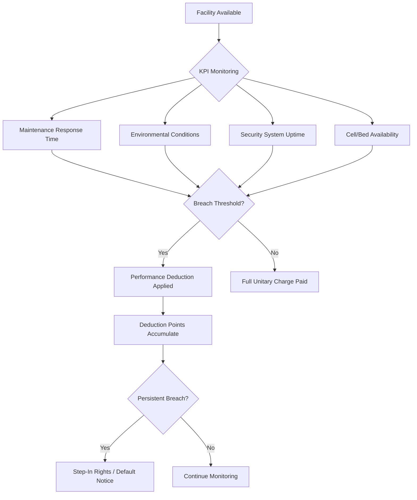

## Correctional Facility and Justice Sector PPPs

### Overview and Sector Definition

Correctional facility and justice sector PPPs involve private-sector participation in the financing, design, construction, and/or operation of prisons, detention centers, courthouses, and related justice infrastructure. This sub-sector of social infrastructure PPPs is distinguished by unusually high political sensitivity, constitutional constraints on privatization of core state functions, and a bifurcated delivery model that separates "hard" infrastructure services from "soft" custodial and rehabilitative functions.

Two structurally different models dominate global practice:

- **DBFM/DBFO correctional facilities** ("design-build-finance-maintain/operate"): the private partner finances and maintains the physical asset, but the state retains custody, security, and rehabilitative operations (the dominant continental European and increasingly the standard US model)
- **Fully privatized corrections** ("management and operations" or "M&O" contracts): a private operator manages day-to-day custody and security under contract, common historically in the US and Australia but in retreat in several jurisdictions

### Core Rationale for PPP Structuring

**Key Points**

- Corrections facilities have predictable, government-guaranteed revenue streams (availability payments tied to bed capacity), making them attractive to infrastructure investors despite social controversy
- Justice infrastructure suffers chronically from public capital budget competition — courts and prisons rank low against health and education in capital allocation, creating a backlog PPPs are used to clear
- Facility specifications (perimeter security, cell block design, HVAC redundancy, life-safety systems) are highly standardized, enabling repeatable design templates that lower transaction costs across a pipeline of facilities
- Long asset life (30-60 years) aligns with typical PPP concession tenors of 25-30 years

### Delivery Models Compared

#### Design-Build-Finance-Maintain (DBFM)

Under DBFM, the private consortium's obligations are strictly confined to the building envelope and non-custodial services:

- Facilities management (catering, laundry, cleaning, maintenance, grounds)
- Utilities and lifecycle capital replacement
- IT infrastructure and security hardware (cameras, locks, perimeter sensors) — though *operation* of that hardware for custodial purposes typically remains with the state

The state retains all "sovereign functions": use of force, classification of inmates, discipline, sentence administration, and armed perimeter security. This model has become the near-universal default in the UK (post-1990s), the Netherlands, France (the "Programme 13000" and successors), and most Canadian provinces, precisely because it avoids delegating coercive state power to a private entity.

#### Management and Operations (M&O) / Full Privatization

Under M&O contracts, a private operator (historically firms such as CoreCivic and GEO Group in the US) runs the entire facility including custody and security staffing, subject to a management contract with the corrections department. Revenue is typically a per-diem rate per inmate-day, which creates a structurally different incentive profile than availability-based DBFM payments.

**[Inference]** The per-diem model has been widely criticized for creating occupancy-dependent revenue incentives that some analysts argue conflict with decarceration policy goals; this is a contested normative claim rather than an established technical fact, though the structural incentive itself (revenue scaling with population) is a documented feature of per-diem contracts.

#### Hybrid Models

Some jurisdictions split services: private DBFM for the physical facility plus a separate private operations contract for non-sovereign services (education, vocational training, healthcare, reentry programming) while custody remains public. Australia's state-based prison PPPs (Victoria, Queensland, New South Wales) have used variants of both full privatization and hybrid structures over time, with several jurisdictions later renationalizing operations while retaining private-financed assets.

### Payment Mechanism Structuring

#### Availability Payments (DBFM Standard)

The unitary charge in a corrections DBFM deal is typically structured as:

$$UC_t = AP_t \times (1 - D_t) - PD_t$$

Where:

- $AP_t$ = base availability payment in period $t$
- $D_t$ = deduction factor for unavailable capacity (cells out of service)
- $PD_t$ = performance deductions for failed KPIs (maintenance response times, temperature control, hot water availability)

Unlike toll roads or hospitals with patient-volume risk, correctional facility availability payments are deliberately insulated from occupancy — the government pays for *capacity provided*, not *beds filled*, which is a key design choice contrasted against per-diem M&O contracts. This distinction is often the central point emphasized by governments defending DBFM procurement against privatization critiques.

#### Per-Diem / Per-Capita Payments (M&O Standard)

$$R = \sum_{i=1}^{n} (r_i \times d_i)$$

Where $r_i$ is the contracted per-diem rate for inmate classification tier $i$ and $d_i$ is inmate-days in that tier. Contracts commonly include minimum guaranteed occupancy clauses (e.g., 90-95% "take-or-pay" population guarantees), which have drawn significant policy criticism as creating fiscal exposure for government if crime/incarceration rates fall below contracted thresholds.

### Risk Allocation Matrix

| Risk Category | DBFM Allocation | M&O Allocation |
| --- | --- | --- |
| Design/construction | Private | Private (if also financier) or Public |
| Lifecycle/maintenance | Private | Mixed |
| Custody/security incidents | Public | Private (operator liability, often capped) |
| Occupancy/demand | Public | Shared (via take-or-pay minimums) |
| Litigation from inmates (civil rights) | Public | Contested — often indemnified back to public in practice |
| Escape liability | Public (facility integrity only) | Private (operational failure) |
| Legislative/sentencing policy change | Public | Public |

**[Inference]** The allocation of civil-rights litigation risk in M&O contracts is jurisdiction-specific and often subject to litigation itself regarding whether private operators enjoy qualified immunity comparable to public officials; this remains a legally unsettled and evolving area rather than a fixed technical parameter.

### Constitutional and Legal Constraints

Several jurisdictions have found that delegating custodial authority to private entities raises constitutional issues distinct from other PPP sectors:

- Some legal systems treat the power of detention and use of force as an inherently non-delegable sovereign function (a doctrine of "essential state function"), which is the primary legal driver behind the European preference for DBFM-only structures
- Judicial oversight, sentencing, and courtroom functions are essentially never privatized in any jurisdiction; PPP structuring for courthouses is confined strictly to the building (design, financing, maintenance, security systems installation) with all judicial and administrative functions remaining public
- **[Unverified]** The precise constitutional basis varies significantly by country and legal tradition; readers should verify current case law and constitutional interpretation for any specific jurisdiction before relying on this as a fixed rule

### Courthouse PPPs — A Distinct Sub-Model

Courthouse PPPs are structurally closer to conventional social infrastructure (schools, hospitals) than to prison PPPs because there is no custodial ambiguity:

- Standard DBFM structure: private consortium designs, builds, finances, and maintains the courthouse building
- Availability payments tied to building performance KPIs: courtroom availability, security system uptime, HVAC/environmental control, ADA/accessibility compliance
- Judicial security (bailiffs, in-custody defendant transport, courtroom security screening) remains public
- Notable examples include batches of UK Crown Court and county court PFI projects, and various US county courthouse P3s procured under state P3 enabling statutes

### Facility Specification and Design Standards

Correctional facility design PPPs require specification annexes far more detailed than typical social infrastructure, covering:

- **Security classification tiers**: minimum, medium, maximum, and supermax specifications with differing perimeter, cell construction, and staff-to-inmate ratio requirements baked into the output specification
- **Life-safety redundancy**: fire suppression compatible with cell lockdown procedures, emergency power for perimeter lighting and electronic locks (N+1 or N+2 redundancy commonly mandated)
- **Anti-ligature and self-harm mitigation design**: increasingly mandated in output specifications following litigation and coronial inquiry findings in multiple jurisdictions
- **Technology integration**: biometric access control, cell-call systems, video visitation infrastructure — procured either as part of the DBFM capital scope or as a separate technology-refresh contract given faster obsolescence cycles than the building shell

### Performance Measurement Framework

### Political Economy and Contestation

Correctional PPPs face a distinctive intensity of political and civil-society opposition compared to other social infrastructure sub-sectors:

- Advocacy campaigns explicitly targeting "prison privatization" have influenced procurement policy in multiple jurisdictions, including outright bans on new private prison contracts at various points (e.g., certain US states and the brief 2016-2017 federal Bureau of Prisons phase-out memo, later reversed)
- The DBFM-only model is frequently the political compromise that allows social infrastructure financing benefits (capital risk transfer, faster delivery) while avoiding the "privatized custody" controversy
- ESG and responsible-investment screens increasingly exclude private prison operators and, in some cases, even DBFM lenders to correctional facilities, affecting the available lender/investor pool and pricing
- **[Speculation]** Some market analysts anticipate continued divestment pressure will push financing structures further toward public direct-financing or availability-only models even in jurisdictions that previously used full M&O privatization, though this trend's trajectory is not settled

### Worked Example: Simplified DBFM Correctional Facility

**Example**

A 1,200-bed medium-security facility is procured as a 27-year DBFM concession.

- Capital cost: $280 million
- Base annual availability payment: $34 million (calibrated to cover debt service, equity return, and lifecycle reserve)
- Performance deduction cap: 10% of annual unitary charge
- Deduction triggers: maintenance response >4 hours (minor), >24 hours (major); any unplanned loss of perimeter security system function

Annual payment under a moderate performance year with 2% deductions:

$$UC = \$34{,}000{,}000 \times (1 - 0.02) = \$33{,}320{,}000$$

Occupancy is irrelevant to this calculation — even at 60% or 100% capacity utilization, the unitary charge is unchanged, which is the defining structural feature distinguishing this from an M&O per-diem contract.

### Common Pitfalls in Structuring

- Underspecifying "sovereign function" boundaries in contract schedules, leading to disputes over whether the private FM contractor's staff can be present during security incidents
- Insufficient lifecycle reserve modeling for high-wear security hardware (locks, cameras) with shorter replacement cycles than the building shell — a mismatch between the 25-30 year concession term and 7-10 year technology refresh cycles
- Underestimating change-in-law risk from evolving detention standards (cell size minimums, mental health accommodation requirements) that can trigger costly variation orders mid-concession
- Reputational risk contagion to lenders and equity investors from unrelated incidents (deaths in custody, human rights findings) even under DBFM structures where the private party has no custodial role

**Next Steps**

- Availability Payment Mechanism Design and Deduction Regimes
- Change-in-Law and Compensation Event Provisions in Social Infrastructure PPPs
- Step-In Rights and Contract Termination in Sensitive-Sector PPPs
- ESG Screening and Its Impact on PPP Lender/Investor Pools
- Court Infrastructure PPPs vs. Judicial Independence Safeguards
- Comparative Case Study: UK Prison PFI vs. US Private Corrections M&O