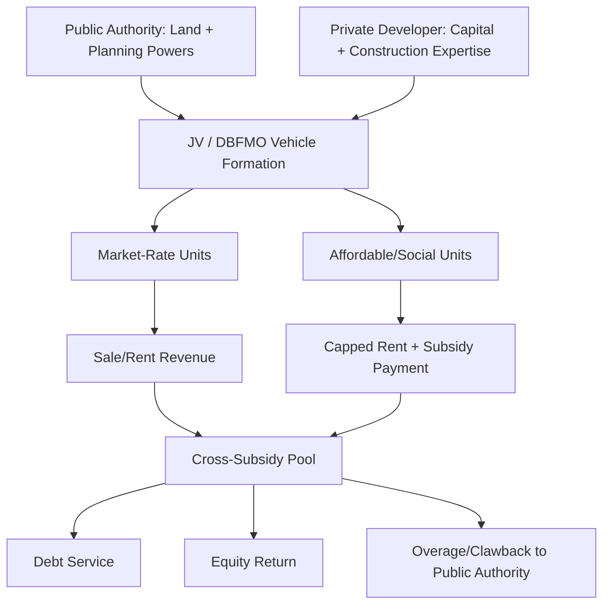

## Social Housing and Urban Regeneration PPPs

### Overview and Sector Scope

Social housing and urban regeneration PPPs cover private-sector participation in the financing, development, and management of affordable/subsidized housing, mixed-income residential development, and broader place-based regeneration schemes that combine housing with infrastructure, retail, and public realm improvements. This sub-sector differs structurally from other social infrastructure PPPs (schools, hospitals, prisons) in one crucial respect: the underlying asset can generate direct market-rate or near-market-rate revenue (rent, sale proceeds, commercial leasing), so pure availability-payment models are less common than in other social infrastructure categories, and demand-risk and mixed-revenue structures are far more prevalent.

### Core Rationale for PPP Structuring

**Key Points**

- Public housing authorities typically face severe capital constraints and aging stock requiring simultaneous new-build and retrofit investment, which annual government budgets cannot fund in a single cycle
- Regeneration schemes require patient, long-duration capital (20-40+ years) to capture value uplift from area transformation, aligning with private infrastructure investors' return horizons
- Land value capture is central to viability: public authorities often contribute land (rather than cash) as their equity-equivalent contribution, transferring density/planning risk to the private partner in exchange for below-market land cost
- Cross-subsidization models (market-rate units subsidizing affordable units) require sophisticated financial structuring only feasible with private development expertise and risk capital

### Delivery Models

#### Design-Build-Finance-Maintain-Operate (DBFMO) Social Housing

The private partner is responsible for the full lifecycle of a defined affordable housing portfolio:

- Design and construction to specified affordability mix (e.g., 30% social rent, 20% affordable rent, 50% market sale/rent)
- Financing structured against a blended revenue stream of public rent subsidies, tenant rent payments, and market unit sales/rents
- Long-term maintenance and, in some models, housing management/tenancy services
- Payment mechanism combines an availability-style component (for the subsidized units) with market revenue risk (for the market-rate component)

#### Mixed-Tenure Regeneration Joint Ventures

Common in large-scale estate regeneration, this model structures the public authority (often a local housing authority) and a private developer as joint venture partners rather than a pure procurer-contractor relationship:

- Public authority contributes land and existing housing stock (often via long leasehold or land value)
- Private partner contributes development finance, construction expertise, and takes market-sale risk
- Profit/uplift sharing mechanisms distribute returns once a hurdle rate is achieved, with the public partner typically receiving an increasing share above the hurdle ("overage" or "clawback" provisions)
- Decant and rehousing obligations for existing residents are typically retained as a distinct, heavily regulated public-sector-led workstream even within an otherwise private-led JV

#### Community Land Trust (CLT) and Hybrid Ownership Models

**[Inference]** CLTs and shared-equity models are increasingly integrated into larger PPP-enabled regeneration schemes as an affordability-preservation mechanism, though the degree to which a CLT arrangement constitutes a "PPP" in the strict procurement sense (versus a parallel affordable-housing delivery vehicle) varies by jurisdiction and is not a uniformly standardized classification.

- Land is held by a trust (public, quasi-public, or nonprofit) in perpetuity
- Housing units are sold or leased with restrictive covenants capping resale value, preserving long-term affordability
- Can be layered into a broader PPP regeneration scheme as the mechanism for the "affordable" tranche while market-rate parcels are delivered under conventional development agreements

#### Availability-Payment Social Housing (Institutional/Continental European Model)

In some jurisdictions, purpose-built social housing PPPs mirror the DBFM structure used for schools and hospitals more closely, particularly where housing is delivered for specific public-sector tenant populations (key worker housing, student housing tied to public universities, military/institutional housing):

$$UC_t = AP_t \times (1 - D_t) - PD_t$$

Where the availability payment $AP_t$ substitutes for market rent risk entirely, and deductions $D_t$ apply for units unavailable due to disrepair or failed maintenance KPIs — structurally identical to the corrections/hospital availability-payment mechanics but calibrated to residential-specific KPIs (heating, damp/mold remediation response time, communal area maintenance).

### Land Value Capture Mechanisms

Land value capture is the defining financial engineering challenge of urban regeneration PPPs, distinguishing this sub-sector from single-asset social infrastructure deals.

#### Tax Increment Financing (TIF)

$$TIF_t = (AV_t - AV_0) \times r$$

Where $AV_t$ is assessed property value in year $t$, $AV_0$ is the baseline assessed value at project inception, and $r$ is the applicable tax rate. The incremental tax revenue above baseline is ring-fenced to service debt issued to fund upfront infrastructure and public realm investment, without raising general tax rates.

#### Density Bonus / Planning Gain Exchange

Public authorities grant increased permitted density (additional floors, reduced parking minimums, use changes) in exchange for a negotiated affordable housing contribution, calculated typically as:

$$AH_{units} = \max\left(0, \; (GFA_{bonus} \times \rho) - AH_{baseline}\right)$$

Where $GFA_{bonus}$ is the additional gross floor area granted, $\rho$ is a jurisdiction-set affordable housing ratio, and $AH_{baseline}$ is any baseline requirement already met without the bonus. **[Inference]** The specific formula and ratio vary substantially by municipal planning code and are frequently subject to negotiated site-specific agreements rather than a single universal formula; the structure above illustrates the general mechanism rather than a codified standard.

#### Section 106 / Planning Obligations (UK-style) and Inclusionary Zoning (US-style)

Both mechanisms extract affordable housing contributions (in-kind units or cash-in-lieu payments) as a condition of planning/zoning approval, functioning as a quasi-PPP mechanism even outside formal procurement structures — the developer is not "procured" by government in the traditional PPP sense, but the negotiated obligation performs an equivalent risk-transfer and value-capture function.

### Risk Allocation Matrix

| Risk Category | DBFMO Social Housing | Mixed-Tenure JV | CLT/Hybrid |
| --- | --- | --- | --- |
| Construction cost/schedule | Private | Private | Private (market parcels) |
| Market sale/rent demand | Shared or Private | Private | Public/Trust (affordable parcels) |
| Land value/planning uplift | Public (via land contribution terms) | Shared (overage mechanism) | Public/Trust retains long-term |
| Tenant/resident decant and rehousing | Public | Public (often ring-fenced) | Public |
| Long-term affordability preservation | Contractual covenant | Contractual/legal covenant | Structural (trust ownership) |
| Interest rate/financing cost | Private | Private | Mixed |
| Political/community opposition | Shared | Shared | Shared |

### Community and Political Economy Considerations

Urban regeneration PPPs carry distinctive social risks beyond conventional PPP financial and construction risk:

- **Displacement and gentrification risk**: regeneration schemes that increase area desirability can raise surrounding rents and property taxes, displacing existing low-income residents even when the scheme itself includes affordable units — a documented pattern across many regeneration case studies, though the magnitude and causal attribution are debated among researchers
- **Resident consultation and "right to return"**: many jurisdictions now mandate resident ballots or consultation processes before estate regeneration proceeds, and guarantee existing social tenants a right to return to a new unit on equivalent terms — a critical contractual obligation often structured as a standalone workstream with its own risk allocation, since decant timelines rarely align cleanly with construction phasing
- **Community benefit agreements (CBAs)**: legally binding side-agreements between developers and community coalitions, negotiated outside the formal procurement contract but increasingly treated as a de facto condition of political and planning approval

### Financial Viability and the "Affordability Gap"

The core viability challenge in most social housing PPPs is a public-sector affordability requirement that private market economics cannot support unassisted:

$$Gap = C_{total} - (R_{market,NPV} + R_{subsidized,NPV})$$

Where $C_{total}$ is total development cost (NPV), $R_{market,NPV}$ is the present value of market-rate unit revenue, and $R_{subsidized,NPV}$ is the present value of subsidized-rent/sale revenue at capped affordability levels. This gap is closed through a combination of:

- Direct capital grant subsidy
- Land contributed at nil or below-market cost
- Cross-subsidy from a higher proportion of market units than the nominal affordability target might suggest
- Tax increment financing or other value-capture revenue streams
- Reduced planning obligations (density bonuses, parking minimum waivers) that lower per-unit cost

### Procurement and Structuring Diagram

### Worked Example: Mixed-Tenure Regeneration Viability

**Example**

A 500-unit regeneration scheme replaces 200 existing social housing units with 500 new units (200 social replacement + 100 affordable + 200 market).

- Total development cost: $150 million
- Market unit sale revenue (200 units, NPV): $95 million
- Affordable unit revenue at capped rent (100 units, NPV): $18 million
- Social replacement unit revenue at social rent (200 units, NPV): $22 million
- Total revenue: $135 million
- Funding gap: $150M - $135M = $15 million

This gap is closed via a $10 million public capital grant and a $5 million land value contribution (land transferred at below market value), illustrating the typical multi-source gap-funding structure rather than reliance on a single subsidy instrument.

### Common Pitfalls in Structuring

- Underestimating decant, temporary rehousing, and "right to return" logistics, which frequently become the critical path risk rather than construction itself
- Overreliance on market-unit sale velocity assumptions to fund cross-subsidy, leaving the affordable housing delivery exposed to housing market cyclicality
- Insufficiently defined long-term affordability covenants, allowing "affordable" units to convert to market rate after an initial restricted period shorter than community expectations
- Land value capture mechanisms (TIF, density bonuses) that are highly sensitive to municipal assessment practices and can underperform projections if broader area appreciation does not materialize as modeled
- Community benefit agreement commitments that are legally distinct from the core PPP contract, creating governance gaps if the CBA counterparty (a community coalition) lacks the capacity to enforce compliance

**Related Topics**

- Land Value Capture Instruments in Urban Infrastructure Finance
- Tax Increment Financing: Structuring and Bond Issuance Mechanics
- Resident Consultation, Decant, and Right-to-Return Frameworks
- Cross-Subsidy Modeling in Mixed-Tenure Development
- Community Benefit Agreements and Their Legal Enforceability
- Comparative Case Study: UK Estate Regeneration vs. US HOPE VI/Choice Neighborhoods Models