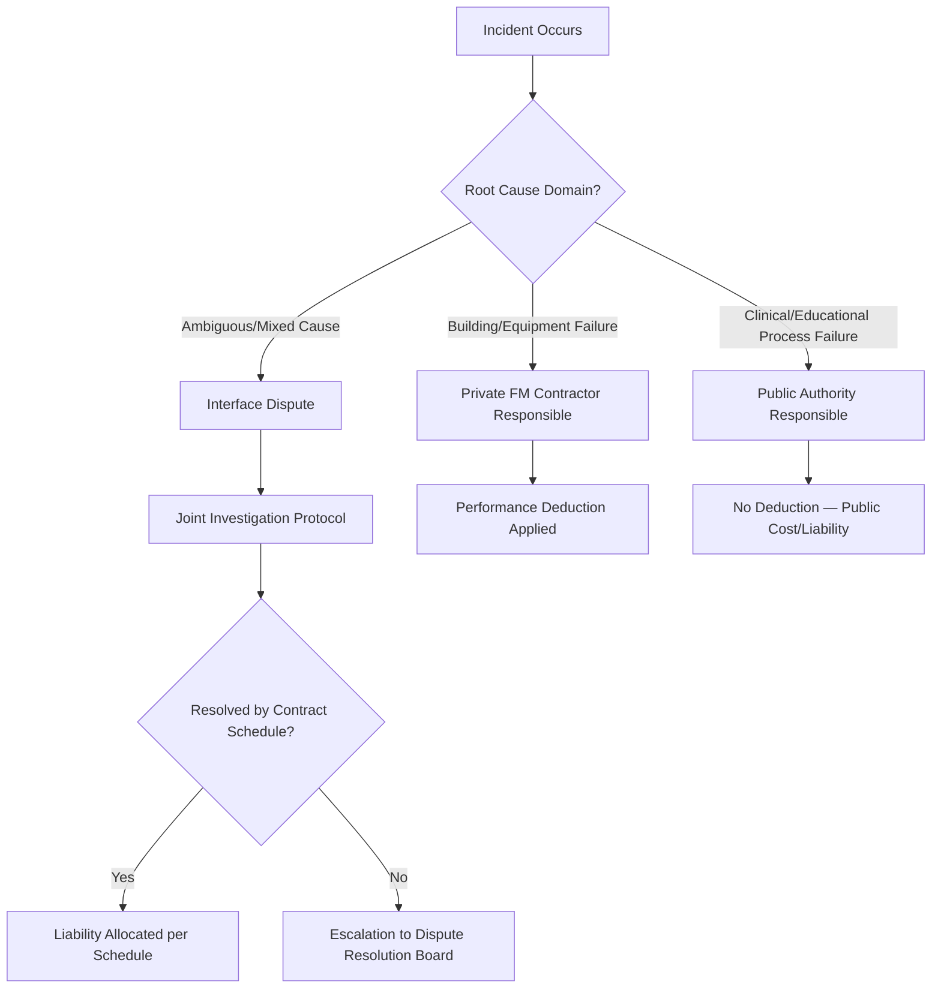

## Separating Hard Facilities Management from Clinical or Educational Services

### Conceptual Foundation

The separation of "hard FM" (facilities management) from "soft," clinical, or educational service delivery is the foundational structuring principle of nearly all modern social infrastructure PPPs — schools, hospitals, prisons, and courts alike. It defines the precise boundary of what the private partner is contracted to deliver and, by extension, what remains an inalienable public-sector function.

- **Hard FM**: the physical asset and its building-integrated systems — structure, roof, HVAC, electrical, plumbing, lifts, fire/life-safety systems, and their planned/reactive maintenance and lifecycle replacement
- **Soft FM**: non-clinical, non-educational support services delivered *within* the building but not part of its physical fabric — catering, cleaning, portering, security guarding, grounds maintenance, waste management, help-desk/reception
- **Clinical/Educational Services**: the core public-sector mission-delivery function — diagnosis and treatment, teaching and curriculum, custody and rehabilitation — which is essentially never transferred to the private partner in DBFM-style social infrastructure PPPs

This tripartite split (hard FM / soft FM / core service) is the standard analytical decomposition used across UK PFI/PF2, Canadian P3, Australian PPP, and most continental European availability-based models.

### Why the Boundary Is Drawn Here

**Key Points**

- Hard FM is highly standardized, specification-driven, and measurable through objective, verifiable KPIs (temperature ranges, equipment uptime, response times) — ideal conditions for output-based private contracting and availability payments
- Core clinical/educational service quality depends on professional judgment, discretion, and outcomes (patient recovery, exam results, rehabilitation) that are difficult to specify contractually without creating perverse incentives or infringing professional/clinical autonomy
- Labor relations and professional regulation (medical licensing boards, teacher certification, judicial independence) create legal and political barriers to transferring core service delivery to a private, profit-motivated entity
- Retaining core services publicly preserves democratic accountability and ministerial/departmental responsibility for outcomes that voters and oversight bodies directly associate with government performance

### The Interface Risk Problem

The central technical challenge in this separation is **interface risk**: failures or ambiguities at the boundary between hard FM/soft FM (private) and clinical/educational delivery (public) that neither party can fully control or is contractually incentivized to resolve alone.

Common interface failure scenarios include:

- A hospital operating theater is unavailable — was it an HVAC/air-handling failure (private FM) or a clinical scheduling failure (public)?
- A classroom cannot be used — was it a maintenance defect (private) or a curriculum/staffing decision to repurpose the room (public)?
- A prison cell block is offline — was it a physical plant failure (private) or a security incident requiring lockdown (public, sovereign function)?

### Contractual Mechanisms for Managing the Boundary

#### Output Specifications and Service Level Schedules

The Project Agreement (or equivalent) typically contains a detailed **Output Specification** or **Service Level Specification** annex that exhaustively lists private-party obligations in measurable, objective terms:

- Environmental conditions (temperature, humidity, air changes per hour) by room type
- Response and rectification times for defects, tiered by severity (e.g., emergency: 1 hour response/4 hour fix; routine: 5 business days)
- Cleaning frequency and standards by area classification (clinical vs. non-clinical zones in a hospital)
- Equipment availability percentages for building-integrated systems

Everything not listed in the Output Specification is implicitly outside the private party's scope — making the completeness and precision of this document the single most important risk-allocation tool in the contract.

#### Payment Mechanism Deduction Logic

$$UC_t = AP_t \times \left(1 - \sum_{i} w_i D_{i,t}\right)$$

Where $w_i$ is the weighting assigned to failure category $i$ and $D_{i,t}$ is the deduction factor for that category in period $t$. Critically, deductions apply **only** to failures within the private party's contracted scope (hard FM and any soft FM bundled into the deal) — a clinical negligence event or an educational outcome shortfall does not trigger a unitary charge deduction, because the private party has no contractual control over or responsibility for that domain.

#### Permitted Interruptions vs. Chargeable Unavailability

Most output specifications distinguish:

- **Unavailability due to contractor default** — triggers deduction
- **Permitted interruption** — pre-agreed maintenance windows, force majeure, or public-authority-caused disruption (e.g., the authority itself takes a room out of clinical use) — does not trigger deduction
- **Relief events / compensation events** — third-party or uncontrollable events that pause performance obligations without penalty, sometimes with cost/time compensation to the private party

### Staffing and TUPE/Employment Boundary Issues

A parallel, non-financial dimension of the separation concerns which staff transfer to the private employer:

- Hard FM and soft FM staff (maintenance engineers, cleaners, caterers, security guards) typically transfer to the private facilities management contractor, often under statutory employee transfer protections (e.g., TUPE in the UK, or equivalent successor-employer obligations elsewhere)
- Clinical staff (doctors, nurses), teaching staff, and custodial/correctional officers remain public employees, retaining civil service or equivalent professional employment status
- **[Inference]** The precise boundary of which ancillary roles transfer (e.g., portering, which involves patient-adjacent contact but is not clinical) varies by deal and has historically been a significant point of negotiation and occasional post-contract dispute; this is not a uniformly fixed rule across all jurisdictions or sectors

### Sector-Specific Application

#### Hospitals (Healthcare PPPs)

Hard FM: building fabric, medical gas piping infrastructure (not the gas supply/clinical use itself), HVAC serving clinical zones to specified standards, lifts, fire systems.

Soft FM (often bundled): catering, cleaning (non-clinical and sometimes clinical-adjacent cleaning under strict specification), laundry, portering, car parking, help desk.

Retained public: all diagnosis, treatment, nursing, clinical governance, infection control clinical protocols (though the FM contractor is bound by cleaning standards that support infection control).

#### Schools (Education PPPs)

Hard FM: building structure, roof, heating, lighting, playground surfaces, fire safety systems.

Soft FM (often bundled): cleaning, catering, grounds maintenance, minor ICT infrastructure maintenance (though not curriculum-related ICT/pedagogical software).

Retained public: teaching, curriculum, assessment, pastoral care, school leadership.

#### Prisons (Justice Sector PPPs)

Hard FM: cell block structure, perimeter fencing/walls (physical integrity, not operation), building services.

Soft FM (often bundled): catering, laundry, some maintenance of security hardware (cameras, locks — installation and physical upkeep, not operational monitoring).

Retained public: custody, use of force, classification, discipline, rehabilitation programming (though vocational/education programming delivery is sometimes contracted to a specialist private or third-sector provider under a separate services agreement, distinct from the hard FM contractor).

### Governance Structures for Managing the Boundary

- **Joint liaison/interface committees**: standing bodies with representatives from the public authority and private contractor, meeting regularly to resolve boundary disputes before they escalate to formal dispute resolution
- **Helpdesk and single point of contact protocols**: a unified fault-reporting system that logs incidents and routes them to the responsible party, creating an auditable record for interface disputes
- **Independent certifier/monitor**: many contracts appoint a third-party technical monitor to verify compliance with the output specification and adjudicate ambiguous cases, reducing reliance on either party's self-reporting

### Common Pitfalls in Structuring the Separation

- Incomplete output specifications that leave gaps neither party is contractually obligated to fill, discovered only during operations when a genuine service failure occurs in the gap
- Poorly defined "permitted interruption" clauses that create disputes over whether an unavailability was caused by the public authority's own action (no deduction) or contractor default (deduction applies)
- Underestimating the volume and cost of interface dispute resolution over a 25-30 year concession term, particularly in complex hospital environments with high clinical-operational interdependency
- Bundling too much soft FM into the private scope in a way that inadvertently constrains clinical or educational flexibility (e.g., rigid cleaning schedules that cannot adapt to a sudden infection control need without a contract variation)
- **[Unverified]** The degree to which this separation genuinely eliminates political controversy over privatization varies by jurisdiction; critics in several countries have argued the hard/soft FM boundary is itself contestable and that soft FM outsourcing (catering, cleaning) still raises distinct labor and quality concerns even where core clinical/educational functions remain public — this remains a live policy debate rather than a settled technical matter

**Next Steps**

- Output Specification Drafting and Payment Mechanism Design
- Interface Risk Allocation and Dispute Resolution Boards in PPPs
- TUPE and Employee Transfer in Social Infrastructure Procurement
- Independent Certifier and Technical Monitor Roles in PPP Contracts
- Comparative Case Study: UK PFI Hospital Soft FM Bundling vs. Unbundled Models
- Performance Deduction Regimes: Calibrating Weightings Across Failure Categories