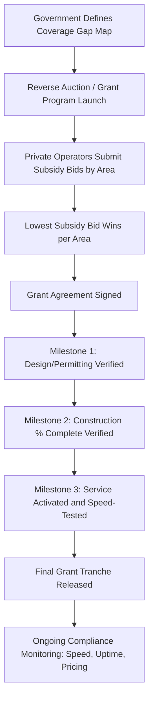

## Broadband and Rural Connectivity PPPs

### Overview and Sector Rationale

Broadband and rural connectivity PPPs address a structurally distinct market failure from traditional infrastructure PPPs: in dense urban areas, broadband deployment is commercially viable without subsidy, but in low-density rural, remote, or geographically difficult areas, the cost per passing (cost to reach each additional household) is high enough that private operators will not invest absent public support. This is the classic "digital divide" or "broadband gap" problem, and PPP structuring exists specifically to close it.

- Unlike toll roads or hospitals, the underlying technology (fiber, fixed wireless, satellite) evolves rapidly, creating technology-obsolescence risk absent in most other PPP asset classes
- The revenue model is typically retail subscription-based (demand risk), but the initial capital subsidy gap is closed through public grant/gap-funding mechanisms rather than availability payments
- Universal service obligation (USO) policy frameworks in many countries provide the underlying legal basis and funding mechanism (e.g., universal service funds financed by telecom sector levies)

### Core Delivery Models

#### Gap-Funding / Minimum Subsidy Auction Model

The dominant global model for rural broadband PPPs. Government defines target coverage areas (typically unserved or underserved, based on a minimum speed threshold), and private operators bid for the minimum subsidy required to make deployment commercially viable in that area.

$$Subsidy_{bid} = C_{deploy} - NPV(R_{subscription})$$

Where $C_{deploy}$ is the operator's estimated deployment cost for the area and $NPV(R_{subscription})$ is the present value of expected subscription revenue over the funding/commitment period. The auction mechanism (reverse auction — lowest subsidy request wins) is designed to reveal each operator's true cost structure and minimize public expenditure per passing.

#### Open-Access Wholesale Network Model

A single network (often publicly funded or co-funded) is built and operated on an open-access, non-discriminatory wholesale basis, with retail internet service providers (ISPs) competing to serve end customers over that shared infrastructure.

- Reduces duplicative infrastructure buildout in low-density areas where multiple competing networks would each be commercially marginal
- The network operator (public entity, PPP concessionaire, or nonprofit) earns wholesale access revenue from ISPs rather than retail subscription revenue directly
- Common in New Zealand (Ultrafast Broadband/Chorus model), Australia (NBN Co), and various municipal/cooperative fiber networks in the US and EU

#### Design-Build-Operate-Transfer (DBOT) Concession

A private consortium designs, builds, and operates the network for a defined concession period (typically 15-25 years, shorter than road/rail concessions given technology risk), after which the asset may transfer to public or continued private ownership depending on contract terms. Revenue is demand-based (retail or wholesale), often supplemented by an upfront or milestone-based capital grant.

#### Public Asset / Private Operator Lease Model

The public sector (municipality, utility, or state broadband authority) finances and owns the physical infrastructure (often "dark fiber" conduit and cable), leasing capacity to private operators who light the network and provide retail service. This shifts long-term asset ownership risk to the public sector while preserving competitive retail service delivery.

### Payment and Funding Mechanisms

#### Universal Service Fund (USF) Financing

Many jurisdictions fund rural broadband gap subsidies through a USF, financed by a levy on telecom operator revenues (fixed and mobile), which is then disbursed via competitive auction or direct grant to winning bidders in underserved areas. **[Unverified]** The specific levy rate, fund governance structure, and disbursement mechanism vary substantially by country and are subject to periodic regulatory reform; current rates and rules should be verified against the relevant national regulator's current published framework.

#### Milestone-Based Capital Grants

$$Grant_{disbursed} = \sum_{m=1}^{n} G_m \times \mathbb{1}(Milestone_m \text{ verified})$$

Grant tranches are released only upon independent verification of coverage milestones (e.g., percentage of target premises passed, service activated and tested to minimum speed), protecting public funds against non-performance and construction delay.

#### Take-Up / Connection Incentive Payments

Some schemes supplement passing subsidies with per-connection incentive payments once a household actually subscribes, addressing the risk that a network is built ("passed") but under-adopted due to affordability, digital literacy, or lack of perceived need — a common gap between technical coverage and actual usage in rural connectivity programs.

### Risk Allocation Matrix

| Risk Category | Gap-Funding Auction | Open-Access Wholesale | DBOT Concession |
| --- | --- | --- | --- |
| Construction cost/schedule | Private | Public or Shared | Private |
| Technology obsolescence | Private | Public (network owner) | Private |
| Take-up/adoption (demand) | Private | Shared (retail ISPs bear it) | Private |
| Wholesale pricing/access disputes | N/A | Regulated/Public oversight | N/A |
| Terrain/permitting/right-of-way | Shared | Public (if publicly built) | Shared |
| Ongoing technology upgrade (e.g., fiber overbuild of fixed wireless) | Private | Public | Contract-dependent |

### Technology Architecture Considerations

Rural connectivity PPPs typically evaluate a technology-neutral or technology-specific approach depending on program design:

- **Fiber-to-the-Premises (FTTP)**: highest capital cost per passing in low-density areas but longest asset life and highest future bandwidth headroom; increasingly the default target technology in gap-funded programs due to declining future-upgrade risk
- **Fixed Wireless Access (FWA)**: lower capital cost, faster deployment, but capacity-constrained and more sensitive to terrain/line-of-sight and spectrum availability
- **Low Earth Orbit (LEO) Satellite**: emerging option (e.g., Starlink and comparable services) for the most remote/dispersed premises where even fixed wireless is uneconomical; increasingly referenced in USF program design as a "last resort" technology for the highest-cost tail of unserved locations
- **[Inference]** The relative cost-effectiveness ranking of these technologies is highly sensitive to local terrain, population density, and evolving satellite constellation economics, and rankings that held even a few years ago may not hold given the pace of LEO satellite capacity and cost changes — this is an area requiring current, location-specific analysis rather than a fixed technical hierarchy

### Worked Example: Reverse Auction Subsidy Calculation

**Example**

A rural coverage area has 5,000 unserved premises. Operator deployment cost is estimated at $1,800 per premises passed ($9 million total). Expected take-up rate is 45% at an average monthly ARPU of $65, over a 10-year revenue horizon used for bid modeling, with a discount rate of 8%.

Annual revenue at steady-state take-up: $5{,}000 \times 0.45 \times \$65 \times 12 = \$1{,}755{,}000$

Approximate NPV of a 10-year revenue stream (using an annuity approximation at 8% discount rate, annuity factor ≈ 6.71):

$$NPV(R) \approx \$1{,}755{,}000 \times 6.71 \approx \$11{,}776{,}050$$

**[Inference]** In this simplified illustration, the modeled revenue NPV exceeds deployment cost, which would suggest a low or zero subsidy requirement; in practice, real bids incorporate ramp-up periods (take-up rarely reaches steady-state immediately), churn, operating costs, cost of capital beyond the discount rate shown, and risk margins, all of which typically reduce the effective NPV substantially below this simplified figure and justify a positive subsidy bid. This example illustrates the mechanism, not a realistic bid outcome.

### Regulatory and Policy Interfaces

- **Net neutrality and open-access obligations**: publicly subsidized networks are frequently subject to non-discrimination requirements not imposed on purely private, unsubsidized networks
- **Speed and service quality mandates**: grant agreements typically specify minimum download/upload speeds and latency thresholds that must be met and independently verified, with clawback provisions for non-compliance
- **Overbuild restrictions**: many programs prohibit subsidizing new infrastructure in areas already served by qualifying private infrastructure, requiring a "challenge process" where incumbent operators can dispute a proposed subsidy area
- **Pricing regulation**: open-access wholesale models typically require regulated, non-discriminatory wholesale pricing to prevent the network owner from favoring an affiliated retail ISP

### Common Pitfalls in Structuring

- Coverage maps based on outdated or self-reported incumbent data leading to disputed or inaccurate "unserved" area designations, delaying program rollout through challenge processes
- Underestimating take-up risk — a technically "passed" area with low actual subscription rates undermines both program impact metrics and operator revenue assumptions
- Technology-neutral auctions inadvertently favoring lower-capital-cost, lower-capability technologies (fixed wireless) over durable fiber in ways that create a second-generation funding gap when bandwidth needs grow
- Insufficiently robust milestone verification allowing grant disbursement against incomplete or non-functional builds
- Cross-border/cross-jurisdictional coordination gaps when adjacent regions run separate, uncoordinated subsidy programs, creating either duplicative subsidy or gap areas at boundaries

**Related Topics**

- Universal Service Fund Design and Telecom Levy Financing Mechanisms
- Reverse Auction Design for Infrastructure Subsidy Allocation
- Open-Access Wholesale Network Regulation and Pricing
- LEO Satellite Connectivity as a Last-Mile Solution: Economics and Policy Integration
- Data Center and Digital Infrastructure PPPs
- Smart City and IoT Infrastructure Partnership Models