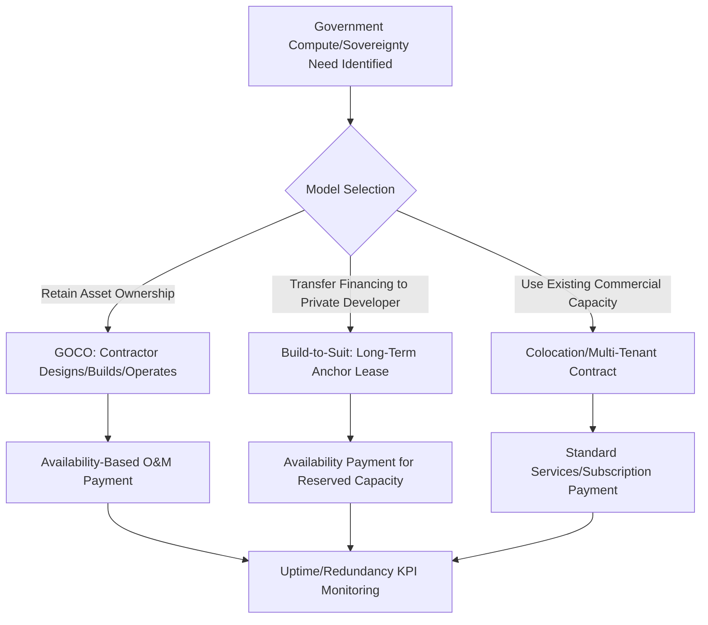

## Data Center and Cloud Infrastructure Partnerships

### Overview and Sector Rationale

Data center and cloud infrastructure partnerships represent an emerging and structurally hybrid category of digital infrastructure PPP, distinguished from broadband/rural connectivity by their asset intensity, colocation with power infrastructure, and the frequent conflation of "PPP" with purely commercial public-cloud procurement arrangements. Precise structuring depends heavily on which of several distinct government objectives is being pursued.

- **Sovereign/government cloud and data center capacity**: government seeks secure, often geographically-controlled compute and storage capacity for public-sector workloads, sensitive data, and digital government services
- **Economic development-driven data center PPPs**: state/local governments partner with hyperscale or colocation operators to attract large capital investment, often through land, power infrastructure, and tax incentive packages structured with PPP-like elements
- **Public sector as anchor tenant**: government commits to long-term capacity off-take from a privately financed and operated facility, providing revenue certainty that underwrites private capital investment

### Delivery Models

#### Government-Owned, Contractor-Operated (GOCO) Data Centers

The public sector retains asset ownership (land and building, sometimes core infrastructure) while contracting a private operator for design, construction management, and ongoing operations and maintenance — structurally similar to DBFM/DBOM models used in other infrastructure sectors, adapted for data center-specific technical requirements (redundant power, cooling, physical security tiers).

#### Build-to-Suit / Anchor Tenant Model

A private developer finances, builds, and owns a facility designed to government specifications, with government committing to a long-term lease or capacity-reservation agreement that underwrites the developer's financing. This is structurally closest to a conventional availability-payment PPP:

$$UC_t = AP_t \times (1 - D_t) - PD_t$$

Where $AP_t$ covers reserved capacity (power, rack space, connectivity) regardless of actual utilization, and $D_t$/$PD_t$ apply for failures against uptime, power redundancy (e.g., N+1, 2N configurations), and cooling performance SLAs — closely analogous to the availability-payment mechanics used in other social and digital infrastructure PPPs.

#### Colocation and Multi-Tenant Public-Private Facilities

Government becomes one tenant among several in a commercially operated, multi-tenant data center, procured through a standard managed-hosting or colocation services contract rather than a bespoke PPP structure. **[Inference]** Whether this arrangement constitutes a "PPP" in the formal risk-transfer/project-finance sense is contestable — it more closely resembles a long-term services procurement contract; it is included here because government agencies and industry commentary frequently describe such large, multi-year anchor commitments using PPP-adjacent language even where the underlying legal and financing structure differs from a true project-financed PPP.

#### Public Cloud Landing Zone / Hyperscaler Partnership Agreements

Government enters a large-scale enterprise agreement with a hyperscale cloud provider (encompassing dedicated regions, government/sovereign cloud offerings, or dedicated capacity), sometimes bundled with local data center investment commitments as a condition of the agreement (economic development linkage). These are typically structured as commercial services contracts with investment-commitment side agreements rather than project-financed PPPs, but are increasingly discussed in the same policy and economic-development context.

### Sovereignty, Security, and Data Residency Considerations

**Key Points**

- Data residency requirements (data must be stored/processed within national or sub-national borders) are a primary driver of purpose-built government/sovereign data center PPPs rather than reliance on existing global hyperscale infrastructure
- Security classification tiers (analogous to Tier III/IV data center industry standards, but layered with government security clearance and physical access control requirements) drive significantly higher capital cost per facility than commercial-grade equivalents
- **[Unverified]** Specific national security classification requirements, clearance regimes, and sovereign cloud certification frameworks vary substantially by country and are subject to frequent policy revision; current requirements should be verified against the relevant national authority's published framework rather than assumed static
- Supply chain security requirements for hardware and firmware provenance are increasingly incorporated into procurement specifications for sensitive government workloads, adding a distinct risk category not present in commercial data center PPPs

### Risk Allocation Matrix

| Risk Category | GOCO Model | Build-to-Suit/Anchor Tenant | Colocation/Multi-Tenant |
| --- | --- | --- | --- |
| Construction cost/schedule | Private (contractor) | Private (developer) | N/A (existing facility) |
| Technology/equipment obsolescence | Shared | Private | Private |
| Power/cooling redundancy performance | Private (O&M contractor) | Private | Private |
| Capacity utilization/demand | Public (owns asset) | Public (pays regardless, if availability-based) | Public (pays for reserved capacity) |
| Cybersecurity/data breach | Shared (contractual liability caps common) | Shared | Shared |
| Power grid capacity/energy cost volatility | Public or Shared | Private (often passed through) | Private (passed through) |
| Sovereignty/data residency compliance | Public | Public (via contract specification) | Public (via contract specification) |

### Power Infrastructure as a Structuring Constraint

Data center PPPs are increasingly structured around power availability as the binding constraint rather than land, connectivity, or construction capacity:

- Grid interconnection queue delays in many regions now exceed construction timelines, making secured power capacity the critical path and a key deal-structuring risk allocated explicitly in contracts
- On-site or co-located power generation (gas peaker plants, increasingly small modular reactor (SMR) proposals, and renewable-plus-storage configurations) is increasingly bundled into large data center PPP/development agreements as a risk mitigant against grid delay
- **[Speculation]** The trend toward data center operators directly financing dedicated power generation capacity (rather than relying solely on grid interconnection) is an active and rapidly evolving area of infrastructure deal structuring; the eventual standard model is not yet settled and current reporting should be consulted for the latest structuring approaches given how quickly this space is changing

### Economic Development-Linked Structuring

Many jurisdictions pursue data center PPPs primarily as an economic development instrument rather than a public-service delivery mechanism:

- Tax abatement and incentive packages (sales tax exemptions on equipment, property tax abatements) are frequently the primary "public contribution," functioning similarly to viability gap funding in other PPP sectors even though the government is not the end-user of the facility
- Public investment in supporting infrastructure (transmission upgrades, water/cooling infrastructure, road access) is sometimes structured as a cost-shared or PPP-adjacent arrangement tied to the developer's investment commitment and job-creation targets
- Clawback provisions tied to job creation, capital investment thresholds, and operational timelines are standard risk-mitigation tools protecting public incentive expenditure against non-performance

### Worked Example: Availability Payment for a Government Anchor Tenant Facility

**Example**

A state government commits to a 15-year anchor tenant agreement for a purpose-built 10-megawatt sovereign cloud facility.

- Base annual availability payment: $18 million (covering reserved power, cooling, rack space, and connectivity capacity)
- Uptime SLA: 99.99% (approximately 52.6 minutes of permitted annual downtime)
- Deduction schedule: 0.5% of annual payment per each additional hour of downtime beyond the SLA threshold, capped at 15% annual deduction

In a year with 3 hours of downtime beyond the SLA threshold:

$$Deduction = 3 \times 0.5\% \times \$18{,}000{,}000 = \$270{,}000$$

$$UC = \$18{,}000{,}000 - \$270{,}000 = \$17{,}730{,}000$$

As with other availability-payment digital and social infrastructure PPPs, the payment is tied to *reserved capacity being available*, not actual government workload volume processed through the facility.

### Common Pitfalls in Structuring

- Conflating commercial cloud services procurement (standard vendor contracting) with true PPP project finance structuring, leading to mismatched risk allocation expectations
- Underestimating power interconnection timeline risk, which has become the dominant schedule risk in data center development across many markets and is frequently outside either party's direct control
- Insufficiently specified data sovereignty and security compliance obligations, creating ambiguity over liability if a breach or residency violation occurs at a subcontractor or supply-chain level
- Economic development incentive packages structured without robust clawback mechanisms, exposing public funds if job-creation or investment commitments are not met
- Technology refresh mismatch: server/equipment obsolescence cycles (3-5 years) are far shorter than the underlying real estate/power infrastructure concession term (15-25 years), requiring distinct contractual treatment of the two asset layers

**Related Topics**

- Grid Interconnection Risk and On-Site Power Generation in Digital Infrastructure Deals
- Sovereign Cloud and Data Residency Policy Frameworks
- Economic Development Incentive Structuring and Clawback Design
- Broadband and Rural Connectivity PPPs
- Availability Payment Mechanism Design Across Infrastructure Sectors
- Cybersecurity Risk Allocation in Government Technology Contracts