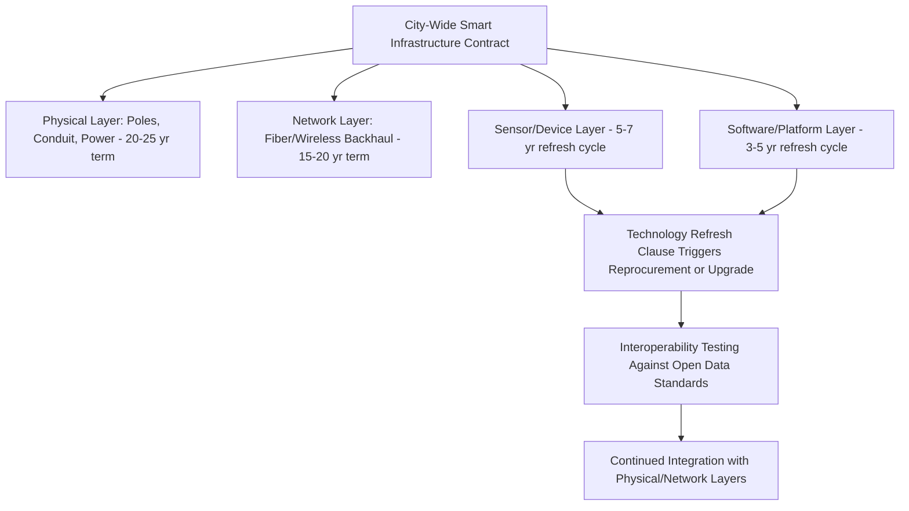

## Smart City Platforms and Digital Public Services

### Overview and Sector Definition

Smart city PPPs encompass the deployment of integrated sensor networks, data platforms, and digital service delivery systems that span multiple municipal functions — transportation, utilities, public safety, environmental monitoring, and citizen-facing digital government services. This is among the most structurally heterogeneous PPP categories, because "smart city" is an umbrella term covering dozens of distinct technical systems, each with its own risk profile, rather than a single standardized asset class comparable to a toll road or hospital.

- No single dominant delivery model exists across jurisdictions; structuring is typically bespoke, component-by-component, or organized around a master systems integrator relationship
- Revenue models vary enormously: some components generate direct revenue (smart parking, advertising on connected infrastructure), others are pure public-cost availability arrangements (traffic management platforms), and others involve complex data-value-sharing arrangements
- Interoperability and data governance across vendor-supplied subsystems is a defining technical and contractual challenge largely absent from single-asset infrastructure PPPs

### Common Delivery Models

#### Master Systems Integrator (MSI) Model

A single private prime contractor is responsible for integrating multiple subsystems (traffic sensors, smart lighting, public Wi-Fi, environmental sensors) into a coherent city-wide data platform, often subcontracting individual technology components while retaining overall systems integration and platform accountability.

#### Revenue-Generating Infrastructure-as-a-Service

Certain smart city components are structured with direct or quasi-direct revenue streams that can support demand-risk or hybrid financing without full public capital outlay:

- **Smart streetlighting with advertising/connectivity overlay**: private partner finances LED retrofit and adds small-cell telecom infrastructure or digital advertising displays, recovering costs through energy savings-sharing, telecom leasing, and advertising revenue rather than a pure availability payment
- **Smart parking systems**: private operator deploys sensors and payment platforms, sharing parking revenue with the municipality under an agreed split, with system performance tied to sensor uptime and payment processing reliability
- **Public Wi-Fi with data monetization**: private partner deploys and maintains public Wi-Fi infrastructure, funded partly through anonymized data analytics services or advertising rather than direct government payment

#### Data Platform-as-a-Service (Availability Model)

For components with no direct revenue potential (city-wide traffic management, integrated emergency dispatch data platforms, environmental sensor networks feeding public policy decisions), the standard availability-payment structure applies:

$$UC_t = AP_t \times (1 - D_t) - PD_t$$

Where deductions apply against platform uptime, data latency thresholds, sensor network coverage percentage, and API/interoperability compliance with specified open data standards.

#### Public-Private Data Trust / Data Governance Partnership

A distinct and increasingly important structuring layer, separate from physical asset delivery: governance arrangements determining data ownership, access rights, privacy protections, and permitted secondary uses of city-generated data collected through PPP-delivered infrastructure. **[Inference]** Approaches to data governance in smart city PPPs remain highly jurisdiction-specific and are an actively evolving area of policy and legal practice rather than a settled standard; specific frameworks (data trusts, open data mandates, data localization requirements) vary significantly and should be verified against current local regulation.

### Key Structuring Challenges Distinct to This Sector

**Key Points**

- **Interoperability risk**: multiple vendors supplying different subsystems (traffic sensors from one vendor, lighting control from another, a separate citizen services app) creates integration risk not present in single-asset PPPs, requiring open-standard API mandates and interoperability testing regimes written into procurement specifications
- **Technology obsolescence and vendor lock-in**: smart city technology components have far shorter useful-life cycles (3-7 years) than traditional infrastructure (25-30+ years), creating a structural mismatch if the underlying contract term is set at conventional infrastructure PPP duration
- **Data privacy and surveillance concerns**: sensor networks, facial recognition-adjacent camera systems, and location-tracking components raise civil liberties concerns that have led to public opposition, and in some cases outright bans or moratoria, on specific technology deployments in various jurisdictions
- **Cybersecurity as critical infrastructure risk**: integrated city platforms present an aggregated attack surface across multiple public safety and utility functions, requiring security specifications and liability allocation distinct from single-purpose infrastructure assets

### Risk Allocation Matrix

| Risk Category | MSI Model | Revenue-Generating Components | Data Platform Availability Model |
| --- | --- | --- | --- |
| Systems integration/interoperability | Private (prime contractor) | N/A (typically single vendor) | Private |
| Technology obsolescence | Shared (refresh clauses) | Private | Shared |
| Direct revenue/demand | N/A | Private or Shared | N/A |
| Data privacy/governance compliance | Public (policy-setting) with private operational compliance | Public/Private shared | Public/Private shared |
| Cybersecurity breach | Shared (liability caps common) | Private | Shared |
| Public acceptance/political risk (surveillance concerns) | Public | Public | Public |

### Contract Structuring for Technology Refresh Mismatch

Because component technology cycles are far shorter than typical PPP concession terms, smart city contracts increasingly separate the underlying physical/network infrastructure layer from the technology/software layer:

This layered structuring allows shorter refresh/reprocurement cycles for fast-obsolescing components while preserving long-term financing certainty for the underlying physical and network infrastructure.

### Data Value and Monetization Considerations

- Many smart city PPP proposals include projected revenue from anonymized/aggregated data analytics sold to third parties (urban planners, retailers, insurers); **[Speculation]** the actual realized commercial value of such secondary data monetization has frequently underperformed initial business case projections in publicized cases, though systematic, generalizable evidence on this point is limited and outcomes vary significantly by city and data category
- Open data mandates (requiring the platform operator to publish specified non-sensitive datasets for public and third-party developer use) are increasingly a standard contractual requirement, reflecting a policy preference for public data as a shared civic asset rather than purely private commercial exploitation
- Data localization and sovereignty requirements (see also Data Center and Cloud Infrastructure Partnerships) frequently apply to smart city data platforms handling citizen-identifiable information

### Worked Example: Smart Streetlighting Cost-Recovery Structure

**Example**

A city retrofits 50,000 streetlights to LED with integrated small-cell telecom infrastructure under a 15-year concession.

- Capital cost: $40 million
- Annual energy savings versus legacy lighting: $3.2 million (shared 70/30 between private operator and city)
- Annual telecom infrastructure leasing revenue to mobile carriers: $1.8 million (100% to private operator)
- Private operator annual revenue: $(\$3.2M \times 0.70) + \$1.8M = \$4.04$ million
- Simple payback period: $\$40M / \$4.04M \approx 9.9$ years, within the 15-year concession term

This illustrates the hybrid, multi-revenue-stream cost recovery structure characteristic of revenue-generating smart city components, distinct from pure availability-payment digital infrastructure deals.

### Common Pitfalls in Structuring

- Contract terms set at conventional 25-30 year infrastructure PPP duration without a distinct, shorter technology refresh mechanism, leading to platforms locked into obsolete systems well before contract expiry
- Underspecified interoperability and open API requirements, resulting in vendor lock-in that undermines the city's ability to competitively reprocure individual subsystems
- Data governance and privacy frameworks addressed as an afterthought rather than structured into the procurement from inception, leading to public opposition or legal challenge after deployment
- Overly optimistic data monetization revenue projections built into the financial case, creating viability gaps if secondary data revenue underperforms
- Cybersecurity liability caps set without adequate consideration of the aggregated, cross-functional attack surface unique to integrated city platforms (a single breach can affect multiple critical services simultaneously)

**Next Steps**

- Data Governance Frameworks and Public-Private Data Trusts
- Interoperability Standards and Open API Mandates in Municipal Technology Procurement
- Cybersecurity Risk Allocation Across Integrated Public Infrastructure Systems
- Technology Refresh Clauses and Layered Contract Structuring
- Data Center and Cloud Infrastructure Partnerships
- Broadband and Rural Connectivity PPPs