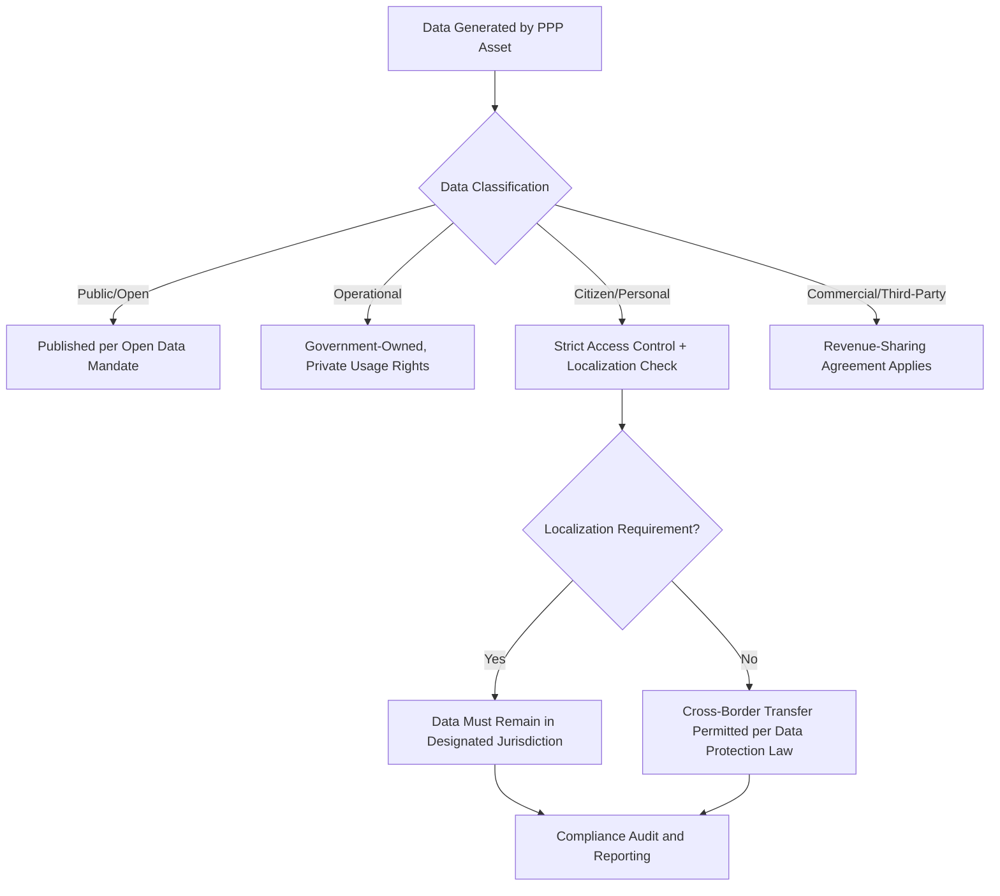

## Cybersecurity and Data Governance in Digital PPPs

### Overview and Cross-Cutting Nature

Cybersecurity and data governance function as a cross-cutting risk layer applicable across every digital infrastructure PPP category — broadband networks, data centers, smart city platforms, and increasingly digitized versions of traditional social infrastructure (hospitals, schools, prisons with networked systems). Unlike construction or demand risk, cyber risk is dynamic, adversarial, and does not diminish over the life of a concession the way physical asset risk typically does; it can, and typically does, intensify as threat actors evolve.

- Cyber risk is fundamentally different from traditional PPP risk categories because the threat is intentional and adaptive rather than probabilistic and stable (unlike, e.g., weather-related force majeure risk)
- Data governance concerns — who owns, accesses, and can monetize data generated by PPP-delivered infrastructure — are a relatively recent addition to PPP contract structuring, without the decades of accumulated standard-form contract language available for construction or availability-payment risk
- Both cybersecurity and data governance provisions increasingly appear as standalone schedules within PPP project agreements, reflecting their status as distinct risk categories requiring specialized allocation rather than generic "compliance with law" clauses

### Cybersecurity Risk Allocation Frameworks

#### Baseline Security Standards and Certification Requirements

Most digital PPP contracts now incorporate baseline security frameworks by reference rather than drafting bespoke technical security requirements from scratch:

- Recognized frameworks (e.g., NIST Cybersecurity Framework, ISO/IEC 27001, sector-specific standards such as those governing critical infrastructure) are commonly incorporated as contractual minimum compliance obligations
- **[Unverified]** The specific frameworks mandated, certification bodies recognized, and compliance verification mechanisms vary substantially by jurisdiction and sector, and are subject to frequent regulatory updates; current requirements should be verified against the applicable national or sector regulator rather than assumed static
- Independent security audits and penetration testing at defined intervals (commonly annual, with additional testing triggered by major system changes) are standard contractual requirements with results reportable to the public authority or an independent monitor

#### Liability Allocation for Breach Events

$$Liability_{allocated} = f(NegligenceStandard, BreachCause, ContractualCap)$$

Cyber liability allocation typically distinguishes:

- **Private party negligence** (failure to patch known vulnerabilities, inadequate access controls) — private party liability, often subject to a negotiated cap
- **State-sponsored or advanced persistent threat (APT) attacks** — frequently treated as a relief event or force majeure-adjacent category, given that no commercially reasonable security posture can guarantee defense against a well-resourced nation-state actor; **[Inference]** the appropriate treatment of APT-attributed breaches remains contested in contract negotiation, since attribution itself is often ambiguous or disputed, making this a genuinely unsettled area of contract drafting practice rather than a fixed convention
- **Shared/undetermined causation** — increasingly addressed through joint incident response protocols and independent forensic investigation clauses rather than pre-allocated liability splits

#### Cyber Insurance Requirements

Digital PPP contracts increasingly mandate that the private party maintain cyber liability insurance meeting specified minimum coverage thresholds, though **[Unverified]** market capacity, pricing, and coverage terms for cyber insurance have been volatile and evolving in recent years, and any specific figures should be checked against current market conditions rather than treated as stable benchmarks.

### Data Governance Structuring

#### Data Ownership and Classification

A foundational structuring step is classifying data generated or processed through the PPP asset into tiers, each with distinct governance rules:

- **Public/open data**: government-owned, subject to open data publication mandates
- **Operational/proprietary data**: data generated in the course of private party operations (e.g., maintenance logs, sensor diagnostics) — ownership terms negotiated, often government-owned with private party usage rights for operational purposes
- **Citizen/personal data**: subject to the most stringent governance, typically government-owned or held in trust, with strict access controls, retention limits, and privacy law compliance obligations
- **Third-party/commercial data**: data with independent commercial value (e.g., aggregated mobility patterns), where monetization rights and revenue-sharing arrangements are often explicitly negotiated

#### Data Localization and Cross-Border Transfer Restrictions

Many digital PPP contracts, particularly those involving citizen data or critical infrastructure, incorporate data localization requirements restricting where data may be stored and processed:

#### Data Portability and Vendor Exit Provisions

Given the multi-decade term of many PPPs and the technology obsolescence risk discussed in related digital infrastructure topics, data governance schedules increasingly mandate:

- Standardized, non-proprietary data export formats to prevent vendor lock-in at contract expiry or termination
- Defined data migration assistance obligations during transition-out periods
- Escrow arrangements for source code and system documentation in case of contractor insolvency or default, ensuring continuity of service and data accessibility

### Incident Response Governance

**Key Points**

- Joint incident response protocols, pre-agreed and tested (via tabletop exercises) before go-live, are increasingly standard, given that ad hoc coordination during an active breach materially worsens outcomes
- Mandatory breach notification timelines to the public authority (often shorter than general statutory breach notification deadlines, given the heightened public interest in government-linked system breaches) are commonly specified as a distinct contractual obligation
- Independent forensic investigation requirements, with costs and findings-sharing arrangements pre-negotiated, reduce disputes over causation and liability during a high-pressure incident
- **[Inference]** The trend toward mandatory, tested incident response protocols in digital PPP contracts appears to be strengthening across multiple jurisdictions following a number of high-profile public-sector breaches, though this is an evolving area of contracting practice and the degree of standardization achieved varies

### Risk Allocation Matrix

| Risk Category | Typical Allocation | Notes |
| --- | --- | --- |
| Negligent security failure | Private | Subject to negotiated liability cap |
| State-sponsored/APT attack | Contested/Shared | Often treated as relief event; attribution disputes common |
| Data breach notification cost | Private (initial), Shared (extraordinary) | Statutory minimums often exceeded contractually |
| Data localization compliance | Public (policy) / Private (operational compliance) | Joint responsibility structure |
| Third-party data monetization | Shared (negotiated revenue split) | Varies significantly by deal |
| Legacy system vulnerability at contract handover | Shared/Negotiated | Frequently disputed at transition-out |
| Regulatory change (new data protection law) | Public | Standard change-in-law treatment |

### Worked Example: Breach Liability Cap Structuring

**Example**

A digital infrastructure PPP contract sets an annual aggregate cyber liability cap for the private operator at $25 million, with a sub-cap of $5 million for any single incident attributable to operator negligence, and a carve-out excluding liability caps entirely for gross negligence or willful misconduct.

If a breach caused by an unpatched, publicly disclosed vulnerability (clear negligence) results in $8 million of direct government remediation costs:

$$Liability_{operator} = \min(\$8M, \$5M_{sub-cap}) = \$5{,}000{,}000$$

The remaining $3 million falls to the public authority under this cap structure, illustrating why sub-cap levels are a heavily negotiated term — set too low, they leave government inadequately protected against foreseeable negligent failures; set too high, they may be commercially unattractive or uninsurable for the private party.

### Common Pitfalls in Structuring

- Generic "compliance with applicable law" clauses used in place of specific, auditable cybersecurity and data governance schedules, leaving significant ambiguity in enforcement
- Liability caps set without adequate modeling of realistic breach cost scenarios (regulatory fines, remediation, reputational/political cost), leading to caps that are either commercially unviable for bidders or inadequate for genuine public protection
- Data ownership and portability terms addressed only at contract signing without provision for evolving data protection law over a multi-decade concession term, creating change-in-law disputes
- Absence of pre-tested joint incident response protocols, discovered only during an actual live breach when coordination failures compound technical damage
- Underestimating legacy system risk at transition-out, where outgoing contractors have reduced incentive to invest in security remediation near contract end

**Next Steps**

- Smart City Platforms and Digital Public Services
- Data Center and Cloud Infrastructure Partnerships
- Change-in-Law and Compensation Event Provisions Applied to Data Protection Regulation
- Transition-Out and Contract Expiry Risk Management in Digital PPPs
- Cyber Insurance Markets and Their Interface with Infrastructure Risk Transfer
- Comparative Case Study: Public-Sector Data Breach Incident Response Across Jurisdictions