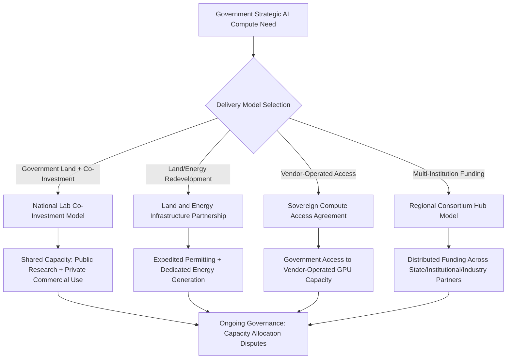

## Emerging Models for AI and Compute Infrastructure Partnerships

### Overview and Why This Category Is Emerging Rather Than Established

AI and compute infrastructure partnerships represent the newest and least standardized category within digital infrastructure PPPs, distinct from conventional data center PPPs primarily in scale, urgency, and the direct linkage of compute capacity to national strategic competitiveness. Unlike broadband or even traditional data center deals, these partnerships have emerged very recently, are being actively structured in real time by national governments, and lack the multi-decade accumulated body of standard contract precedent available in other PPP sub-sectors. **[Unverified]** Because this is an active and fast-moving area of government and industry practice, the specific programs and deal structures described below reflect recent, publicly reported arrangements and should be verified against current government and vendor announcements, as terms and program details are likely to continue evolving.

- The central rationale is national competitiveness in AI capability, framed explicitly by multiple governments as a strategic race requiring compute capacity that neither pure public procurement nor pure private investment can deliver fast enough alone
- Deal timelines have compressed dramatically relative to traditional infrastructure PPPs — government agencies have explicitly stated an objective of moving supercomputer/AI cluster deployment from a multi-year timeline to a matter of months
- Energy availability, rather than construction capacity or financing, is frequently the binding constraint, tying this category closely to power infrastructure partnership models

### Emerging Delivery Models

#### Co-Investment / Shared Capacity National Lab Model

A model publicly articulated by the U.S. Department of Energy involves direct co-investment between a government research agency and private technology vendors to deploy large-scale AI compute clusters at national laboratory sites, with computing capacity shared between government research priorities and private commercial use. This model was used to deploy AI clusters powered by advanced GPU and CPU hardware at national laboratories, explicitly framed as expanding near-term government AI capacity while accelerating work on priorities including fusion, materials discovery, and grid modernization. The stated objective of this new partnership model is to compress the timeframe for standing up new supercomputers from years to months by enabling co-investment from both the government agency and private partners, with shared computing power and infrastructure providing mutual benefit to both sides. [energy](https://www.energy.gov/articles/energy-department-announces-new-public-private-partnership-model-two-supercomputers)[energy](https://www.energy.gov/articles/energy-department-announces-new-public-private-partnership-model-two-supercomputers)

**[Inference]** This co-investment structure differs materially from a conventional availability-payment PPP in that the private vendor also derives direct operational and commercial value from the shared capacity, rather than being paid purely for a service rendered to government — making the risk/return calculus and appropriate valuation of the public contribution (land, permitting acceleration, co-funding) a genuinely novel structuring question without settled precedent.

#### Land and Energy Infrastructure Redevelopment Partnerships

A second emerging model links AI compute infrastructure development to the repurposing of existing government land and energy assets, bringing together multiple federal agencies and private partners around energy modernization as the enabling condition for compute buildout. One such partnership between government agencies and private firms was structured to redevelop government-owned land, modernize energy infrastructure, and develop advanced computing capacity, explicitly described as unlocking infrastructure investment without increasing costs to existing utility customers. [commerce](https://www.commerce.gov/news/press-releases/2026/03/commerce-and-energy-departments-announce-partnership-ensure-affordable)

This model typically bundles:

- Government land made available for development (analogous to the land-contribution mechanism in social housing PPPs)
- Expedited permitting for both compute facilities and associated energy generation, frequently justified by executive action aimed at accelerating federal permitting timelines for data center infrastructure
- Private capital for both the compute hardware/facility and, increasingly, dedicated energy generation to avoid grid interconnection queue delays

#### Vendor-Delivered Sovereign Compute Access Agreements

A distinct model involves a private cloud/hardware vendor providing government agencies with direct access to AI computing resources as a component of a broader infrastructure partnership, rather than government owning the underlying hardware. Under one such partnership, a major cloud vendor committed to provide a national laboratory with immediate access to AI computing resources spanning current and newer GPU architectures, while dedicated large-scale supercomputing systems were constructed on laboratory grounds. This approach was explicitly framed by the vendor as delivering sovereign, high-performance AI capability to the government partner. [anl](https://www.anl.gov/article/argonne-expands-nations-ai-infrastructure-with-powerful-new-supercomputers)[anl](https://www.anl.gov/article/argonne-expands-nations-ai-infrastructure-with-powerful-new-supercomputers)

**[Inference]** The "sovereign compute" framing in these vendor partnerships appears to serve a similar function to data residency requirements in other digital infrastructure PPPs — asserting government control over sensitive compute capacity even where the underlying hardware may be commercially operated or partially vendor-owned — though the precise legal and operational meaning of "sovereign" varies by agreement and is not a standardized term with fixed contractual content across deals.

#### Regional/Multi-Institutional Consortium Hub Model

Rather than a single bilateral government-vendor deal, some emerging programs structure AI compute access as a multi-party regional consortium. One federal program supports state or multi-state regional hubs structured as coalitions of higher education institutions partnering with private industry, philanthropy, and state governments to expand access to compute for AI-enabled scientific discovery. Under this model, the consortium — comprising state and local governments, research institutions, philanthropies, and the private sector — bears responsibility for all funding of new or expanded computing, data, and AI resources, whether deployed on-premises or via cloud infrastructure. [nsf](https://www.nsf.gov/funding/opportunities/us-national-science-foundation-state-regional-artificial/nsf26-513/solicitation)[nsf](https://www.nsf.gov/funding/opportunities/us-national-science-foundation-state-regional-artificial/nsf26-513/solicitation)

This consortium approach more closely resembles traditional multi-stakeholder infrastructure financing (analogous to municipal broadband cooperatives) than a bilateral government-vendor PPP, distributing both funding obligation and capacity access across a broader set of institutional beneficiaries.

### Structuring Rationale: Why Traditional PPP Models Are Being Adapted

**Key Points**

- Conventional availability-payment PPP structuring (fixed long-term payment for guaranteed capacity) is difficult to apply cleanly when the underlying technology (GPU architecture, model training requirements) is evolving on a sub-annual cycle, far faster than even the shortened technology-refresh cycles seen in data center PPPs
- Public-interest oversight concerns — ensuring broad research and public-sector access rather than capacity capture by a small number of dominant private AI firms — are cited by policy analysts as a rationale for structuring these as partnerships with defined public-access commitments rather than pure private investment or pure commercial procurement
- These arrangements are generally framed as formal contractual structures where governments and private firms share responsibility for financing, building, and operating AI-critical infrastructure, primarily compute clusters, data centers, energy generation, and the connectivity linking them, with each party contributing according to comparative advantage. [windfalltrust](https://windfalltrust.org/policy-atlas/public-private-partnerships)
- Governments typically contribute land, permitting acceleration, subsidies, and demand guarantees, while private firms contribute technical expertise, operational capacity, and co-investment capital, reflecting a rationale that the scale of capital and technical complexity required exceeds what either government or private industry could efficiently deliver alone. [windfalltrust](https://windfalltrust.org/policy-atlas/public-private-partnerships)

### Risk Allocation Considerations (Emerging, Not Yet Standardized)

| Risk Category | Typical Emerging Allocation | Structuring Note |
| --- | --- | --- |
| Hardware/technology obsolescence | Private | Refresh cycles far shorter than facility/energy infrastructure life |
| Energy availability/grid interconnection | Shared, increasingly Private (on-site generation) | Binding constraint in most current deals |
| Permitting and siting | Public (accelerated via executive/regulatory action) | Explicit policy lever in current U.S. federal approach |
| Compute capacity allocation between public research and private commercial use | Negotiated, deal-specific | No standardized allocation formula yet established |
| National security/export control compliance | Public (policy-setting), Private (operational compliance) | Increasingly significant given hardware export restrictions |
| Long-term facility/land value | Public (if government land contributed) | Analogous to land value capture in other infrastructure PPPs |

**[Inference]** Because this risk allocation table reflects a small number of recent, high-profile deals rather than an established body of contract precedent, the categorizations above should be understood as descriptive of current practice rather than a settled or universally applied standard; readers should expect continued structural evolution as more deals close and disputes or renegotiations surface unforeseen risk allocation gaps.

### Structuring Diagram

### Policy Debate: Concentration Risk and Public Interest Oversight

A central policy concern motivating the PPP structuring approach, rather than pure private investment, is that leaving AI infrastructure investment entirely to the private sector risks concentrating access among a small number of dominant firms, creating bottlenecks that could distort competition and limit broader participation in the AI economy. This concern sits alongside a competing view — reflected in the deals described above — that speed and scale of deployment are themselves the primary strategic objective, with public-interest oversight mechanisms (shared capacity commitments, research access guarantees) layered onto otherwise commercially-driven deal structures rather than displacing private capital allocation decisions. [windfalltrust](https://windfalltrust.org/policy-atlas/public-private-partnerships)

This tension — between rapid capacity deployment and public-interest access/competition safeguards — is a live and unresolved policy debate rather than a settled structuring principle, and reasonable analysts differ on which objective should take structural priority in any given deal.

### Common Pitfalls and Open Structuring Questions

- Absence of standardized public-access or research-capacity-reservation clauses, risking that "partnership" framing does not translate into genuine public benefit if capacity allocation is left entirely to vendor discretion
- Energy infrastructure commitments (transmission upgrades, dedicated generation) that may create long-term utility ratepayer or grid-reliability exposure not fully captured in the initial deal announcement
- Technology and hardware obsolescence cycles that may outpace the facility, land, and energy infrastructure commitments underpinning the deal, creating an unresolved question of how long-term public land/energy contributions are protected if a compute-specific technology or vendor relationship becomes obsolete
- National security and export control considerations affecting hardware sourcing and international vendor participation, an evolving regulatory area with direct bearing on deal structuring
- Governance disputes over capacity allocation between public research priorities and private commercial use, particularly during periods of high compute demand where both purposes compete for the same constrained resource

**Next Steps**

- Data Center and Cloud Infrastructure Partnerships
- Grid Interconnection Risk and On-Site Power Generation in Digital Infrastructure Deals
- Cybersecurity and Data Governance in Digital PPPs
- Land Value Capture Instruments in Urban Infrastructure Finance
- Export Control and National Security Review in Technology Infrastructure Deals
- Comparative Case Study: National Lab Co-Investment vs. Vendor-Operated Sovereign Compute Models