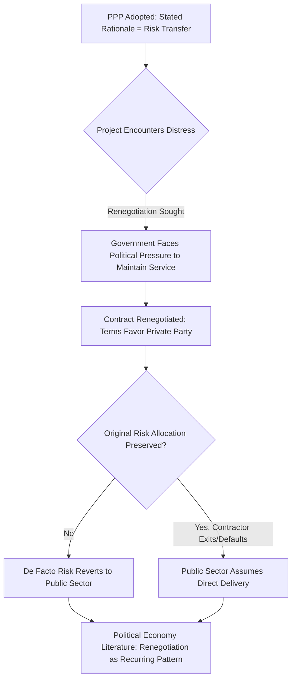

## Political Economy Drivers of PPP Adoption

### Overview and Analytical Framing

Political economy analysis of PPP adoption examines why governments choose PPP procurement over conventional public procurement or full privatization, looking beyond the technical value-for-money case to the incentive structures, institutional constraints, and political dynamics that actually drive decision-making. This lens is essential because technical rationales (risk transfer, efficiency gains, private-sector innovation) frequently coexist with, and sometimes are subordinate to, political incentives that a purely financial or engineering analysis would miss.

- Political economy analysis treats PPP adoption as the outcome of interactions among multiple actors with distinct and sometimes conflicting interests: elected officials, civil servants, private investors, multilateral lenders, labor unions, and citizens/voters
- This framing does not assume PPPs are adopted "incorrectly" or in bad faith — it simply recognizes that procurement choice is a political decision embedded in institutional and electoral incentives, not a purely technocratic optimization
- Understanding these drivers is important both for structuring deals realistically and for anticipating the political risks (renegotiation, populist backlash, contract renegotiation) that affect long-term PPP performance

### Fiscal and Budgetary Drivers

#### Off-Balance-Sheet Accounting Incentives

**Key Points**

- A frequently cited driver of PPP adoption is the historical treatment of PPP liabilities as off the government's balance sheet or outside headline public debt/deficit figures, allowing infrastructure investment without immediately breaching fiscal rules or debt ceilings
- This incentive has been significantly narrowed in many jurisdictions through accounting standard reforms (e.g., IPSAS, Eurostat's ESA rules on government deficit and debt) that increasingly require PPP liabilities to be recognized on-balance-sheet when the government bears the majority of risk and reward
- **[Unverified]** The precise accounting treatment thresholds and their practical enforcement vary significantly across jurisdictions and have been subject to periodic reform; current classification rules should be verified against the applicable accounting standard-setter rather than assumed uniform
- **[Inference]** Even where formal accounting treatment has tightened, some analysts argue a residual political incentive persists because PPP payment obligations, even when on-balance-sheet, are typically structured as recurring operating expenditure rather than upfront capital borrowing, which can be politically easier to present to voters and legislatures than a large discrete debt issuance — though this is a contested characterization rather than a settled empirical finding

#### Circumventing Capital Expenditure Ceilings

In many public financial management systems, capital expenditure budgets face tighter annual ceilings or more restrictive approval processes than operating expenditure. PPP structuring, by converting an upfront capital cost into a stream of annual availability payments classified as operating expenditure, can allow infrastructure projects to proceed despite capital budget constraints that would otherwise block conventional procurement — a structural incentive independent of, though often conflated with, headline debt accounting treatment.

#### Intergenerational Cost-Shifting

$$PV(Cost_{PPP}) = \sum_{t=1}^{n} \frac{AP_t}{(1+r)^t}$$

By spreading payment obligations over a 25-30 year concession term, PPPs shift the fiscal burden of infrastructure delivered today onto future taxpayers and future government administrations. **[Inference]** This intergenerational cost-shifting can be a rational and appropriate reflection of the asset's useful life (matching payment to benefit period), but critics argue it can also be politically attractive specifically because it allows a current administration to deliver visible infrastructure without bearing the visible fiscal cost within its own electoral term — the normative assessment of which framing predominates in a given case is contested rather than empirically settled.

### Electoral and Political Cycle Drivers

#### Visible Delivery Within Electoral Timeframes

Elected officials face strong incentives to deliver visible, tangible infrastructure achievements within their electoral term. PPPs, by transferring construction financing and risk to a private consortium with strong commercial incentives to complete on schedule, can compress delivery timelines relative to conventional phased public capital budgeting — making PPP procurement attractive to politicians seeking a completed, ribbon-cutting-ready asset within their time in office.

#### Avoiding Direct Tax Increases

Because PPP payment obligations are structured as long-term contractual commitments rather than upfront borrowing requiring immediate revenue-raising measures, PPP procurement can allow governments to deliver infrastructure without the politically costly step of raising taxes or issuing highly visible public debt in the near term — deferring the political cost of financing to future budget cycles and future officeholders.

#### Legacy and Signaling Value

Large, iconic infrastructure projects (landmark bridges, airports, hospitals) can serve a signaling function for political leaders and, in some cases, national governments seeking to demonstrate modernization or international competitiveness, independent of the narrower technical efficiency case for PPP procurement specifically.

### Institutional and Bureaucratic Drivers

#### Public Sector Capacity Constraints

**Key Points**

- Many governments, particularly at subnational or developing-country level, lack the in-house technical, financial, and project management capacity to design, procure, and manage complex infrastructure projects, making private-sector partnership an institutional necessity rather than a purely preference-driven choice
- Multilateral development banks and bilateral donor agencies have historically promoted PPP procurement partly as a mechanism to bring in private-sector technical expertise and project discipline where public institutional capacity is weak
- **[Inference]** This capacity-driven rationale can create a structural risk: governments with the weakest institutional capacity to manage complex projects are often also the least equipped to negotiate, monitor, and enforce complex long-term PPP contracts, potentially exposing them to disadvantageous terms relative to better-resourced private counterparties — this is a widely discussed concern in development finance literature rather than a universally documented outcome in every case

#### Path Dependency and Institutional Momentum

Once a government establishes dedicated PPP units, legal frameworks, and standard-form contracts, an institutional and bureaucratic momentum favoring continued PPP use can develop, independent of a fresh case-by-case value-for-money assessment for each subsequent project — a documented pattern in institutional economics more broadly, applied here to the specific case of PPP procurement units.

#### Multilateral and Donor Conditionality

In some developing-country contexts, PPP adoption has been directly linked to conditionality attached to multilateral lending or development assistance, where PPP procurement or enabling legal reform is a condition of broader financial support — making PPP adoption in these cases partly externally driven rather than purely a domestic political economy outcome.

### Risk Transfer Rhetoric vs. Actual Practice

A recurring theme in political economy analysis of PPPs is the gap between the stated rationale (genuine risk transfer to the private sector, incentivizing efficiency) and observed practice in some cases:

**[Inference]** A body of academic and policy literature has documented contract renegotiation as a recurring feature of PPP practice in multiple countries and sectors, particularly in transport and utility concessions, often occurring relatively early in the concession term; however, the frequency, causes, and normative interpretation of renegotiation (opportunistic private-party behavior vs. genuine unforeseen circumstance vs. poor original risk allocation) vary by study and sector, and reflect an active area of empirical research rather than a single settled conclusion.

### Interest Group and Stakeholder Dynamics

| Stakeholder | Typical Incentive Toward PPP | Typical Concern/Opposition |
| --- | --- | --- |
| Elected officials | Visible delivery, deferred fiscal cost | Renegotiation risk, political blame if service fails |
| Civil service/bureaucracy | Access to private technical capacity | Loss of direct control, institutional capacity erosion |
| Private investors/lenders | Long-term stable, often government-backed revenue | Political/regulatory risk, expropriation concern |
| Labor unions | — | Job security, terms/conditions concerns for transferred staff |
| Civil society/advocacy groups | — | Transparency, accountability, distributional equity concerns |
| Multilateral/donor institutions | Leverage private capital and expertise | Debt sustainability, governance capacity concerns |
| Taxpayers/citizens | Faster infrastructure delivery | Long-term cost, value-for-money uncertainty, reduced public control |

### Value-for-Money Analysis as Political Legitimation Tool

Formal value-for-money (VfM) assessments and Public Sector Comparator (PSC) analyses are frequently required as a procedural step before PPP approval, intended to provide an objective, technical justification for the procurement choice. **[Inference]** Political economy scholars have noted that the assumptions underlying VfM/PSC analysis (discount rates, risk transfer valuation, optimism bias adjustments) involve significant analytical judgment, and some research has questioned whether such analyses are, in practice, sometimes structured or interpreted in ways that support a procurement decision already favored on political or institutional grounds rather than functioning as a genuinely neutral ex ante test — this remains a debated methodological and empirical question rather than a documented universal practice, and the degree to which it applies varies substantially by jurisdiction, institutional quality, and the independence of the reviewing body.

### Common Pitfalls in Political Economy Analysis

- Treating PPP adoption purely as a technical/financial decision while ignoring the electoral, fiscal-accounting, and institutional incentives that frequently drive the underlying procurement choice
- Assuming political economy drivers are uniformly "bad" or corrupt rather than recognizing that genuine capacity constraints, appropriate intergenerational cost-matching, and legitimate risk transfer can coexist with the political incentives described above
- Underestimating the durability of institutional momentum (dedicated PPP units, established legal frameworks) in perpetuating PPP use independent of case-by-case merit
- Failing to anticipate renegotiation risk stemming from the gap between the political incentive to announce a project and the sustained political will required to enforce the original risk allocation through a distress event
- Overlooking multilateral/donor conditionality as a distinct and sometimes underacknowledged driver in developing-country PPP programs

**Next Steps**

- Value-for-Money Analysis and the Public Sector Comparator Methodology
- Contract Renegotiation Patterns and Determinants in PPP Practice
- Fiscal Risk Reporting and Contingent Liability Disclosure for PPPs
- Multilateral Development Bank Conditionality and PPP Enabling Reform
- Anti-Corruption Safeguards in PPP Procurement
- Labor and Employment Transition Issues in PPP Transactions