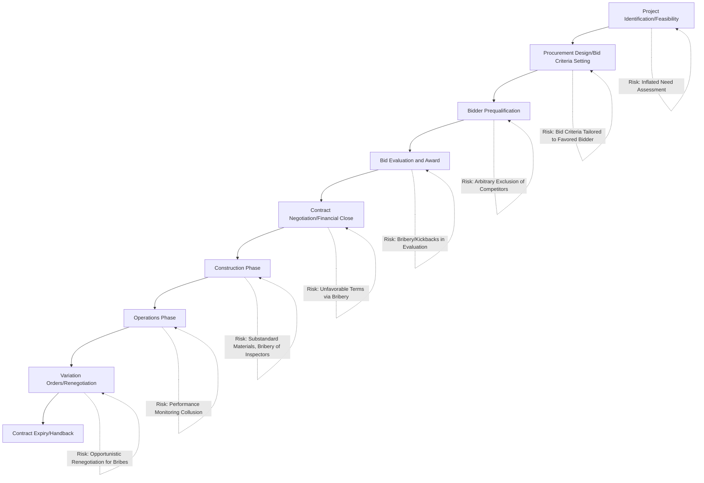

## Corruption Risks in PPP Procurement and Mitigation Strategies

### Overview and Why PPPs Carry Distinct Corruption Risk

PPPs present corruption risk profiles distinct from conventional public procurement because of their scale, complexity, long duration, and the significant information asymmetries between public officials and sophisticated private bidders. The combination of large capital sums, technically complex bid evaluation, extended negotiation periods, and multi-decade contract administration creates multiple discrete points at which corrupt influence can be introduced, many of which are less prominent or absent in shorter-duration, more standardized conventional procurement.

- Unlike a simple goods/services tender, a PPP transaction involves financial structuring, risk allocation, and long-term contract terms that are inherently harder for oversight bodies, legislatures, and the public to scrutinize in real time
- The multi-decade contract life creates ongoing corruption exposure at the post-award administration stage (variation orders, dispute resolution, renegotiation) that persists long after the original competitive tender is complete
- The technical complexity of value-for-money and risk-transfer analysis can itself be exploited to obscure corrupt or favoritism-driven procurement decisions behind a veneer of technical justification

### Corruption Risk Points Across the PPP Project Cycle

### Corruption Risk by Project Stage

#### Project Identification and Feasibility Stage

**Key Points**

- Risk of project selection driven by opportunities for rent extraction rather than genuine public need, sometimes termed "white elephant" projects in the political economy literature — infrastructure justified more by the financial opportunities it creates for connected parties than by demonstrated demand
- Feasibility studies and demand forecasts can be manipulated (optimism bias inflated deliberately rather than through genuine forecasting error) to justify a project that primarily benefits specific private or political interests
- Land acquisition and site selection decisions at this stage are a documented corruption risk point, particularly where compensation values or site choice benefit parties with advance knowledge of the project

#### Procurement Design and Bid Criteria Setting

Corruption at this stage typically involves tailoring technical specifications, qualification criteria, or evaluation weightings to favor a predetermined bidder, effectively converting a nominally competitive tender into a foregone conclusion. This can include:

- Setting technical qualification thresholds that only one or a small number of connected firms can meet
- Structuring evaluation criteria to weight subjective factors heavily, creating discretion for evaluators to favor a preferred bidder despite an ostensibly competitive process
- Unusually short bid submission timeframes that disadvantage bidders without advance informal knowledge of the tender

#### Bidder Prequalification and Evaluation

- Bribery or kickbacks to influence prequalification decisions, bid evaluation scoring, or the selection of members on evaluation committees
- Collusive bidding arrangements among ostensibly competing bidders (bid-rigging), where firms coordinate to ensure a predetermined outcome while maintaining the appearance of competition
- Conflicts of interest among evaluation committee members with undisclosed financial or personal relationships to bidding consortia

#### Contract Negotiation and Financial Close

Because many PPP procurement processes include a negotiation phase even after competitive bid selection (particularly in Competitive Dialogue-style procedures), this stage creates a distinct corruption risk window where final contract terms — price, risk allocation, performance standards — can be altered in the winning bidder's favor through improper influence, occurring after competitive tension has already been resolved.

#### Construction and Operations Phases

- Substandard materials or construction quality substituted for specified standards, facilitated by bribery of inspectors or independent certifiers
- Collusion in performance monitoring and payment mechanism administration, where monitoring officials underreport contractor performance failures in exchange for improper payments, resulting in the public authority paying full unitary charges despite service shortfalls

#### Post-Award Renegotiation

**[Inference]** A substantial body of political economy and development finance literature has identified post-award contract renegotiation as a particularly significant corruption risk window, because renegotiations often occur outside the transparency and competitive discipline of the original tender process, involve fewer parties, and can be structured to quietly shift risk and value toward the private party — however, not all renegotiation reflects corruption, and legitimate renegotiation can and does occur due to genuine unforeseen circumstances; distinguishing the two requires case-specific analysis rather than treating all renegotiation as presumptively corrupt.

### Mitigation Strategies

#### Procedural and Legal Safeguards

- **Standardized bidding documents and evaluation criteria**: reducing evaluator discretion through objective, quantifiable, and pre-disclosed evaluation formulas rather than heavily weighted subjective criteria
- **Mandatory public disclosure of bid evaluation results and scoring**: enabling losing bidders and civil society to scrutinize the basis for award decisions and challenge apparent irregularities
- **Conflict-of-interest disclosure and recusal requirements**: mandatory declarations for all officials involved in project identification, procurement design, and evaluation, with defined recusal protocols for identified conflicts
- **Independent procurement oversight bodies**: dedicated anti-corruption or procurement integrity units with authority to review and, where warranted, halt or investigate PPP tenders independent of the procuring agency itself

#### Transparency Mechanisms

- **Open contracting standards**: publication of PPP contracts, feasibility studies, and value-for-money assessments in full or substantial detail, enabling public and civil society scrutiny beyond the procuring agency and immediate stakeholders
- **Beneficial ownership disclosure requirements**: mandating that bidding consortia disclose their ultimate beneficial owners, addressing the risk of shell companies or nominee structures obscuring conflicts of interest or connections to public officials
- **Independent technical and financial advisors**: engaging advisors with no ongoing commercial relationship to bidders to support government procurement teams, reducing information asymmetry that can otherwise be exploited

#### Institutional Design Safeguards

$$RiskExposure = f(Discretion, Opacity, Duration, Materiality)$$

Mitigation strategy design generally targets reducing one or more of these four risk-driving factors: reducing evaluator/official discretion (standardized criteria), reducing opacity (disclosure requirements), managing duration-related risk (independent monitoring across the full contract life, not just at award), and addressing materiality (enhanced scrutiny scaled to project size).

- **Dedicated PPP units with clear mandates and independence**: separating project sponsorship (the agency wanting the project) from procurement oversight (an independent unit assessing and approving the deal) reduces the risk of a single captured agency controlling the entire process
- **Multilateral and independent lender due diligence**: where projects involve development finance institution co-financing, the additional layer of independent due diligence and procurement scrutiny required by these institutions can serve as an external check, though **[Inference]** the effectiveness of this safeguard depends heavily on the rigor and independence of the specific institution's due diligence practices, which vary
- **Whistleblower protection mechanisms**: legal protections and reporting channels for public officials or private-sector employees who identify corrupt practices within the procurement or contract administration process

#### Post-Award Monitoring Safeguards

- **Independent certifiers/technical monitors**: third-party verification of construction quality and ongoing performance against output specifications, reducing reliance on either party's self-reporting (see also the interface risk discussion in social infrastructure PPP structuring)
- **Renegotiation transparency requirements**: mandatory public disclosure and, in some frameworks, legislative or independent regulatory approval requirements for material contract renegotiations, addressing the elevated corruption risk at this stage
- **Regular independent audit of payment mechanism administration**: periodic external audit of deduction calculations and unitary charge payments to detect collusion between monitoring officials and contractors

### International Anti-Corruption Frameworks Applicable to PPPs

**[Unverified]** Multiple international frameworks and conventions address corruption in public procurement broadly, including PPP transactions, such as the UN Convention Against Corruption and various regional anti-bribery instruments; specific applicability, ratification status, and enforcement mechanisms vary by country and should be verified against current international and domestic legal frameworks rather than assumed uniformly applicable.

- Foreign bribery statutes in bidder home jurisdictions (extraterritorial anti-bribery laws) can create liability exposure for multinational bidders even where the corrupt conduct occurs in the host country, adding an external enforcement layer beyond host-country institutions
- Multilateral development bank debarment and sanctions regimes exclude firms found to have engaged in corrupt practices from participating in bank-financed projects, creating a reputational and commercial consequence extending beyond the specific project where misconduct occurred

### Common Pitfalls in Anti-Corruption Structuring

- Concentrating anti-corruption safeguards entirely at the tender/award stage while leaving the multi-decade operations and renegotiation phases comparatively unmonitored, despite evidence that these later stages carry significant corruption risk
- Relying on formal transparency requirements (contract publication) without genuine capacity or civil society access to meaningfully analyze complex, technical PPP contract terms, reducing disclosure to a procedural formality rather than an effective check
- Underresourcing independent oversight and procurement integrity bodies relative to the scale and complexity of the transactions they are meant to scrutinize
- Treating anti-corruption safeguards as separate from, rather than integrated into, the core value-for-money and risk allocation analysis, missing opportunities to design payment mechanisms and monitoring structures that inherently reduce corruption opportunity
- Failing to extend beneficial ownership and conflict-of-interest disclosure requirements to subcontractors and joint venture partners further down the delivery chain, leaving a gap through which corrupt relationships can persist

**Next Steps**

- Political Economy Drivers of PPP Adoption
- Value-for-Money Analysis and the Public Sector Comparator Methodology
- Contract Renegotiation Patterns and Determinants in PPP Practice
- Independent Certifier and Technical Monitor Roles in PPP Contracts
- Open Contracting Standards and Beneficial Ownership Disclosure Frameworks
- Multilateral Development Bank Sanctions and Debarment Regimes