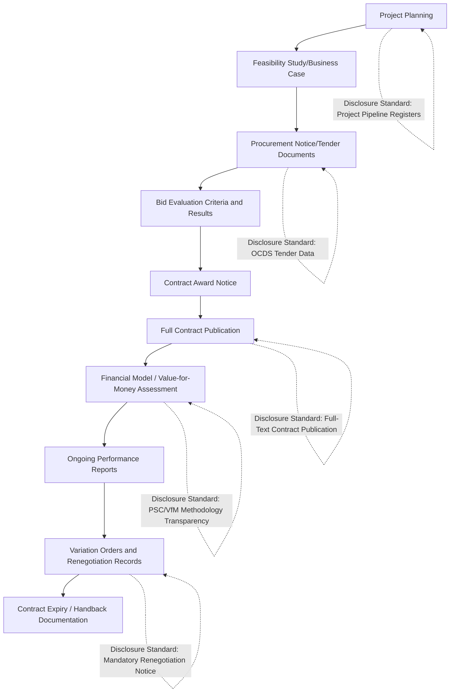

## Transparency, Disclosure, and Open Contracting Standards

### Overview and Rationale

Transparency and disclosure frameworks in PPPs address the information asymmetry between government negotiators, private bidders, and the broader public — an asymmetry that is more acute in PPPs than conventional procurement given contract duration, financial complexity, and the technical sophistication required to evaluate value-for-money claims. Open contracting standards attempt to convert this asymmetry into a manageable, structured disclosure regime rather than leaving transparency to ad hoc political or legal disclosure obligations.

- Transparency serves multiple distinct functions: enabling competitive bidding integrity, allowing civil society and legislative oversight, supporting investor confidence through predictable rule-of-law disclosure norms, and creating an evidentiary record for future dispute resolution or renegotiation scrutiny
- The rationale extends beyond anti-corruption (covered in the related topic on corruption risk mitigation) to encompass broader democratic accountability and fiscal risk management objectives
- Transparency requirements must be balanced against legitimate commercial confidentiality interests (proprietary technical solutions, competitively sensitive financial modeling) — a tension that is a recurring and unresolved design question across jurisdictions rather than one with a single settled resolution

### The Open Contracting Data Standard (OCDS) Framework

**Key Points**

- The Open Contracting Data Standard is a widely referenced framework developed to provide a common, structured data format for publishing procurement information across the full contracting cycle — planning, tender, award, contract, and implementation stages
- OCDS-based disclosure is designed to allow data to be published in a machine-readable format, enabling systematic analysis, cross-project comparison, and automated red-flag detection (e.g., identifying single-bidder tenders or unusual price patterns) rather than relying solely on manual document review
- **[Unverified]** The specific adoption status, implementing jurisdictions, and degree of mandatory versus voluntary application of OCDS-aligned disclosure vary and continue to evolve; current adoption should be verified against the standard's maintaining organization and relevant national procurement transparency initiatives rather than assumed universal
- Applying open contracting data standards to PPPs specifically requires extensions beyond standard goods/services procurement data, given the additional complexity of financial structuring, risk allocation schedules, and long-term payment mechanisms unique to PPP contracts

### What Gets Disclosed Across the Project Cycle

### Full Contract Disclosure Practices

#### Rationale for Publishing Complete PPP Contracts

A growing practice among transparency advocates and some governments is publishing the full text of signed PPP agreements (subject to limited, specifically justified redactions) rather than summary notices alone, on the basis that summary disclosure is insufficient to allow genuine scrutiny of risk allocation, payment mechanisms, and termination provisions buried in lengthy technical schedules.

- **[Inference]** The degree to which full contract publication has become standard practice, as opposed to summary disclosure, varies substantially by jurisdiction and is an area of active policy debate and reform rather than a settled global norm; some countries and multilateral frameworks have moved toward mandatory full publication while others retain more limited disclosure requirements
- Redaction practices, where permitted, are typically limited to narrowly defined categories such as genuinely proprietary technical intellectual property or specific security-sensitive information (particularly relevant to justice sector and critical infrastructure PPPs discussed elsewhere in this curriculum), rather than broad commercial confidentiality claims

#### Value-for-Money and Public Sector Comparator Disclosure

Publishing the underlying methodology, assumptions, and results of value-for-money assessments and Public Sector Comparator analyses is a distinct and often more contested disclosure category than contract text itself, because these documents reveal the government's own cost estimates and negotiating position in ways that some officials argue could disadvantage the government in future negotiations or renegotiations. This creates a direct tension between transparency objectives and negotiating leverage concerns that is resolved differently across jurisdictions.

### Beneficial Ownership Disclosure

A specific and increasingly emphasized transparency requirement addresses the ownership structure of bidding and contracted entities:

- Mandatory disclosure of ultimate beneficial owners of bidding consortia, special purpose vehicles, and major subcontractors, addressing the risk that shell company or nominee ownership structures obscure conflicts of interest, connections to public officials, or sanctioned entities
- **[Unverified]** International standards and national requirements for beneficial ownership disclosure thresholds (e.g., percentage ownership triggering disclosure) and registry accessibility vary considerably and are subject to ongoing reform; current requirements should be checked against the applicable national beneficial ownership registry framework
- Beneficial ownership transparency is particularly significant in PPPs given the frequent use of multi-tiered special purpose vehicle structures for financing and risk isolation, which can otherwise obscure the ultimate economic parties to the transaction

### Legislative and Independent Oversight Access

**Key Points**

- Legislative oversight committees in many jurisdictions have specific statutory or procedural rights to access PPP contract information, financial models, and fiscal risk assessments beyond what is made available to the general public, reflecting a tiered transparency model (full public disclosure of some categories, restricted legislative/auditor access to more sensitive categories)
- Supreme audit institutions (national auditors-general or equivalent) frequently have both the mandate and specialized capacity to conduct in-depth PPP contract and performance audits, serving as an independent check that does not rely solely on public/civil society capacity to interpret complex technical disclosures
- **[Inference]** The effectiveness of legislative and audit oversight is contingent on the independence, resourcing, and technical capacity of these institutions, which varies substantially across jurisdictions; formal statutory access rights do not automatically translate into effective oversight in practice

### Civil Society and Media Monitoring Capacity

Transparency mechanisms are only as effective as the capacity of external actors to use disclosed information meaningfully:

- Investigative journalism and civil society organizations specializing in public finance and infrastructure monitoring play a documented role in identifying irregularities in disclosed PPP data, particularly in jurisdictions with active open contracting data publication
- **[Inference]** A gap frequently identified in transparency literature is the difference between formal disclosure (information technically made available) and functional transparency (information genuinely accessible and interpretable by those with the capacity to scrutinize it) — complex financial models and legal schedules published in raw form may satisfy formal disclosure requirements while remaining functionally inaccessible to most civil society or media actors without specialized expertise
- Capacity-building support for civil society and media analysis of PPP disclosures is increasingly recognized as a necessary complement to disclosure mandates themselves, rather than disclosure alone being sufficient to achieve accountability objectives

### Balancing Transparency with Legitimate Commercial Confidentiality

$$DisclosureScope = TotalContractContent - LegitimateConfidentialityExclusions$$

The core design tension in transparency frameworks is defining a narrow, justified, and consistently applied set of confidentiality exclusions rather than allowing broad or inconsistent redaction that undermines the disclosure regime's purpose:

- Genuinely proprietary technical or financial modeling methodology (distinct from the substantive risk allocation and payment terms themselves) is the most commonly accepted basis for limited redaction
- Security-sensitive information in specific sectors (justice, defense-adjacent infrastructure, critical digital infrastructure) may justify narrower disclosure, though even here, aggregate financial and risk-allocation terms are typically still disclosable
- **[Inference]** Broad commercial confidentiality claims covering pricing, risk allocation, or performance terms are increasingly challenged by transparency advocates as inconsistent with the public-interest rationale for PPP disclosure, on the basis that the government is a party to the contract on behalf of the public and the public retains a legitimate interest in the terms of that agreement; this remains a contested area with varying resolution across legal systems

### Fiscal Risk and Contingent Liability Disclosure

A distinct transparency category, connected to broader public financial management practice, involves disclosing the fiscal risk and contingent liability exposure created by a government's overall PPP portfolio, not just individual project contracts:

- Aggregate PPP payment obligations disclosed alongside conventional public debt figures in fiscal risk statements, addressing the political economy concern (discussed in the related topic on political economy drivers) that PPP structuring can obscure the true scale of government long-term financial commitments
- Contingent liability disclosure covering guarantees, minimum revenue guarantees, and termination payment obligations that may not appear in the baseline unitary charge projections but represent material fiscal exposure under specified trigger conditions

### Common Pitfalls in Transparency Framework Design

- Publishing summary procurement notices while treating full contract text, financial models, and risk allocation schedules as confidential, providing only superficial rather than substantive transparency
- Applying inconsistent or overly broad commercial confidentiality redactions that vary by project or negotiator discretion rather than following clearly defined, consistently applied criteria
- Disclosing information in formats (lengthy unstructured PDF documents rather than structured, machine-readable data) that satisfy formal disclosure obligations without enabling genuine analytical scrutiny
- Neglecting fiscal risk and contingent liability disclosure at the portfolio level, allowing the cumulative long-term fiscal exposure of a government's PPP program to remain obscured even where individual contracts are disclosed
- Underinvesting in civil society and legislative capacity to interpret disclosed technical and financial information, leaving formal transparency requirements without a functional accountability mechanism to act on them

**Next Steps**

- Corruption Risks in PPP Procurement and Mitigation Strategies
- Political Economy Drivers of PPP Adoption
- Fiscal Risk Reporting and Contingent Liability Disclosure for PPPs
- Value-for-Money Analysis and the Public Sector Comparator Methodology
- Beneficial Ownership Registries and Their Application to Infrastructure Procurement
- Supreme Audit Institution Practice in PPP Contract Oversight