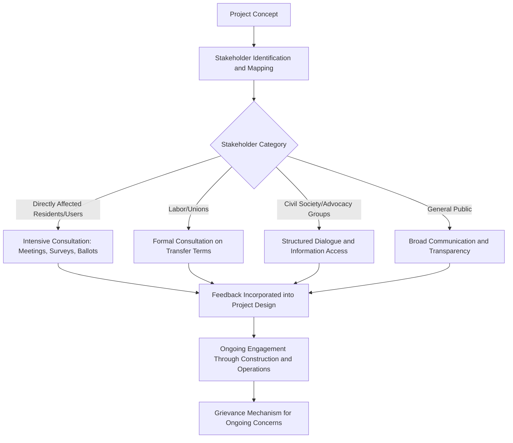

## Public Perception, Acceptability, and Stakeholder Engagement

### Overview and Why Public Acceptability Is a Distinct Structuring Concern

Public perception and stakeholder acceptability function as an independent risk category in PPP structuring, separate from but interacting with the financial, technical, and political economy dimensions covered elsewhere in this curriculum. A PPP that is technically well-structured and fiscally sound can still fail politically or operationally if it lacks public legitimacy — manifesting as protracted legal challenges, protest movements, election-driven contract cancellation, or sustained reputational damage to both government and private partners that outlasts the specific project.

- Public acceptability risk is distinct from, though related to, the political economy drivers of PPP adoption discussed elsewhere — this topic concerns how affected communities and the broader public respond to a PPP once it is proposed or underway, rather than why the government chose PPP procurement in the first place
- Acceptability risk varies systematically by sector: social infrastructure sectors touching sensitive public services (health, corrections, water) tend to generate more intense public scrutiny of privatization elements than sectors seen as more purely commercial (toll roads, energy generation), though this is a general pattern rather than a fixed rule
- Effective stakeholder engagement is increasingly treated as a distinct workstream requiring dedicated expertise and resourcing, rather than an incidental communications function layered onto technical project delivery

### Drivers of Public Opposition to PPPs

#### Ideological and Values-Based Opposition

A segment of public and political opposition to PPPs is rooted in principled objection to private-sector involvement in public service delivery, independent of the specific technical or financial merits of any given project. This opposition frequently centers on:

- Concern that essential public services (water, healthcare, corrections, education) should not be subject to profit-motivated private delivery, regardless of contractual safeguards
- Broader skepticism toward the value-for-money case for PPPs, informed by documented instances of cost overruns, renegotiation, or perceived excessive private-sector returns on other projects
- Labor union opposition tied to concerns over transferred staff terms and conditions, job security, and the broader erosion of public-sector employment

#### Distributional and Equity Concerns

- Concern that PPP-delivered infrastructure (tolled roads, market-rate housing components in mixed-tenure regeneration) may disproportionately benefit higher-income users while burdening lower-income communities with costs or displacement, a concern discussed in sector-specific terms in the social housing and urban regeneration topic
- Perception that long-term payment obligations under availability-payment structures constrain future government fiscal flexibility in ways that will ultimately be borne by taxpayers broadly, including those who did not directly benefit from the specific asset

#### Process-Based Opposition

Distinct from opposition to PPPs in principle, process-based opposition arises from how a specific project was decided, procured, or communicated — inadequate consultation, perceived lack of transparency (connecting directly to the disclosure topic discussed elsewhere), or a sense that affected communities were not meaningfully engaged before key decisions were made.

**[Inference]** Process-based opposition is generally considered more directly addressable through improved stakeholder engagement practice than ideological opposition, since the latter reflects a values position on privatization that consultation process improvements alone are unlikely to resolve — though even well-conducted engagement processes will not eliminate values-based objections, and distinguishing which type of opposition predominates in a given case requires direct engagement with the specific concerns raised rather than assumption.

### Stakeholder Mapping and Engagement Framework

### Consultation Mechanisms by Intensity

**Key Points**

- **Resident ballots and referenda**: the most intensive and formally binding consultation mechanism, increasingly mandated for major regeneration schemes affecting existing social housing tenants (as discussed in the social housing PPP topic), giving directly affected residents a formal vote on whether a scheme proceeds
- **Structured public consultation processes**: statutory or voluntary consultation periods with defined feedback mechanisms, common across most infrastructure sectors and jurisdictions, though the binding weight given to consultation feedback varies significantly — from advisory input only to a formal requirement that specific concerns be addressed before approval
- **Community benefit agreements**: legally negotiated side-agreements between developers and community coalitions (introduced in the social housing PPP topic), representing a more intensive and often legally binding form of stakeholder engagement than standard consultation
- **General public communication and media engagement**: the least intensive but broadest-reach engagement mechanism, relevant to maintaining general public legitimacy for a project even where a smaller group of directly affected stakeholders receives more intensive engagement

### The Information Asymmetry and Trust Deficit Problem

**[Inference]** A recurring theme in public acceptability research is that technical complexity in PPP structuring (risk allocation, financial modeling, payment mechanisms) creates a trust deficit independent of whether the underlying deal terms are genuinely favorable to the public — because most affected stakeholders lack the specialized expertise to independently verify value-for-money claims, public acceptability often depends as much on perceived process fairness and institutional trust as on the technical merits of the specific contract; this is a widely discussed pattern in public administration and political science literature rather than a claim with a single definitive empirical source.

This dynamic creates a structural challenge: the transparency and disclosure mechanisms discussed in the related topic are necessary but often insufficient for public acceptability, because formal disclosure of complex technical information does not automatically translate into public understanding or trust.

### Sector-Specific Acceptability Patterns

| Sector | Typical Acceptability Concern | Common Mitigation Approach |
| --- | --- | --- |
| Water/utilities | Rate increases, loss of public control over essential service | Rate regulation transparency, retained public ownership of core asset |
| Corrections/justice | Privatization of coercive state functions | DBFM-only models retaining custody publicly (see corrections PPP topic) |
| Social housing/regeneration | Displacement, gentrification, loss of affordable stock | Right-to-return guarantees, resident ballots, CBAs |
| Toll roads | Perceived "double taxation" (tolls on publicly-funded corridors) | Clear communication of financing rationale, toll-free alternative routes |
| Healthcare facilities | Fear of reduced clinical service quality or two-tier care | Clear public communication of hard/soft FM boundary (see FM separation topic) |
| Digital/AI infrastructure | Data privacy, surveillance, concentration of benefit | Data governance transparency, public-access commitments |

### Managing Opposition During Project Delivery

Public acceptability risk does not end at project approval — sustained stakeholder engagement through construction and operations phases addresses:

- **Construction-phase disruption grievances**: noise, traffic, temporary service disruption affecting nearby residents or users, requiring active grievance mechanisms and responsive communication rather than one-time pre-approval consultation
- **Performance-related public trust erosion**: well-publicized service failures (even minor, contractually addressed ones) can disproportionately damage broader public confidence in the PPP model generally, beyond the specific project affected
- **Renegotiation and variation transparency**: given the corruption and transparency risks associated with post-award renegotiation discussed elsewhere, maintaining public communication about the reasons for and terms of any renegotiation is important for sustaining acceptability through the full contract life

### Media and Political Narrative Dynamics

**[Inference]** Public and media narratives about PPPs are frequently shaped disproportionately by high-profile failures or controversies (well-publicized cost overruns, service failures, or corruption cases) relative to the larger population of PPP projects that perform adequately without significant public controversy — a pattern consistent with general media coverage dynamics around infrastructure and public policy more broadly, though systematically quantifying this asymmetry across the full global PPP portfolio is methodologically difficult and not something this analysis can verify with precision.

### Common Pitfalls in Stakeholder Engagement Practice

- Treating consultation as a procedural formality completed once before approval, rather than a sustained relationship maintained through construction and operations
- Providing technically accurate but practically inaccessible disclosure (dense financial models, legal schedules) and treating this as equivalent to genuine public understanding or engagement
- Underestimating the durability of ideological opposition to privatization in sensitive sectors, and assuming improved process or communication alone will resolve values-based objections
- Failing to differentiate engagement intensity appropriately by stakeholder proximity and impact, applying uniform broad communication where directly affected communities (e.g., residents facing decant in a regeneration scheme) require more intensive, binding consultation mechanisms
- Neglecting labor and union engagement as a distinct stakeholder category with specific legal and contractual dimensions (transfer terms, conditions) separate from broader community consultation

**Next Steps**

- Transparency, Disclosure, and Open Contracting Standards
- Political Economy Drivers of PPP Adoption
- Social Housing and Urban Regeneration PPPs
- Correctional Facility and Justice Sector PPPs
- Community Benefit Agreements and Their Legal Enforceability
- Grievance Mechanism Design for Long-Term Infrastructure Projects