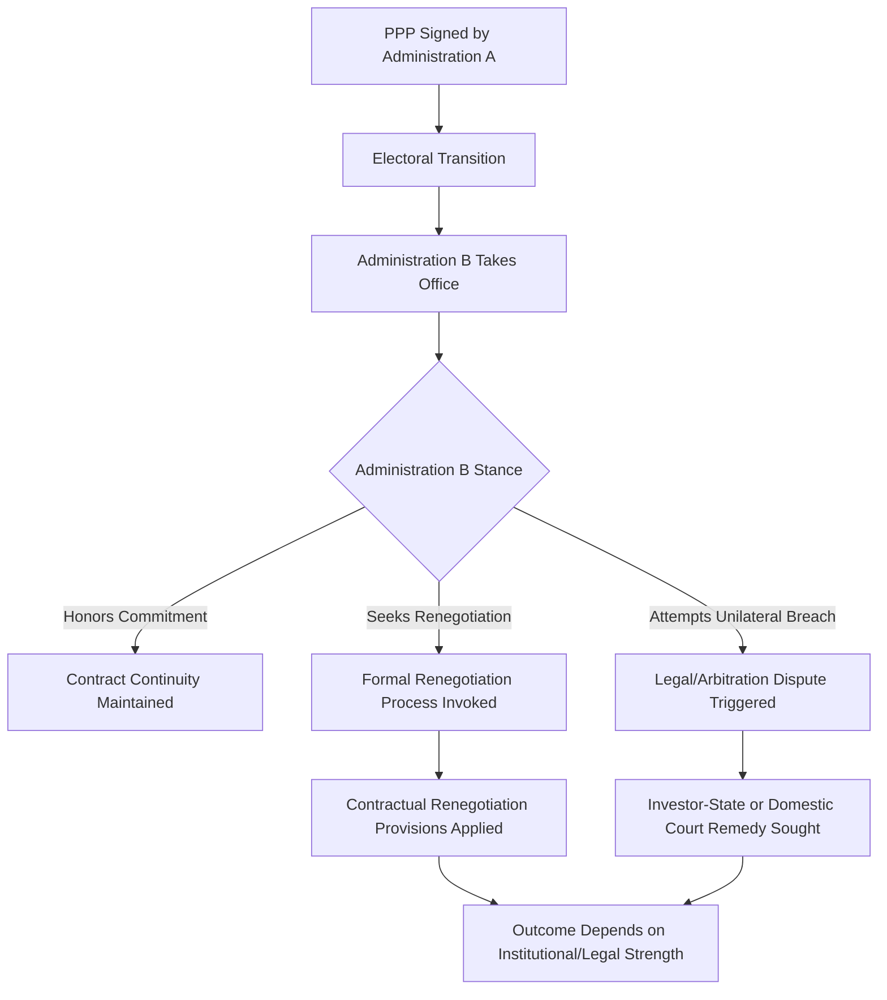

## Electoral Cycles and Time-Inconsistency Problems in PPP Commitments

### Overview and the Core Theoretical Problem

Time inconsistency, a concept originating in monetary policy and public economics literature, describes a situation where a policy that is optimal to announce at one point in time is no longer optimal to implement once circumstances change or once the announcing party's incentives shift — most commonly across an electoral transition. Applied to PPPs, time inconsistency explains why long-term contractual commitments made by one government (spanning 25-30 years) frequently outlast the political mandate, and sometimes the political will, of the administration that signed them, creating a structural vulnerability distinct from ordinary commercial or construction risk.

- The fundamental tension: PPP contracts require credible long-term commitment to attract private capital at reasonable cost, but democratic political systems are designed around finite electoral terms with no binding mechanism to compel a future government to honor a predecessor's long-term commitments in the same way it would honor sovereign debt
- This is a genuine structural feature of democratic governance interacting with long-duration contracting, not a flaw unique to any particular country's institutions, though the severity of the problem varies with institutional and legal safeguards in place
- Time-inconsistency risk is distinct from ordinary political risk (regulatory change, expropriation) in that it specifically concerns the credibility and durability of the *original commitment itself* across a change in the party or individuals holding political power, rather than risk arising from external events

### Mechanisms Through Which Time Inconsistency Manifests

#### Change of Government/Administration

The most direct manifestation: an incoming government, particularly one that opposed the PPP during opposition or campaigned on a platform critical of the specific project or PPP procurement generally, faces a political incentive to renegotiate, contest, or attempt to unwind a contract signed by a predecessor administration, even where the contract remains legally binding.

$$V_{new} = V_{political}(Renegotiation) - C_{legal}(BreachOrRenegotiation)$$

Where the new administration weighs the political value of appearing to act against an unpopular predecessor commitment against the legal and reputational cost of breach or contested renegotiation — a calculus that shifts unpredictably with each electoral cycle in ways the original contracting parties cannot fully anticipate at financial close.

#### Mid-Term Political Pressure Without Change of Government

Time-inconsistency pressure can also arise within a single administration's term, where initial political support for a project erodes due to changed circumstances (cost overruns becoming public, service performance issues, shifting public opinion) even without an electoral transition, creating pressure to renegotiate or publicly distance from a commitment the same government originally made.

#### Populist and Anti-Establishment Political Dynamics

**[Inference]** Some political science and public administration literature suggests PPPs, given their association with prior administrations, private capital, and technical complexity, can become a specific target for populist political movements seeking to contrast their approach with an established political and technical elite — making PPP contracts symbolically vulnerable to renegotiation or cancellation campaigns independent of the specific contract's technical merit; the extent and generality of this pattern across different political contexts is a matter of ongoing scholarly discussion rather than an established universal finding.

### Contractual and Institutional Mitigants

#### Legal and Constitutional Entrenchment

- Framework PPP legislation in many jurisdictions establishes that PPP contracts are binding government obligations enforceable regardless of subsequent administration changes, functioning similarly to sovereign debt obligations in their legal durability, though **[Unverified]** the specific legal mechanisms, enforcement strength, and practical track record of such entrenchment vary substantially by jurisdiction and legal tradition and should be verified against the applicable domestic legal framework
- Independent judicial or arbitral dispute resolution mechanisms, often specified in the original contract (domestic courts, international arbitration under frameworks such as ICSID for cross-border investor-state disputes), provide the private party a legal remedy against unilateral government breach, raising the cost of opportunistic time-inconsistent behavior

#### International Investment Protection

For PPPs involving foreign private investors, bilateral investment treaties and international investment agreements can provide an additional layer of protection against expropriation or unfair treatment following a change of government, creating a cost to the host government (potential international arbitration liability) that raises the credibility of the original commitment. **[Inference]** The scope, strength, and current political standing of investor-state dispute settlement mechanisms varies considerably by treaty and has been subject to significant reform debate and renegotiation in various jurisdictions in recent years; current treaty coverage and enforcement practice should be verified rather than assumed stable.

#### Independent PPP Units and Institutional Continuity

Establishing dedicated PPP units with institutional continuity independent of any single political administration (career civil service staffing, statutory independence from ministerial direction on contract administration matters) can reduce time-inconsistency risk by embedding contract stewardship in an institution designed to outlast electoral cycles, distinct from the political leadership that negotiated the original deal.

#### Cross-Party Political Consensus Building

**Key Points**

- Some governments explicitly pursue cross-party political consensus or bipartisan support before committing to major long-term PPP programs, seeking to reduce the likelihood that a change of government will produce a fundamentally different stance toward existing commitments
- This approach has inherent limits — consensus achieved at signing does not guarantee consensus will persist, particularly if project performance issues emerge or if political dynamics shift due to unrelated factors
- Building broad stakeholder buy-in (discussed in the related public acceptability topic) can complement formal cross-party consensus by creating a broader constituency invested in project continuity beyond the signing administration itself

### Renegotiation as the Practical Manifestation of Time Inconsistency

The contract renegotiation phenomenon discussed in the political economy drivers and corruption risk topics is frequently, though not always, connected to time-inconsistency dynamics specifically:

- A change of government creates a natural juncture for renegotiation demands, whether framed as addressing genuine grievances with the prior administration's deal terms or as opportunistic political positioning
- **[Inference]** Distinguishing legitimate renegotiation motivated by genuinely changed circumstances from renegotiation driven primarily by time-inconsistency political dynamics (a new administration simply wanting to be seen renegotiating a predecessor's deal) is analytically difficult in practice and is a subject of ongoing academic debate rather than one with a clear diagnostic test; the same renegotiation event can often be plausibly characterized either way depending on the analyst's perspective

### Sector and Payment Structure Interactions

| Structural Feature | Time-Inconsistency Exposure | Mitigating Factor |
| --- | --- | --- |
| Availability payments (fixed, non-discretionary) | Lower — payment obligation is contractually fixed regardless of political stance | Strong legal enforceability of the underlying payment obligation |
| Demand-risk/toll concessions | Higher — political pressure to reduce or freeze toll rates is a common time-inconsistency manifestation | Independent toll-setting formulas removed from direct political discretion |
| Sensitive sectors (corrections, water) | Higher — ideologically charged sectors more prone to targeted political campaigns | DBFM-only structuring reducing "privatization" framing (see corrections PPP topic) |
| Projects with highly visible cost overruns | Higher — provides concrete political ammunition for a new administration | Robust original risk allocation minimizing public cost exposure in the first place |

### Common Pitfalls in Managing Time-Inconsistency Risk

- Assuming legal enforceability alone is sufficient protection without accounting for the political and reputational cost a government may be willing to bear to exit or renegotiate an unpopular commitment despite legal exposure
- Underinvesting in original project design and stakeholder engagement quality, leaving a project more vulnerable to become a political target if it later proves to have been poorly conceived or communicated
- Failing to build institutional continuity (independent PPP units, statutory frameworks) that can provide stability independent of any single administration's political stance
- Over-relying on cross-party political consensus achieved at signing without recognizing that such consensus can erode over a multi-decade contract term as the political landscape and personnel change repeatedly
- Neglecting the interaction between time-inconsistency risk and payment mechanism design, where demand-risk structures create materially higher exposure to populist political pressure than availability-payment structures

**Next Steps**

- Political Economy Drivers of PPP Adoption
- Corruption Risks in PPP Procurement and Mitigation Strategies
- Public Perception, Acceptability, and Stakeholder Engagement
- Contract Renegotiation Patterns and Determinants in PPP Practice
- Investor-State Dispute Settlement and Bilateral Investment Treaty Protections
- Institutional Design of Independent PPP Units