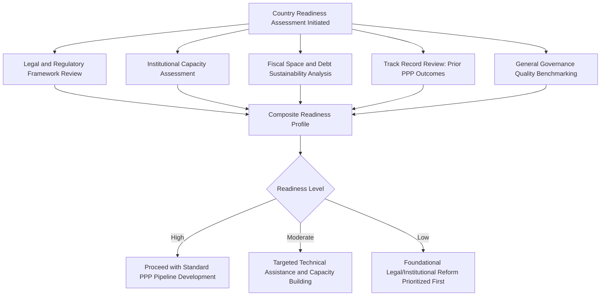

## Governance Indices and Country Readiness Assessments

### Overview and Purpose

Governance indices and country readiness assessments are diagnostic tools used by governments, multilateral development banks, and private investors to evaluate whether a given jurisdiction possesses the institutional, legal, and administrative foundations necessary to support successful PPP procurement and long-term contract management. These tools sit at the intersection of the political economy, corruption risk, and time-inconsistency themes covered elsewhere in this chapter, converting qualitative institutional concerns into structured, comparable assessment frameworks used in practice to inform investment and lending decisions.

- These assessments serve multiple audiences and purposes simultaneously: guiding multilateral development bank lending and technical assistance prioritization, informing private investor risk pricing and country selection, and providing governments themselves with a diagnostic tool to identify reform priorities before launching a PPP program
- **[Unverified]** Because this is a domain with actively maintained, periodically updated indices and assessment frameworks published by various institutions, specific current rankings, scores, and methodological details should be verified directly against the publishing institution's most recent release rather than relied upon from memory, given the frequency of updates and methodology revisions
- No single index or assessment framework is universally treated as authoritative; practitioners typically triangulate across multiple sources given that each framework emphasizes different institutional dimensions and uses different methodologies

### Categories of Relevant Governance and Readiness Frameworks

#### General Governance Quality Indices

Broad governance indices not specific to PPPs but frequently referenced as a foundational input to PPP readiness assessment, typically covering dimensions such as:

- Rule of law and contract enforcement quality
- Control of corruption
- Government effectiveness and regulatory quality
- Political stability and absence of violence
- Voice and accountability (civil liberties, press freedom, democratic participation)

**[Inference]** These general governance indices are widely used as a proxy input into PPP risk assessment precisely because dedicated PPP-specific institutional data is less comprehensive and less consistently available across countries than broader governance indicators; however, using general governance quality as a direct proxy for PPP-specific institutional readiness involves an inferential leap that may not fully capture PPP-specific institutional capacity (e.g., a country could have strong general rule-of-law institutions but underdeveloped specific PPP legal frameworks, or vice versa).

#### PPP-Specific Readiness and Benchmarking Frameworks

Distinct from general governance indices, some frameworks are specifically designed to assess PPP institutional readiness, typically evaluating dimensions such as:

- Existence and quality of dedicated PPP-enabling legislation
- Presence and institutional capacity of a dedicated PPP unit or equivalent government body
- Track record of prior PPP transactions and their outcomes (completed, renegotiated, terminated)
- Availability of standardized contract templates, procurement guidelines, and dispute resolution mechanisms
- Fiscal risk management and contingent liability disclosure practices specific to PPP portfolios

**[Unverified]** Specific PPP-specific benchmarking frameworks (such as those historically maintained by certain multilateral development banks or research institutions) have varied in their availability, continuity, and specific scoring methodology over time, with some frameworks discontinued or substantially revised; current availability and the specific institutions maintaining active PPP readiness benchmarking should be verified directly rather than assumed to match any prior period's landscape.

### Structuring a Country Readiness Assessment

### Key Assessment Dimensions in Detail

#### Legal and Regulatory Framework Quality

**Key Points**

- Assessment typically examines whether enabling PPP legislation exists, whether it provides clear procurement procedures, dispute resolution mechanisms, and government payment obligation enforceability, and whether the legal framework has been tested through actual completed transactions rather than existing only in statute
- The presence of standardized contract templates and procurement guidance materials is generally treated as a positive readiness indicator, reducing transaction costs and negotiation uncertainty for both government and private bidders on subsequent projects
- Legal framework assessment often specifically examines the mechanisms discussed in the time-inconsistency topic — how binding PPP contractual obligations are treated across changes in government, and what dispute resolution recourse exists for private parties

#4### Institutional Capacity

Assessment of the specific government institutions responsible for PPP project identification, procurement, negotiation, and ongoing contract management, evaluating:

- Existence, independence, and technical staffing of a dedicated PPP unit or equivalent body
- Track record of successful project preparation, procurement, and contract administration
- Availability of specialized technical, legal, and financial advisory capacity, whether in-house or through established access to external expertise

#### Fiscal Space and Debt Sustainability

Given the fiscal risk and off-balance-sheet accounting themes discussed in the political economy drivers topic, readiness assessments typically incorporate an evaluation of:

$$FiscalSpace = DebtCeiling - (ExistingDebt + ContingentLiabilities_{PPP})$$

Where the assessment considers not just headline government debt but the aggregate contingent liability exposure created by existing and planned PPP commitments, addressing the concern that fiscal space can be effectively exhausted through PPP payment obligations even where conventional debt metrics appear healthy.

#### Track Record and Precedent Transactions

**[Inference]** A jurisdiction's history of completed, renegotiated, and terminated or failed PPP transactions is widely treated by both multilateral institutions and private investors as one of the most informative readiness indicators, on the reasoning that revealed institutional behavior in prior transactions is a stronger predictor of future contract administration quality than stated legal frameworks or policy intentions alone — though a limited or absent track record (common in jurisdictions newly entering PPP procurement) does not necessarily indicate poor readiness, simply an absence of evidence either way, which assessment frameworks generally treat as a distinct category from a demonstrated poor track record.

### Use of Readiness Assessments by Different Stakeholders

| Stakeholder | Primary Use of Readiness Assessment |
| --- | --- |
| Multilateral development banks | Prioritizing technical assistance and structuring lending/guarantee support |
| Private investors and lenders | Country risk pricing, investment committee approval, political risk insurance decisions |
| Host governments | Self-diagnostic tool for sequencing institutional and legal reform before launching a PPP pipeline |
| Political risk insurers/export credit agencies | Underwriting decisions and premium pricing for coverage of PPP-related political risk |
| Rating agencies | Informing sovereign and sub-sovereign credit assessments where PPP contingent liabilities are material |

### Limitations and Critiques of Governance Index Methodology

- **[Inference]** General governance indices, while widely used, have been subject to methodological critique in academic literature regarding subjectivity in underlying data sources (often based on expert surveys or perception-based measures rather than directly observable outcomes), potential cultural or ideological bias in what constitutes "good governance," and limited ability to capture rapid institutional change within an annual or biennial update cycle — these are documented methodological debates in political science and development economics rather claims specific to this curriculum's characterization
- Country-level aggregate indices may obscure significant subnational variation relevant to PPP structuring, particularly in federal systems or countries with significant regional institutional capacity differences, where a national-level score may not accurately characterize the specific subnational jurisdiction where a project is being structured
- Readiness assessments conducted at a single point in time can become outdated relatively quickly if a jurisdiction undergoes significant political transition, legal reform, or institutional capacity change, creating a need for periodic reassessment rather than reliance on a single historical evaluation

### Common Pitfalls in Applying Readiness Assessments

- Treating a single governance index or readiness score as sufficient due diligence rather than triangulating across multiple frameworks and supplementing with direct, project-specific institutional and legal review
- Applying general governance quality scores as a direct substitute for PPP-specific institutional assessment, missing jurisdiction-specific gaps or strengths not captured in broader governance metrics
- Failing to account for subnational institutional variation when assessing readiness for a specific regional or municipal-level project in a federal or decentralized governance system
- Relying on outdated assessment data in a jurisdiction that has undergone significant recent political or legal change, without commissioning updated, project-specific due diligence
- Using a low readiness assessment as grounds to avoid PPP procurement entirely rather than as a diagnostic tool to sequence appropriate capacity-building and legal reform before proceeding

**Related Topics**

- Political Economy Drivers of PPP Adoption
- Corruption Risks in PPP Procurement and Mitigation Strategies
- Electoral Cycles and Time-Inconsistency Problems in PPP Commitments
- Fiscal Risk Reporting and Contingent Liability Disclosure for PPPs
- Multilateral Development Bank Conditionality and PPP Enabling Reform
- Bankability Assessment from the Private Sector Perspective