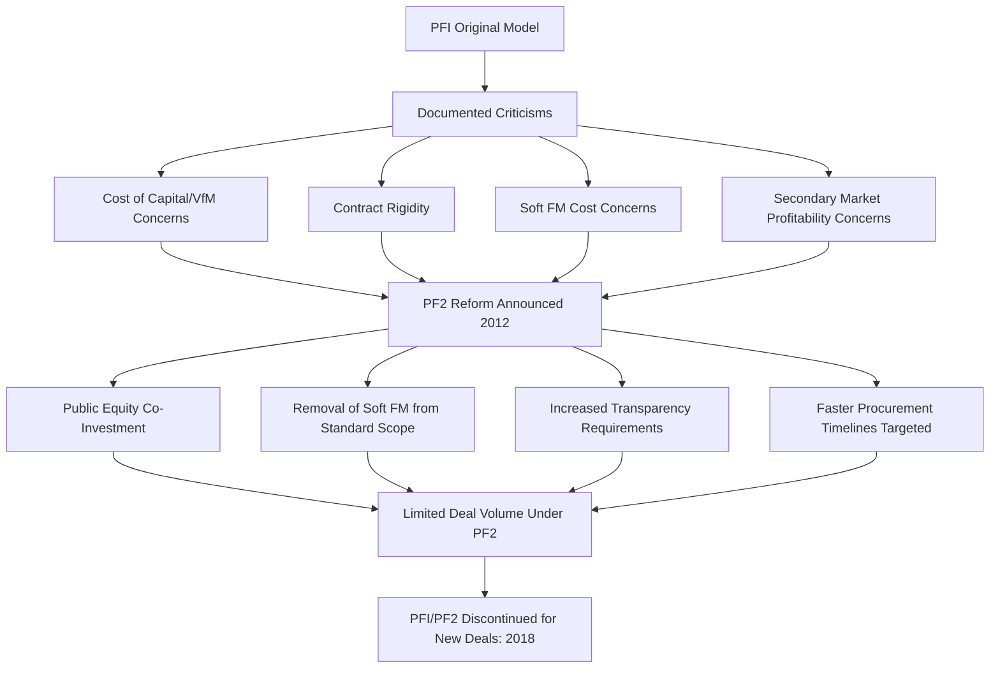

## The UK Private Finance Initiative and PF2 Reforms

### Overview and Historical Significance

The UK Private Finance Initiative (PFI), launched in 1992 and expanded significantly from 1997 onward, is widely regarded as the most influential and extensively studied national PPP program globally, serving as a template — both positive and cautionary — for PPP frameworks developed subsequently in Canada, Australia, continental Europe, and numerous developing countries. Its later reform into PF2 (announced 2012) and eventual full discontinuation of new PFI/PF2 deals (announced 2018) provide one of the most thoroughly documented case studies of a mature PPP program's full lifecycle, from expansion through critique to policy reversal.

- PFI pioneered much of the standard-form contracting language, risk allocation methodology, and payment mechanism structuring now considered conventional across the global PPP industry, including the DBFM availability-payment model discussed extensively elsewhere in this curriculum
- The program's scale was substantial, encompassing hundreds of projects across health, education, transport, defense, and justice sectors over roughly two and a half decades
- **[Unverified]** Precise cumulative figures for total PFI capital value, number of projects, and total committed future payment obligations vary depending on the source, measurement date, and methodology (e.g., whether deals in devolved administrations are included); current authoritative figures should be verified against UK National Audit Office (NAO) or HM Treasury publications rather than relied upon from memory

### Original PFI Design Rationale (1992–2012)

#### Core Structuring Principles

PFI established the DBFM availability-payment model as its standard structure across social infrastructure sectors (schools, hospitals) and some economic infrastructure:

- Private consortia (typically a special purpose vehicle backed by construction, facilities management, and financial investor partners) financed, designed, built, and maintained public assets under long-term contracts (typically 25-30 years)
- Payment was structured as a unitary charge combining availability payments and performance deductions, closely resembling the mechanics described in the payment mechanism topics elsewhere in this curriculum
- The stated rationale emphasized genuine risk transfer (construction and lifecycle maintenance risk shifted to the private sector), private-sector innovation and efficiency, and accelerated infrastructure delivery relative to constrained public capital budgets

#### Off-Balance-Sheet Accounting Treatment

**Key Points**

- A significant driver of PFI's early expansion was the accounting treatment allowing many PFI liabilities to remain off the government's balance sheet under national accounting rules then in effect, directly illustrating the fiscal/political economy dynamics discussed in the political economy drivers topic elsewhere in this curriculum
- This accounting treatment was later substantially reformed; changes to international accounting standards over the following decades required most PFI liabilities to eventually be recognized on the government balance sheet, removing much of the original fiscal-accounting incentive for the specific structuring approach used
- **[Inference]** The subsequent tightening of accounting treatment is widely viewed by researchers as having been a contributing, though not sole, factor in the later decline of PFI's political attractiveness, since it reduced one of the specific incentives (though not the only one) that had originally driven the program's rapid 1990s-2000s expansion

### Documented Criticisms Leading to Reform

#### Cost of Capital and Value-for-Money Concerns

A recurring and well-documented criticism, raised extensively by the UK National Audit Office and Public Accounts Committee over many years, centered on the relative cost of private finance compared to direct government borrowing:

$$Cost_{differential} = r_{private} - r_{government}$$

Because private consortia typically financed projects at a higher cost of capital than the government's own sovereign borrowing rate, critics argued this cost differential needed to be more than offset by genuine efficiency gains and risk transfer value to represent value-for-money — a case that official reviews found was not consistently demonstrated across the full PFI portfolio, particularly for projects where the underlying risks transferred were arguably not those most naturally suited to private management.

#### Contract Rigidity and Change Cost

PFI contracts were widely documented to impose significant costs for even minor variations to specified services once signed, given their detailed, long-term output specifications — a structural feature directly connected to the output specification and interface risk discussions found in the hard/soft FM separation topic elsewhere in this curriculum. Public bodies reported difficulty adapting PFI-contracted facilities to changing operational needs without triggering costly formal variation processes.

#### Soft FM Cost and Quality Concerns

Documented criticism specifically targeted the cost and value-for-money of ancillary soft FM services (cleaning, catering, minor maintenance) bundled into many PFI contracts, with reported instances of costs for routine tasks significantly exceeding comparable conventional procurement costs — a specific and recurring public and media criticism that became symbolically associated with broader PFI skepticism even where it concerned a narrower category of services within the overall contract.

#### Profitability and Secondary Market Concerns

Public scrutiny also focused on the profitability of PFI investment, particularly following the emergence of an active secondary market in which original equity investors sold their stakes in operational PFI projects to infrastructure funds, sometimes at valuations suggesting higher-than-anticipated returns — raising public and parliamentary concern about whether the original risk-pricing and value-for-money assessment had adequately anticipated this outcome.

### PF2 Reforms (Announced 2012)

In response to accumulated criticism, HM Treasury announced PF2 as a reformed successor model, incorporating several structural changes:

Key PF2 structural changes included:

- **Public sector equity co-investment**: government taking a minority equity stake in PF2 special purpose vehicles, intended to give the public sector direct visibility into and a share of investor returns, addressing the secondary market profitability concerns from the original model
- **Removal of most soft FM services from standard scope**: shifting cleaning, catering, and similar services back toward conventional public procurement or shorter-term separate contracts, directly responding to the soft FM cost criticism and narrowing the private party's scope closer to genuine hard FM as discussed in the hard/soft FM separation topic
- **Enhanced transparency requirements**: increased disclosure obligations regarding contract terms and investor returns, reflecting the broader transparency and disclosure themes discussed elsewhere in this chapter
- **Procurement timeline targets**: an explicit objective to reduce the time and cost of the procurement process itself, which had been separately criticized as excessively lengthy and costly for both public and private parties

### Discontinuation of PFI/PF2 (2018)

**[Unverified]** In 2018, HM Treasury announced that no new PFI/PF2 deals would be signed, effectively ending new procurement under this model, though existing contracts continued to run their agreed terms; the precise policy statements, subsequent government reviews, and current status of remaining legacy PFI/PF2 contract administration should be verified against current UK government and National Audit Office publications, since this is now a matured historical policy decision with ongoing legacy contract management implications that may have evolved further since.

**[Inference]** Analysts have offered varying interpretations of why PF2 reform did not sufficiently restore confidence to sustain the program, including the view that the accounting and political economy incentives that had originally driven PFI's rapid expansion had diminished by this period (following the accounting treatment reforms discussed above), reducing the underlying institutional and fiscal motivation for continued use of this specific model even after its structural criticisms were addressed; this remains an area of ongoing policy and academic analysis rather than a matter with a single agreed causal account.

### Lasting Legacy and Influence on Global PPP Practice

Despite the UK's own discontinuation of new PFI/PF2 deals, the program's influence on global PPP practice has been substantial and persists independent of the UK's current domestic policy stance:

- Standard-form output specifications, availability-payment mechanics, and risk allocation matrices used across many international PPP programs, including several sub-sector frameworks discussed elsewhere in this curriculum, trace direct methodological lineage to PFI-era UK Treasury guidance and standard contract templates
- The documented UK experience — both the original model's strengths and its accumulated criticisms — has directly informed subsequent PPP program design in other jurisdictions seeking to capture PFI's demonstrated benefits (delivery speed, genuine construction/lifecycle risk transfer) while avoiding its documented pitfalls (soft FM bundling, inadequate value-for-money demonstration, insufficient transparency)
- The extensive body of UK National Audit Office reports on individual PFI projects and the program overall constitutes one of the most detailed publicly available empirical records of long-term PPP contract performance globally, frequently cited in academic and policy literature on PPP value-for-money and risk transfer effectiveness

### Common Pitfalls and Lessons for Other Jurisdictions

- Underestimating the durability of accounting treatment as a driver of program design, and the risk that reform of accounting standards can remove foundational incentives underpinning an established PPP program's structuring approach
- Bundling ancillary, lower-complexity services (soft FM) into long-term contracts primarily for administrative convenience rather than because genuine long-term risk transfer value justifies the reduced future flexibility this creates
- Insufficient early transparency regarding investor returns and secondary market activity, allowing profitability concerns to accumulate as a significant source of public and political criticism before being addressed
- Failing to build sufficiently flexible contract mechanisms for legitimate operational change, leading to documented rigidity criticism that undermined broader public sector confidence in the model
- Treating a reformed successor model (PF2) as sufficient to fully restore program credibility without addressing the underlying political economy and accounting dynamics that had shifted since the original program's inception

**Related Topics**

- Political Economy Drivers of PPP Adoption
- Separating Hard Facilities Management from Clinical or Educational Services
- Value-for-Money Analysis and the Public Sector Comparator Methodology
- Transparency, Disclosure, and Open Contracting Standards
- Contract Renegotiation Patterns and Determinants in PPP Practice
- Comparative Case Study: Canadian P3 and Australian PPP Program Design