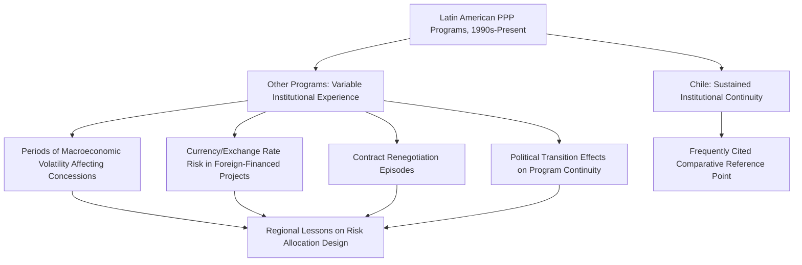

## Chilean Concession Program and Latin American Experience

### Overview and Historical Significance

The Chilean concessions program, initiated in the early 1990s, is widely regarded as one of the earliest and most institutionally successful PPP frameworks in a developing-country context, frequently cited as a model that other Latin American countries and, more broadly, other emerging markets have sought to emulate or adapt. Its significance lies particularly in the sustained institutional quality and legal framework stability it achieved relative to many contemporaneous developing-country PPP programs, offering an instructive counterpoint to the more volatile experience seen in several other regional programs.

- Chile's program began under a period of broader market-oriented economic reform and was structured with a specific emphasis on transparent competitive bidding, standardized contract frameworks, and dedicated institutional capacity (a concessions unit within the Ministry of Public Works)
- **[Unverified]** Precise cumulative figures on total concession value, number of projects, and sectoral distribution across the program's multi-decade history vary by source and measurement period; current authoritative figures should be verified against Chilean Ministry of Public Works publications or multilateral development bank program reviews rather than relied upon from memory
- The program spans multiple sectors including toll roads, airports, and water infrastructure, applying variants of the demand-risk concession model discussed in economic infrastructure PPP structuring more broadly, though this curriculum's chapter focus here is on political economy and institutional lessons rather than sector-specific technical structuring

### Institutional Design Features Underpinning Program Durability

#### Dedicated Concessions Unit

**Key Points**

- Chile established a specialized institutional unit within its Ministry of Public Works specifically dedicated to concession program design, procurement, and contract administration, providing the kind of institutional continuity and technical capacity discussed in the governance indices and readiness assessment topic elsewhere in this chapter
- This institutional design is frequently cited in comparative PPP literature as a contributing factor to the program's relative consistency across multiple changes of government, illustrating a practical institutional mitigant to the time-inconsistency risks discussed in the related topic on electoral cycles
- **[Inference]** While institutional continuity is widely credited as a contributing factor to program durability, isolating its specific causal contribution from other concurrent factors (macroeconomic stability, broader rule-of-law institutional quality, specific legal framework design) is analytically difficult, and comparative case study literature generally treats institutional design as one of several contributing factors rather than a sole explanatory variable

#### Standardized Legal and Contractual Framework

The program developed relatively standardized concession contract templates and competitive bidding procedures applied consistently across projects and sectors, reducing transaction costs and providing predictability for both domestic and international private bidders — a structural feature directly connected to the standardized bidding documentation approach discussed as a corruption-mitigation and transparency best practice elsewhere in this chapter.

#### Renegotiation Experience

**[Inference]** Despite Chile's generally favorable institutional reputation relative to many regional peers, academic and policy literature examining the Chilean program has documented instances of contract renegotiation over the program's history, consistent with the broader pattern noted in the political economy drivers and corruption risk topics that renegotiation is a recurring feature across PPP programs generally rather than one specific to weaker-institution jurisdictions; the presence of renegotiation in even a comparatively well-regarded program illustrates that strong institutions reduce but do not eliminate this structural PPP characteristic.

### Broader Latin American Regional Experience

#### Diversity of Institutional and Outcome Experience

Latin America as a region has a long and varied history with PPP/concession programs beyond Chile, and the regional experience is frequently studied comparatively precisely because it illustrates a wide range of institutional and outcome variation within a broadly similar legal tradition (civil law systems) and overlapping historical periods of market-oriented reform.

- **Currency and macroeconomic risk exposure**: several Latin American infrastructure concessions, particularly toll road and transport projects with revenue denominated in local currency but financed partly in foreign currency, have been documented in academic and multilateral development bank literature as facing significant financial distress during periods of regional currency devaluation or macroeconomic instability — illustrating a risk category (currency/macroeconomic risk) that interacts with but is analytically distinct from the political economy and governance risks discussed elsewhere in this chapter
- **Demand risk realization gaps**: multiple documented cases across the region involve toll road or transport concessions where actual traffic/demand significantly underperformed initial forecasts, triggering financial distress, renegotiation, or in some cases contract termination — a pattern connected to the broader demand forecasting and optimism bias themes relevant to project appraisal and feasibility study practice
- **[Unverified]** Specific country-by-country outcomes, current program status, and reform trajectories across the region continue to evolve, and given the breadth of countries and time period involved, current status for any specific country's program should be verified against recent, country-specific sources rather than treated as a stable regional generalization

#### Common Structural Lessons Drawn from Regional Experience

**[Inference]** Comparative literature examining the broader Latin American regional experience has drawn several recurring lessons, though the specific weighting and applicability of each lesson varies by country and specific program history:

- The importance of realistic, independently reviewed demand forecasting given the region's documented experience with demand risk realization gaps in transport concessions specifically
- The value of minimum revenue guarantee or demand risk-sharing mechanisms as a partial mitigant to the political and financial distress caused by demand shortfalls, though such guarantees themselves create fiscal contingent liability exposure requiring the disclosure practices discussed in the transparency topic
- The significance of macroeconomic and currency risk management in concession structuring, particularly for projects with foreign currency financing exposed to local currency revenue streams
- The comparative institutional durability advantage illustrated by Chile's dedicated concessions unit model, informing subsequent institutional design recommendations for other countries in the region and beyond

### Chile's Program as a Comparative Reference Point

Chile's program is frequently used in comparative PPP and development economics literature as an instructive reference point precisely because it demonstrates that strong institutional design, standardized procurement, and dedicated technical capacity can produce a relatively durable and consistent PPP program even amid the electoral and political economy pressures discussed generally in this chapter — while the broader regional experience simultaneously illustrates that this outcome is not automatic or guaranteed by shared legal tradition or historical period alone, but appears connected to the specific institutional choices made.

**[Inference]** The degree to which Chile's specific institutional model is directly transferable to other countries with different legal traditions, administrative capacity baselines, and political contexts is a matter of ongoing debate in development economics and comparative public administration literature; institutional transplantation across different contexts does not automatically replicate outcomes achieved in the origin context, and this caveat is broadly recognized in the comparative institutional literature rather than specific to this curriculum's characterization.

### Risk and Structural Comparison Summary

| Dimension | Chile (Program-Level Pattern) | Broader Regional Pattern (Variable) |
| --- | --- | --- |
| Institutional continuity | Comparatively high, dedicated unit | Variable, dependent on specific country |
| Legal/contractual standardization | Relatively standardized | Variable across countries |
| Demand risk realization | Documented cases exist but program generally sustained | Documented significant shortfall cases in multiple countries |
| Renegotiation incidence | Present but within a functioning institutional framework | Present, sometimes associated with broader program distress |
| Currency/macroeconomic risk exposure | Relevant given regional economic history | Significant factor in several documented distress cases |

### Common Pitfalls and Lessons for Other Jurisdictions

- Assuming that a strong legal framework alone guarantees program durability without the complementary dedicated institutional capacity that Chile's specific model emphasized
- Underestimating currency and macroeconomic risk in concession structuring, particularly where foreign currency financing is paired with local currency revenue streams, a documented source of financial distress in the broader regional experience
- Relying on optimistic demand forecasts without independent review or adequate consideration of risk-sharing mechanisms, given the region's documented pattern of demand risk realization gaps in transport concessions
- Assuming institutional design features transferable across contexts will automatically replicate outcomes achieved in their origin jurisdiction, without accounting for differing legal, administrative, and political contexts
- Treating "Latin American experience" as a homogeneous category rather than recognizing substantial documented variation in institutional quality and outcomes across countries within the region

**Related Topics**

- Governance Indices and Country Readiness Assessments
- Electoral Cycles and Time-Inconsistency Problems in PPP Commitments
- The UK Private Finance Initiative and PF2 Reforms
- Bankability Assessment from the Private Sector Perspective
- Demand Forecasting and Optimism Bias in Project Appraisal
- Minimum Revenue Guarantees and Demand Risk-Sharing Mechanisms