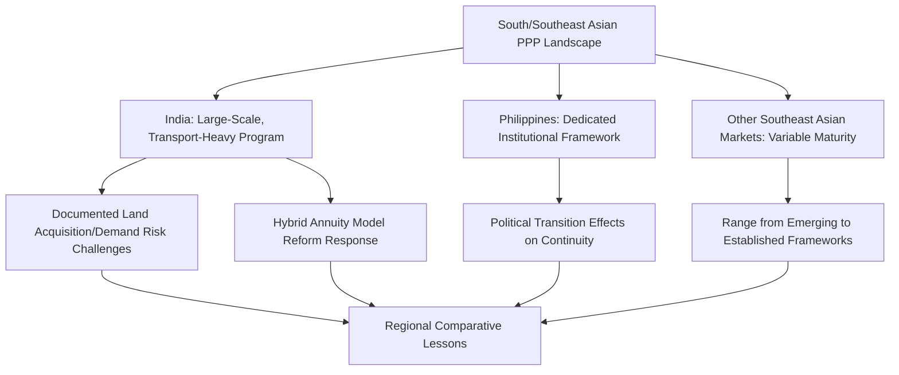

## PPP Programs in India, the Philippines, and Southeast Asia

### Overview and Regional Framing

South and Southeast Asian PPP experience encompasses some of the largest PPP programs globally by transaction volume (particularly India) alongside smaller but institutionally distinctive programs across the Philippines and other Southeast Asian jurisdictions. The region is frequently studied comparatively because it illustrates a wide range of institutional maturity, sectoral emphasis, and program outcomes within a broadly overlapping timeframe of PPP program expansion from the 1990s onward, offering a useful complement to the UK, Chilean, and Latin American case studies discussed elsewhere in this chapter.

- **[Unverified]** Given the scale and continuous evolution of PPP activity across this region, specific current program statistics, pipeline figures, and policy status for any individual country should be verified against current national PPP unit publications, multilateral development bank reports (Asian Development Bank, World Bank), or national infrastructure authority sources rather than relied upon from memory
- The region's experience spans nearly every sector discussed elsewhere in this curriculum — transport, power, water, social infrastructure, and increasingly digital infrastructure — making it a broad comparative reference rather than a single sector-specific case study

### India's PPP Program

#### Scale and Sectoral Emphasis

India developed one of the world's largest PPP programs by transaction count and cumulative investment value, with particularly extensive application in highways/road transport (through National Highways Authority of India toll and annuity-based concessions), airports, ports, and power generation, alongside more recent expansion into social infrastructure and urban development sectors.

- The program's scale created substantial institutional learning and standardization over time, including the development of model concession agreements intended to reduce negotiation time and provide consistency across the large volume of individual transactions
- **[Inference]** The sheer transaction volume of India's program is frequently cited in comparative literature as both a strength (extensive institutional learning, standardization) and a source of documented stress (capacity constraints in individual project preparation and oversight relative to pipeline scale), reflecting a genuine tension between program scale and per-project institutional attention rather than one being simply resolved in favor of either characterization

#### Documented Structural Challenges

**Key Points**

- India's road sector PPP program in particular has been extensively documented in policy and academic literature as experiencing a significant wave of financial distress among concessionaires during certain periods, attributed by various analyses to a combination of factors including land acquisition delays, environmental clearance delays, demand/traffic forecasts that did not materialize as projected, and difficulties in the bank lending sector's exposure to stressed infrastructure assets
- Land acquisition risk has been particularly significant and distinctively emphasized in Indian PPP case study literature relative to some other jurisdictions, given the documented complexity, cost, and delay associated with acquiring right-of-way for linear infrastructure projects (highways, and to varying degrees rail and power transmission) under India's land acquisition legal framework
- **[Inference]** These documented challenges led to significant policy and structural reform efforts over time, including shifts in risk allocation approach (for example, increased use of hybrid annuity models that reduce pure demand-risk exposure for concessionaires relative to earlier toll-based structures), though the specific current status and effectiveness of these reforms should be verified against current Indian government and multilateral assessment sources rather than assumed static

#### Hybrid Annuity and Risk-Sharing Model Evolution

$$UC_{hybrid} = CapitalGrant_{upfront} + AnnuityPayment_t$$

In response to documented demand-risk realization challenges in pure toll concessions, India's highway sector notably developed hybrid annuity models combining a partial upfront government capital contribution with subsequent annuity-style payments over the concession term, explicitly reducing the concessionaire's exposure to traffic demand risk relative to a pure toll-revenue model — illustrating a direct policy response to documented sector-specific risk allocation challenges, and a structural evolution parallel to the demand-risk mitigation themes discussed in the Latin American regional experience topic.

### The Philippines' PPP Program

#### Institutional Framework

The Philippines developed a dedicated legal and institutional framework for PPPs, including specific enabling legislation and a designated PPP center/unit function within government, reflecting the institutional design principles discussed in the governance indices and readiness assessment topic elsewhere in this chapter.

- **[Unverified]** The specific current institutional structure, name, and mandate of the Philippines' PPP governing body has been subject to periodic reform and reorganization over the program's history; current institutional details should be verified against current Philippine government sources rather than assumed stable across the program's multi-decade history
- The program has spanned transport (including notable urban transit and airport projects), water, and social infrastructure sectors, with documented variation in project-level outcomes and completion timelines across this sectoral range

#### Documented Program Characteristics

**[Inference]** Comparative and country-specific literature on the Philippines' PPP program has noted, among other themes, the significance of political transition effects on program continuity (connecting to the time-inconsistency dynamics discussed elsewhere in this chapter), with documented instances of project review, renegotiation, or delay associated with changes in national administration — a pattern consistent with, though not unique to, the broader time-inconsistency phenomenon discussed generally rather than a finding specific to any single administration's characterization.

### Broader Southeast Asian Regional Experience

- Southeast Asia beyond India and the Philippines encompasses a wide range of PPP institutional maturity, from countries with well-established, multi-decade programs to those still developing foundational enabling legislation and institutional capacity, consistent with the readiness assessment variation discussed in the governance indices topic
- Regional multilateral institutions (Asian Development Bank prominently, alongside other regional and bilateral development finance institutions) have played a documented role across the region in providing both direct project co-financing and technical assistance for PPP institutional and legal framework development, reflecting the multilateral conditionality and support themes discussed in the political economy drivers topic
- **[Unverified]** Given the number of distinct countries and jurisdictions encompassed by "Southeast Asia" as a regional category, and the pace of ongoing program development and reform across the region, any specific country-level generalization beyond India and the Philippines should be treated as illustrative rather than comprehensive, and current country-specific status should be verified against dedicated current sources

### Comparative Structural Themes Across the Region

| Theme | India | Philippines | Broader Regional Pattern |
| --- | --- | --- | --- |
| Program scale | Very large by transaction volume | Moderate, sector-diversified | Highly variable by country |
| Dominant historical sector emphasis | Transport (highways especially) | Transport, water, social infrastructure | Variable |
| Demand risk structural evolution | Documented shift toward hybrid annuity models | Mixed, project-dependent | Variable, evolving |
| Land acquisition as distinct risk category | Prominently and distinctively documented | Present but less singularly emphasized in literature | Variable by legal/land tenure system |
| Institutional/political transition effects | Documented at state and national levels | Documented across national administrations | Consistent with time-inconsistency theme generally |

### Lessons Drawn from Regional Comparative Experience

**[Inference]** Development finance and academic literature examining this regional experience collectively has drawn several recurring themes, with the caveat that applicability varies significantly by specific country and sector context:

- The particular significance of land acquisition and right-of-way risk as a distinct structuring category in jurisdictions with complex land tenure and acquisition legal frameworks, warranting dedicated risk allocation and timeline planning attention beyond generic construction risk treatment
- The value of adaptive risk allocation reform (such as India's hybrid annuity model evolution) in responding to documented demand-risk realization challenges, illustrating that PPP program design can evolve iteratively based on accumulated transaction-level experience rather than remaining fixed to an initial structuring approach
- The recurring relevance of institutional continuity and political transition management (as discussed in the time-inconsistency topic) across multiple countries in the region, suggesting this is a broadly applicable structural concern rather than one specific to any single country's political context
- The role of regional and multilateral development finance institutions in supporting both direct project financing and the institutional/legal capacity-building that underpins program maturity over time, consistent with the governance readiness assessment themes discussed elsewhere in this chapter

### Common Pitfalls and Lessons for Other Jurisdictions

- Underestimating land acquisition and right-of-way risk in linear infrastructure projects, particularly in jurisdictions with complex or contested land tenure systems, based on the extensively documented Indian highway sector experience
- Structuring pure demand-risk (toll-based) concessions without adequate independent demand forecast review or risk-sharing mechanisms, given the region's documented pattern of financial distress linked to demand shortfalls
- Assuming a single national PPP program characterization applies uniformly across all sectors and time periods within that country, when documented experience shows significant sector-specific and temporal variation (as with India's distinct transport-sector challenges relative to other sectors)
- Failing to anticipate and plan for political transition effects on project continuity, particularly for large or symbolically significant projects that may become associated with a specific outgoing administration
- Treating "Southeast Asia" or even specific large programs like India's as monolithic, when documented experience shows substantial variation by sector, sub-national jurisdiction, and time period requiring project-specific and current due diligence rather than generalized regional assumptions

**Related Topics**

- Chilean Concession Program and Latin American Experience
- Electoral Cycles and Time-Inconsistency Problems in PPP Commitments
- Governance Indices and Country Readiness Assessments
- Demand Forecasting and Optimism Bias in Project Appraisal
- Minimum Revenue Guarantees and Demand Risk-Sharing Mechanisms
- Multilateral Development Bank Conditionality and PPP Enabling Reform