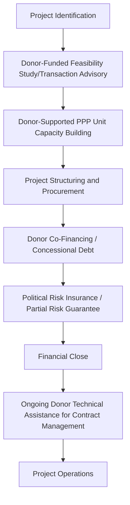

## Sub-Saharan African PPP Markets and Donor Support

### Overview and Distinctive Regional Characteristics

Sub-Saharan African PPP markets present a distinctive case within global comparative PPP experience, characterized by generally earlier-stage institutional development relative to the UK, Chilean, and several Asian programs discussed elsewhere in this chapter, alongside a particularly significant and structurally central role played by multilateral and bilateral development finance institutions in nearly every stage of project preparation, financing, and risk mitigation. This donor-intensive character is not incidental but reflects underlying structural features of the region's infrastructure financing landscape that distinguish it from many other regional case studies in this curriculum.

- **[Unverified]** Given the significant heterogeneity among Sub-Saharan African countries in institutional capacity, market size, and PPP program maturity, and the pace of ongoing development in this area, specific current program statistics and country-level status should be verified against current multilateral development bank (World Bank, African Development Bank) and national PPP unit sources rather than relied upon from memory
- The region encompasses both a small number of countries with comparatively more developed PPP frameworks and institutional capacity, and a larger number of countries at earlier stages of enabling legal and institutional framework development, consistent with the readiness assessment variation discussed in the governance indices topic elsewhere in this chapter
- Infrastructure financing gaps in the region have been extensively documented in development economics literature as substantial relative to available domestic public and private capital, providing a core structural rationale for the emphasis on PPP and blended finance approaches discussed throughout this topic

### The Centrality of Development Finance Institutions

#### Multi-Stage Donor Involvement

Unlike PPP markets where private capital and domestic government institutions are the primary transacting parties with donors playing a more peripheral role, Sub-Saharan African PPP transactions frequently involve development finance institutions across multiple, sometimes overlapping, roles simultaneously:

- **Transaction advisory and feasibility study funding**: given documented public sector capacity constraints discussed in the governance readiness topic, donor-funded technical assistance frequently supports project feasibility studies, transaction structuring, and procurement design from the earliest project stages, addressing a capacity gap that would otherwise significantly constrain project pipeline development
- **Concessional and blended finance co-investment**: development finance institutions frequently provide concessional debt or equity co-investment alongside commercial private capital, addressing the higher perceived risk premiums that purely commercial financing might otherwise require, and improving overall project bankability
- **Political risk insurance and partial risk guarantees**: instruments provided by institutions such as the Multilateral Investment Guarantee Agency and various bilateral and regional guarantee facilities specifically address the elevated political and regulatory risk perceptions that can otherwise deter private investment, directly connecting to the country readiness and governance risk themes discussed elsewhere in this chapter
- **[Inference]** This multi-role donor involvement reflects a documented view in development finance literature that private capital alone, absent this layered support, would not flow to many Sub-Saharan African infrastructure opportunities at commercially viable risk-adjusted terms, making donor involvement a structurally necessary rather than merely supplementary feature of most current regional PPP activity — though the specific balance and evolution of this dependency varies by country and is subject to ongoing policy debate about long-term market development objectives

#### Blended Finance Structures

$$TotalCapital = PrivateEquity + PrivateDebt + ConcessionalDebt_{DFI} + Grant_{TechnicalAssistance/ViabilityGap}$$

Blended finance structures combining commercial private capital with concessional donor financing and grant-funded viability gap support have become a defining structural feature of many Sub-Saharan African PPP transactions, distinct from the more purely commercial financing structures characteristic of some other regional case studies discussed in this chapter, reflecting the specific rationale of using limited concessional resources to mobilize larger volumes of commercial private capital that would not otherwise be available on acceptable terms.

### Sectoral Emphasis and Notable Program Areas

**Key Points**

- Power generation, particularly independent power producer (IPP) structures, represents one of the most extensively developed PPP sub-sectors across the region, with numerous countries having developed specific legal and regulatory frameworks and standardized power purchase agreement templates to attract private generation capacity investment
- Transport infrastructure (ports, in particular, given the region's trade logistics significance, alongside toll roads and some rail concessions) represents a second major sectoral emphasis, frequently structured with significant donor co-financing and risk mitigation support
- Water and sanitation PPPs have a documented and, in some specific historical cases, contested history in the region, with some notable examples of water concession contracts facing significant public opposition, renegotiation, or termination, illustrating the public acceptability dynamics discussed in the stakeholder engagement topic elsewhere in this chapter, particularly acute in a sector directly touching basic needs and affordability for lower-income populations
- **[Unverified]** Digital infrastructure PPPs, including rural connectivity programs, represent a growing but comparatively newer sectoral emphasis in the region; current program status and specific country initiatives should be verified against current sources given the pace of development in this specific sub-sector

### Documented Structural Challenges

#### Currency and Macroeconomic Risk

**[Inference]** Similar to the currency and macroeconomic risk themes documented in the Latin American regional experience discussed elsewhere in this chapter, Sub-Saharan African infrastructure projects with revenue denominated in local currency but financing costs or debt service obligations linked to foreign currency have been documented in development finance literature as facing significant risk from currency volatility, a concern that has driven specific innovation in local currency financing instruments and currency risk guarantee products offered by some development finance institutions specifically targeting this regional risk profile.

#### Regulatory and Institutional Capacity Constraints

Beyond the general institutional capacity themes discussed in the governance readiness assessment topic, sector-specific regulatory capacity — particularly independent, technically capable utility and infrastructure regulators able to set and enforce tariffs, service standards, and contract compliance — has been documented as a specific and recurring constraint in several country contexts, directly affecting the credibility and bankability of PPP arrangements in regulated sectors such as power and water.

#### Political Risk and Governance Variation

Consistent with the governance indices and country readiness themes discussed earlier in this chapter, the region exhibits substantial variation in political stability, rule-of-law institutional quality, and government contract enforcement track record across its many constituent countries, making country-specific and often even sub-national due diligence particularly important rather than relying on regional-level generalizations for any specific transaction.

### Comparative Structural Summary

| Dimension | Sub-Saharan African Pattern | Contrast with Other Regional Case Studies |
| --- | --- | --- |
| Role of development finance institutions | Central and multi-stage (advisory, co-financing, guarantees) | More peripheral in UK, Chile; significant but less pervasive in parts of Asia and Latin America |
| Predominant sectoral emphasis | Power (IPP), transport, water (contested), emerging digital | Varies; UK emphasized social infrastructure; India emphasized transport |
| Financing structure | Blended concessional/commercial finance common | More purely commercial in UK/Chile; variable in Asia/Latin America |
| Institutional maturity variation | Very high across constituent countries | Present but generally narrower range within single-country case studies |
| Currency/macro risk emphasis | Significant, actively addressed via specific guarantee instruments | Documented concern in Latin America; less central to UK case study |

### Common Pitfalls and Lessons for Other Jurisdictions

- Underestimating the degree to which project bankability in many regional contexts depends on layered donor support (advisory, concessional finance, guarantees) rather than assuming a purely commercial financing structure will be readily available
- Structuring water and other basic-needs-sector PPPs without adequate attention to the affordability and public acceptability dynamics that have led to documented contract disputes and terminations in this specific regional context
- Neglecting currency and macroeconomic risk mitigation instruments in projects with foreign currency financing exposed to local currency revenue, given the region's documented vulnerability to this risk category
- Applying a single regional generalization to investment or policy decisions without conducting country-specific, and where relevant sub-national, institutional and governance due diligence given the substantial documented variation across the region's constituent countries
- Treating donor involvement as purely transitional scaffolding without a clear strategy for developing sustainable domestic institutional and market capacity over time, given the long-term policy objective (discussed in development finance literature) of eventually reducing dependency on concessional support as domestic markets mature

**Related Topics**

- Governance Indices and Country Readiness Assessments
- Chilean Concession Program and Latin American Experience
- Public Perception, Acceptability, and Stakeholder Engagement
- Minimum Revenue Guarantees and Demand Risk-Sharing Mechanisms
- Multilateral Development Bank Conditionality and PPP Enabling Reform
- Bankability Assessment from the Private Sector Perspective