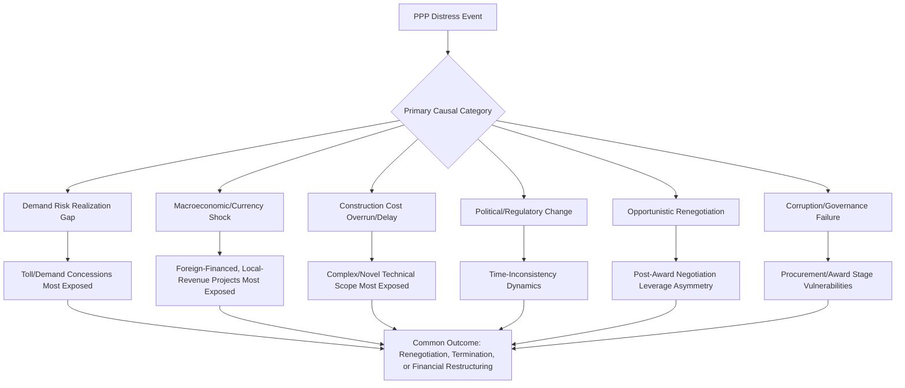

## Notable PPP Failures and Renegotiated Contracts

### Overview and Analytical Purpose

Examining notable PPP failures and renegotiated contracts serves a distinct pedagogical and practical purpose within comparative PPP study: rather than treating renegotiation and failure as anomalies to be dismissed, this analytical lens treats them as a documented, recurring feature of PPP practice across nearly every regional case study discussed elsewhere in this chapter, warranting systematic examination of causal patterns and structural lessons rather than country-specific blame attribution.

- This topic synthesizes and extends the renegotiation themes already introduced across the UK, Chilean/Latin American, Asian, and Sub-Saharan African case studies, organizing them around common failure typologies rather than a further regional breakdown
- **[Unverified]** Given that this topic concerns documented historical cases, specific project names, dates, financial figures, and outcomes referenced in the broader academic and policy literature on this subject should be verified against primary sources (national audit reports, academic case studies, multilateral development bank reviews) rather than relied upon from memory, since case details are often complex, contested in their interpretation, and subject to correction as further information emerges
- The framing here deliberately avoids attributing failure exclusively to any single actor category (government, private sponsors, lenders) because documented cases typically involve a combination of contributing factors rather than a single clear-cut cause

### Typology of PPP Failure and Renegotiation Causes

### Demand Risk Realization Failures

**Key Points**

- The most extensively documented failure category across the comparative case studies in this chapter involves toll road, transport, and other demand-risk concessions where actual usage significantly underperformed the forecasts underpinning the original financial model, a pattern documented across the Latin American and South/Southeast Asian regional experiences discussed elsewhere in this chapter
- **[Inference]** Academic literature examining this pattern across multiple countries has generally attributed it to a combination of genuine forecasting difficulty (transport demand is inherently uncertain, particularly for new corridors without comparable historical traffic data) and documented instances of optimism bias, where forecasts used to support project approval and financial close were more optimistic than subsequently proved accurate — the relative weighting of innocent forecasting error versus systematic optimism bias in any specific case is often genuinely difficult to establish and is a matter of case-specific analysis rather than a general finding applicable uniformly
- The structural policy response documented across multiple jurisdictions — evidenced by India's hybrid annuity model evolution discussed in the Asian case study topic, and various minimum revenue guarantee mechanisms used in Latin America — has generally moved toward reducing pure demand-risk transfer to concessionaires in sectors where this pattern has been most acutely documented, reflecting a broader industry-wide risk allocation lesson drawn from this failure category specifically

### Macroeconomic and Currency Shock Failures

Projects financed with foreign currency debt but generating revenue in local currency have been documented across multiple regional case studies (Latin America and Sub-Saharan Africa particularly, as discussed in the respective topics elsewhere in this chapter) as vulnerable to financial distress during periods of significant currency devaluation, since debt service obligations in foreign currency terms can increase substantially relative to local-currency revenue even where the underlying project continues to perform operationally as originally planned. This failure category is analytically distinct from demand risk failure, since the underlying service delivery or usage may be entirely as forecasted, with the financial distress arising instead from currency mismatch in the financing structure itself.

### Construction and Technical Failures

**[Inference]** A smaller but documented category of PPP distress involves genuine construction cost overrun, technical failure, or schedule delay significant enough to threaten project viability independent of subsequent revenue performance, more commonly associated with technically novel or unusually complex projects (major tunneling projects, complex rail systems, first-of-a-kind technical configurations) where construction risk transfer to the private party, while contractually clear, proves difficult to actually bear if the technical challenge exceeds what any party reasonably anticipated at financial close — illustrating that formal contractual risk allocation and the practical bearability of that risk by the allocated party are related but distinct considerations.

### Political and Regulatory Change Failures

Connecting directly to the time-inconsistency themes discussed extensively elsewhere in this chapter, a documented failure category involves projects that become financially or politically unviable following a change in government, regulatory framework, or broader political stance toward the specific project or PPP procurement generally — including documented cases of tariff freezes imposed for political reasons on previously agreed cost-reflective tariff formulas (particularly relevant to water and power sector concessions), and cases of project cancellation or forced renegotiation following electoral transitions.

### Opportunistic Renegotiation Patterns

**Key Points**

- A distinct and analytically important failure/distress category, discussed in the political economy and corruption risk topics elsewhere in this chapter, involves renegotiation driven primarily by post-award leverage dynamics rather than genuine unforeseen circumstances — where a private party, having won a competitive tender at aggressive terms, subsequently seeks contract modifications favorable to itself once the government has limited practical alternatives (given the sunk cost and disruption risk of terminating and re-tendering a partially completed or operational project)
- **[Inference]** Academic literature examining this pattern (sometimes discussed under the general economic concept of "winner's curse" combined with post-award bargaining power asymmetry) suggests that competitive tender processes can, in some documented cases, create an incentive structure where aggressive initial bidding is followed by anticipated renegotiation, though empirically distinguishing this pattern from genuine unforeseen circumstance requiring legitimate renegotiation is difficult in individual cases and remains a subject of ongoing academic and policy debate rather than one with a clear diagnostic test applicable to any specific case
- Mitigation approaches discussed in the corruption risk and transparency topics elsewhere in this chapter — including mandatory renegotiation disclosure requirements and independent review of proposed contract modifications — are directly responsive to this specific failure category

### Governance and Corruption-Driven Failures

A distinct failure category, connecting directly to the corruption risk topic discussed elsewhere in this chapter, involves projects that experience distress, termination, or significant reputational damage due to documented corruption in the original procurement, construction, or ongoing contract administration process, rather than primarily commercial, technical, or macroeconomic factors — illustrating that governance failure can be an independent and sometimes primary causal factor distinct from, though occasionally compounding, the other failure categories discussed above.

### Consequences and Outcomes of Distress

$$Outcome \in \{Renegotiation, PartialTermination, FullTermination, FinancialRestructuring, PublicReacquisition\}$$

Documented distress cases across the comparative literature have resulted in varying outcomes depending on the severity of distress, the specific contractual termination and step-in provisions in place, and the broader political and fiscal context:

- **Renegotiation**: the most commonly documented outcome, involving modification of payment terms, risk allocation, or concession length without full contract termination
- **Termination and re-tender**: less common but documented in cases of severe financial distress or fundamental contract breach, requiring the government to re-procure the asset, often at additional cost and delay relative to the original project timeline
- **Financial restructuring**: particularly relevant to debt-financed projects experiencing distress primarily due to macroeconomic or demand factors rather than fundamental project viability issues, involving lender-led restructuring of debt terms while the underlying concession continues
- **Public reacquisition/renationalization**: the most significant outcome, documented in some water sector and other basic-needs-sector cases discussed in the Sub-Saharan African and broader comparative literature, where sustained public opposition or fundamental commercial unviability led to full public sector reacquisition of the asset and service delivery function

### Cross-Cutting Structural Lessons

| Failure Category | Primary Structural Lesson | Related Topic in This Curriculum |
| --- | --- | --- |
| Demand risk realization gap | Independent demand forecast review; risk-sharing mechanisms | Chilean Concession Program and Latin American Experience |
| Macroeconomic/currency shock | Currency risk mitigation instruments; local currency financing | Sub-Saharan African PPP Markets and Donor Support |
| Construction/technical failure | Realistic risk allocation calibrated to genuine bearable capacity | Bankability Assessment from the Private Sector Perspective |
| Political/regulatory change | Institutional continuity; legal entrenchment of commitments | Electoral Cycles and Time-Inconsistency Problems in PPP Commitments |
| Opportunistic renegotiation | Transparency and independent review of modifications | Corruption Risks in PPP Procurement and Mitigation Strategies |
| Governance/corruption failure | Procedural safeguards across full project cycle | Transparency, Disclosure, and Open Contracting Standards |

### Common Pitfalls in Learning from Failure Case Studies

- Attributing a documented failure case to a single simple cause when the underlying academic or investigative record typically reveals multiple contributing and interacting factors
- Treating renegotiation as inherently indicative of bad faith or corruption without considering the genuine unforeseen-circumstance category that also produces legitimate renegotiation
- Overgeneralizing from a small number of high-profile failure cases to conclusions about PPP viability as a procurement model overall, without accounting for the larger population of PPP projects that do not experience significant documented distress
- Failing to distinguish analytically between different failure categories (demand risk vs. currency risk vs. political risk vs. governance failure) that require substantively different structural mitigations, rather than treating "PPP failure" as a single undifferentiated phenomenon
- Relying on secondhand or media characterizations of specific failure cases rather than primary source documentation (audit reports, academic case studies) given the complexity and sometimes contested interpretation of specific historical cases

**Related Topics**

- Chilean Concession Program and Latin American Experience
- Sub-Saharan African PPP Markets and Donor Support
- PPP Programs in India, the Philippines, and Southeast Asia
- Electoral Cycles and Time-Inconsistency Problems in PPP Commitments
- Corruption Risks in PPP Procurement and Mitigation Strategies
- Minimum Revenue Guarantees and Demand Risk-Sharing Mechanisms