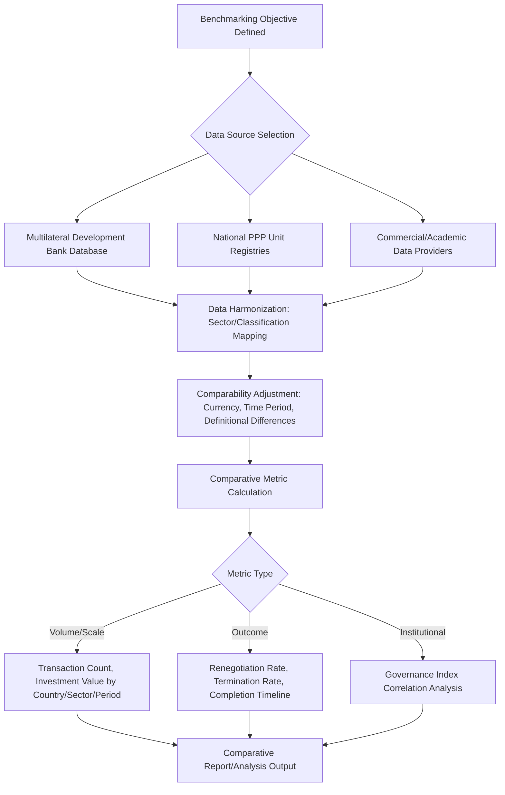

## Cross-Country Benchmarking Using Global PPP Databases

### Overview and Purpose

Cross-country benchmarking using global PPP databases provides the empirical infrastructure underlying much of the comparative analysis presented throughout this chapter — the regional case studies, failure typologies, and governance readiness assessments all ultimately depend on some form of systematic, comparable transaction-level data collection across jurisdictions. This topic examines the methodological foundations, applications, and limitations of the major database and benchmarking efforts that make such comparative analysis possible, rather than the substantive country findings themselves, which are covered in the dedicated regional and thematic topics elsewhere in this chapter.

- **[Unverified]** Because this domain consists of actively maintained databases subject to periodic methodology revision, discontinuation, or institutional transfer between maintaining organizations, specific current database names, coverage, access terms, and methodology should be verified directly against the maintaining institution's current published documentation rather than relied upon from memory
- Global PPP benchmarking serves multiple distinct analytical purposes: informing individual country readiness assessments (as discussed in the related topic), supporting academic research into causal patterns across the failure typologies discussed in the notable failures topic, and providing investors and multilateral institutions with comparative deal-flow and market-sizing information

### Categories of Global PPP Data Sources

#### Multilateral Development Bank-Maintained Databases

Several multilateral development banks and related institutions have historically maintained databases tracking PPP and private participation in infrastructure transactions across developing and emerging markets, typically capturing transaction-level data such as sector, country, financial close date, investment value, and, in some cases, subsequent contract status (ongoing, renegotiated, cancelled).

- **[Inference]** These databases have generally focused predominantly on developing and emerging market transactions, reflecting the institutional mandate of the maintaining multilateral development banks, meaning comparative analysis drawing on these sources may have more limited or differently structured coverage of developed-market PPP activity (such as the UK PFI program discussed elsewhere in this chapter), which is more often tracked through separate national government or specialized commercial data sources
- The specific data fields, coverage period, update frequency, and public accessibility of these databases have varied over time and across institutions, and some databases have been discontinued, merged, or substantially restructured; current availability should be verified directly

#### National PPP Unit and Government Registries

Many countries with established PPP programs, including several discussed in the regional case studies elsewhere in this chapter, maintain their own national PPP project registries or pipelines, providing country-specific transaction detail that may be more granular than aggregated cross-country databases but requires manual compilation to achieve comparability across jurisdictions using potentially different classification and disclosure standards.

#### Commercial and Academic Data Providers

Beyond publicly maintained multilateral and government sources, specialized commercial infrastructure data providers and academic research databases have also compiled cross-country PPP and infrastructure transaction data, often with different sector coverage, geographic emphasis, and methodological approaches than the multilateral development bank sources, contributing to the broader landscape of available comparative data but also to the methodological inconsistency challenges discussed below.

### Structuring a Cross-Country Benchmarking Exercise

### Common Benchmarking Metrics and Applications

**Key Points**

- **Transaction volume and investment value trends**: tracking aggregate PPP activity by country, sector, and time period, commonly used to assess market development trajectories and identify sectoral or regional shifts in PPP activity over time
- **Outcome-based metrics**: renegotiation rates, cancellation/termination rates, and completion timeline benchmarks, directly connecting to the notable failures and renegotiation typology discussed elsewhere in this chapter, used to assess relative program performance and identify countries or sectors warranting deeper case-specific investigation
- **Correlation analysis with governance indices**: academic research has used cross-country PPP outcome data in conjunction with the governance quality indices discussed in the country readiness assessment topic to examine statistical relationships between institutional quality measures and PPP program outcomes, though **[Inference]** such correlational analysis faces significant methodological challenges in establishing causation given the many potentially confounding factors (macroeconomic conditions, sector composition, specific project characteristics) that vary simultaneously with governance quality across countries, and reasonable researchers have reached varying conclusions about the strength and interpretation of such relationships

### Methodological Challenges in Cross-Country Comparison

#### Definitional and Classification Inconsistency

**[Inference]** A persistent and well-documented methodological challenge in cross-country PPP benchmarking involves inconsistent definitions of what constitutes a "PPP" across different databases and countries — some sources apply a narrow definition limited to formally structured, competitively procured, long-term concession or availability-payment arrangements, while others apply a broader definition encompassing various forms of private participation in infrastructure including simple management contracts or asset sales, making direct volume and count comparisons across sources potentially misleading without careful attention to underlying definitional scope.

#### Survivorship and Reporting Bias

Databases relying on voluntary or government self-reporting of transaction data and outcomes may be subject to reporting bias, where troubled or renegotiated projects are less consistently or less promptly reported than successful project announcements, potentially skewing outcome-based benchmarking metrics (such as renegotiation or termination rates) toward understating the true incidence of distress relative to what a more complete dataset would show. **[Inference]** The magnitude of this potential bias is difficult to quantify directly, since by definition it concerns underreported rather than observed data, making it a persistent limitation acknowledged in the methodological literature rather than one with an established correction factor.

#### Currency, Inflation, and Time Period Comparability

Comparing investment values across countries and time periods requires careful methodological attention to currency conversion approach (market exchange rate versus purchasing power parity), inflation adjustment, and consistent time period definition, since naive nominal comparisons across countries and years can produce materially misleading relative rankings or trend analyses.

#### Aggregation Masking Sub-National and Sector Variation

Country-level aggregate benchmarking metrics can mask significant sub-national institutional variation (relevant particularly in federal systems, as discussed in the governance readiness assessment topic) and sector-specific variation (as illustrated by India's notably distinct transport-sector experience relative to other sectors, discussed in the Asian regional case study topic), meaning aggregate country-level benchmarks should generally be treated as a starting point for further investigation rather than a sufficient basis for project-specific or sector-specific conclusions.

### Practical Applications and Limitations for Different Users

| User | Typical Benchmarking Application | Key Limitation to Consider |
| --- | --- | --- |
| Multilateral development banks | Prioritizing technical assistance, tracking program impact over time | Coverage may be skewed toward institutions' own client countries |
| Private investors | Comparative country/sector risk assessment, market sizing | Definitional inconsistency across sources; reporting bias in outcome data |
| Academic researchers | Testing causal hypotheses about institutional quality and outcomes | Confounding factors complicate causal inference from correlational data |
| Host governments | Self-assessment relative to peer countries or regions | Aggregate national metrics may mask relevant sub-national/sectoral variation |
| Rating agencies | Informing sovereign contingent liability risk assessment | Data currency and update frequency vary by source |

### Common Pitfalls in Using Cross-Country Benchmarking Data

- Treating transaction counts or investment values from different databases as directly comparable without verifying underlying definitional and classification consistency
- Drawing causal conclusions from correlations between governance indices and PPP outcome metrics without adequately accounting for confounding variables and the general methodological caution warranted in cross-country institutional research
- Relying on aggregate country-level or even global database figures without recognizing potential reporting bias understating the true incidence of renegotiation, distress, or termination
- Using outdated benchmarking data without verifying current database status, given the documented pattern of database discontinuation, methodology revision, and institutional transfer in this space
- Applying country-level aggregate benchmarks directly to project-specific due diligence without recognizing the sub-national and sector-specific variation that aggregate metrics necessarily obscure

**Related Topics**

- Governance Indices and Country Readiness Assessments
- Notable PPP Failures and Renegotiated Contracts
- Chilean Concession Program and Latin American Experience
- PPP Programs in India, the Philippines, and Southeast Asia
- Sub-Saharan African PPP Markets and Donor Support
- Value-for-Money Analysis and the Public Sector Comparator Methodology