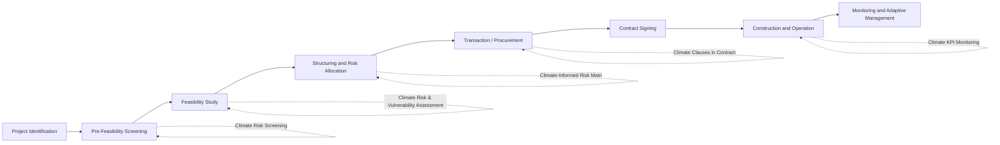

## Integrating Climate Risk Screening into PPP Preparation

### Overview

Climate risk screening is the systematic process of identifying, assessing, and integrating physical and transition climate risks into the earliest stages of Public-Private Partnership (PPP) project preparation. Rather than treating climate considerations as an add-on during environmental compliance review, screening embeds climate analysis into project identification, feasibility studies, structuring, and contract design so that risks are priced, allocated, and mitigated before financial close.

The rationale is straightforward: PPP assets are long-lived (typically 15–30+ years for concessions) and capital-intensive, making them highly exposed to both acute climate shocks (floods, typhoons, heatwaves) and chronic shifts (sea-level rise, changing precipitation patterns, temperature trends). Contracting authorities that fail to screen for these risks early risk allocating them poorly, triggering costly renegotiations, force majeure disputes, or asset failure mid-concession.

### Why Climate Screening Matters in PPP Preparation

**Key Points**

- **Long asset life vs. static risk assumptions**: A toll road or water treatment plant designed using historical rainfall data may be under-engineered for 2050 conditions.
- **Risk allocation efficiency**: PPP theory holds that risk should be allocated to the party best able to manage it. Unscreened climate risk defaults to ambiguous allocation, often resting (unintentionally) with the public sector via force majeure clauses.
- **Bankability**: Lenders and development finance institutions (DFIs) increasingly require climate risk disclosure as a precondition for financing, following frameworks such as the Task Force on Climate-related Financial Disclosures (TCFD) and its successor, the IFRS S2 climate standard.
- **Regulatory and ESG pressure**: Multilateral development banks (MDBs) — World Bank, ADB, IFC — now mandate climate screening for PPPs in their pipelines as part of Paris Agreement alignment commitments.
- **Cost asymmetry**: Retrofitting climate resilience post-construction is estimated at 3–10x more expensive than designing for it upfront [Inference — figures vary by asset class and geography and are drawn from World Bank and GIF resilience-costing studies rather than a single universal ratio].

### Types of Climate Risk to Screen

#### Physical Risk

Physical risk arises from the direct impact of climate hazards on physical assets and operations.

- **Acute physical risk**: Discrete, event-driven hazards — cyclones, flash floods, storm surges, wildfires, extreme heat events.
- **Chronic physical risk**: Gradual, long-term shifts — sea-level rise, rising mean temperatures, changing precipitation regimes, water stress/scarcity, permafrost thaw (region-specific).

#### Transition Risk

Transition risk arises from the shift to a low-carbon economy, affecting project economics rather than physical integrity.

- **Policy and legal risk**: Carbon pricing, emissions caps, fuel-mix mandates that alter the economics of the underlying asset (e.g., a coal-fired power PPP facing a phase-out mandate).
- **Technology risk**: Displacement of an asset's technology by lower-carbon alternatives (e.g., a fossil-fuel bus fleet PPP amid electrification policy).
- **Market risk**: Shifting demand patterns — for example, reduced fossil fuel throughput at a port PPP as trade patterns decarbonize.
- **Reputational risk**: Stakeholder and public perception costs associated with carbon-intensive PPPs.

### When Climate Screening Occurs in the PPP Cycle

The earlier climate risk is screened, the lower the cost of addressing it. Screening at the pre-feasibility stage is a rapid, low-cost filter; a full climate risk and vulnerability assessment (CRVA) follows at feasibility stage for projects that trigger the initial screen.

### Step 1: Rapid Climate Risk Screening (Pre-Feasibility)

This is a desk-based, low-cost exercise conducted before major feasibility spending, intended to flag whether deeper analysis is warranted.

**Key Points**

- Uses existing hazard databases and climate projection tools rather than commissioning new modeling.
- Typically completed in days to a few weeks.
- Produces a binary or tiered output: low/medium/high climate exposure.

Common tools and data sources used at this stage:

| Tool/Source | Provider | Purpose |
| --- | --- | --- |
| ThinkHazard! | GFDRR/World Bank | Rapid hazard exposure by location and hazard type |
| Climate Change Knowledge Portal (CCKP) | World Bank | Historical and projected climate data by country/region |
| Aqueduct Water Risk Atlas | World Resources Institute | Water stress, flood, and drought risk |
| Global Flood Risk Data (Fathom, JBA) | Commercial/academic | High-resolution flood modeling |
| IPCC AR6 Regional Fact Sheets | IPCC | Regional climate projection summaries |
| Climate Risk Toolkit | ADB | Sector-specific screening checklists |

**Example**

A proposed bulk water supply PPP in a coastal city runs a rapid screen using ThinkHazard! and the CCKP. The screen flags:

- High exposure to riverine flooding (current and projected)
- Medium exposure to water scarcity under RCP 4.5 by 2050
- Low exposure to extreme heat (asset type not heat-sensitive)

Because flooding is flagged "high," the project is routed into a full Climate Risk and Vulnerability Assessment (CRVA) before proceeding to detailed feasibility design.

### Step 2: Climate Risk and Vulnerability Assessment (CRVA)

For projects flagged at the screening stage, a CRVA quantifies exposure, sensitivity, and adaptive capacity in detail, typically integrated into the feasibility study.

#### Components of a CRVA

1. **Hazard identification**: Which climate hazards are relevant to the asset type and location.
2. **Exposure analysis**: Spatial overlay of asset location(s) against hazard maps (e.g., flood plains, sea-level rise inundation zones).
3. **Sensitivity analysis**: How the specific asset design responds to the hazard (e.g., pump station elevation vs. projected flood levels).
4. **Adaptive capacity assessment**: Institutional, technical, and financial capacity to respond to climate stress over the asset's life.
5. **Vulnerability scoring**: Combining exposure × sensitivity ÷ adaptive capacity into a composite vulnerability index.
6. **Climate projections under multiple scenarios**: Typically using Representative Concentration Pathways (RCP 4.5, RCP 8.5) or the newer Shared Socioeconomic Pathways (SSP1-2.6, SSP2-4.5, SSP5-8.5).

$$V = f(E, S, AC)$$

Where $V$ is vulnerability, $E$ is exposure, $S$ is sensitivity, and $AC$ is adaptive capacity — the standard IPCC vulnerability framing, with vulnerability increasing with $E$ and $S$ and decreasing with $AC$.

#### Scenario Analysis Approach

**Key Points**

- Avoid single-point forecasts; climate projections carry inherent uncertainty, so scenario ranges are used instead of one "expected" value.
- Standard practice compares at least a moderate (RCP 4.5 / SSP2-4.5) and high-emissions (RCP 8.5 / SSP5-8.5) scenario across near-term (2030s), mid-century (2050s), and end-century (2080s–2100) horizons.
- Design standards are then selected against a chosen scenario and horizon combination, often the more conservative one for critical infrastructure.

**Example**

A coastal highway PPP's CRVA models storm surge inundation under SSP2-4.5 and SSP5-8.5 for 2050 and 2080. Under SSP5-8.5/2080, projected surge levels exceed the originally proposed road elevation by 0.6 meters. The project team raises the design elevation specification accordingly, at an incremental capital cost, rather than accepting the flood risk into the concession.

### Step 3: Translating Climate Risk into PPP Risk Allocation

Once risks are quantified, they must be allocated between the public and private parties through the PPP contract's risk matrix. This is where climate screening converts from an environmental exercise into a commercial/legal one.

#### General Allocation Principles

| Risk Type | Typical Allocation Logic | Rationale |
| --- | --- | --- |
| Foreseeable/quantifiable physical risk (e.g., known flood zone) | Private party, priced into design and O&M costs | Party best positioned to design/mitigate |
| Unforeseeable/catastrophic events (e.g., extreme, low-probability events beyond design standards) | Shared or public party via force majeure/relief events | Insurability limits, catastrophic scale |
| Transition/policy risk (e.g., carbon pricing changes) | Public party or shared via adjustment mechanisms | Government controls the policy lever |
| Residual/design-standard risk (events within known but underdesigned thresholds) | Negotiated, often shared via review mechanisms | Requires periodic re-assessment |

**Key Points**

- Climate screening outputs (vulnerability scores, projected hazard thresholds) should feed directly into drafting the **Risk Matrix** annex of the PPP contract.
- Ambiguously worded force majeure clauses ("acts of God," "extreme weather") are a common source of dispute; climate-screened contracts increasingly define specific thresholds (e.g., "flood exceeding the 1-in-100-year design flood level as defined in Schedule X").
- Some contracts introduce **climate re-opener clauses**, allowing renegotiation of specific technical or financial terms if realized climate conditions diverge materially from the CRVA's assumed scenario, without reopening the entire contract.

### Step 4: Embedding Climate Resilience into Technical Design Standards

Screening outputs should directly inform engineering design standards and Output Specifications, not sit in a separate ESG annex.

**Key Points**

- Design-flood and design-wind standards should reference forward-looking climate projections rather than historical-only Intensity-Duration-Frequency (IDF) curves.
- Redundancy and adaptive design (e.g., modular pump capacity, raised electrical equipment, flexible material specification) reduce the cost of later retrofits.
- "Climate-proofing" premiums are typically incremental (a few percent of capital cost) if designed in from the start, versus substantial if retrofitted later [Inference — magnitude is asset- and context-specific].

**Example: Output Specification Language**

> "The Facility shall be designed such that the finished floor level of all critical electrical and mechanical equipment is a minimum of 0.5m above the 1-in-100-year flood level, as projected under the SSP2-4.5 scenario for the year 2060, per the Climate Risk and Vulnerability Assessment in Schedule 4."

This converts a screening output (projected flood level under a defined scenario) into a binding, auditable contractual obligation.

### Step 5: Financial Structuring and Climate Risk Pricing

Climate risk must also be reflected in the financial model and bankability assessment.

**Key Points**

- **Insurance availability and cost**: Screening results affect whether climate perils are insurable and at what premium; some high-risk perils may become uninsurable over the concession term, requiring alternative risk transfer or public backstops.
- **Cost of capital**: Lenders may price climate risk into debt terms or require climate covenants/monitoring as conditions precedent.
- **Contingency reserves**: Climate-screened financial models often include specific resilience contingency lines rather than folding climate risk into generic contingency percentages.
- **Value-for-Money (VfM) assessment**: Climate risk exposure and mitigation costs should be reflected in both the Public Sector Comparator and the PPP option to ensure a like-for-like comparison.

### Step 6: Monitoring, Reporting, and Adaptive Management

Climate risk screening does not end at financial close — it continues through construction and operations.

**Key Points**

- **Climate KPIs**: Contracts increasingly include monitoring indicators (e.g., rainfall thresholds, temperature thresholds) tied to performance or relief-event triggers.
- **Periodic re-screening**: Given the multi-decade life of concessions and the evolving accuracy of climate models, contracts may mandate re-assessment of climate risk at defined intervals (e.g., every 5–10 years) using updated projections.
- **Adaptive management clauses**: Allow for design or operational modifications mid-concession in response to updated climate data, often paired with a pre-agreed cost-sharing mechanism.

### Institutional Frameworks and Guidance Documents

| Framework/Institution | Relevance to PPP Climate Screening |
| --- | --- |
| World Bank / GIF (Global Infrastructure Facility) | Climate screening tools and PPP-specific resilience guidance |
| TCFD / IFRS S2 | Climate risk disclosure standards influencing lender requirements |
| ADB Climate Risk Management Framework | Sector checklists and screening tools for Asia-Pacific PPPs |
| EBRD Green Economy Transition approach | Climate screening integrated into project appraisal |
| PIARC / national engineering codes | Updated design standards incorporating climate projections (sector-specific, e.g., roads) |

[Unverified — specific current versions, thresholds, and mandatory-vs-recommended status of these frameworks should be confirmed against the institution's latest published guidance, as these are periodically revised.]

### Common Pitfalls

**Key Points**

- **Screening too late**: Conducting climate assessment only for environmental permitting, after design is largely fixed, forecloses cost-effective design changes.
- **Using historical-only data**: Relying solely on past climate records without forward-looking projections systematically understates future risk for long-lived assets.
- **Vague force majeure drafting**: Undefined terms like "severe weather" generate litigation risk rather than clarity.
- **Siloing climate risk from financial structuring**: Treating CRVA as a standalone environmental report disconnected from the risk matrix and financial model undermines its practical use.
- **Ignoring transition risk**: Focusing exclusively on physical hazards while ignoring policy/market shifts that could strand the asset commercially.

### Illustrative Climate Screening Decision Flow (svg_diagram)

<svg xmlns="http://www.w3.org/2000/svg" viewBox="0 0 900 480" font-family="Arial, sans-serif">
<rect x="0" y="0" width="900" height="480" fill="#ffffff" />
<text x="450" y="28" text-anchor="middle" font-size="18" font-weight="bold" fill="#1a1a1a">Climate Risk Screening Decision Flow (svg_diagram)</text>
<rect x="350" y="50" width="200" height="50" rx="8" fill="#e8f0fe" stroke="#4285f4" stroke-width="2" />
<text x="450" y="80" text-anchor="middle" font-size="13" fill="#1a1a1a">Project Concept Identified</text>
<line x1="450" y1="100" x2="450" y2="130" stroke="#666" stroke-width="2" marker-end="url(#arrow)" />
<rect x="325" y="130" width="250" height="55" rx="8" fill="#fff4e5" stroke="#f4a742" stroke-width="2" />
<text x="450" y="153" text-anchor="middle" font-size="13" fill="#1a1a1a">Rapid Screening</text>
<text x="450" y="171" text-anchor="middle" font-size="11" fill="#444">(ThinkHazard, CCKP, Aqueduct)</text>
<line x1="450" y1="185" x2="450" y2="215" stroke="#666" stroke-width="2" marker-end="url(#arrow)" />
<polygon points="450,215 560,255 450,295 340,255" fill="#fde8e8" stroke="#e05252" stroke-width="2" />
<text x="450" y="250" text-anchor="middle" font-size="12" fill="#1a1a1a">High or Medium</text>
<text x="450" y="266" text-anchor="middle" font-size="12" fill="#1a1a1a">Exposure Flagged?</text>
<line x1="340" y1="255" x2="180" y2="255" stroke="#666" stroke-width="2" marker-end="url(#arrow)" />
<text x="255" y="245" text-anchor="middle" font-size="11" fill="#333">No</text>
<rect x="60" y="230" width="180" height="50" rx="8" fill="#e6f4ea" stroke="#34a853" stroke-width="2" />
<text x="150" y="253" text-anchor="middle" font-size="12" fill="#1a1a1a">Proceed to Standard</text>
<text x="150" y="269" text-anchor="middle" font-size="12" fill="#1a1a1a">Feasibility Study</text>
<line x1="560" y1="255" x2="700" y2="255" stroke="#666" stroke-width="2" marker-end="url(#arrow)" />
<text x="630" y="245" text-anchor="middle" font-size="11" fill="#333">Yes</text>
<rect x="700" y="230" width="180" height="50" rx="8" fill="#fde8e8" stroke="#e05252" stroke-width="2" />
<text x="790" y="253" text-anchor="middle" font-size="12" fill="#1a1a1a">Full Climate Risk &amp;</text>
<text x="790" y="269" text-anchor="middle" font-size="12" fill="#1a1a1a">Vulnerability Assessment</text>
<line x1="790" y1="280" x2="790" y2="330" stroke="#666" stroke-width="2" marker-end="url(#arrow)" />
<rect x="700" y="330" width="180" height="55" rx="8" fill="#e8f0fe" stroke="#4285f4" stroke-width="2" />
<text x="790" y="353" text-anchor="middle" font-size="12" fill="#1a1a1a">Update Design Standards,</text>
<text x="790" y="369" text-anchor="middle" font-size="12" fill="#1a1a1a">Risk Matrix, Financial Model</text>
<line x1="700" y1="357" x2="240" y2="357" stroke="#666" stroke-width="2" marker-end="url(#arrow)" />
<line x1="240" y1="357" x2="240" y2="280" stroke="#666" stroke-width="2" marker-end="url(#arrow)" />
<text x="470" y="347" text-anchor="middle" font-size="11" fill="#333">Merge into feasibility &amp; structuring</text>
<line x1="150" y1="280" x2="150" y2="330" stroke="#666" stroke-width="2" marker-end="url(#arrow)" />
<rect x="60" y="330" width="180" height="50" rx="8" fill="#e6f4ea" stroke="#34a853" stroke-width="2" />
<text x="150" y="353" text-anchor="middle" font-size="12" fill="#1a1a1a">Structuring &amp;</text>
<text x="150" y="369" text-anchor="middle" font-size="12" fill="#1a1a1a">Procurement</text>
<line x1="150" y1="380" x2="150" y2="410" stroke="#666" stroke-width="2" marker-end="url(#arrow)" />
<line x1="790" y1="385" x2="790" y2="410" stroke="#666" stroke-width="2" marker-end="url(#arrow)" />
<line x1="150" y1="410" x2="790" y2="410" stroke="#666" stroke-width="2" />
<line x1="470" y1="410" x2="470" y2="430" stroke="#666" stroke-width="2" marker-end="url(#arrow)" />
<rect x="360" y="430" width="220" height="40" rx="8" fill="#f3e8fd" stroke="#9c4dcc" stroke-width="2" />
<text x="470" y="455" text-anchor="middle" font-size="12" fill="#1a1a1a">Financial Close &amp; Monitoring</text>
</svg>

### Practical Checklist for Practitioners

**Key Points**

1. Run a rapid climate screen before committing significant feasibility budget.
2. Escalate flagged projects to a full CRVA using multi-scenario, multi-horizon projections.
3. Translate CRVA findings into specific, quantified design standards — not general resilience language.
4. Draft precise, threshold-based force majeure and relief-event clauses tied to CRVA outputs.
5. Reflect climate risk (physical and transition) in the financial model, insurance strategy, and VfM analysis.
6. Include periodic re-screening and adaptive management provisions in the contract.
7. Assign clear institutional ownership (e.g., within the PPP unit or contracting authority) for climate risk monitoring through the concession life.

### Related Topics

- Force Majeure and Relief Event Drafting in Climate-Exposed PPPs
- Green and Sustainability-Linked Financing Instruments for PPPs
- Environmental and Social Impact Assessment (ESIA) vs. Climate Risk Screening: Scope Differences
- Insurance and Risk Transfer Mechanisms for Catastrophic Climate Events
- ESG Reporting and Disclosure Obligations for PPP Concessionaires
- Nature-Based Solutions and Green Infrastructure in PPP Design
- Climate Adaptation Financing: Blended Finance and DFI Concessional Instruments
- Renegotiation Triggers and Contract Re-Openers in Long-Term Concessions