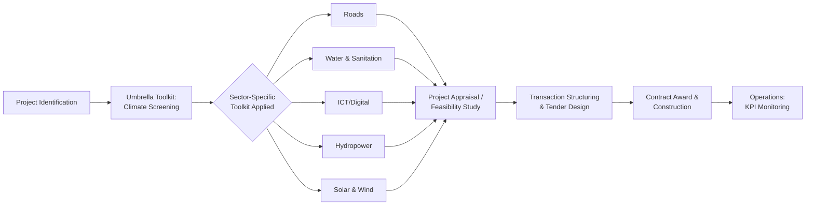
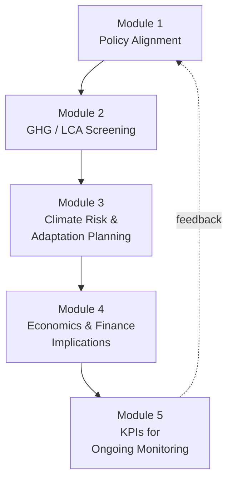

## Climate Toolkits for Infrastructure and Adaptation Planning

### Overview and Purpose

Climate toolkits are structured, practitioner-facing methodologies designed to embed climate risk screening, adaptation planning, and greenhouse gas (GHG) mitigation analysis into the earliest phases of Public-Private Partnership (PPP) preparation. They exist because the standard PPP appraisal process — feasibility studies, value-for-money (VfM) analysis, tender design — has historically treated climate variables as externalities rather than as core project risks. The flagship reference in this space is the World Bank Group's **Climate Toolkits for Infrastructure PPPs (CTIP3)**, developed jointly by the Public-Private Infrastructure Advisory Facility (PPIAF), the Global Infrastructure Facility (GIF), and IFC PPP Transaction and Advisory Services, with MIGA as a contributing author. The stated rationale is that PPP tender selection criteria are typically based on least-cost approaches, which may favor assets that are not resilient enough to withstand climate impacts, potentially resulting in total asset loss with severe economic and social consequences. [World Bank](https://documents1.worldbank.org/curated/en/099051723155518424/pdf/P1746330a9bba90960873404d3b4e4dbd8b.pdf)

The toolkits sit at the intersection of three practitioner concerns:

- **Physical climate risk** to asset design, location, and operations (adaptation)
- **Transition/emissions risk** tied to decarbonization pathways (mitigation)
- **Bankability and contract structuring** — translating climate considerations into terms lenders and concessionaires will actually price and accept

### CTIP3 Architecture: Umbrella and Sector-Specific Suite

The World Bank Group's CTIP3 suite consists of an Umbrella Toolkit designed for multisector application, providing a modular approach to identify climate risks and entry points to incorporate mitigation and adaptation measures throughout project identification, appraisal, and contracting. This is supplemented by five sector-specific toolkits covering Water Production and Treatment, Transport (Roads), Digital/ICT, Energy (Hydropower), and Energy (Solar and Wind). [World Bank Blogs](https://blogs.worldbank.org/en/ppps/introducing-sector-specific-climate-toolkits-infrastructure-ppps)[World Bank Blogs](https://blogs.worldbank.org/en/ppps/introducing-sector-specific-climate-toolkits-infrastructure-ppps)

The toolkits are designed for application in the upstream and midstream stages of the PPP lifecycle and are built for practical implementation, including tools to help users assess the enabling environment and identify climate entry points. Sector toolkits explicitly complement rather than replace the Umbrella Toolkit and are generally not intended for the detailed design, structuring, and tendering phase — they are front-end diagnostic instruments. [PPIAF](https://www.ppiaf.org/workshop-sector-specific-climate-toolkits-infrastructure-public-private-partnerships)[worldbank](https://ppp.worldbank.org/node/7103)

### The Five-Module Structure (Sector-Specific Toolkits)

Each sector-specific CTIP3 toolkit follows a consistent five-module architecture, illustrated below using the ICT and Hydropower toolkits as representative examples.

**Module 1 — Policy Alignment**

This module assists users with mapping applicable climate policies and assessing the project against those policies to identify areas where plan revisions may be required. This typically means cross-referencing a project against a country's Nationally Determined Contributions (NDCs), national adaptation plans, and sector-specific decarbonization strategies. [worldbank](https://ppp.worldbank.org/public-private-partnership/node/7101)

**Module 2 — GHG Emissions Assessment**

This module provides a simplified methodology for a preliminary life-cycle assessment (LCA) of the project's greenhouse gas emissions, based on the project's typology and publicly available data. This is a screening-level estimate, not a full carbon audit — it is meant to flag whether a project's emissions profile warrants deeper mitigation analysis before structuring proceeds. [worldbank](https://ppp.worldbank.org/public-private-partnership/node/7101)

**Module 3 — Climate Risk and Adaptation Planning**

This module provides practical guidance to agencies for documenting, at a preliminary stage, which climate risks could affect a project, what their impact could be, and which adaptation measures might be applicable. This is the core adaptation-planning module and typically walks users through hazard identification (heat, flooding, drought, sea-level rise, extreme wind), exposure mapping, and a qualitative or semi-quantitative risk-rating exercise. [worldbank](https://ppp.worldbank.org/public-private-partnership/node/7101)

**Module 4 — Project Economics and Finance**

This module addresses climate considerations in project economics and finances — i.e., how the costs of resilience measures (higher design standards, redundancy, insurance) and the potential costs of climate-related disruption should be reflected in the project's cost-benefit analysis, tariff structure, or public sector comparator. [PPIAF](https://www.ppiaf.org/feature/new-climate-toolkits-infrastructure-ppps)

**Module 5 — Key Performance Indicators**

The final module defines key performance indicators for tracking climate-resilience and mitigation performance once the asset reaches the operations phase — closing the loop from upstream screening to ongoing contract monitoring. [PPIAF](https://www.ppiaf.org/feature/new-climate-toolkits-infrastructure-ppps)

### Sector Coverage Summary

| Sector Toolkit | Primary Climate Entry Points | Distinct Technical Focus |
| --- | --- | --- |
| Roads (Transport) | Flooding, heat-driven pavement degradation, landslide/erosion exposure | Design and operational decisions for new road assets aligned to Paris Agreement commitments |
| Water Production & Treatment | Water scarcity intensified by extreme temperatures, changing precipitation patterns | Covers conventional treatment plants and desalination systems (pretreatment, high-pressure pumps, membranes, post-treatment) |
| Digital/ICT | Data-center cooling loads, network resilience to extreme weather | Embeds a climate approach into upstream PPP structuring so ICT PPPs can increase climate resilience |
| Hydropower | Hydrological variability, reservoir sedimentation, drought risk | Covers project alignment with climate policies, risk assessment, GHG assessment, project economics, and resilience KPIs specific to hydropower |
| Solar & Wind (Renewables) | Resource variability, extreme heat/wind damage to panels/turbines | Familiarizes non-expert users with climate change impacts on renewable energy projects and offers guidance on mitigation, adaptation, and resilience |

### Adaptation Planning Workflow (Module 3 Deep Dive)

Adaptation planning within the toolkit follows a standard climate risk-screening logic applicable across infrastructure sectors:

1. **Hazard identification** — Which physical climate hazards are relevant to the project's location and asset type (riverine/coastal flooding, extreme heat, drought, cyclones, sea-level rise, permafrost thaw, wildfire)?
2. **Exposure and sensitivity mapping** — Which physical components of the asset (intake structures, substations, foundations, cable routes) are exposed to each hazard, under both current climate and forward-looking climate projections?
3. **Vulnerability scoring** — Combining exposure with the asset's sensitivity (design tolerances, redundancy, age of comparable assets) to produce a qualitative risk rating (e.g., low/medium/high).
4. **Adaptation measure identification** — Matching identified risks to standard engineering or operational responses (elevated foundations, redundant cooling, drainage upgrades, early-warning systems, flexible operating protocols).
5. **Cost and responsibility allocation** — Feeding the selected adaptation measures into Module 4 so that their cost implications are reflected in the PPP's risk matrix and payment mechanism, and so that responsibility for residual climate risk is explicitly allocated between the public and private parties in the contract.

**Key Points**

- The toolkits are **screening instruments**, not detailed engineering studies — their output is a project-specific collection of considerations meant for further evaluation, and an improved understanding of what advisory services are needed downstream. [worldbank](https://ppp.worldbank.org/public-private-partnership/node/7101)
- They are explicitly positioned for **EMDEs** (emerging markets and developing economies), where technical capacity and climate data availability are often constrained. The toolkits assist EMDE governments in screening for climate risks and opportunities, with a focus on practicality. [UNFCCC](https://unfccc.int/event/climate-smart-public-private-partnerships-ppps-building-low-carbon-and-resilient-infrastructure-in)
- The core diagnosis motivating the toolkit's creation is a **contracting failure**: least-cost tender evaluation criteria structurally under-value resilience unless climate risk is priced explicitly and early.

### Governance and Adoption Context

The toolkits were developed by PPIAF, GIF, and IFC PPP Transaction and Advisory Services to build on best practice at the intersection of climate change, infrastructure, and private sector participation. Funding came in part through PPIAF's Climate Resilience and Environmental Sustainability Technical Advisory (CREST) facility, supported by the Swedish International Development Cooperation Agency (SIDA), and by the Global Infrastructure Facility. [World Bank PPP Legal Resource Center](https://ppp.worldbank.org/library/climate-toolkits-infrastructure-ppps)[World Bank PPP Legal Resource Center](https://ppp.worldbank.org/sites/default/files/2023-10/Climate%20Toolkits%20for%20Infrastructure%20PPPs%20-%20Water%20Production%20and%20Treatment%20Sector.pdf)

A documented real-world application is the **Kaduna State, Nigeria** case study: the PPIAF-funded activity applied the Umbrella Toolkit to help the Kaduna State Investment Promotion Agency (KADIPA) develop a gap-assessment report on its regulatory framework and institutional capacity to identify and address climate risks in PPP infrastructure projects, produced an Excel-based screening tool tailored to KADIPA's PPP priorities, and generated a "Clean, Green and Resilient PPP Pipeline Report." This illustrates the toolkit's practical output format: a lightweight, spreadsheet-based instrument adapted to a specific jurisdiction's regulatory and institutional context, rather than a one-size-fits-all global template. [PPIAF](https://www.ppiaf.org/sites/default/files/documents/2024-05/final_sector-specific-toolkits-bbl_clean.pdf)

**[Inference]** The Kaduna Excel-tool pattern — adapting the generic CTIP3 methodology into a jurisdiction-specific spreadsheet — is likely the practical template most sub-national or municipal PPP units (such as an LGU-level PPP unit) would replicate, given limited in-house climate-modeling capacity and the toolkit's own design intent for non-expert public officials.

### Relevance to Sub-National / LGU PPP Practice

For a local government PPP unit (as opposed to a national ministry), the toolkit's five-module logic can be scaled down into a lightweight due-diligence checklist appended to the feasibility study stage:

- **Policy check**: Does the proposed facility (e.g., a public market, water system, or waste facility) align with any existing national or provincial climate adaptation plan?
- **Hazard screening**: Cross-reference the project site against available hazard maps (flood, storm surge, landslide) — often obtainable from national geohazard agencies rather than requiring new modeling.
- **Design-standard question**: Should the technical specifications in the tender documents require a resilience margin above the minimum building code (e.g., elevated critical equipment, backup power, flood-resistant materials)?
- **Risk allocation clause**: Does the draft PPP contract's risk matrix explicitly assign responsibility for climate-related force majeure events, or does it default to ambiguous "Act of God" language that under-serves both parties?
- **Monitoring KPI**: Is at least one climate-resilience or emissions-related KPI included in the concessionaire's performance monitoring framework, separate from purely commercial KPIs?

**[Unverified]** Whether a given LGU's PPP code or implementing rules formally references or mandates use of the CTIP3 methodology (or an equivalent) is jurisdiction-specific and should be confirmed against local PPP legislation rather than assumed.

### Diagram: Risk-to-Contract Pathway (svg_diagram)

<svg viewBox="0 0 760 260" xmlns="http://www.w3.org/2000/svg" font-family="sans-serif">
<title>Climate Risk to Contract Pathway (svg_diagram)</title>
<defs>
<marker id="arrow" markerWidth="10" markerHeight="10" refX="8" refY="3" orient="auto" markerUnits="strokeWidth">
<path d="M0,0 L0,6 L9,3 z" fill="#444"/>
</marker>
</defs>
<rect x="10" y="90" width="130" height="70" rx="8" fill="#dbeafe" stroke="#2563eb"/>
<text x="75" y="120" text-anchor="middle" font-size="12" fill="#1e3a8a">Hazard</text>
<text x="75" y="136" text-anchor="middle" font-size="12" fill="#1e3a8a">Identification</text>
<rect x="180" y="90" width="130" height="70" rx="8" fill="#dbeafe" stroke="#2563eb"/>
<text x="245" y="120" text-anchor="middle" font-size="12" fill="#1e3a8a">Exposure &</text>
<text x="245" y="136" text-anchor="middle" font-size="12" fill="#1e3a8a">Vulnerability</text>
<rect x="350" y="90" width="130" height="70" rx="8" fill="#fef3c7" stroke="#d97706"/>
<text x="415" y="120" text-anchor="middle" font-size="12" fill="#78350f">Adaptation</text>
<text x="415" y="136" text-anchor="middle" font-size="12" fill="#78350f">Measures</text>
<rect x="520" y="90" width="110" height="70" rx="8" fill="#fee2e2" stroke="#dc2626"/>
<text x="575" y="114" text-anchor="middle" font-size="12" fill="#7f1d1d">Cost</text>
<text x="575" y="130" text-anchor="middle" font-size="12" fill="#7f1d1d">Allocation</text>
<text x="575" y="146" text-anchor="middle" font-size="12" fill="#7f1d1d">(Module 4)</text>
<rect x="660" y="90" width="90" height="70" rx="8" fill="#dcfce7" stroke="#16a34a"/>
<text x="705" y="120" text-anchor="middle" font-size="12" fill="#14532d">Contract</text>
<text x="705" y="136" text-anchor="middle" font-size="12" fill="#14532d">Clause</text>
<line x1="140" y1="125" x2="178" y2="125" stroke="#444" stroke-width="1.5" marker-end="url(#arrow)"/>
<line x1="310" y1="125" x2="348" y2="125" stroke="#444" stroke-width="1.5" marker-end="url(#arrow)"/>
<line x1="480" y1="125" x2="518" y2="125" stroke="#444" stroke-width="1.5" marker-end="url(#arrow)"/>
<line x1="630" y1="125" x2="658" y2="125" stroke="#444" stroke-width="1.5" marker-end="url(#arrow)"/>

<text x="380" y="220" text-anchor="middle" font-size="12" fill="#333">Each stage feeds the next; unresolved risk at any stage becomes an unpriced contingent liability at contract signing.</text>

</svg>

### Distinguishing Toolkits from Related Instruments

It is worth distinguishing CTIP3 from adjacent but non-identical instruments practitioners sometimes conflate it with:

- **Climate risk disclosure frameworks** (e.g., TCFD-aligned reporting) — these are corporate/investor disclosure standards, not project-screening toolkits.
- **National Adaptation Plans (NAPs)** — country-level strategic documents that CTIP3's Module 1 checks projects *against*, not a substitute for project-level screening.
- **Multilateral development bank safeguard policies** (e.g., World Bank Environmental and Social Framework) — these are compliance/safeguard instruments triggered by financing, whereas CTIP3 is a voluntary upstream advisory tool usable independent of any specific financier.
- **Green/climate bond taxonomies** — classification systems for labeling finance instruments, applied downstream once a project's mitigation credentials are established, rather than a risk-screening methodology.

**Next Steps**

- Study Module 3's risk-rating methodology in detail against a specific sector toolkit (e.g., Water or Roads) relevant to a target LGU project type
- Examine how climate risk allocation clauses are drafted into PPP risk matrices and payment mechanisms (linking to broader PPP contract-structuring topics)
- Review the Kaduna State case study documentation in full as a template for adapting CTIP3 to a sub-national context
- Compare CTIP3's screening approach against ESG rating methodologies used by private lenders and DFIs in project finance due diligence
- Explore how Module 5 KPIs are operationalized in concession agreements and monitored over the asset's operational life