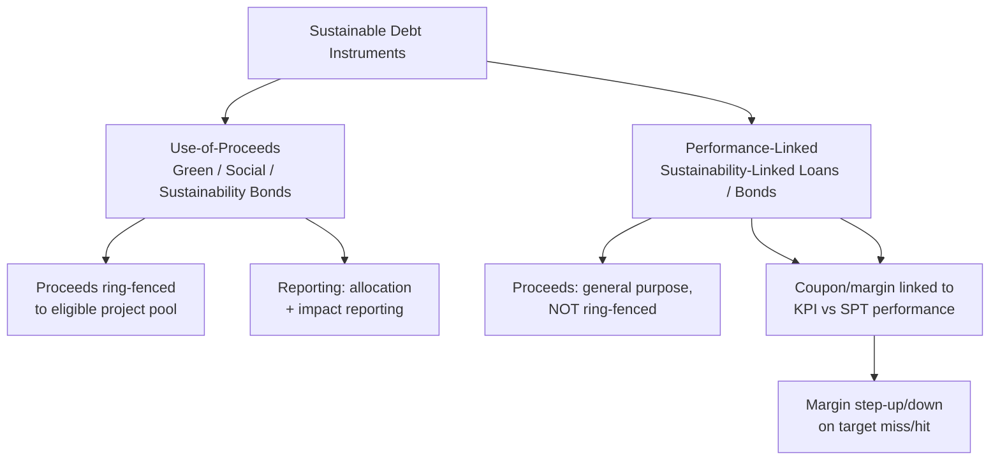
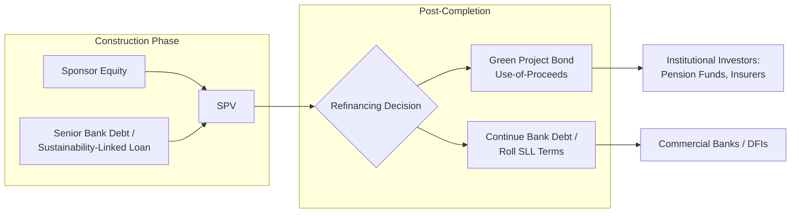

## Green Bonds and Sustainability-Linked Financing for PPPs

### Overview

Green bonds and sustainability-linked financing represent two distinct but complementary debt instrument families used to mobilize capital for Public-Private Partnership (PPP) infrastructure that carries environmental or sustainability objectives. Both sit within the broader category of "sustainable finance" or "labeled bonds," but they differ fundamentally in structure: one is **use-of-proceeds based** and the other is **performance/KPI based**. Understanding this distinction is essential for structuring PPP financing packages, since it determines what a project sponsor must track, disclose, and be penalized for if targets are missed.

### Core Distinction: Use-of-Proceeds vs. Performance-Linked

**Green Bonds (Use-of-Proceeds Instruments)**

Green bonds are debt instruments where the proceeds are earmarked exclusively for financing or refinancing, in part or in full, new and/or existing eligible green projects. The defining feature is proceeds ring-fencing: the capital raised must be tracked and allocated to a pre-defined pool of eligible assets or expenditures (renewable energy, clean transport, sustainable water management, energy efficiency, pollution prevention, etc.). The bond's structure — coupon, maturity, covenants — is otherwise identical to a conventional bond; what differs is the disclosure and use-of-proceeds obligation.

**Sustainability-Linked Loans/Bonds (Performance-Linked Instruments)**

Sustainability-Linked Loans (SLLs) are any types of loan instruments and/or contingent facilities which incentivize the borrower's achievement of ambitious, predetermined sustainability performance objectives. Unlike green bonds, proceeds are **not** required to be used for a specific green purpose — the loan or bond can fund general corporate or project purposes. Instead, the financial terms (typically the interest rate/coupon) are mechanically linked to whether the borrower hits predefined Sustainability Performance Targets (SPTs), measured via Key Performance Indicators (KPIs). Missing the target typically triggers a **margin ratchet** — a step-up in the interest rate, sometimes with the proceeds of that step-up directed to a carbon offset or charitable fund.

### Governing Frameworks and Standard-Setters

The dominant voluntary frameworks are issued by the **International Capital Market Association (ICMA)** for bonds and the **Loan Market Association (LMA) / Asia Pacific Loan Market Association (APLMA) / Loan Syndications and Trading Association (LSTA)** for loans:

| Instrument | Governing Principles | Core Requirement |
| --- | --- | --- |
| Green Bond | ICMA Green Bond Principles (GBP) | Use of proceeds restricted to eligible green project categories |
| Social Bond | ICMA Social Bond Principles (SBP) | Use of proceeds restricted to eligible social project categories |
| Sustainability Bond | ICMA Sustainability Bond Guidelines | Combination of green and social eligible categories |
| Sustainability-Linked Bond | ICMA Sustainability-Linked Bond Principles (SLBP) | Structural/financial characteristics vary based on KPI/SPT achievement |
| Sustainability-Linked Loan | LMA/APLMA/LSTA Sustainability-Linked Loan Principles (SLLP) | Loan terms vary based on KPI/SPT achievement |

**[Inference]** Given that PPP concession financing is predominantly loan-based (project finance debt from commercial banks, DFIs, and export credit agencies) rather than publicly issued bonds, the SLLP framework is likely the more frequently applicable standard for a typical PPP special purpose vehicle (SPV), while green/sustainability *bonds* become more relevant when the SPV or a sponsor refinances via capital markets post-construction.

### The Four Core Components of Green Bond Principles

1. **Use of Proceeds** — Proceeds must be applied to eligible green projects, described in the legal documentation, with environmental benefits assessed and, where feasible, quantified by the issuer.
2. **Process for Project Evaluation and Selection** — The issuer should clearly communicate the environmental sustainability objectives, the process for determining eligibility, and related eligibility criteria.
3. **Management of Proceeds** — Net proceeds should be credited to a sub-account, moved to a sub-portfolio, or otherwise tracked, with a formal internal process linked to lending and investment operations.
4. **Reporting** — Issuers should report at least annually on the use of proceeds until full allocation, covering a list of projects, brief descriptions, amounts allocated, and expected impact.

### The Five Core Components of Sustainability-Linked Loan Principles

1. **Selection of KPIs** — KPIs should be material to the borrower's core business and of high strategic significance, measurable/quantifiable, benchmarked externally, and capable of being verified.
2. **Calibration of Sustainability Performance Targets (SPTs)** — SPTs should be set in good faith, represent a material improvement in the respective KPIs, and be ambitious relative to a benchmark or baseline (comparable to the borrower's peers, its own historical performance, or science-based trajectories).
3. **Loan Characteristics** — The economic outcome of an SLL should be linked to the borrower's performance against the SPTs, typically via a margin ratchet mechanism.
4. **Reporting** — Borrowers should maintain readily available up-to-date information on their SPT performance, including verification reports, publicly disclosed at least annually.
5. **Verification** — Borrowers should seek independent and external verification of their performance against SPTs for each KPI, at least once per year.

### Application to PPP Structures

**Where Green Bonds Fit in a PPP Financing Stack**

In a typical PPP capital structure — a blend of sponsor equity, senior project debt, and sometimes subordinated/mezzanine debt — a green bond issuance most commonly appears in two scenarios:

- **Project bond financing**: Instead of (or alongside) syndicated bank debt, the SPV issues a green project bond directly to institutional investors (pension funds, insurance companies) to fund construction and operation of an eligible asset class (e.g., a solar PPP, a light-rail concession, a wastewater treatment PPP).
- **Refinancing**: After construction risk has passed (post-completion), the SPV refinances initial bank debt via a green bond, often achieving a lower cost of capital because construction-phase risk (the riskiest phase) has already been retired and the asset now has an operating track record — a common project finance "mini-perm" pattern independent of, but compatible with, green labeling.

**Where Sustainability-Linked Loans Fit**

SLLs are more naturally suited to the **construction and early operations phase** of a PPP because they do not require the strict proceeds-tracking infrastructure of a green bond — the SPV borrows for general project purposes and instead commits contractually to KPI targets (e.g., GHG intensity of the completed asset, water-use efficiency, percentage of renewable energy in a captive power supply, community employment targets during construction). This makes SLLs attractive for PPPs where the underlying asset is not itself "purely green" (e.g., a toll road) but the SPV can still commit to material sustainability improvements in how it is built and operated.

### Worked Example: KPI and SPT Design for a Bus Rapid Transit (BRT) PPP

**Key Points**

- **KPI selected**: Fleet-average GHG emissions intensity (gCO₂e per passenger-km)
- **Baseline**: Established from the concessionaire's initial fleet specification at financial close
- **SPT Year 3**: 15% reduction from baseline, driven by contractual replacement of a defined percentage of diesel buses with electric or hybrid units
- **SPT Year 5**: 30% reduction from baseline
- **Margin mechanism**: Base margin of 250 bps; a 10 bps step-down if Year 3 SPT is met, a 10 bps step-up (cumulative to 20 bps step-up total) if missed, verified annually by an independent environmental auditor against the fleet telematics and fuel-consumption data submitted by the concessionaire

This structure directly ties the concessionaire's cost of capital to the same decarbonization outcomes that a climate-conscious grantor (the LGU or national transport authority) would want reflected in the PPP's output specifications and KPI monitoring framework — creating alignment between the financing incentive and the contractual performance incentive rather than treating them as separate tracks.

### Verification, Second-Party Opinions, and Greenwashing Risk

Because these labels are voluntary and self-designated by the issuer, credibility depends on external validation:

- **Second-Party Opinions (SPOs)**: Independent providers (e.g., Sustainalytics, ISS ESG, Vigeo Eiris, CICERO) review the bond/loan framework against ICMA or LMA principles before issuance and issue an opinion on its alignment.
- **Pre-issuance vs. post-issuance verification**: A green bond framework typically receives a pre-issuance SPO on eligibility criteria, plus post-issuance assurance on the actual allocation of proceeds and impact reporting.
- **Greenwashing risk**: A structural risk specific to SLLs is that a "soft" SPT (one that would likely be achieved regardless of the loan) provides no real behavioral incentive while still allowing the borrower to market cheaper "sustainable" financing. This is why the calibration principle in the SLLP explicitly requires SPTs to represent a *material* improvement relative to a benchmark or trajectory, not merely business-as-usual performance.

**[Inference]** For an LGU-sponsored PPP, the greenwashing-risk mitigant most likely to be requested by lenders or grant co-financiers is an independent, pre-agreed baseline methodology fixed at financial close — since a baseline set unilaterally by the concessionaire after the fact would undermine the credibility of any subsequent margin ratchet.

### Regulatory and Taxonomy Context

- **EU Taxonomy for Sustainable Activities** provides a science-based classification system defining which economic activities qualify as environmentally sustainable, increasingly used as a reference eligibility screen even by issuers outside the EU seeking international investor credibility.
- **ASEAN Green Bond Standards** and **ASEAN Sustainability-Linked Bond Standards**, issued by the ASEAN Capital Markets Forum, adapt the ICMA principles for the regional context and are directly relevant for PPPs in Southeast Asian jurisdictions, including the Philippines.
- **Climate Bonds Initiative (CBI) Climate Bonds Standard** offers a more prescriptive, sector-specific certification scheme (with technical criteria for solar, wind, low-carbon buildings, water infrastructure, etc.) as an alternative or complement to ICMA-aligned self-labeling.

### Practical Structuring Considerations for PPP Practitioners

**Example**

A water-treatment PPP seeking green bond financing must, at minimum: (1) confirm the treated-water and sanitation infrastructure fall within eligible categories under a recognized green taxonomy; (2) establish a proceeds-tracking sub-account distinct from the SPV's general operating accounts; (3) commission a pre-issuance second-party opinion; (4) commit contractually to annual impact reporting (e.g., population served, wastewater volume treated, effluent quality standards achieved); and (5) budget for the incremental legal, advisory, and verification costs of maintaining the green label — costs which are typically justified only if the resulting pricing benefit (a "greenium," or lower coupon relative to a conventional bond) or broadened investor base exceeds them.

**Key Points**

- Green bonds and SLLs are **not mutually exclusive** within one PPP's capital stack — an SPV may fund construction with a sustainability-linked bank loan and later refinance with a green bond once eligible-asset criteria and impact data are established.
- The choice between the two hinges on whether the underlying asset itself is unambiguously "green" (favoring use-of-proceeds labeling) or whether the sustainability value lies in behavioral/operational improvement of an otherwise conventional asset (favoring performance-linked labeling).
- Both instrument types depend on credible, independently verified data — a PPP's KPI monitoring and reporting framework, typically designed for output-based payment mechanisms, can and should be architected to double as the data source for sustainable-finance reporting obligations, avoiding duplicate systems.

**Next Steps**

- Examine how a specific green/SLL framework interacts with the PPP's step-in rights and lender consent provisions upon SPT breach
- Study the EU Taxonomy's technical screening criteria in relation to a specific infrastructure sector relevant to an LGU project
- Review how blended finance structures (concessional capital layered with green/sustainability-linked commercial debt) are used to de-risk PPPs in EMDEs
- Compare the cost-of-capital impact ("greenium") empirically observed in labeled versus conventional infrastructure bonds
- Connect this topic to the CTIP3 Module 4 (climate considerations in project economics) to see how upstream climate screening informs downstream financing instrument choice