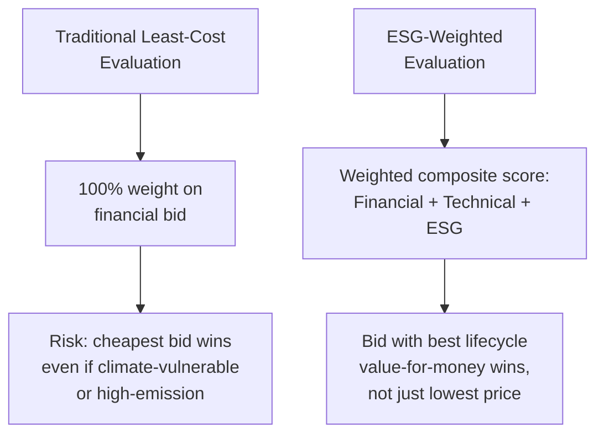
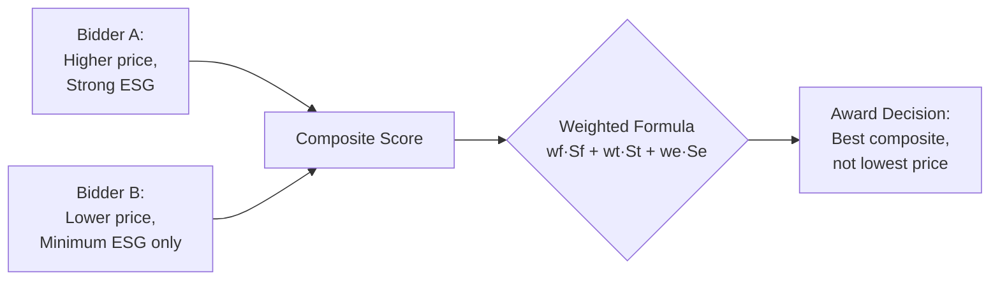

## Environmental, Social, and Governance Criteria in Bid Evaluation

### Overview

Environmental, Social, and Governance (ESG) criteria in bid evaluation refers to the practice of formally incorporating non-financial sustainability factors into the procurement scoring methodology used to select a private partner for a Public-Private Partnership (PPP). This departs from the traditional PPP tender model, in which bids are evaluated predominantly (or exclusively) on financial terms — lowest net present cost, lowest tariff, or highest concession fee offered. ESG-weighted evaluation instead builds environmental performance, social value, and governance/integrity commitments directly into the scoring rubric that determines contract award, alongside — not instead of — financial and technical criteria.

This is procedurally distinct from ESG *safeguards* (environmental and social impact assessments required for regulatory compliance, which apply regardless of who wins) and from post-award ESG *monitoring* (KPI tracking during the operations phase). Bid evaluation ESG criteria operate specifically at the **competitive selection stage** — they change who wins the contract, not merely how the winner is later held accountable.

### Why Least-Cost Evaluation Under-Prices Sustainability

Traditional PPP tender selection criteria are typically based on a least-cost approach, which can promote assets that are not resilient enough to withstand climate impacts or that externalize environmental and social costs onto the public. A bidder proposing a marginally cheaper but carbon-intensive or climate-vulnerable design will win under pure least-cost scoring even if a more resilient or lower-emission alternative would produce superior lifecycle value — because the evaluation methodology has no mechanism to capture that difference. ESG-weighted bid evaluation is the direct procedural corrective: it converts qualitative sustainability attributes into quantifiable scoring inputs that can outweigh a modest price differential.

### Standard Bid Evaluation Architecture

Most PPP tenders use a **two-envelope** or **multi-envelope** system: bidders submit separate technical and financial proposals, with the technical envelope opened and scored first (sometimes on a pass/fail threshold, sometimes on a weighted score), followed by the financial envelope. ESG criteria are typically embedded as a distinct scoring dimension within the technical envelope, or as a fully separate third envelope in more advanced procurement frameworks.

**Key Points**

- **Pass/fail (minimum threshold) approach**: Bidders must meet a minimum ESG compliance bar (e.g., a mandatory Environmental and Social Management Plan, exclusion of prohibited activities under the IFC Exclusion List) to be technically responsive; ESG performance above the threshold does not add extra points.
- **Weighted-score approach**: ESG performance is scored on a graduated scale (e.g., 0–100) and contributes a fixed percentage weight to the overall composite bid score, alongside technical and financial weights.
- **Combined approach**: A mandatory minimum threshold *plus* additional weighted points for performance above that threshold — the most common design in leading-practice frameworks, since it guarantees a baseline while still rewarding ambition.

### Typical Composite Scoring Formula

A common weighted-sum formula used in Most Economically Advantageous Tender (MEAT) evaluation is:

$$\text{Total Score} = w_f \cdot S_f + w_t \cdot S_t + w_e \cdot S_e$$

where $S_f$, $S_t$, and $S_e$ are the normalized financial, technical, and ESG scores respectively (each typically scaled 0–100), and $w_f + w_t + w_e = 1$. Illustrative weight allocations seen in practice range from $w_e = 0.10$ to $w_e = 0.25$ for the ESG component in infrastructure PPPs with material sustainability exposure, though weights are project- and jurisdiction-specific and are set out in the tender's Request for Proposal (RFP) evaluation criteria.

**[Inference]** For a first-generation ESG-weighted tender in a jurisdiction without established precedent, a lower ESG weight (in the 10–15% range) combined with a firm mandatory pass/fail threshold is likely a more defensible starting design than a high ESG weight — since it reduces legal challenge risk from bidders unfamiliar with subjective sustainability scoring while still establishing the practice.

### Illustrative ESG Sub-Criteria by Pillar

| Pillar | Example Bid Evaluation Sub-Criteria | Typical Scoring Basis |
| --- | --- | --- |
| Environmental | Lifecycle GHG emissions of proposed design; climate resilience measures (flood-proofing, redundancy); resource efficiency (water/energy use); biodiversity/habitat impact mitigation | Quantitative (tCO₂e, % reduction) or qualitative technical panel scoring |
| Social | Local employment and skills-transfer commitments; community engagement plan quality; occupational health and safety (OHS) track record; affordability/inclusion provisions for end-users | Mix of quantitative commitments (# jobs, % local hire) and qualitative plan review |
| Governance | Anti-corruption and integrity compliance history; beneficial ownership transparency; track record of contract performance/disputes on prior concessions; quality of proposed grievance-redress mechanism | Track-record screening (pass/fail) plus qualitative plan scoring |

### Worked Example: Scoring a Wastewater Treatment PPP Bid

**Example**

Assume an RFP sets $w_f = 0.60$, $w_t = 0.25$, $w_e = 0.15$, with the ESG sub-score further disaggregated as 50% environmental, 30% social, 20% governance. Bidder A proposes a design with 12% lower lifecycle emissions than the technical baseline and commits to 40% local hiring during construction, scoring 85/100 on the ESG dimension. Bidder B offers a 3% lower financial bid but only meets minimum compliance thresholds with no above-baseline commitments, scoring 55/100 on ESG. If Bidder A's financial and technical scores are within a few points of Bidder B's, the 30-point ESG differential (worth 4.5 points of total composite score at $w_e = 0.15$) can be sufficient to overcome Bidder B's price advantage — this is the mechanical effect that pure least-cost evaluation cannot replicate.

### Verification and Anti-Gaming Safeguards

A structural risk in any weighted qualitative scoring system is that bidders overstate ESG commitments to win the tender, then under-deliver during construction and operations ("bid-and-switch" or a procurement-stage analogue of greenwashing). Leading-practice frameworks mitigate this through:

- **Converting winning ESG commitments into binding contract obligations**: Whatever ESG commitments earned points during evaluation should be transposed verbatim into the PPP contract's technical specifications and KPI framework, with liquidated damages or step-in rights attached to non-performance — not left as an unenforceable tender promise.
- **Bid bonds and performance security calibrated to ESG commitments**: Increasing the performance bond or requiring a dedicated ESG compliance bond where a bidder has won specifically on the strength of above-threshold ESG scoring.
- **Independent technical evaluation committees**: Using a scoring panel with dedicated environmental and social specialists (distinct from purely financial/legal evaluators) to reduce the risk of superficial or "boilerplate" ESG proposals scoring artificially high.
- **Standardized, auditable scoring rubrics**: Publishing detailed scoring guidance (not just criteria headings) in the RFP so that evaluators apply consistent, defensible standards — reducing both gaming risk and legal challenge risk from unsuccessful bidders.

### Governance and Reference Frameworks

- **World Bank/PPIAF/GIF Climate Toolkits for Infrastructure PPPs (CTIP3)** feed directly into bid evaluation design: the climate risk and GHG assessments produced upstream (Modules 2–3) provide the technical baseline against which competing bids' environmental proposals can be objectively compared.
- **IFC Performance Standards** and the **IFC Exclusion List** are commonly incorporated by reference as the minimum environmental and social threshold bidders must meet to be technically responsive, particularly in Multilateral Development Bank (MDB)-financed PPPs.
- **MDB Procurement Frameworks** (e.g., World Bank New Procurement Framework's "Rated Criteria" mechanism) provide a structured, pre-approved methodology for assigning non-price weighted criteria — including sustainability — without triggering procurement-fairness challenges, since the methodology is disclosed transparently in the bidding documents before submission.
- **National PPP laws and implementing rules** in many jurisdictions are increasingly amended to explicitly authorize non-price/ESG weighting in the Swiss Challenge or competitive bidding process, since older PPP legislation drafted before ESG's mainstreaming sometimes defaults to lowest-cost or highest-fee award criteria by statute, requiring a legal basis check before an ESG-weighted RFP can be issued.

### Practical Design Considerations for a Procuring Authority

**Key Points**

- **Transparency is the primary legal defense**: The scoring methodology, weights, and sub-criteria must be fully disclosed in the RFP before bid submission — retroactively introducing or adjusting ESG weights after bids are received is a common ground for procurement challenge and contract award annulment.
- **Quantify wherever feasible**: Sub-criteria expressed in measurable units (tCO₂e reduced, % local employment, number of grievance cases resolved within SLA) are more defensible under challenge than purely narrative "quality of environmental plan" scoring, which invites subjective disputes between evaluators and losing bidders.
- **Match ESG weight to project risk profile**: A project with high climate exposure (a coastal transport asset) or high social sensitivity (a resettlement-heavy right-of-way) warrants proportionally higher ESG weighting than a project type (e.g., a low-impact ICT data-transmission PPP) where sustainability exposure is comparatively limited.
- **Align with the payment mechanism**: ESG criteria scored at bid stage should map onto the KPIs monitored during operations, so that the sustainability case made to win the tender continues to be enforced — and financially incentivized or penalized — for the life of the concession.

**[Unverified]** Whether a specific LGU's existing PPP code (as opposed to a national framework) already permits non-price/ESG-weighted evaluation, or whether an implementing rules amendment or special authorization would be required first, is jurisdiction-specific and should be confirmed against the applicable local PPP statute before designing an ESG-weighted RFP.

**Next Steps**

- Draft a sample RFP evaluation-criteria clause with fully worked weights and sub-criteria for a specific sector (e.g., solid waste management PPP)
- Study how ESG bid-stage commitments are legally transposed into binding contract KPIs and liquidated-damages clauses
- Review MDB "Rated Criteria" procurement guidance in detail as a template methodology
- Examine dispute case studies where ESG-weighted scoring was legally challenged by unsuccessful bidders, and how procuring authorities defended the methodology
- Connect this topic back to CTIP3 Module 3/4 outputs as the technical baseline feeding environmental sub-criteria scoring