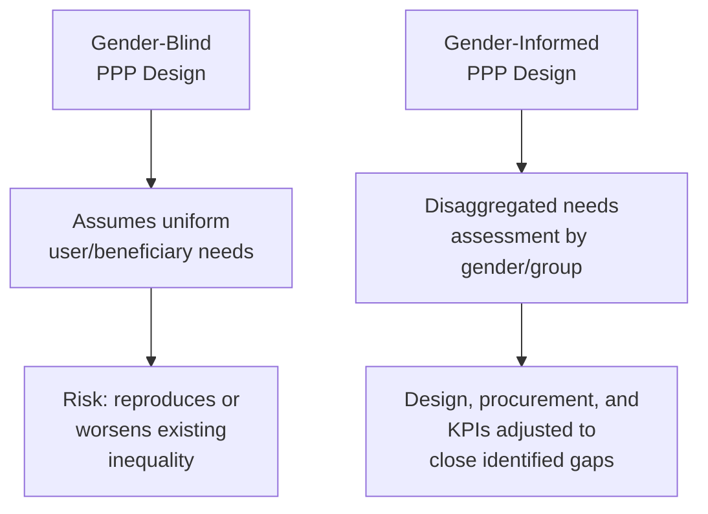
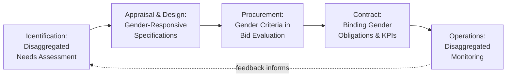

## Gender-Informed and Inclusive PPP Design

### Overview

Gender-informed and inclusive PPP design refers to the deliberate integration of gender equality and social inclusion (GESI) considerations across the full Public-Private Partnership (PPP) project cycle — from feasibility and needs assessment through procurement, contract structuring, and operational monitoring — rather than treating gender as an ancillary safeguard applied only during environmental and social impact assessment. The underlying premise is that infrastructure is not gender-neutral in its effects: design decisions, tariff structures, employment practices, and consultation processes can systematically differ in their impact on women, girls, persons with disabilities, and other marginalized groups unless those effects are explicitly analyzed and addressed at each decision point.

This differs from generic "social" ESG criteria in that it requires **disaggregated analysis** — understanding how a given intervention affects different demographic groups differently — rather than treating "the community" or "affected persons" as a homogeneous population.

### Why Infrastructure Is Not Gender-Neutral

Physical and service infrastructure interacts with existing social and economic roles in ways that produce differentiated outcomes. Common documented patterns include:

- **Transport**: Trip-chaining behavior (multiple short, off-peak trips linked to caregiving and household responsibilities) differs from the single-destination commuting pattern that transit systems are often designed around, meaning route and schedule design optimized for commuter flows can underserve caregivers.
- **Water and sanitation**: Time spent collecting water disproportionately falls on women and girls in many contexts, directly affecting school attendance and income-generating time; a water PPP's service-area prioritization therefore has a differentiated welfare effect.
- **Public lighting and safety**: Personal security concerns around infrastructure design (poorly lit transit stops, unmonitored underpasses) have been documented to affect women's mobility and infrastructure usage patterns more acutely than men's.
- **Employment in construction and operations**: Absent deliberate design, construction-phase and operations-phase jobs in infrastructure PPPs default toward existing gender-segregated labor market patterns, reproducing rather than correcting exclusion.

### Entry Points Across the PPP Project Cycle

Gender-informed design is most effective when embedded as a checklist at each stage of the standard PPP cycle, rather than as a single stand-alone assessment.

**1. Identification and Feasibility**

Sex-disaggregated data collection during needs assessment and demand forecasting — for example, disaggregating ridership surveys, willingness-to-pay studies, and household consultations by gender, age, and disability status rather than collecting household-level data that defaults to a single (often male) respondent.

**2. Appraisal and Design**

Translating disaggregated findings into concrete technical specifications: lighting and sightline standards at transit stops, gender-separated or family-friendly sanitation facilities, accessible design compliant with universal design principles for persons with disabilities, and route/schedule design informed by trip-chaining data rather than commuter-only assumptions.

**3. Procurement and Bid Evaluation**

Incorporating gender-responsive criteria into bid evaluation — for instance, scoring bidders on proposed female employment targets in construction and operations, supplier diversity commitments, or the quality of a proposed gender action plan — using the same weighted-scoring architecture applicable to broader ESG bid criteria.

**4. Contract Structuring and Concession Agreement**

Embedding binding gender-related obligations directly into the PPP contract: minimum female employment quotas with phased targets, mandatory anti-sexual-harassment and grievance-redress mechanisms for the workforce, and equal-pay-for-equal-work covenants enforceable through the same liquidated-damages or step-in-rights architecture used for other performance obligations.

**5. Operations and Monitoring**

Including sex-disaggregated Key Performance Indicators (KPIs) in the ongoing monitoring framework — not just aggregate ridership or service-coverage numbers, but disaggregated usage, satisfaction, safety-incident, and employment data tracked over the life of the concession.

### Gender Action Plans (GAPs)

A Gender Action Plan is the standard instrument used by Multilateral Development Banks (MDBs) to operationalize gender-informed design within a specific project. A typical GAP structure includes:

| Component | Content |
| --- | --- |
| Gender Gap Analysis | Baseline disaggregated data identifying specific gaps the project can address |
| Objectives and Actions | Concrete, project-specific actions mapped to identified gaps (e.g., "install gender-separated sanitation facilities at all X stations") |
| Indicators and Targets | Measurable, time-bound targets for each action (e.g., "30% female workforce participation in construction by Year 2") |
| Responsible Party | Whether the procuring authority, the concessionaire/SPV, or both are accountable for each action |
| Budget | Costed allocation for GAP implementation, distinguishing costs borne by the public sector versus embedded in the concessionaire's contract price |
| Monitoring Schedule | Reporting frequency and verification method, typically aligned to the project's broader KPI monitoring cycle |

**[Inference]** For a PPP procured without direct MDB financing, a lighter-weight adaptation of the GAP structure — focused on the procurement and contract-obligation entry points rather than a full standalone MDB-style document — is likely more proportionate for a sub-national or LGU-level project, given typically more limited institutional capacity to manage a full parallel GAP monitoring workstream.

### Worked Example: Gender-Responsive Design in an Urban Bus PPP

**Example**

A municipal bus PPP's feasibility study disaggregates a household travel survey and finds that women make 40% more trips than men but travel shorter average distances, with a high proportion of trips linked to childcare, eldercare, and market visits occurring in off-peak hours. In response, the RFP's technical specifications require: (1) minimum service frequency during off-peak hours rather than only peak-commute optimization; (2) priority seating and stroller/wheelchair accessible boarding on all vehicles; (3) well-lit, camera-monitored waiting areas at all stops as a mandatory design standard, not an optional add-on; and (4) a contractual female-employment target of 25% of the operations workforce (including driving roles) by Year 3, verified annually and tied to a portion of the performance-based subsidy payment. This converts the initial disaggregated data finding into binding technical and contractual specifications rather than a discretionary aspiration.

### Common Pitfalls and Anti-Tokenism Safeguards

**Key Points**

- **"Add gender and stir" risk**: Appending a generic gender statement to project documentation without disaggregated data or binding obligations produces no measurable change in outcomes; gender considerations must translate into specific, verifiable technical specifications and contract clauses to be meaningful rather than symbolic.
- **Employment quotas without enabling conditions fail**: A female-employment target imposed on a concessionaire without addressing barriers (lack of on-site sanitation facilities for female workers, unsafe transport to worksites, absence of childcare support, workplace harassment policies) is unlikely to be met in practice; quotas should be paired with the enabling conditions that make them achievable.
- **Data disaggregation must be genuine, not superficial**: Collecting household-level survey data that defaults to a single respondent (commonly the household head) undercounts the needs and travel patterns of other household members; survey design itself must be structured to capture individual-level, disaggregated responses.
- **Grievance mechanisms need a gender-responsive channel**: A generic project grievance-redress mechanism may be underused for gender-based harassment or exploitation concerns unless it offers confidential, gender-sensitive reporting channels and clearly defined survivor-centered response protocols.

### Governance and Reference Frameworks

- **World Bank Group Gender Strategy and Gender Tags**: World Bank-financed projects are tagged and tracked for the extent to which they incorporate gender-informed design, analysis, and monitoring, providing a structured methodology procuring authorities can adapt even without direct Bank financing.
- **IFC Performance Standard 2 (Labor and Working Conditions) and Performance Standard 4 (Community Health, Safety, and Security)**: Provide baseline requirements relevant to workplace gender equity and community safety design that intersect directly with gender-informed infrastructure design.
- **2X Challenge / 2X Criteria**: A framework originally developed by G7 Development Finance Institutions to mobilize capital toward gender-lens investing, offering a structured set of criteria (women in leadership, workforce, supply chains, products/services, and portfolio) that can inform how gender performance is scored or financed within a PPP's private-sector participation.
- **UNECE PPP and Gender Framework / PIARC Gender-Responsive Transport guidance**: Sector-specific guidance documents (particularly for transport) providing detailed technical checklists for gender-responsive infrastructure design.
- **National Gender and Development (GAD) mandates**: Many jurisdictions, including the Philippines, maintain statutory GAD budgeting and mainstreaming requirements applicable to government agencies and, by extension, to public infrastructure projects they procure — a relevant compliance layer for an LGU-level PPP unit to confirm applies to its specific transaction.

**[Unverified]** The specific GAD budget-allocation percentage requirement and its applicability to LGU-procured PPP transactions (as opposed to direct LGU program expenditures) is jurisdiction- and agency-specific and should be verified against the applicable national and local GAD implementing rules rather than assumed to apply uniformly.

### Practical Design Considerations for a Procuring Authority

**Key Points**

- **Disaggregate before designing**: Commission or require disaggregated baseline data collection (by gender, age, disability, and other relevant social categories) before finalizing technical specifications, since design decisions made on aggregate data risk defaulting to the needs of the historically dominant user group.
- **Convert findings into binding obligations, not aspirations**: Gender-responsive design elements identified during appraisal should appear in the RFP's mandatory technical specifications and the eventual contract's KPI framework — using the same enforceable-obligation logic applicable to other ESG and climate-resilience commitments discussed elsewhere in this chapter — rather than remaining as a narrative commitment in a feasibility study.
- **Budget for enabling conditions**: Where employment or participation targets are set, budget explicitly for the conditions (facilities, safety measures, training, childcare support) needed to make those targets achievable, rather than imposing an unfunded mandate on the concessionaire.
- **Align monitoring with existing KPI infrastructure**: Sex-disaggregated indicators should be added to the project's existing performance-monitoring framework rather than run as a separate parallel reporting system, reducing administrative burden while maintaining data integrity.

**Next Steps**

- Draft a sample sex-disaggregated KPI set for a specific sector-type PPP (e.g., urban transport, water utility)
- Study the 2X Criteria in detail as a potential scoring framework for gender-responsive bid evaluation
- Review Philippine GAD mainstreaming requirements in relation to LGU PPP procurement specifically
- Examine how gender-based grievance-redress mechanisms are structurally separated from general project grievance channels in comparable case studies
- Connect this topic to the broader ESG Criteria in Bid Evaluation chapter item to integrate gender sub-criteria into a unified weighted scoring formula