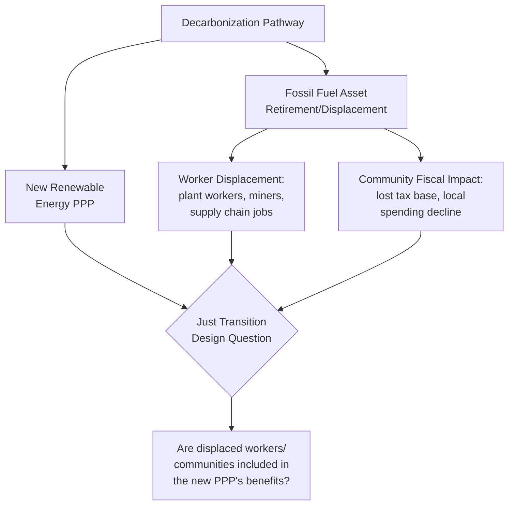

## Just Transition Considerations in Energy PPPs

### Overview

Just Transition refers to the principle and associated policy framework that the shift away from fossil-fuel-based energy systems toward low-carbon alternatives must be managed in a way that fairly distributes the costs and benefits of that transition, rather than allowing decarbonization gains to be captured broadly while transition costs — job losses, community economic decline, stranded assets — fall narrowly on specific workers, communities, and regions. In the context of Public-Private Partnerships (PPPs), Just Transition considerations arise wherever a PPP either (a) directly replaces or decommissions fossil-fuel energy infrastructure, or (b) is itself a new renewable energy PPP sited in or near a community historically dependent on the fossil-fuel value chain it may partially displace.

This distinguishes Just Transition from the broader ESG and gender-inclusion topics addressed elsewhere in this chapter: it is specifically concerned with the **distributional consequences of a structural economic shift**, not general environmental or social performance.

### The Core Tension in Energy PPPs

Energy PPPs sit at the center of the Just Transition challenge because they are simultaneously the vehicle for decarbonization (new solar, wind, and hydropower PPPs) and, in many jurisdictions, connected to the assets being phased out (coal-fired power purchase agreements, fossil-fuel-dependent grid infrastructure, and the workforces and local economies built around them). A PPP structuring decision made purely on levelized cost of electricity (LCOE) or bankability grounds can therefore generate significant local economic disruption even while achieving a net positive climate outcome at the national or global level.

### Four Recognized Pillars of Just Transition

Drawing from the International Labour Organization's (ILO) Guidelines for a Just Transition and subsequent adoption by climate finance institutions, Just Transition frameworks generally organize around four pillars:

1. **Social dialogue and stakeholder engagement** — Meaningful consultation with affected workers, unions, and communities in transition planning, not merely notification after decisions are finalized.
2. **Decent work and job creation** — Ensuring new energy PPP jobs are quality jobs (fair wages, safety standards, formal employment) and that job creation is scaled and sequenced to genuinely absorb displaced workers, not merely counted in aggregate without regard to who is actually re-employed.
3. **Social protection** — Transitional income support, retraining stipends, pension bridging, and severance frameworks for workers displaced before new opportunities materialize.
4. **Economic diversification** — Addressing the fiscal and economic base of communities historically dependent on a single fossil-fuel industry, since a coal town's economy cannot be sustained by the smaller workforce a solar farm typically requires on the same land.

### Structural Asymmetry: Job Intensity and Skills Mismatch

**Key Points**

- Renewable energy generation is typically less labor-intensive per megawatt in ongoing operations than fossil-fuel generation (particularly coal, which requires continuous fuel extraction, transport, and handling labor), meaning a direct one-for-one job replacement assumption is usually unrealistic.
- Construction-phase renewable energy PPP employment is often substantial but temporary (2–4 years for a utility-scale project), while the jobs being displaced (mining, plant operations) were often long-term, unionized, and higher-wage — creating both a quantity and a quality gap that a Just Transition plan must explicitly address rather than assume away.
- Skills transferability is partial: some technical roles (electrical, mechanical maintenance, grid operations) transfer relatively well from fossil-fuel to renewable facilities with targeted retraining; others (mining-specific extraction skills) do not transfer directly and require more substantial reskilling investment or alternative livelihood support.

**[Inference]** Given this asymmetry, a Just Transition plan that relies solely on the new energy PPP's own direct hiring to absorb a displaced fossil-fuel workforce is likely to under-deliver on employment outcomes; complementary economic diversification measures (attracting other industries, supporting small business development) are probably necessary to fully address the community-level fiscal and employment gap, separate from what any single PPP contract can reasonably be expected to solve.

### Embedding Just Transition into PPP Structuring

**1. Feasibility and Site Selection**

Where a renewable PPP is intentionally sited to replace or co-locate with a retiring fossil-fuel asset (a growing pattern sometimes called "coal-to-clean" repowering), feasibility studies should explicitly map the existing workforce, its skills profile, and the local fiscal dependency on the retiring asset, alongside the standard technical and financial feasibility analysis.

**2. Procurement and Bid Evaluation**

Just Transition criteria can be incorporated into the same weighted ESG bid-evaluation architecture used for broader sustainability scoring: bidders can be scored on proposed local/displaced-worker hiring targets, retraining program commitments, and community investment plans, using the same pass/fail-threshold-plus-weighted-points structure applicable to other ESG sub-criteria.

**3. Contract Structuring**

Binding obligations translate Just Transition commitments from aspiration into enforceable contract terms: minimum local-hiring quotas with a defined preference tier for workers displaced from the retiring asset, funded retraining program requirements, and community benefit-sharing mechanisms (e.g., a percentage of revenue or a fixed community development fund) written into the concession agreement's payment or obligations schedule.

**4. Financing Structure**

Just Transition-aligned financing instruments — including sustainability-linked loans with Sustainability Performance Targets (SPTs) tied specifically to displaced-worker hiring rates or retraining completions, and dedicated Just Transition funds or facilities offered by some Multilateral Development Banks (MDBs) and Development Finance Institutions (DFIs) — can align the cost of capital with transition-employment outcomes, using the same margin-ratchet mechanism structure applicable to sustainability-linked financing generally.

**5. Operations and Monitoring**

Ongoing KPI tracking should disaggregate not just aggregate employment numbers but the proportion of hires drawn from the displaced workforce or affected community specifically, since an energy PPP could technically meet an aggregate local-hiring target while hiring none of the workers actually displaced by the transition it is part of.

### Worked Example: Coal Plant Retirement Paired with Solar PPP

**Example**

A national utility retires a 300 MW coal plant employing 450 direct workers and supporting an estimated 1,200 indirect jobs in the surrounding town's supply chain and services. A 200 MW solar PPP is procured on adjacent land, expected to generate approximately 80 permanent operations jobs post-construction (alongside a larger but temporary construction workforce). A Just Transition plan for this pairing would need to explicitly address: (1) that 80 permanent jobs cannot numerically absorb 450 direct workers, let alone indirect employment, requiring a regional economic diversification strategy beyond the solar PPP itself; (2) which subset of coal-plant skills (electrical, grid, maintenance) are transferable to solar operations with retraining, and which are not; (3) a bridging income-support or pension mechanism for workers unable to transition before the coal plant's closure date; and (4) a community fund, potentially financed through a small levy on the solar PPP's revenue, directed toward local economic diversification rather than assuming the solar project alone constitutes adequate replacement.

### Governance and Reference Frameworks

- **ILO Guidelines for a Just Transition to Environmentally Sustainable Economies and Societies for All**: The foundational normative framework defining the four-pillar structure referenced above.
- **Just Energy Transition Partnerships (JETPs)**: Country-level, multi-donor financing and policy packages (established for South Africa, Indonesia, Vietnam, and Senegal, among others) that bundle concessional finance, technical assistance, and policy reform commitments to support a country's coal-to-clean transition, providing a country-level policy backdrop against which individual energy PPPs may be structured.
- **World Bank Just Transition for All initiative**: Provides diagnostic and advisory tools for assessing coal transition impacts and designing mitigating interventions, complementary to but distinct from the CTIP3 climate-risk toolkits addressed elsewhere in this chapter (CTIP3 addresses climate risk and mitigation in project design; Just Transition frameworks address the socioeconomic transition-management dimension specifically).
- **Climate Investment Funds (CIF) Accelerating Coal Transition (ACT) Investment Program**: A dedicated concessional finance window supporting coal transition planning and implementation, including worker and community transition measures, in select countries.

**[Unverified]** Whether a specific jurisdiction's energy sector currently has an active or planned coal-to-clean transition program (such as a JETP) that a given energy PPP might connect to is country-specific and time-sensitive, and should be confirmed against current national energy policy rather than assumed.

### Common Pitfalls and Design Failures

**Key Points**

- **Treating aggregate job numbers as sufficient**: Reporting total jobs created by a renewable PPP without disaggregating how many were filled by workers actually displaced by the transition obscures whether a genuine just transition occurred versus simply new jobs going to a different, unrelated labor pool.
- **Sequencing failure**: Retiring fossil-fuel assets before replacement livelihoods (new PPP construction jobs, retraining completion, alternative industry investment) are actually available creates an employment and income gap that a Just Transition plan must explicitly sequence against, rather than assuming simultaneous timing.
- **Excluding informal and indirect workers**: Just Transition planning focused only on direct, formally employed plant workers can miss a larger population of informally employed or indirect supply-chain workers (transport, local services, informal mining-adjacent economies) who are equally affected but harder to formally count and target.
- **Underestimating fiscal transition costs for local government**: A retiring fossil-fuel asset frequently represents a disproportionate share of a host municipality's tax base; a Just Transition plan focused only on worker-level outcomes without addressing local government fiscal transition risks an incomplete response to the actual community-level impact.

### Practical Design Considerations for a Procuring Authority

**Key Points**

- **Map the transition, not just the new project**: Where an energy PPP is connected to a fossil-fuel asset retirement, feasibility analysis should explicitly quantify the workforce and fiscal base being displaced, not treat the new PPP as a standalone project unconnected to that displacement.
- **Set realistic absorption expectations**: Given the job-intensity asymmetry between fossil and renewable generation, avoid presenting a new energy PPP's direct employment as a full substitute for displaced jobs; frame it as one component of a broader regional transition strategy.
- **Bind commitments contractually**: As with other ESG dimensions addressed in this chapter, Just Transition commitments made during bidding should be converted into enforceable contract obligations and monitored KPIs, not left as non-binding aspirational statements in a feasibility study or bid proposal.
- **Coordinate beyond the single PPP**: Given that a single energy PPP is structurally unlikely to fully resolve a community's transition needs, procuring authorities should consider how the PPP's community-benefit or local-hiring provisions coordinate with broader national or donor-supported transition programs (such as a JETP, where applicable) rather than operating in isolation.

**Next Steps**

- Study a specific JETP country case (e.g., South Africa or Indonesia) in detail as a policy-financing template
- Draft sample contract clauses for displaced-worker hiring preference and retraining obligations in an energy PPP concession agreement
- Examine how sustainability-linked loan SPTs have been calibrated specifically around Just Transition employment metrics in comparable transactions
- Connect this topic to the Green Bonds and Sustainability-Linked Financing chapter item to explore Just Transition-labeled financing instruments specifically
- Review CTIP3's Hydropower and Solar/Wind sector toolkits alongside Just Transition frameworks to integrate physical climate risk and socioeconomic transition planning into a single project appraisal