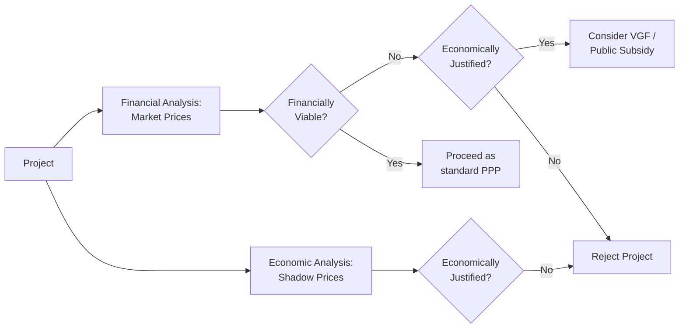
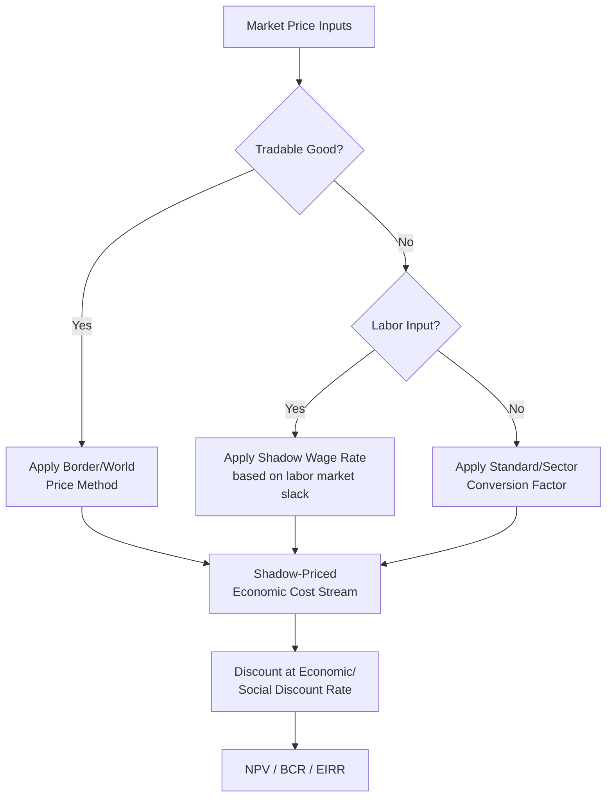

## Cost-Benefit Analysis and Shadow Pricing Techniques

### Overview

Cost-Benefit Analysis (CBA) is the standard analytical framework used to determine whether a proposed infrastructure project — and by extension, a candidate Public-Private Partnership (PPP) — generates net positive value to society, expressed by comparing the discounted stream of economic benefits against the discounted stream of economic costs over the project's evaluation horizon. Shadow pricing is the companion technique used to correct market prices that fail to reflect the true economic (as opposed to financial) value of inputs and outputs, which is essential in PPP appraisal because a project can appear financially unattractive at market prices while remaining economically justified once distortions are corrected — or vice versa.

This distinction between **financial analysis** (cash flows at market prices, relevant to the private concessionaire's bankability) and **economic analysis** (welfare effects at shadow prices, relevant to the public sector's decision to proceed) is the foundational concept underpinning this entire topic.

### Financial vs. Economic Analysis: Why Both Are Required

**Key Points**

- **Financial analysis** answers: "Is this project bankable? Will the concessionaire's revenues cover its costs and generate an acceptable return?" It uses actual market prices, taxes, subsidies, and tariffs as the concessionaire will actually experience them.
- **Economic analysis** answers: "Does this project increase national welfare? Are the resources it consumes worth less than the benefits it produces to society as a whole?" It uses shadow prices that strip out transfers (taxes, subsidies) and correct for market distortions, since a tax payment is a transfer between citizens and government, not a net use of real economic resources.
- A project can be **financially viable but economically unjustified** (e.g., a heavily subsidized toll road that extracts value from taxpayers without generating commensurate real economic benefit) or **economically justified but financially unviable** (e.g., a rural water system with high social returns but insufficient user willingness/ability to pay to cover full-cost tariffs) — this second case is precisely why the Viability Gap Funding (VGF) mechanism exists in PPP frameworks, to bridge the difference between an economically sound project's social returns and its private financial returns.

### Core CBA Metrics

The three standard decision metrics derived from a discounted cash flow of costs and benefits are:

**Net Present Value (NPV)**

$$NPV = \sum_{t=0}^{T} \frac{B_t - C_t}{(1+r)^t}$$

where $B_t$ and $C_t$ are the benefits and costs in year $t$, $r$ is the discount rate, and $T$ is the project's evaluation horizon. A project is economically justified under the NPV criterion when $NPV > 0$ at the chosen economic discount rate.

**Benefit-Cost Ratio (BCR)**

$$BCR = \frac{\sum_{t=0}^{T} \frac{B_t}{(1+r)^t}}{\sum_{t=0}^{T} \frac{C_t}{(1+r)^t}}$$

A project passes the BCR test when $BCR > 1$. BCR is particularly useful for ranking competing projects under a constrained capital budget, since it expresses value generated per unit of cost, whereas NPV in isolation can favor a larger project with a smaller relative return.

**Economic Internal Rate of Return (EIRR)**

The EIRR is the discount rate $r^*$ at which $NPV = 0$:

$$0 = \sum_{t=0}^{T} \frac{B_t - C_t}{(1+r^*)^t}$$

A project is economically justified when the EIRR exceeds the chosen economic discount rate (often called the hurdle rate or opportunity cost of capital). EIRR is distinguished from the Financial Internal Rate of Return (FIRR), which uses market-price cash flows and is the metric relevant to the concessionaire's return-on-equity decision rather than the public sector's welfare decision.

### Shadow Pricing: Core Techniques

Shadow pricing exists because market prices in many economies — particularly developing economies with significant taxes, subsidies, trade protection, labor market distortions, or non-traded goods — diverge from the true opportunity cost of resources. The standard techniques for deriving shadow prices are:

**1. Border Pricing / World Price Method (for Tradable Goods)**

For goods that are internationally traded (steel, cement, fuel, machinery), the shadow price is derived from the border (CIF/FOB) price rather than the domestic market price, since the border price reflects the good's true opportunity cost to the economy — what it would actually cost to import or the value forgone by not exporting it — stripped of domestic tariffs, taxes, and subsidies that are transfers rather than real resource costs.

**2. Standard Conversion Factor (SCF) and Conversion Factors for Non-Tradables**

For non-traded goods and services (most labor, land, and local construction services) that cannot be directly benchmarked against a border price, a Standard Conversion Factor is applied — a single economy-wide ratio between the shadow (economic) price level and the domestic market price level, reflecting the average distortion (average tariff and tax wedge) across the economy. Specific conversion factors (SCFs for particular sectors) can be used where sector-specific distortions differ materially from the economy-wide average.

**3. Shadow Wage Rate (SWR) for Labor**

Labor is shadow-priced differently depending on labor market conditions:

$$SWR = \text{Market Wage} \times \text{Conversion Factor for Labor}$$

- In economies or sectors with significant **unemployment or underemployment** (common in unskilled rural labor markets in many developing economies), the shadow wage is set below the market wage — sometimes substantially — since the opportunity cost of employing previously unemployed or underemployed labor is lower than the wage paid, reflecting that the labor's marginal product in its prior use was low or zero.
- In **fully employed, competitive labor markets** (typically skilled/professional labor), the shadow wage approximates the market wage, since employing this labor on the project genuinely displaces its use elsewhere at close to full opportunity cost.
- A conversion factor is applied to the market wage rather than assuming a flat percentage universally, and the appropriate factor varies significantly by labor market segment, region, and skill level — making this one of the more judgment-intensive shadow pricing exercises in project appraisal.

**4. Shadow Price of Capital / Discount Rate Selection**

The choice of economic discount rate itself reflects a shadow price — specifically, the shadow price of capital, since capital diverted to the project has an opportunity cost in its next-best alternative use (private investment displaced, or the social time preference for consumption today versus in the future). Multilateral Development Banks (MDBs) commonly apply a standardized real economic discount rate (historically often in the 10–12% range for many developing-economy applications, though rates are periodically revised and vary by institution and country), while some national planning agencies specify their own official Social Discount Rate (SDR) for public investment appraisal.

**5. Shadow Exchange Rate (SER)**

Where a country's official exchange rate is distorted (overvalued due to capital controls, multiple exchange rate regimes, or trade restrictions), a Shadow Exchange Rate Factor is applied to convert foreign-currency-denominated costs and benefits into local currency at a rate that better reflects the currency's true scarcity value, rather than the administratively set official rate.

### Valuing Non-Market Benefits

Many PPP benefits are not directly priced in any market and require dedicated valuation techniques:

| Benefit Type | Common Valuation Technique | Typical Application |
| --- | --- | --- |
| Travel time savings | Value of Time (VOT) studies, wage-rate proxies | Transport PPPs (roads, rail, transit) |
| Reduced accidents/fatalities | Value of a Statistical Life (VSL), willingness-to-pay studies | Road safety components of transport PPPs |
| Health improvements | Cost-of-illness avoided, willingness-to-pay | Water/sanitation PPPs (waterborne disease reduction) |
| Environmental benefits/costs | Contingent valuation, hedonic pricing, avoided damage cost | Renewable energy, pollution control PPPs |
| Avoided GHG emissions | Social Cost of Carbon (SCC) or shadow carbon price | Energy and transport PPPs with emissions profile |

**[Inference]** For an LGU-level PPP with limited budget for primary valuation research (e.g., commissioning an original willingness-to-pay survey), the more practical approach is typically benefit transfer — applying VOT, VSL, or SCC values already established in comparable studies (national transport appraisal guidance, published SCC estimates) and adjusting for income-level and context differences, rather than conducting new primary valuation research for each individual project.

### Worked Example: Simplified CBA for a Toll Road PPP

**Example**

A proposed toll road has an estimated financial construction cost of $50 million, using imported steel and equipment (weighting 40% of cost, shadow-priced at border price with a conversion factor of 0.95) and local unskilled labor (30% of cost, shadow-priced at a labor conversion factor of 0.6 given significant underemployment in the region) and local non-tradable materials (30% of cost, shadow-priced at the Standard Conversion Factor of 0.85). The shadow-priced economic cost is calculated as:

$$EC = (0.40 \times 50M \times 0.95) + (0.30 \times 50M \times 0.6) + (0.30 \times 50M \times 0.85)$$

$$EC = 19.0M + 9.0M + 12.75M = \$40.75M$$

Against this economic cost of $40.75 million (versus the $50 million financial cost), the project's quantified benefits — travel time savings valued via VOT, vehicle operating cost reductions, and avoided accident costs — are projected at a present value of $65 million over the evaluation horizon at the applicable economic discount rate, yielding:

$$NPV = 65M - 40.75M = \$24.25M, \quad BCR = \frac{65M}{40.75M} \approx 1.60$$

The project passes the economic viability test (NPV > 0, BCR > 1) even though the raw financial cost figure alone might suggest a less favorable picture — illustrating why shadow pricing can materially change the appraisal conclusion relative to unadjusted market-price analysis.

### Sensitivity Analysis and Switching Values

Because shadow price parameters (especially the shadow wage conversion factor and the economic discount rate) involve significant judgment, standard CBA practice requires sensitivity analysis: re-running the NPV/BCR/EIRR calculation under plausible alternative assumptions (e.g., ±20% on key benefit estimates, alternative discount rates) to test how robust the conclusion is. A related concept is the **switching value** — the percentage change in a key variable (cost overrun, benefit shortfall, discount rate) that would be required to flip the project's NPV from positive to negative, which identifies which assumptions the project's viability is most sensitive to and therefore which should receive the most appraisal scrutiny and, later, the most careful risk allocation in the PPP contract.

### Governance and Reference Frameworks

- **UNIDO Guidelines for Project Evaluation**: One of the original foundational methodologies (the Little-Mirrlees/UNIDO approach) establishing shadow pricing techniques including border pricing and shadow wage methodology for developing-economy project appraisal.
- **World Bank / Asian Development Bank (ADB) Economic Analysis Guidelines**: MDB-specific operational guidance on economic discount rates, shadow pricing conventions, and standard conversion factors applied in Bank-financed project appraisal, frequently used as reference even for non-MDB-financed PPPs given their standardized rigor.
- **HM Treasury Green Book** (UK) and equivalent national CBA guidance manuals in other jurisdictions: Provide detailed, publicly available methodology for valuing non-market benefits (VOT, VSL) frequently used as a benefit-transfer reference in appraisal practice internationally.
- **National Economic and Development Authority (NEDA) ICC guidelines** (Philippines) and equivalent national planning body requirements: Where applicable, national investment coordination bodies frequently mandate a specific CBA/EIRR methodology and minimum hurdle rate as a precondition for project approval, which should be confirmed as the binding methodology for any specific national or LGU-level project rather than assuming MDB conventions apply by default.

**[Unverified]** The specific current official economic discount rate or hurdle rate mandated by a given national planning authority for public investment appraisal is subject to periodic revision and should be confirmed against the current applicable guidance rather than assumed from general MDB conventions.

### Common Pitfalls in Practice

**Key Points**

- **Double-counting benefits**: A common error is counting both a direct benefit (e.g., reduced transport cost) and a derived secondary effect of that same benefit (e.g., increased property values along the route) as separate additive benefits, when the property value increase is often simply a capitalization of the same travel-time-saving benefit already counted — this constitutes double-counting rather than two distinct sources of value.
- **Ignoring displacement/transfer effects**: Benefits that represent activity merely shifted from one location or mode to another (e.g., a new toll road diverting traffic from a free alternative route without generating genuinely new trips) should not be counted as net new economic benefit at the full gross value, since the appropriate measure is the net welfare gain from the shift, not the gross activity captured.
- **Optimism bias in cost and demand forecasting**: Systematic historical tendency for infrastructure project appraisals to underestimate construction costs and overestimate demand/usage forecasts; many CBA guidance frameworks now recommend applying an explicit optimism bias adjustment (an uplift to cost estimates and/or a haircut to demand forecasts) calibrated from historical outturn data on comparable projects, rather than relying on unadjusted point forecasts.
- **Using the financial discount rate for economic analysis (or vice versa)**: The economic/social discount rate and the financial discount rate (the concessionaire's weighted average cost of capital) serve different analytical purposes and are typically numerically different; conflating them produces a hybrid calculation that answers neither question correctly.

**Next Steps**

- Work through a full multi-year discounted cash flow model applying shadow pricing to a specific sector-type project (e.g., a water treatment PPP)
- Study Value-for-Money (VfM) analysis and the Public Sector Comparator as the companion appraisal technique used specifically to compare PPP versus traditional public procurement delivery
- Examine risk-adjusted discount rate methodologies versus certainty-equivalent approaches as alternative treatments of project risk in CBA
- Review optimism bias correction methodologies and their empirical basis in infrastructure cost/demand forecasting research
- Connect this topic to CTIP3 Module 4 (climate considerations in project economics) to explore how climate risk and resilience costs are integrated into the shadow-priced economic cost stream