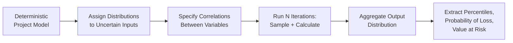
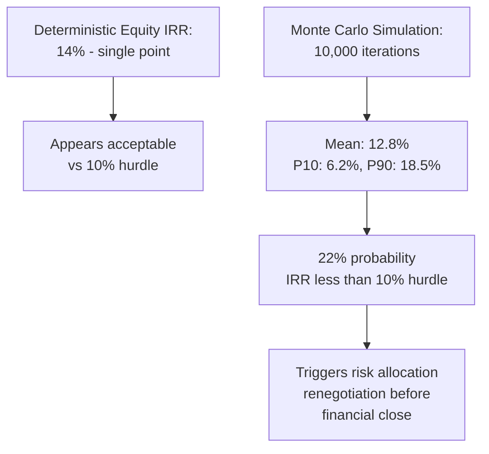

## Monte Carlo Simulation for Project Risk Modeling


### Overview

Monte Carlo simulation is a computational risk-analysis technique that models the uncertainty in a Public-Private Partnership (PPP) project's financial and economic outcomes by repeatedly sampling random values from specified probability distributions for uncertain input variables (construction cost, demand/traffic volume, operating costs, discount rates, exchange rates), running the project's financial or economic model thousands of times with each sampled combination, and aggregating the results into a probability distribution of outcomes (e.g., Net Present Value or Internal Rate of Return) rather than a single deterministic point estimate.

This addresses a structural limitation of standard deterministic Cost-Benefit Analysis and financial modeling: a single-point NPV or IRR estimate conveys no information about the *range* of plausible outcomes or the *probability* that the project will actually be viable, whereas Monte Carlo output directly answers questions such as "what is the probability this project's NPV is negative?" or "what is the 10th-percentile downside case for the concessionaire's equity IRR?" — questions that are central to both public sector fiscal risk assessment and private lender/sponsor due diligence.

### Why Deterministic Sensitivity Analysis Is Insufficient

Standard sensitivity analysis (varying one input at a time, or testing a small number of discrete scenarios such as "best case / base case / worst case") has two structural limitations that Monte Carlo simulation directly addresses:

1. **It ignores correlation between variables.** In reality, uncertain inputs are often correlated — a macroeconomic downturn that suppresses traffic demand may simultaneously affect construction input costs and interest rates. One-at-a-time sensitivity testing cannot capture these joint movements, while Monte Carlo simulation can explicitly model correlation structures between variables.
2. **It provides no probability weighting.** A "worst case" scenario in traditional scenario analysis is typically an arbitrary combination of pessimistic assumptions with no attached likelihood, whereas Monte Carlo simulation, by sampling from defined probability distributions, produces a full probability distribution of outcomes — allowing analysts to state not just that a downside case exists, but how likely it is.

```mermaid
flowchart TD
    A[Deterministic Base Case] --> B[Single Point Estimate:<br/>NPV = X]
    C[Scenario Analysis] --> D[3-5 Discrete Scenarios:<br/>Best/Base/Worst]
    E[Monte Carlo Simulation] --> F[Probability Distribution:<br/>P(NPV less than 0) = Y%]
    D -.no probability weighting.-> G[Limited decision usefulness]
    B -.no uncertainty range.-> G
    F -.full risk profile.-> H[Informed risk-based<br/>decision making]
```

### Core Methodology

**Step 1 — Model Construction**

Build a deterministic financial or economic model of the project (typically in spreadsheet form) with clearly identified input cells for each variable to be treated as uncertain, and output cells for the metrics of interest (NPV, Equity IRR, Debt Service Coverage Ratio, minimum DSCR, project completion date).

**Step 2 — Distribution Assignment**

Assign a probability distribution to each uncertain input variable, informed by historical data, expert judgment, or benchmark studies. Common distribution choices include:

| Variable Type | Typical Distribution | Rationale |
| --- | --- | --- |
| Construction cost overrun | Triangular or PERT (Beta) | Bounded (minimum, most-likely, maximum), asymmetric — cost overruns are more common and larger than underruns |
| Demand/traffic volume | Normal or Lognormal | Continuous, can be modeled as a percentage deviation from a base forecast |
| Construction duration | Triangular or PERT | Bounded, asymmetric — similar rationale to cost overrun |
| Exchange rate | Lognormal or historical bootstrap | Cannot go negative, captures fat-tailed currency movements |
| Discount rate / interest rate | Normal or Uniform | Depends on whether a central-bank policy anchor or wider uncertainty range is more appropriate |
| Discrete risk events (force majeure, political risk) | Bernoulli/binary combined with an impact distribution | Captures probability of occurrence separately from magnitude of impact if it occurs |

**Step 3 — Correlation Specification**

Where variables are believed to move together (e.g., construction cost overruns often correlate with construction delay), a correlation matrix or copula structure is specified so that the simulation does not incorrectly treat all variables as independent, which would understate the probability of compounding adverse outcomes.

**Step 4 — Iterative Sampling**

The simulation engine draws a random value for each uncertain input from its assigned distribution (respecting specified correlations), calculates the model's output metrics for that specific combination, and repeats the process for a large number of iterations — commonly 1,000 to 100,000 depending on model complexity and the precision required, since more iterations reduce the sampling error in the resulting distribution's tail estimates, which matter most for downside risk assessment.

**Step 5 — Output Distribution Analysis**

The resulting set of output values (one NPV, one IRR, etc. per iteration) is aggregated into a probability distribution, from which the analyst can extract the mean, median, standard deviation, percentiles (P10, P50, P90), and the probability that the outcome falls below (or above) any threshold of interest.



### Sampling Techniques

**Simple Random Sampling** draws independently at random from each distribution, which is straightforward but can require a very large number of iterations to accurately characterize distribution tails.

**Latin Hypercube Sampling (LHS)** is a stratified sampling technique that divides each input distribution into equal-probability intervals and ensures each interval is sampled proportionately across iterations, achieving comparable accuracy to simple random sampling with substantially fewer iterations — a material practical advantage when each iteration requires running a computationally intensive project finance model.

### Key Output Metrics for PPP Risk Assessment

**Key Points**

- **Probability of loss / probability of negative NPV**: The percentage of simulation iterations in which the project's NPV falls below zero — a direct, intuitive risk metric for public-sector decision-makers assessing whether to proceed.
- **Value at Risk (VaR)**: The loss level that will not be exceeded with a specified confidence level (e.g., "there is a 95% probability that losses will not exceed $X million"), commonly used to size contingency reserves or fiscal risk provisions.
- **Minimum Debt Service Coverage Ratio (Min DSCR) distribution**: Critical for lenders, since the probability distribution of the minimum DSCR across the loan tenor directly informs covenant-setting and the lender's willingness to finance at a given leverage level.
- **P10/P50/P90 outcomes**: Standard percentile reporting convention (particularly in resource and infrastructure project finance) where P50 represents the median case, P10 a relatively optimistic case (only 10% chance of exceeding it), and P90 a relatively conservative case (90% chance of exceeding it) — used to communicate the range of plausible outcomes to boards, lenders, and public oversight bodies without requiring them to interpret a full distribution.
- **Tornado/sensitivity diagrams derived from simulation output**: Ranking which input variables' uncertainty contributes most to output variance (via correlation or regression analysis on the simulation results), directing risk-mitigation and contract risk-allocation effort toward the variables that matter most.

### Worked Example: Toll Road PPP Equity IRR Simulation

**Example**

A toll road PPP's base-case equity IRR is calculated deterministically at 14%, assuming point estimates for construction cost, traffic ramp-up, and operating costs. A Monte Carlo simulation is built with: construction cost modeled as a PERT distribution (minimum 95% of base estimate, most likely 100%, maximum 130%, reflecting asymmetric overrun risk); Year-1 traffic volume modeled as Normal with a mean equal to the base forecast and a standard deviation of 15%, growing with a correlated annual growth-rate uncertainty in subsequent years; and operating cost modeled as Lognormal with a modest positive skew. Running 10,000 iterations using Latin Hypercube Sampling produces a simulated equity IRR distribution with a mean of 12.8% (below the deterministic 14% figure, reflecting the asymmetric downside skew typical of infrastructure cost and demand risk), a P10 of 6.2%, a P90 of 18.5%, and a calculated 22% probability that equity IRR falls below the sponsor's 10% minimum hurdle rate. This 22% probability of hurdle-rate shortfall is the decision-relevant output that the single-point 14% deterministic estimate entirely concealed, and would typically prompt renegotiation of risk allocation (e.g., a minimum traffic guarantee or a construction cost pass-through mechanism) before financial close.



### Application Points Across the PPP Lifecycle

**1. Feasibility and Appraisal**: Testing whether a project's economic NPV remains positive across a probability-weighted range of demand and cost scenarios, informing the go/no-go decision with a defensible risk profile rather than a single fragile point estimate.

**2. Risk Allocation and Contract Structuring**: Identifying, via sensitivity/tornado analysis on simulation output, which risk variables contribute most to outcome variance — directly informing which risks should be allocated to the party best able to manage or absorb them in the PPP contract's risk matrix (a construction cost overrun risk driven primarily by input material price volatility might be allocated differently than one driven by geotechnical uncertainty, for example).

**3. Lender Due Diligence and Covenant Design**: Sizing minimum DSCR covenants, cash reserve requirements (Debt Service Reserve Account sizing), and contingency/standby facilities based on the simulated probability distribution of cash flow shortfalls rather than an arbitrary fixed multiple.

**4. Public Sector Fiscal Risk Assessment**: Where the government provides guarantees, minimum revenue guarantees, or availability payments, Monte Carlo simulation of the government's contingent liability exposure informs fiscal risk provisioning and disclosure — a growing requirement in PPP fiscal risk management frameworks given the historically underappreciated fiscal risk that PPP contingent liabilities can represent.

**5. Viability Gap Funding (VGF) Sizing**: Where a project requires public subsidy to be financially viable, simulating the distribution of the financing gap (rather than relying on a single base-case gap calculation) can inform whether a fixed VGF grant or a more flexible, contingent support mechanism better matches the project's actual risk profile.

### Common Pitfalls in Practice

**Key Points**

- **Distribution misspecification**: Assigning a symmetric Normal distribution to a variable that is fundamentally asymmetric (such as construction cost overrun, which has a much longer upside tail than downside) will understate downside risk; distribution choice should reflect the empirical or judgmental shape of the actual uncertainty, not default to Normal for convenience.
- **Ignoring correlation ("independence assumption")**: Treating all uncertain variables as statistically independent when they are not (e.g., assuming cost overrun and construction delay are unrelated) systematically understates the probability of compounding adverse outcomes and produces an overly narrow, falsely reassuring output distribution.
- **Garbage-in-garbage-out on input calibration**: Monte Carlo simulation adds analytical sophistication to the *propagation* of uncertainty but does not correct poorly calibrated input assumptions; if the underlying base-case forecasts or distribution parameters are themselves biased (see optimism bias in cost/demand forecasting), the simulation will propagate that same bias through to the output distribution with an added, potentially misleading, veneer of quantitative rigor.
- **Insufficient iteration count for tail estimation**: Percentile estimates in the extreme tails (P1, P99) require substantially more iterations to estimate reliably than central estimates (P50); an analysis using too few iterations may report an unstable or misleading tail-risk figure.
- **Confusing simulation output with prediction**: The output distribution reflects the uncertainty *as modeled* by the chosen input distributions and correlations — it is a structured representation of assumed uncertainty, not an independently verified forecast of actual future outcomes, and its credibility is entirely dependent on the quality of the underlying assumptions feeding it.

### Governance and Reference Frameworks

- **World Bank / IMF PPP Fiscal Risk Assessment Model (PFRAM)**: A structured tool explicitly incorporating stochastic (Monte Carlo-style) risk assessment of government contingent liabilities arising from PPP contracts, widely referenced in public sector PPP fiscal risk management guidance.
- **HM Treasury Green Book (UK) supplementary guidance on risk and uncertainty**: Provides methodological guidance on when probabilistic (Monte Carlo) versus simpler sensitivity/scenario approaches are proportionate to the scale and complexity of a given public investment appraisal.
- **Project finance industry practice (lender technical/financial due diligence)**: Commercial lenders and their independent technical/financial advisors routinely require Monte Carlo-based DSCR and cash flow stress testing as a standard component of due diligence for project finance transactions above a certain scale, though specific requirements vary by lender and transaction size.

**[Unverified]** Whether a specific national or LGU-level PPP framework formally mandates probabilistic (Monte Carlo) risk analysis as opposed to permitting simpler deterministic sensitivity analysis for project approval is jurisdiction- and threshold-specific, and should be confirmed against the applicable PPP approval guidelines rather than assumed as a universal requirement.

### Practical Implementation Considerations

**Key Points**

- **Software tools**: Commonly implemented via spreadsheet add-ins (such as @RISK or Crystal Ball layered onto Excel-based financial models) or in dedicated statistical/programming environments (Python with libraries such as NumPy and SciPy, or R), with the choice generally driven by the complexity of the underlying model and the technical capacity of the appraisal team.
- **Model transparency matters for public-sector defensibility**: Given that Monte Carlo output will inform a public decision (project approval, VGF sizing, guarantee provisioning), the input distribution assumptions and correlation structure should be explicitly documented and defensible to reviewers and auditors, not treated as a "black box" output — the credibility of a probabilistic result depends on the transparency of its inputs, not merely the sophistication of the technique.
- **Proportionality to project scale and complexity**: Full Monte Carlo simulation with correlated multi-variable distributions is most clearly justified for large, complex, or high-risk PPPs; for smaller or lower-risk projects, simpler deterministic scenario or sensitivity analysis may be proportionate, avoiding unnecessary analytical overhead relative to the decision stakes involved.

**Next Steps**

- Build a worked Monte Carlo model in a spreadsheet or Python environment for a specific sample project, including distribution assignment and correlation specification
- Study the World Bank/IMF PFRAM tool's methodology in detail as applied to contingent liability assessment
- Examine tornado diagram construction and regression-based sensitivity analysis techniques applied to simulation output
- Compare Monte Carlo simulation with alternative probabilistic techniques such as scenario-tree/decision-tree analysis and real options valuation for PPP risk assessment
- Connect this topic back to Cost-Benefit Analysis and Shadow Pricing Techniques to explore how shadow-priced cost and benefit streams are themselves treated as uncertain inputs within a combined economic Monte Carlo framework