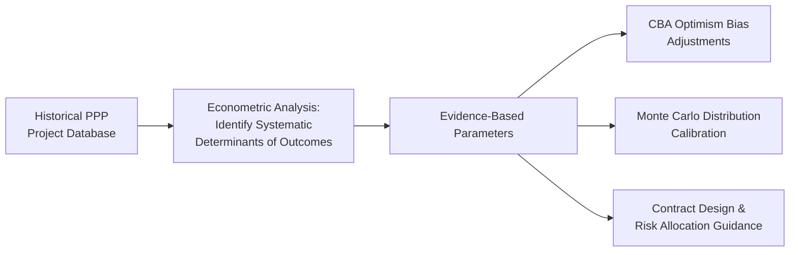
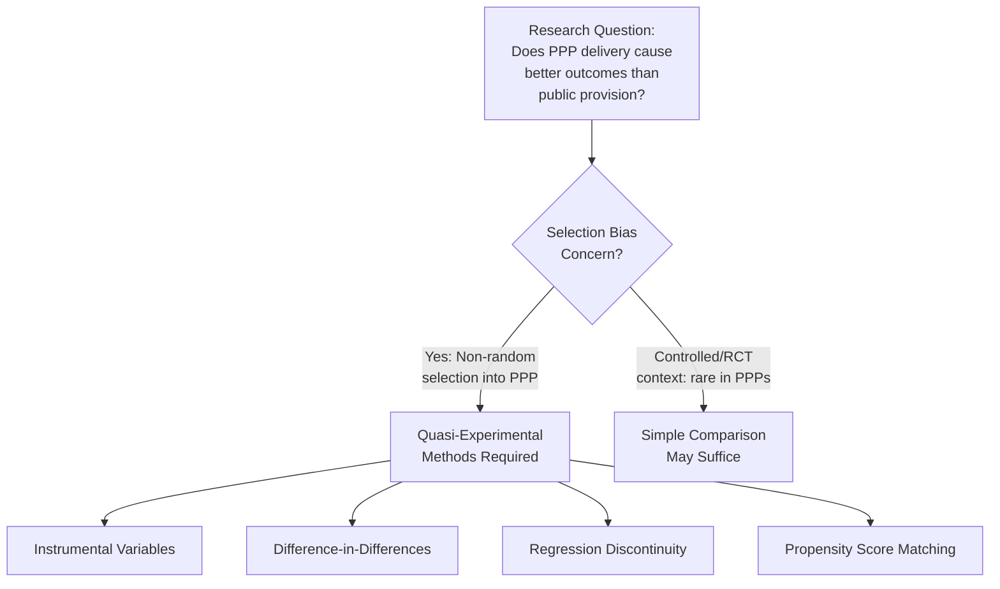

## Econometric Analysis of PPP Performance and Outcomes

### Overview

Econometric analysis of Public-Private Partnership (PPP) performance and outcomes applies statistical inference techniques to observational data — spanning multiple projects, sectors, and jurisdictions — to identify systematic determinants of PPP success or failure, rather than relying solely on single-project case studies or ex-ante appraisal models. Where Cost-Benefit Analysis and Monte Carlo simulation (addressed elsewhere in this chapter) are primarily **forward-looking, single-project appraisal tools**, econometric analysis is primarily a **backward-looking, cross-project research and evaluation tool**: it asks what has actually happened across a population of completed or operating PPPs, and what statistically explains the variation in outcomes observed.

This makes econometric analysis the empirical evidence base that appraisal assumptions (cost overrun distributions, demand forecast bias, contract renegotiation likelihood) ultimately draw upon — the Monte Carlo distribution parameters and CBA optimism-bias adjustments discussed elsewhere in this chapter are themselves typically derived from prior econometric research on historical PPP performance.

### Why Econometric Methods Are Needed

**Key Points**

- **Isolating causal or structural relationships from correlation**: A raw comparison showing that PPPs in one sector have higher cost overruns than another sector could reflect genuine sector-specific risk, or could reflect confounding factors (project size, country institutional quality, procurement method) correlated with sector choice; econometric methods are designed to control for such confounders rather than accept a naive comparison at face value.
- **Generalizing beyond a single case study**: A single PPP renegotiation case study, however detailed, cannot establish whether the factors observed are idiosyncratic to that project or represent a systematic pattern; econometric analysis using a panel or cross-section of many PPPs can test whether a hypothesized relationship holds broadly.
- **Informing policy and appraisal parameters with evidence rather than assumption**: Optimism bias correction factors, standard cost-overrun distributions, and renegotiation-risk premia used in appraisal are only as credible as the empirical research underpinning them — econometric analysis of historical PPP databases is the primary source of that evidence base.

### Common Outcome Variables Studied

| Outcome Variable | Typical Measurement | Research Question Example |
| --- | --- | --- |
| Cost overrun | % deviation of actual final cost from contracted/forecast cost | What project or institutional factors predict larger overruns? |
| Time overrun | % or absolute deviation of actual completion date from planned date | Does procurement method (competitive dialogue vs. direct negotiation) affect delay likelihood? |
| Demand/traffic forecast accuracy | Ratio of actual to forecast demand in early operating years | Is forecast optimism systematically larger for certain sectors or forecasting methodologies? |
| Contract renegotiation incidence | Binary (renegotiated/not) or count of renegotiation events | What contract design features (concession length, risk allocation clauses) correlate with renegotiation probability? |
| Service quality / KPI compliance | Compliance rate with contracted performance standards | Does private operation improve service quality relative to public provision benchmarks, controlling for other factors? |
| Fiscal cost to government | Realized government payments (availability payments, guarantee calls) versus budgeted | How well do ex-ante fiscal risk assessments predict actual contingent liability realization? |

### Core Econometric Techniques Applied to PPP Research

**1. Cross-Sectional Regression**

The simplest approach: regressing an outcome variable (e.g., cost overrun percentage) on a set of explanatory variables (project size, sector, country governance indicators, procurement method) across a single cross-section of completed projects.

$$Y_i = \beta_0 + \beta_1 X_{1i} + \beta_2 X_{2i} + \cdots + \beta_k X_{ki} + \varepsilon_i$$

where $Y_i$ is the outcome for project $i$, the $X$ variables are project- and country-level characteristics, and $\varepsilon_i$ is the error term. This is typically estimated via Ordinary Least Squares (OLS) for continuous outcomes (cost overrun %) or logistic/probit regression for binary outcomes (renegotiated or not).

**2. Panel Data Methods**

Where the same projects or countries are observed over multiple time periods (e.g., annual KPI compliance data over a concession's operating life), panel data methods exploit both cross-sectional and time-series variation:

$$Y_{it} = \beta_0 + \beta_1 X_{it} + \alpha_i + \gamma_t + \varepsilon_{it}$$

where $\alpha_i$ represents project- or country-specific fixed effects (controlling for unobserved, time-invariant characteristics such as baseline institutional quality) and $\gamma_t$ represents time fixed effects (controlling for factors common to all projects in a given year, such as a global commodity price shock affecting construction costs everywhere simultaneously). Fixed-effects panel models are particularly valuable in PPP research because they control for unobserved country- or sector-level heterogeneity that a simple cross-section cannot separate from the variable of actual interest.

**3. Instrumental Variables (IV) and Quasi-Experimental Methods**

A central methodological challenge in PPP performance research is **selection bias**: countries or sectors that adopt PPPs are not randomly assigned to do so, meaning a simple comparison of PPP versus publicly-provided infrastructure outcomes may reflect underlying differences in the types of projects or jurisdictions that select into PPP delivery, rather than a causal effect of the PPP modality itself. Addressing this requires quasi-experimental identification strategies:

- **Instrumental Variables**: Using a variable that affects the likelihood of choosing PPP delivery but has no direct effect on the outcome except through that choice (a valid instrument), allowing estimation of a more credible causal effect of PPP status on outcomes.
- **Difference-in-Differences (DiD)**: Comparing the change in outcomes before and after a policy reform (e.g., a national PPP law's introduction) between jurisdictions that adopted the reform and comparable jurisdictions that did not, isolating the reform's effect from other confounding trends.
- **Regression Discontinuity Design (RDD)**: Exploiting a threshold rule (e.g., a project-value cutoff above which PPP procurement becomes mandatory or is subject to additional review) to compare outcomes for projects just above versus just below the threshold, which should be similar in all other respects except treatment status near the cutoff.
- **Propensity Score Matching (PSM)**: Constructing a comparison group of non-PPP projects that are statistically similar to the PPP sample on observable characteristics, to approximate a more valid counterfactual than an unmatched comparison would provide.

**4. Survival/Duration Analysis**

Applied specifically to time-to-event outcomes such as time-to-renegotiation or time-to-contract-termination, survival analysis (e.g., Cox proportional hazards models, Kaplan-Meier estimation) models the probability that a given event has not yet occurred by a given time, and how covariates (concession length, sector, country risk rating) affect the hazard rate of that event occurring. This is particularly well-suited to renegotiation research, since renegotiation is fundamentally a time-to-event phenomenon rather than a simple binary outcome measured at a fixed point.

### Worked Example: Modeling Renegotiation Probability

**Example**

A researcher assembles a panel dataset of 300 completed or operating transport PPPs across multiple countries, with a binary outcome variable indicating whether each contract was renegotiated within its first five years of operation. A logistic regression is specified:

$$\ln\left(\frac{P(\text{Renegotiation}=1)}{1-P(\text{Renegotiation}=1)}\right) = \beta_0 + \beta_1(\text{Concession Length}) + \beta_2(\text{Competitive Bidding}) + \beta_3(\text{Demand Risk Retained by Private Party}) + \beta_4(\text{Country Governance Index}) + \varepsilon$$

Suppose the estimated coefficient on "Demand Risk Retained by Private Party" is positive and statistically significant, suggesting that, controlling for concession length, procurement method, and country governance, contracts in which the private party bears full demand risk are associated with a higher probability of renegotiation — consistent with a hypothesis that demand risk is difficult for private parties to price accurately ex-ante, leading to renegotiation pressure when actual demand diverges materially from forecast. This finding, if robust across model specifications and datasets, would provide empirical support for a risk-allocation design principle (e.g., partial demand risk-sharing via minimum revenue guarantees) rather than resting that design choice on theoretical reasoning alone.

**[Inference]** A single study's coefficient estimate, even if statistically significant, should generally be treated as one data point in a broader evidence base rather than a definitive causal finding — replication across multiple independent datasets and robustness to alternative model specifications materially strengthens confidence in any specific empirical relationship, which is a general feature of econometric research rather being specific to PPP studies.

### Key Data Sources for PPP Econometric Research

- **World Bank Private Participation in Infrastructure (PPI) Database**: A widely used cross-country dataset tracking PPP and private infrastructure project characteristics, investment values, and (to varying degrees of completeness) outcome data, frequently used as the base dataset for cross-country PPP performance research.
- **National PPP unit registries and disclosure databases**: Where available, country-specific PPP contract registries (increasingly required under PPP fiscal transparency reforms) provide more granular project-level data than cross-country aggregates, though data completeness and consistency vary substantially by jurisdiction.
- **MDB project completion and evaluation reports**: World Bank, Asian Development Bank (ADB), and other MDB Independent Evaluation Group / Independent Evaluation Department reports on financed projects provide detailed, audited outcome data, though generally limited to the subset of projects receiving MDB financing or guarantees.
- **Academic and think-tank compiled datasets**: Various research datasets compiled specifically for academic study of PPP renegotiation, cost overrun, and demand forecast accuracy, often drawing on and supplementing the sources above with hand-collected contract-level detail.

**[Unverified]** The current completeness, update frequency, and specific variable coverage of any named database should be verified directly against the source at the time of use, since data infrastructure in this field has historically been uneven in coverage and is subject to periodic revision.

### Common Methodological Pitfalls in PPP Performance Research

**Key Points**

- **Survivorship bias**: Analyzing only completed or currently operating PPPs while excluding cancelled or failed projects from the sample systematically overstates average PPP performance, since the projects most likely to fail are precisely the ones excluded from a "completed projects" dataset.
- **Omitted variable bias**: Failing to control for a confounding factor correlated with both the explanatory variable of interest and the outcome (e.g., country institutional quality affecting both the choice of procurement method and project outcomes) can produce a spurious or biased coefficient estimate on the variable actually being studied.
- **Reverse causality**: In some specifications, the presumed causal direction may run the opposite way from what is assumed — for example, a correlation between "government experience with PPPs" and "lower cost overruns" could reflect that more capable governments both accumulate PPP experience *and* independently manage cost overruns better, rather than experience itself causing improved outcomes.
- **Small sample sizes in sector- or country-specific studies**: Because well-documented, comparable PPP contract data is relatively scarce compared to many other economic research domains, sector-specific or single-country studies frequently operate with limited statistical power, meaning null findings should not be over-interpreted as definitively ruling out an effect.
- **Publication bias toward statistically significant or dramatic findings**: As in most empirical social science research, studies finding a significant, notable relationship (e.g., a dramatic renegotiation rate finding) may be more likely to be published or cited than null-result studies, which can skew the visible evidence base toward more dramatic conclusions than the full universe of research would support.

### Application to PPP Policy and Practice

**Key Points**

- **Calibrating appraisal assumptions with evidence**: Econometric findings on historical cost-overrun and demand-forecast-bias patterns directly inform the optimism-bias correction factors and Monte Carlo distribution parameters used in forward-looking project appraisal, closing the loop between backward-looking research and forward-looking analysis.
- **Informing contract design**: Robust findings on renegotiation determinants (e.g., demand risk allocation, concession length, competitive versus unsolicited procurement) provide an evidence base for standard contract clauses and risk-matrix design, rather than relying solely on theoretical risk-allocation principles.
- **Ex-post program evaluation**: National PPP units and Supreme Audit Institutions increasingly use econometric methods to evaluate whether their PPP program as a whole has delivered value-for-money relative to counterfactual public procurement, informing policy-level decisions about the appropriate scale and sectoral focus of a PPP program.
- **Benchmarking a specific project's assumptions**: A procuring authority appraising a new project can use published econometric findings on comparable projects (similar sector, similar country income level, similar procurement method) as an external benchmark check against the project's own bespoke cost and demand forecasts, flagging where a specific project's assumptions appear more optimistic than historical patterns would suggest is typical.

### Governance and Reference Frameworks

- **World Bank PPI Database and associated research publications**: The primary cross-country empirical research infrastructure in this field, underpinning a substantial share of published academic and policy research on PPP performance determinants.
- **IMF Fiscal Affairs Department research on PPP fiscal risk**: Provides econometric and case-study evidence specifically on the fiscal cost realization of PPP contingent liabilities, directly relevant to public sector fiscal risk management practice.
- **Academic literature in infrastructure/transport economics and public economics journals**: The primary venue for peer-reviewed econometric PPP performance research, subject to the standard methodological scrutiny (identification strategy, robustness checks) of academic peer review.

**Next Steps**

- Review a specific published econometric study on PPP renegotiation or cost overrun determinants in detail, examining its identification strategy and robustness checks
- Study the World Bank PPI Database's structure and variable coverage directly to assess its applicability to a specific research or benchmarking question
- Examine how difference-in-differences or regression discontinuity designs have been applied to evaluate the causal effect of specific PPP policy reforms
- Connect this topic to Cost-Benefit Analysis and Shadow Pricing Techniques and Monte Carlo Simulation for Project Risk Modeling to explore how econometric findings on historical bias patterns are operationalized as optimism-bias corrections and distribution parameters in forward-looking appraisal
- Explore survival analysis methodology in greater depth as applied specifically to contract renegotiation and termination timing