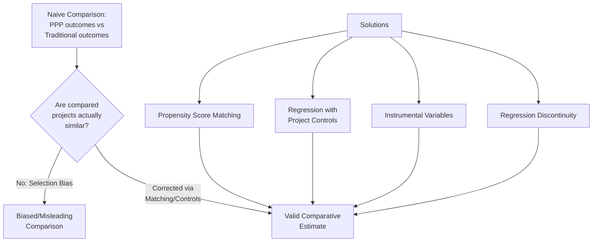
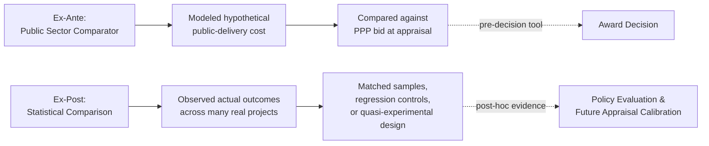

## Comparative Statistical Analysis of PPP versus Traditional Procurement Outcomes

### Overview

Comparative statistical analysis of PPP versus traditional procurement outcomes is the specific research and evaluation exercise of empirically testing whether Public-Private Partnership delivery produces systematically different — and specifically, better or worse — outcomes than conventional public procurement (design-bid-build, design-build, or direct public agency execution) for comparable infrastructure. Where the broader econometric analysis topic addressed elsewhere in this chapter covers methods for studying PPP performance determinants generally, this topic focuses narrowly on the **head-to-head comparison problem**: constructing a statistically valid comparison between two different delivery modalities that are rarely, if ever, randomly assigned to otherwise identical projects.

This comparison sits at the center of the PPP policy debate, since the entire premise for choosing PPP over traditional procurement — Value for Money (VfM) — is fundamentally a comparative claim, and comparative statistical analysis is the empirical (as opposed to purely ex-ante modeled) evidence base for or against that claim.

### The Fundamental Identification Problem

**Key Points**

- **Non-random selection into delivery mode**: Governments do not randomly assign projects to PPP versus traditional procurement; the choice is typically driven by project characteristics (size, complexity, revenue-generating potential), institutional capacity, fiscal space constraints, and sometimes political considerations — all of which may independently affect project outcomes regardless of delivery mode.
- **The counterfactual problem**: For any specific PPP project, the traditionally-procured alternative was never actually built, meaning there is no directly observed comparison case for that specific project; comparative analysis must instead rely on comparing across a population of different projects delivered under each mode, or on ex-ante modeled counterfactuals such as the Public Sector Comparator (PSC).
- **Confounding by project type**: PPPs have historically been disproportionately used for large, revenue-generating, or high-complexity projects (toll roads, airports, water utilities) while smaller or less commercially viable projects (rural roads, local schools) are more often delivered traditionally — meaning a naive comparison of "PPP projects" versus "traditional projects" partly compares different underlying project populations, not delivery mode in isolation.

### The Ex-Ante Comparative Tool: Public Sector Comparator (PSC)

Before turning to ex-post statistical methods, it is necessary to distinguish them from the standard **ex-ante** comparative tool used at the appraisal stage: the Public Sector Comparator. The PSC is a hypothetical, risk-adjusted cost estimate of what a project would cost if delivered through conventional public procurement, constructed specifically to be compared against the PPP bid cost to test Value for Money before a project is awarded.

$$VfM = PSC_{\text{risk-adjusted}} - PPP_{\text{bid cost, risk-adjusted}}$$

A positive result indicates the PPP option offers better value than the modeled public sector alternative. The PSC is explicitly a **modeled counterfactual**, not an empirical observation — it is constructed using assumptions about public sector costs, risk retention, and optimism bias, and its accuracy depends entirely on the credibility of those assumptions. This is the critical distinction from the topic at hand: the PSC estimates what traditional procurement *would* cost; comparative statistical analysis examines what traditional procurement *has actually* cost across observed historical projects.

**[Inference]** Because the PSC's risk-adjustment and optimism-bias assumptions are themselves often calibrated from the same historical econometric research on cost overruns discussed under Econometric Analysis of PPP Performance and Outcomes, a jurisdiction's PSC methodology is likely only as credible as the empirical base rate data feeding its risk-adjustment factors — a PSC built on outdated or non-representative cost overrun benchmarks would systematically bias the VfM conclusion in one direction.

### Ex-Post Statistical Comparison Methods

**1. Matched-Sample Comparison (Propensity Score Matching)**

Constructs a comparison group of traditionally-procured projects that are statistically similar to the PPP sample on observable characteristics (project size, sector, country, procurement year), then compares outcome variables (cost overrun, time overrun, quality) between the matched groups. This directly addresses the confounding-by-project-type problem noted above, though it can only control for observable characteristics, not unobserved factors that may still differ systematically between the groups.

**2. Regression-Based Comparison with Delivery-Mode Indicator**

A regression specification directly includes a delivery-mode dummy variable alongside project and country controls:

$$Y_i = \beta_0 + \beta_1(\text{PPP}_i) + \beta_2 X_{i} + \varepsilon_i$$

where $\text{PPP}_i$ is a binary indicator equal to 1 if project $i$ was PPP-delivered, $X_i$ is a vector of project- and country-level controls, and $\beta_1$ is interpreted as the estimated average difference in outcome $Y$ associated with PPP delivery, holding the controls constant. The credibility of $\beta_1$ as a genuine delivery-mode effect (rather than a residual confound) depends entirely on how completely $X_i$ captures the actual determinants of project selection into PPP versus traditional delivery.

**3. Quasi-Experimental Designs**

Where a policy threshold or discrete reform creates a source of variation in delivery mode that is plausibly unrelated to underlying project quality, the same quasi-experimental techniques used in broader PPP econometric research apply here specifically to the PPP-versus-traditional comparison:

- **Regression Discontinuity**: Exploiting a project-value threshold above which PPP procurement becomes mandatory, comparing outcomes for projects just above versus just below the cutoff.
- **Difference-in-Differences**: Comparing outcome trends before and after a jurisdiction adopts a PPP program, relative to a comparison jurisdiction that did not, to isolate the program's effect from broader time trends affecting infrastructure delivery generally.
- **Instrumental Variables**: Using a factor that influences the likelihood of PPP selection (e.g., a jurisdiction's PPP unit establishment date, or distance to donor technical assistance) but has no plausible direct effect on project outcomes except through the delivery-mode choice it influences.

### Outcome Dimensions Typically Compared

| Dimension | Common Finding Pattern in Research | Key Caveat |
| --- | --- | --- |
| Cost overrun | Some studies find PPPs associated with lower average cost overruns relative to matched traditional projects | Results are sector- and context-dependent; not a universal finding, and effect sizes vary substantially across studies |
| Time overrun | Similarly mixed; some evidence of better on-time delivery under PPP structures with performance-linked payment mechanisms | Contract design details (payment mechanism, penalty structure) likely mediate this effect more than delivery mode per se |
| Service quality / KPI compliance | Evidence varies significantly by sector and monitoring regime quality | Quality comparisons are highly sensitive to how "quality" is measured and how rigorously KPIs are monitored and enforced under each mode |
| Whole-of-life fiscal cost | Contested; PPP's higher cost of private capital versus government borrowing must be weighed against efficiency gains, risk transfer value, and lifecycle maintenance discipline | This comparison is highly sensitive to the discount rate and risk-transfer valuation assumptions used, which remain debated in the literature |
| Risk transfer effectiveness | Evidence that de jure (contractual) risk transfer sometimes diverges from de facto risk transfer, particularly where governments renegotiate or bail out distressed concessions | Raises the question of whether contracted risk allocation is a reliable proxy for actual realized risk-bearing |

### Worked Example: Comparing Cost Overruns Using Propensity Score Matching

**Example**

A researcher compiles a dataset of 150 PPP-delivered and 400 traditionally-procured road projects across several countries. A propensity score model is first estimated, predicting the probability of PPP selection based on project length, estimated cost, urban/rural location, and country income level. Each PPP project is then matched to one or more traditionally-procured projects with a similar predicted propensity score, producing a matched comparison sample balanced on these observable characteristics. Comparing average cost overrun between the matched groups yields a smaller and more defensible estimate of the PPP-associated cost overrun difference than the raw, unmatched comparison would have shown — because the raw comparison had included a disproportionate share of large, complex traditionally-procured projects with inherently higher overrun risk, which the matching procedure corrects for. The matched estimate still cannot rule out that some unobserved factor (e.g., unmeasured institutional capacity in project sponsors that both influences PPP selection and independently affects outcomes) continues to bias the result, which is why researchers typically report the matched-sample estimate alongside a regression-based or instrumental-variable robustness check rather than relying on matching alone.

### Reconciling Ex-Ante PSC and Ex-Post Statistical Evidence

**Key Points**

- **The PSC answers a different question than ex-post comparison research**: The PSC estimates whether a *specific* project appears better value delivered as a PPP given modeled assumptions at the point of decision; ex-post comparative research estimates whether PPP delivery has *on average* produced different outcomes across a population of completed projects — a finding from the latter can and should inform the calibration of the former's risk-adjustment assumptions, but the two are not directly substitutable analyses.
- **Ex-post evidence should feed back into ex-ante appraisal practice**: Where robust ex-post comparative research finds that traditional procurement in a specific sector or country context tends to experience larger cost overruns than the PSC's risk-adjustment factor assumes, that finding should prompt a recalibration of the PSC methodology's risk-adjustment parameters — otherwise the PSC risks systematically favoring PPP delivery (or vice versa) based on outdated or non-representative assumptions rather than current evidence.
- **A single jurisdiction's PSC track record can itself become an ex-post research subject**: Comparing a jurisdiction's historical PSC-predicted costs against subsequently observed actual traditional-procurement costs (where traceable) provides a direct test of the PSC methodology's own predictive accuracy, closing the loop between the ex-ante tool and ex-post evidence.

### Common Methodological Pitfalls Specific to This Comparison

**Key Points**

- **Cherry-picked case studies substituting for systematic comparison**: A small number of prominently publicized PPP failures or successes (in either direction) are sometimes used in policy debate as if representative, when only a systematic comparison across a sufficiently large and representative sample of both delivery modes can support a generalizable conclusion.
- **Ignoring risk transfer valuation in fiscal cost comparisons**: A comparison that focuses solely on the nominal financing cost differential (private capital typically costing more than sovereign borrowing) while ignoring the value of risk genuinely transferred to the private party is incomplete, since the entire economic rationale for PPP fiscal cost premiums rests on risk transfer being worth more than the financing cost differential — a comparison silent on this point does not actually test the core VfM hypothesis.
- **Treating "PPP" as a monolithic category**: Outcomes likely vary substantially across PPP contract types (concessions, availability-payment PFI-style contracts, management contracts) and sectors; pooling all PPP structures into a single comparison category can obscure meaningful heterogeneity that a more disaggregated analysis would reveal.
- **Publication and reporting bias**: Jurisdictions and sponsors have institutional incentives to publicize successful PPPs and underreport or quietly renegotiate troubled ones, which can bias the visible dataset available for ex-post comparative research toward more favorable outcomes than the true underlying population.

### Governance and Reference Frameworks

- **World Bank / PPIAF Value-for-Money guidance and PSC methodology notes**: Provide the standard ex-ante comparative methodology against which ex-post research findings should be reconciled.
- **UK National Audit Office (NAO) and HM Treasury retrospective PFI/PF2 evaluations**: A frequently cited body of ex-post comparative evidence, given the UK's long operating history with the Private Finance Initiative model, providing detailed retrospective assessment of realized versus projected value for money.
- **Academic infrastructure economics literature comparing delivery modes**: The primary source of peer-reviewed matched-sample and quasi-experimental comparative studies, subject to ongoing methodological debate about identification strategy validity given the inherent difficulty of finding a fully convincing counterfactual.
- **National Audit/Supreme Audit Institution retrospective PPP program reviews**: Where available, provide jurisdiction-specific ex-post evidence directly relevant to informing that jurisdiction's own PSC calibration and future PPP policy decisions.

**[Unverified]** The specific empirical consensus (or lack thereof) on whether PPPs systematically outperform traditional procurement is an actively evolving and debated area of the literature, sensitive to sector, country context, contract type, and time period studied; any specific quantitative finding cited from a particular study should be understood as evidence from that context rather than a universally generalizable result.

**Next Steps**

- Review a specific national retrospective PPP program evaluation (e.g., a Supreme Audit Institution report) in detail as a worked ex-post comparative case study
- Study Public Sector Comparator construction methodology in depth, including risk-adjustment and optimism-bias parameter calibration
- Examine how risk-transfer valuation is specifically modeled and monetized within VfM and PSC frameworks
- Connect this topic to Econometric Analysis of PPP Performance and Outcomes to explore shared identification-strategy challenges (selection bias, quasi-experimental methods) across both research questions
- Explore how ex-post comparative findings from other jurisdictions might be adapted, with appropriate caution regarding context transferability, to calibrate a specific jurisdiction's own PSC methodology