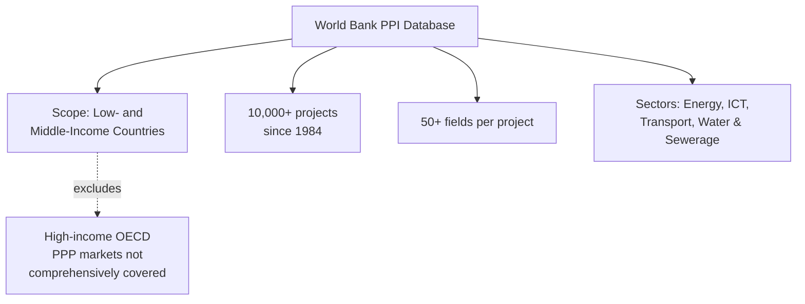
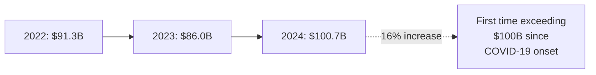
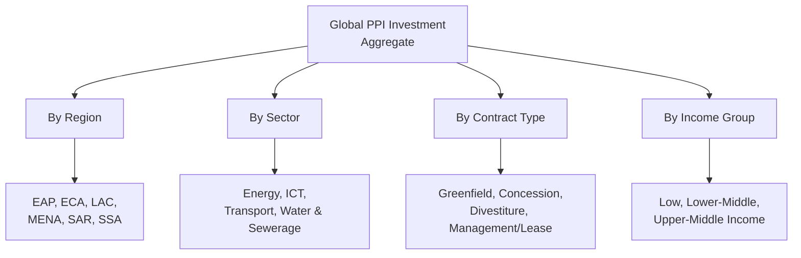

## Data Sources and Global PPP Market Statistics

### Overview

Reliable quantitative analysis of Public-Private Partnerships — whether Cost-Benefit Analysis, Monte Carlo simulation, econometric performance research, or comparative statistical analysis, all addressed elsewhere in this chapter — depends entirely on the availability and quality of underlying project-level and market-level data. This topic surveys the principal global and regional data sources for PPP market statistics, their scope and methodological conventions, and the data-quality limitations that any quantitative analyst must account for before drawing conclusions from them.

### The Primary Global Source: World Bank PPI Database

The **Private Participation in Infrastructure (PPI) Database**, maintained by the World Bank Group's Public-Private Partnership Group, is the leading source of private infrastructure investment trend data for the developing world. Its purpose is to identify and disseminate information on private participation in infrastructure projects in low- and middle-income countries, highlighting the contractual arrangements used to attract private investment, the sources and destination of investment flows, and information on the main investors. [Worldbank](https://ppi.worldbank.org/en/about-us/about-ppi)

**Key Points**

- The database currently provides information on more than 10,000 infrastructure projects dating from 1984, and is updated with the prior year's data approximately six months after year-end. [Worldbank](https://ppi.worldbank.org/en/about-us/about-ppi)
- The database's methodology specifies that investment amounts represent total investment commitments entered into by the project entity at contract signature or financial closure — not the planned or executed annual investment, which is a critical distinction: a single large recorded figure reflects a lifetime commitment made in one year, not spending disbursed over the project's construction period, and must be interpreted accordingly when constructing time-series analysis. [World Bank PPP Legal Resource Center](https://ppp.worldbank.org/library/private-participation-infrastructure-ppi-database)
- The database contains over 50 fields per project record, including country, financial closure year, infrastructure services provided, and type of private participation, providing substantial variable depth for econometric research beyond simple investment totals. [Worldbank](https://ppi.worldbank.org/en/about-us/about-ppi)
- Coverage is explicitly restricted to low- and middle-income countries as classified by the World Bank, meaning it is not a comprehensive global PPP dataset inclusive of high-income-country PPP activity (such as UK PFI/PF2 projects or many OECD-country PPPs), a scope limitation researchers must account for when generalizing findings.

### Current Global Market Statistics (World Bank PPI Data)

**Key Points**

- Private Participation in Infrastructure (PPI) investment in 2024 reached $100.7 billion, marking an increase of 16 percent from $87.1 billion in 2023 and 20 percent above the past five-year average of $83.7 billion. [Worldbank](https://ppi.worldbank.org/en/ppi)
- This represented the first time PPI investment exceeded the $100 billion threshold since the onset of the COVID-19 pandemic. [Worldbank](https://ppi.worldbank.org/en/ppi)
- PPI investment in 2023 amounted to US$86.0 billion, representing approximately 0.2 percent of the combined GDP of all low- and middle-income countries, a slight decrease from US$91.3 billion in 2022, though 2023 investment still marginally exceeded the prior five-year (2018–2022) average of $85.5 billion. [Worldbank](https://ppi.worldbank.org/en/ppi)
- A notable structural shift documented in the data: prior to 2010, new project investment was roughly evenly distributed between conventional and low-carbon projects (852 conventional versus 899 low-carbon), but after 2010, new low-carbon PPI projects (1,915) more than doubled the number of new conventional projects (815). This shift is directly relevant to the Climate Resilience and ESG themes addressed elsewhere in this syllabus, providing the market-level empirical backdrop against which sector-specific climate toolkit adoption and green financing trends should be understood. [Worldbank](https://ppi.worldbank.org/en/ppi)

**[Unverified]** Statistics beyond the 2024 figures cited here are subject to ongoing revision and annual update; the most current figures should always be confirmed directly against the live PPI Database or its most recent Annual Report at the time of use, since global infrastructure investment data is revised as project records are finalized.

### Complementary and Alternative Data Sources

| Source | Maintaining Institution | Scope and Distinguishing Feature |
| --- | --- | --- |
| PPI Database | World Bank PPP Group | Primary EMDE-focused source; contract-signature investment commitments; 50+ fields per project |
| National PPP Unit Registries | Individual country PPP units/agencies | Jurisdiction-specific, often more granular and current than global aggregates; completeness varies significantly by country |
| MDB Project Databases | Asian Development Bank, IADB, AfDB, EBRD, etc. | Cover Bank-financed or guaranteed projects specifically; typically include audited outcome and evaluation data unavailable in market-tracking databases |
| Infrastructure Journal (IJGlobal) | Commercial data provider | Broader global coverage including high-income-country project finance transactions; subscription-based commercial product |
| Preqin / Infralogic | Commercial data providers | Focus on private infrastructure fund and investor-level data, complementing project-level databases with capital-markets and sponsor perspective |
| National Audit/Supreme Audit Institution reports | Country-specific audit bodies | Ex-post, audited retrospective evaluation data; typically the most reliable source for actual (as opposed to contracted) outcome figures, but limited to jurisdictions with active PPP audit practices |
| Academic/research-compiled datasets | Universities, think tanks | Often hand-collected supplements to the PPI Database with additional variables (renegotiation events, detailed contract terms) for specific research questions |

### Interpreting Investment Commitment Figures Correctly

**Key Points**

- Because the PPI Database records investment commitments at contract signature or financial closure rather than planned or executed annual investment, a headline annual figure (e.g., "$100.7 billion in 2024") represents the sum of lifetime committed investment for projects reaching financial close that year — not capital expenditure actually disbursed during 2024 itself, which would typically be spread across the subsequent construction period. [World Bank PPP Legal Resource Center](https://ppp.worldbank.org/library/private-participation-infrastructure-ppi-database)
- This convention means investment commitment figures are appropriately used to track deal-flow and market activity trends (how much new PPP business was contracted in a given year) but are not directly interpretable as annual capital expenditure or GDP-contribution figures without further adjustment.
- Cross-database comparability requires care: different sources may use different definitions of "PPP" (some include any private participation arrangement, including simple management contracts and divestitures; others restrict to concession-style long-term contracts), different sector taxonomies, and different country income-group classifications, meaning a headline statistic from one source is not necessarily directly comparable to a similarly labeled statistic from another without confirming methodological alignment.

### Regional and Sectoral Disaggregation

The PPI Database and equivalent sources typically allow disaggregation along several standard dimensions relevant to comparative and econometric analysis:

- **By region**: East Asia and Pacific, Europe and Central Asia, Latin America and the Caribbean, Middle East and North Africa, South Asia, and Sub-Saharan Africa are the standard World Bank regional classifications used for PPI regional snapshot reporting.
- **By sector**: Energy (further split by generation type, increasingly distinguishing conventional versus low-carbon/renewable), Information and Communications Technology, Transport, and Water and Sewerage are the primary sector categories tracked historically.
- **By contract type**: Greenfield projects, concessions (including Build-Operate-Transfer and variants), divestitures, and management/lease contracts represent the standard private participation arrangement taxonomy used to classify project records.
- **By income group**: Low-income, lower-middle-income, and upper-middle-income country classifications (per current World Bank Fiscal Year classification, which is itself updated periodically) allow analysis of how PPP market activity varies by country development level.

### Data Quality and Interpretive Limitations

**Key Points**

- **Uneven country-level reporting completeness**: Because the PPI Database and similar sources depend substantially on project sponsors, governments, and secondary reporting for data collection, completeness and timeliness vary considerably across countries and sectors, with better-resourced PPP units generally producing more complete and current records than jurisdictions with limited institutional capacity.
- **Survivorship and disclosure bias**: As noted under Econometric Analysis of PPP Performance and Outcomes elsewhere in this chapter, publicly available databases may under-represent cancelled, failed, or quietly renegotiated projects relative to their true incidence, since disclosure incentives favor reporting successful deal closures over troubled project histories.
- **Limited standardized outcome data**: While investment commitment figures at financial close are relatively well and consistently recorded, standardized ex-post outcome data (actual realized cost, time, demand, and service-quality performance relative to contracted terms) is considerably less complete across the same universe of projects, which is precisely why dedicated econometric and comparative research often requires hand-collected supplementary datasets rather than relying on the headline market-tracking databases alone.
- **Currency and inflation adjustment conventions vary**: Cross-time and cross-country comparisons require consistent treatment of currency conversion (often USD at a specified exchange rate convention) and inflation adjustment (real versus nominal terms); a source's stated methodology should always be checked before comparing figures across years or countries, since inconsistent treatment can materially distort apparent trends.

### Practical Guidance for Using These Sources in Analysis

**Key Points**

- **Confirm current figures directly at the point of use**: Given the periodic revision and annual update cycle of these sources, any statistic cited in a report, feasibility study, or academic paper should be verified against the live database or its most recent official report rather than relied upon from a prior citation, especially for time-sensitive market-trend claims.
- **Match the source to the analytical question**: Use the PPI Database for EMDE-wide market trend and deal-flow analysis; use national PPP unit registries or Supreme Audit Institution reports for jurisdiction-specific, project-level outcome verification; use MDB project databases where the analysis specifically concerns Bank-financed or guaranteed transactions; and use commercial providers (IJGlobal, Preqin) where broader global or investor-level coverage, including high-income-country markets, is required.
- **Document methodology assumptions explicitly**: When a comparative or econometric analysis draws on one or more of these sources, the specific database, snapshot date, currency/inflation convention, and any sector or country-group filtering applied should be explicitly documented, both for reproducibility and to allow readers to assess whether the cited figures remain current.
- **Cross-check headline statistics against multiple sources where high stakes are involved**: For high-stakes decisions (a major VfM or fiscal risk determination), triangulating a key statistic across the PPI Database, a relevant MDB source, and where available a national audit report reduces the risk of relying on a single source's potential data-quality limitations.

**[Unverified]** The specific current subscription terms, coverage scope, and update frequency of commercial data providers referenced above (IJGlobal, Preqin/Infralogic) should be confirmed directly with those providers at the time of use, as commercial data product offerings change independently of this reference material.

### Relevance to LGU-Level PPP Practice

**[Inference]** For a sub-national or LGU-level PPP unit without in-house access to commercial infrastructure databases, the World Bank PPI Database and any national PPP unit registry (where the country maintains one) are likely the most readily accessible and cost-free sources for benchmarking a proposed project's assumptions against comparable historical transactions, making them the practical starting point for feasibility-stage market benchmarking even though they may lack the granularity of a paid commercial data product.

**Next Steps**

- Directly query the World Bank PPI Database's custom query tool for a specific sector and country relevant to a target project, to benchmark comparable historical transactions
- Review the most recent PPI Annual Report in full for current-year global and regional statistics beyond the summary figures presented here
- Examine a specific national PPP unit's registry or disclosure database (where one exists) for jurisdiction-specific project-level detail
- Connect this topic to Econometric Analysis of PPP Performance and Outcomes and Comparative Statistical Analysis of PPP versus Traditional Procurement Outcomes to see how these data sources are operationalized as the empirical inputs for those research methods
- Explore the methodological differences between the PPI Database's investment-commitment convention and alternative capital-expenditure-based reporting conventions used by other sources